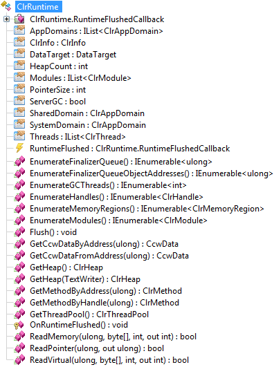
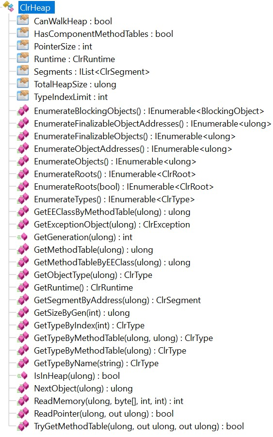
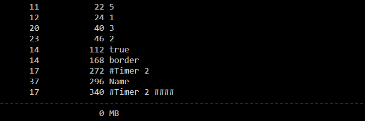

This second post in the ClrMD series details the basics of parsing the CLR heaps. The [associated code](https://github.com/criteo/criteo-dotnet-blog/tree/master/ClrMD-Part2) checks string duplicates as sample.

Part 1: [Bootstrapping ClrMD to load a dump](/posts/2017-02-21_clrmd-part-1-going-beyond/).

### From ClrRuntime to ClrHeap or how to traverse the managed heap

In [the previous post](/posts/2017-02-21_clrmd-part-1-going-beyond/), we have boostrapped the code needed to load a memory dump and get an instance of **ClrRuntime**. This type is the starting point for accessing the content of a managed process with [ClrMD](https://github.com/microsoft/clrmd):



Most of the memory and heap management is well described in the [ClrMD documentation](https://github.com/microsoft/clrmd/blob/main/doc/GettingStarted.md#the-gc-heap), you are able to:

- list the application domains with **AppDomains**,
- dig into the memory regions with **EnumerateMemoryRegions**,
- access the managed heap with **GetHeap**

As shown in the [ClrMD samples](https://github.com/microsoft/clrmd/blob/main/src/Samples/DumpHeap/DumpHeap.cs), the **ClrHeap** type helps you traversing the managed memory:



Before doing any heap exploration with **ClrHeap**, you need to ensure that the process was not in the middle of a garbage collection when the dump was taken. This can be done by checking **CanWalkHeap**:

**clrmd.cs**

```csharp
var heap = clr.GetHeap();

if (!heap.CanWalkHeap)
   return;
```

Then, you can start browsing the objects in memory with the following code:

**clrmd.cs**

```csharp
foreach (ClrObject obj in heap.EnumerateObjects())
{
   try
   {
      var objType = obj.Type;
      if (objType == null)
         continue;
      ...
   }
   catch (Exception x)
   {
      WriteLine(x);
      // some InvalidOperationException might occur sometimes
   }
}
```

As you can see, each reference to an object is enumerated as ClrObject used to get the type of the corresponding instance via **GetObjectType**. Note that the **Type** property might return null in some memory corruption scenario (as commented in the ClrMD samples) so don’t forget to check it in your own code. This kind of simple loop is not really efficient in term of performance when you are dealing with multi-GB dump files. Unfortunately, as the rest of the post explains, sometimes, you don’t have a choice.

### How duplicated are your strings?

Internally at Criteo, we are always trying to improve the performance of the code that runs in production. Lately, one of the leads to limit the memory consumption was to leverage the [interningfeature of strings](https://msdn.microsoft.com/en-us/library/system.string.intern.aspx). Since string instances are immutable (i.e. once created, you can’t change their value), The idea is to ask the CLR to keep a single instance of each repeated string in an internal cache. Then, this instance can be shared whenever a string would be duplicated, thus saving memory. This would be especially efficient if an object model is stored as a dictionary where the keys and most of the string fields of the value data share the same values: even if millions of items are stored, their fields points to the very few different hundreds of strings.

But before starting any major refactoring, it is mandatory to have metrics about the current status and being able to measure the possible gains. In that context, it would be interesting to get a summary of which strings are the most repeated with their corresponding size in memory: something close to **!sos.dumpheap -stat**.

The code to achieve this goal is simple and straightforward from the loop previously listed: you just have to check if the type is System.String and count every different value in a dictionary.

**Clrmd.cs**

```csharp
Dictionary<string, int> strings = new Dictionary<string, int>();

foreach (var obj in heap.EnumerateObjects())
{
   ...
   if (obj.Type.Name != "System.String")
      continue;

   string s = obj as string;

   if (!strings.ContainsKey(s))
   {
      strings[s] = 0;
   }

   strings[s] = strings[s] + 1;
   ...
}
```

The formatting of the results is also simple. The strings are sorted by the size in bytes of all duplicated instances (hence the x2 multiplier factor because a character is UTF-16 encoded on 2 bytes):

**Clrmd.cs**

```csharp
int totalSize = 0;

// Sort by size taken by the instances of string
var query = strings
    .Where(s => s.Value > minCountThreshold)
    .Select(e => new
    {
       Count = e.Value,
       Size = 2 * e.Value * e.Key.Length,
      Key = e.Key
    })
    .OrderBy(ai => ai.Size);

foreach (var aggregatedInfo in query)
{
   WriteLine(string.Format(
      "{0,8} {1,12} {2}",
      aggregatedInfo.Count,
      aggregatedInfo.Size,
      aggregatedInfo.Key.Replace("\n", "## ").Replace("\r", " ##")
      ));
   totalSize += aggregatedInfo.Size;
}

WriteLine("-------------------------------------------------------------------------");
WriteLine(string.Format("         {0,12} MB", totalSize/(1024*1024)));
```

Note that a **minCountThreshold** parameter is used here as a minimum number of instances of the same string to avoid listing strings not so duplicated in memory. For a better formatting, the \r\n are transformed into “##” so each string stays on one line. Here is the result for a simple sample app:



The gain would be less than a MB here…

### Next step…

In this example, we let ClrMD transparently marshal the strings instances from the dump address space into our tool. However, sometimes, you need to directly and explicitly access the value of type fields. This will be the subject of the next post where we describe how to list the timers running in a process.

---

*Co-authored with [Kevin Gosse](https://twitter.com/KooKiz)*
