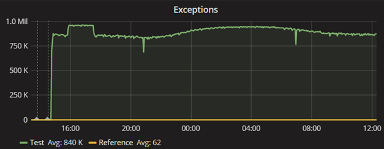
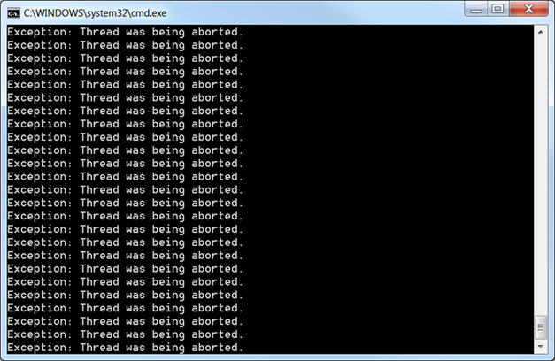

**When you see this, you know for sure that something is wrong with a server:**



This chart counts the number of first-chance exceptions thrown by the server. We have here an average of 840K exceptions thrown per minute, or 14K exceptions per second. That’s a lot, especially considering that this server only processes about 400 requests per second. Impossible to find anything meaningful or even related in the logs, and the server seems to respond properly to requests: head scratching situation for sure.

The ratio between processed requests and exceptions thrown does not make any sense. It would be great if we could see what are these unbelievable exceptions with our own eyes. Thankfully, the [procdump tool](https://technet.microsoft.com/en-us/sysinternals/dd996900) from Sysinternals lists the first chance exceptions with the following magical command line:

```text
procdump -ma -e 1 -f E0434352.CLR <pid>
```

Instead of capturing a memory dump, the tool will display all CLR related exceptions in the console as they are thrown. We expected a never ending flow of exception details but… For some reason, procdump seemed to completely slow down the process, generating an output polluted by timeout exceptions, that supposedly aren’t thrown when procdump isn’t attached.

It was the time for drastic measures: remote debugging the faulty process with Visual Studio could give us hints about what was going on. This time, we were able to catch a **ThreadAbortException** we never saw before. Retrying a few times helped us to confirm that it was indeed the culprit.

### The likely culprit

As good .NET citizen, we know that it is bad not recommended to call **Thread.Abort** but to be sure, we did a search on our code, to discover… that we never abort any thread. We started to search by dichotomy any code change since the last known good run of the application. We found a fix for a code that was using **Thread.Abort**: maybe the server was still running with the old code! We checked the version of the assembly and double-checked by decompiling it (just in case) but it was the fixed code without any **Thread.Abort**.

Back to scratching our head, we kept Visual Studio remotely attached to the process and thankfully, we managed to catch a **CannotUnloadAppDomainException** from time to time. As the name indicates, this exception is thrown by the AppDomain when it doesn’t manage to unload in a timely fashion. It turns out that unloading an AppDomain is [a known cause ofThreadAbortException](https://learn.microsoft.com/en-us/dotnet/api/system.appdomain.unload?WT.mc_id=DT-MVP-5003325), so we’ve got a serious lead.

That ASP.NET would try to unload an appdomain isn’t surprising. It can occur, for instance, when a configuration file is modified. But it’s certainly not enough to explain the 14K exceptions per second, unless we’re continuously creating and unloading new appdomains.

Depressingly, we also managed to explain why we weren’t getting anything in the log files. For performance and scalability reason, our logging API is asynchronous: the logger thread responsible for saving the traces was actually one of the first threads being aborted, thus killing our main source of information. Speak about bad luck.

Back to the problem and digging further into the callstacks, we found out that the exception was always thrown in the same method:

**Program.cs**

```csharp
public void SomeMethod()
{
   while (someCondition)
   {
      try
      {
         // Do some stuff

         // Sleep 15 minutes
         Thread.Sleep(15 * 60 * 1000);
      }
      catch (Exception ex)
      {
         // Log the exception
      }
   }
}
```

Did we find the culprit? This loop was a good candidate to explain the repeated exceptions: if an exception is thrown then we will go to the catch block, to immediately try again. However, **ThreadAbortException** is [a weird beast](https://learn.microsoft.com/en-us/dotnet/api/system.threading.threadabortexception?WT.mc_id=DT-MVP-5003325): whenever caught, it will automatically be rethrown at the end of the catch block. So in our case, it means that we would leave the “while” block when the exception is rethrown behind our back, and exit the thread. There was no way the code could loop to generate the expected 14k exceptions per second!

The only other option was that appdomains would be created and unloaded at a crazy pace, but why?

After turning around for a while, we noticed something peculiar: the **ThreadAbortException** was always thrown in the same thread; just like if the code was really looping despite what we mentioned earlier…. What’s going on?

### The plot twist

When you’ve excluded every other possible cause, you start doubting of your own knowledge. And so we’ve put together a small program to test the behavior of the **ThreadAbortException**:

**Program.cs**

```csharp
static void Main(string[] args)
{
   var mutex = new ManualResetEventSlim();
   var t = new Thread(() =>
   {
      while (true)
      {
         try
         {
            if (!mutex.IsSet)
            {
               mutex.Set();
            }

            // Do some stuff
            Thread.Sleep(100);
         }
         catch (Exception ex)
         {
            Console.WriteLine("Exception: " + ex.Message);
         }
      }
   });

   t.Start();

   // Wait for the thread to start
   mutex.Wait();

   t.Abort();

   Console.ReadLine();
}
```

We start a background thread, doing some fake work in a loop, catching any thrown exception. The main thread then waits for the background thread to start before asking the CLR to stop it by calling **Thread.Abort**. Following the abort request, a **ThreadAbortException** will be magically thrown in the context of the background thread. The exception will be caught there, logged in the console, then automatically be rethrown because of its special nature. Then the thread will exit because the exception is rethrown outside of the try/catch block.

Compile, run, and lo and behold…



It seems everything we knew about **ThreadAbortException** is actually wrong!

The behavior can only be reproduced in a release build while , and running in 64 bit. That last part tipped us towards suspecting the JIT. And indeed, disabling RyuJIT in the configuration seems to fix the issue:

**App.config**

```csharp
<?xml version="1.0" encoding="utf-8"?>
<configuration>
  <runtime>
    <useLegacyJit enabled="1" />
  </runtime>
</configuration>
```

How could the JIT be involved? The call to **Thread.Abort** is in fact asynchronous and sets the **AbortRequested** flag on the Thread object. The CLR will throw a **ThreadAbortException** as soon as it is reaching a *safe place* as Jeffrey Richter explains page 580 of his “Clr via C#” book. The code responsible for throwing the exception at the right time is generated by the JIT compiler.

A JIT bug! After [having notified Microsoft](https://connect.microsoft.com/VisualStudio/feedback/details/3131699), we still had to fix our code. We just need to catch the **ThreadAbortException** and… rethrow it because it is not done for us by the JIT generated code.

### In the end…

Sometimes, the odds are really against you when investigating an issue. Starting with Procdump changing the behavior of the process and the logger crashing during the appdomain unloading, to end up with a bug in the least visible part of the .NET framework. During those times, it is important to keep a clear head, have a few coworkers around to bounce ideas on, and methodically test every single assertion you make, no matter how confident you feel about it.

---

*Co-authored with [Kevin Gosse](https://twitter.com/kevingosse)*
