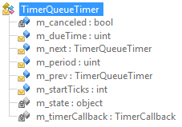
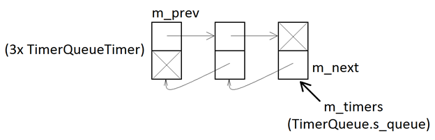

This third post of the ClrMD series focuses on how to retrieve value of static and instance fields by taking timers as an example. The next post will dig into the details of figuring out which method gets called when a timer triggers. As an example, the [associated code](https://github.com/criteo/criteo-dotnet-blog/tree/master/ClrMD-Parts3%2B4_Timers) lists all timers in a dump and covers both articles.

Part 1: [Bootstrapping ClrMD](/posts/2017-02-21_clrmd-part-1-going-beyond/)

Post 2: [Finding duplicated strings with ClrMD](/posts/2017-03-24_clrmd-part-2-from-clrruntime/)

### Marshaling data from a dump

Beyond heap navigation shown in [the previous post](/posts/2017-03-24_clrmd-part-2-from-clrruntime/), the big thing to understand about ClrMD is that the retrieved information is often an **address**. An address from another address space because the dump is seen as another process just like if you were debugging it live. Your code will need to access the other process memory corresponding to this address; not directly with a pointer/reference indirection or with the raw Win32 [ReadProcessMemory](https://msdn.microsoft.com/en-us/library/windows/desktop/ms680553.aspx) API function but via APIs like **GetObjectType** or **GetValue**.

To illustrate how to navigate into the dump address space with ClrMD, we will show how to list the timers that have been started. This can be useful to investigate various issues, such as leaks or timers being stuck.

### Know your framework

A naive implementation, like [the string example of the previous post](/posts/2017-03-24_clrmd-part-2-from-clrruntime/), would try to list all object instances in the CLR heap and look at **Timer** instances only. However, as it has been mentioned already, this is very inefficient in terms of performance; especially for 10+ GB dumps…

It is time to figure out what happens in the .NET runtime when your code creates a new timer. If the [source code of the version of the CLR you are using](https://referencesource.microsoft.com/#mscorlib/system/threading/timer.cs) is not available, start your favorite IL decompiler and look at the **System.Threading.Timer** implementation details. The parameters given to the [constructors](https://msdn.microsoft.com/en-us/library/system.threading.timer.aspx#Anchor_2) (such as the due time, period, and callback method, in addition to its optional parameter if any) are not stored in the class itself but in the **TimerQueueTimer** helper class.



The **Timer** constructor code, after a few sanity checks, calls the **TimerSetup** method to wrap a **TimerQueueTimer** in a **TimerHolder** that is stored in the **Timer** **m_timer** field.

This is where things start to become interesting: this **TimerQueueTimer** class adds each new instance into a linked list kept by a singleton object stored in the static **s_queue** field of the **TimerQueue** class. The following figure shows the relation between instances after three timers are created:



So… a fast way to list the timers would be to get the unique static instance of **TimerQueue**, look at its **m_timers** field and iterate on each **TimerQueueTimer** by following their **m_next** field until it contains null. The rest of the post details the following operations with ClrMD:

- quickly getting a **ClrType**
- reading a static field
- reading an instance field

to fill up a collection of our own **TimerInfo** used to easily create a summary:

**TimerInfo.cs**

```csharp
public class TimerInfo
{
   public ulong TimerQueueTimerAddress { get; set; }
   public uint DueTime { get; set; }
   public uint Period { get; set; }
   public bool Cancelled { get; set; }
   public ulong StateAddress { get; set; }
   public string StateTypeName { get; set; }
   public ulong ThisAddress { get; set; }
   public string MethodName { get; set; }
}
```

This is wrapped inside a helper method described in the next few sections:

**EnumerateTimers-1**

```csharp
public IEnumerable<TimerInfo> EnumerateTimers(ClrRuntime runtime)
{
   ClrHeap heap = runtime.GetHeap();
   if (!heap.CanWalkHeap)
      yield break;
```

As explained in [the previous post](/posts/2017-03-24_clrmd-part-2-from-clrruntime/), you need to ensure that the process was not in the middle of a garbage collection when the dump was taken by checking the value of the **ClrHeap.CanWalkHeap** property.

### Standing on the shoulders of giants

I have found the different steps to get access to the static fields of classes in the [ClrMD implementation from GitHub](https://github.com/Microsoft/clrmd/tree/master/src/Microsoft.Diagnostics.Runtime). In addition, I highly recommend that you take a look at the [samples](https://github.com/Microsoft/dotnetsamples/tree/master/Microsoft.Diagnostics.Runtime/CLRMD).


Let’s go back to our first goal: getting the value of the static **s_queue** field of the **TimerQueue** class. One of the very efficient optimization found in the ClrMD implementation is to directly get a **ClrType** from a module and call its **GetTypeByName** method instead of iterating the heap until an instance of the type is found. In our case, we need to access **TimerQueue** which is a type from mscorlib. Here is the code of the helper function from Desktop\threadpool.cs to get a **ClrModule** for mscorlib:

**GetMscorlib.cs**

```csharp
private ClrModule GetMscorlib(ClrRuntime runtime)
{
    foreach (ClrModule module in runtime.Modules)
        if (module.AssemblyName.Contains("mscorlib.dll"))
            return module;

    // Uh oh, this shouldn't have happened.  Let's look more carefully (slowly).
    foreach (ClrModule module in runtime.Modules)
        if (module.AssemblyName.ToLower().Contains("mscorlib"))
            return module;

    // Ok...not sure why we couldn't find it.
    return null;
}
```

The following line sets **timerQueueType** with the **ClrType** corresponding to **TimerQueue**:

**EnumerateTimers-2.cs**

```csharp
var timerQueueType = GetMscorlib(runtime).GetTypeByName("System.Threading.TimerQueue");
```

Next, get the **ClrStaticField** corresponding to the static field **s_queue**:

**EnumerateTimers-3.cs**

```csharp
ClrStaticField staticField = timerQueueType.GetStaticFieldByName("s_queue");
```

The **staticField** variable is not the static instance but rather a way to access it… or them.

### But where are my statics!

Let’s take some time to explain a “detail” of the .NET Framework to help you understand how to get the static **TimerQueue** instance. Unlike previous Windows frameworks, .NET allows a process to contain several running environments called [application domains](https://learn.microsoft.com/en-us/dotnet/framework/app-domains/application-domains?WT.mc_id=DT-MVP-5003325) (a.k.a. AppDomains). For a better isolation, each AppDomain has its own set of static variables: this is why you need to iterate on each AppDomain with ClrMD to access the static instances:

**EnumerateTimers-4.cs**

```csharp
foreach (ClrAppDomain domain in runtime.AppDomains)
{
    ulong? timerQueue = (ulong?)staticField.GetValue(domain);
    if (!timerQueue.HasValue || timerQueue.Value == 0)
        continue;
```

The address returned by **ClrStaticField.GetValue** is nullable because, in an AppDomain where no **TimerQueue** has ever been used, its fields won’t be initialized.

We don’t really need to map this address from the dump address space into something usable in the tool. Instead, only the value of the **m_timers** field is interesting to be able to start iterating on the list of timers.

### How to get the values of instance fields?

Now that we have an address in the dump and the **ClrType** describing the type of the corresponding object (**TimerQueue** here), it is easy to retrieve the value of one of its instance fields. Since this action is needed again and again to move from one **TimerQueueTimer** object to the next, it is valuable to create a helper method:

**GetFieldValue.cs**

```csharp
private object GetFieldValue(ClrHeap heap, ulong address, string fieldName)
{
    var type = heap.GetObjectType(address);
    ClrInstanceField field = type.GetFieldByName(fieldName);
    if (field == null)
        return null;

    return field.GetValue(address);
}
```

The address of the object in the dump is used to get its **ClrType.** The **ClrInstanceField** (instead of a **ClrStaticField** as for the **s_queue** case) describing the property exposes the expected **GetValue** method. Note that the return value of **GetValue** is defined as **System.Object** but you should understand it as the numeric value stored in the dump (or the other process address space) at the given address. For the simple value types such as boolean, number and even ulong address, a cast will be enough to transparently marshal the value into the tool with ClrMD.

Let’s go back to writing the code to access to head of the **TimerQueueTimer** list from the **TimerQueue** static instance:

**EnumerateTimers-5.cs**

```csharp
// m_timers is the start of the list of TimerQueueTimer
var currentPointer = GetFieldValue(heap, timerQueue.Value, "m_timers");

while ((currentPointer != null) && (((ulong)currentPointer) != 0))
{
    // currentPointer points to a TimerQueueTimer instance
    ulong currentTimerQueueTimerRef = (ulong)currentPointer;

    TimerInfo ti = new TimerInfo()
    {
        TimerQueueTimerAddress = currentTimerQueueTimerRef
    };

    ...

 currentPointer = GetFieldValue(heap, currentTimerQueueTimerRef, "m_next");
}
```

**currentPointer** holds the address of each **TimerQueueTimer** in the list kept by the static **TimerQueue**.

Note the ((ulong)currentPointer) != 0) test in the **while** loop to detect the end of the list when the **m_next** field is **null**.

### Next step…

After enumerating each timer, the next post will show how to extract details such as the due time, the period, and even which method is called when it ticks.

---

*Co-authored with [Kevin Gosse](https://twitter.com/KooKiz)*
