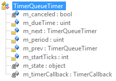
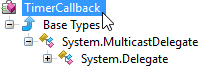
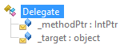
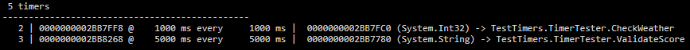

This fourth post of the ClrMD series digs into the details of figuring out which method gets called when a timer triggers. The [associated code](https://github.com/criteo/criteo-dotnet-blog/tree/master/ClrMD-Parts3%2B4_Timers) lists all timers in a dump.

Part 1: [Bootstrapping ClrMD to load a dump](/posts/2017-02-21_clrmd-part-1-going-beyond/).

Part 2: [Finding duplicated strings with ClrMD heap traversing](/posts/2017-03-24_clrmd-part-2-from-clrruntime/).

Part 3: [List timers by following static fields links](/posts/2017-05-03_clrmd-part-3-static-instance-fields/).

### Looking at my timer

In the previous post, we explained how to access a static field of **TimerQueue** to start iterating the list of **TimerQueueTimer** wrapping the created timers. Now that the **currentPointer** variable contains the address of each **TimerQueueTimer**, it is time to extract the details of the timer we have created.



The following code extracts the value of the **TimerQueueTimer** fields corresponding to each Timer thanks to the GetFieldValue helper [presented in the previous post](/posts/2017-05-03_clrmd-part-3-static-instance-fields/):

**TimerQueueTimerFields.cs**

```csharp
var val = GetFieldValue(heap, currentTimerQueueTimerRef, "m_dueTime");
ti.DueTime = (uint)val;

val = GetFieldValue(heap, currentTimerQueueTimerRef, "m_period");
ti.Period = (uint)val;

val = GetFieldValue(heap, currentTimerQueueTimerRef, "m_canceled");
ti.Cancelled = (bool)val;
```

Note that the value for **m_dueTime** is always the same as the value of **m_period**. This is not a bug but it seems that .NET is only keeping the due time during construction but use the corresponding field for other purpose after.

The **m_state** field case is a little bit more complicated to decipher because the type of the object passed to the timer needs to be figured out in addition to its address, if the latter is not null:

**TimerQueueTimerState.cs**

```csharp
val = GetFieldValue(heap, currentTimerQueueTimerRef, "m_state");
ti.StateTypeName = "";
if (val == null)
{
   ti.StateAddress = 0;
}
else
{
   ti.StateAddress = (ulong)val;
   var stateType = heap.GetObjectType(ti.StateAddress);
   if (stateType != null)
   {
      ti.StateTypeName = stateType.Name;
   }
}
```

As usual with ClrMD, you need to get the **ClrType** corresponding to the object referenced by an address before being able to access its fields or to get its name. However, instead of looking into a module as it has been done for **TimerQueue**, it is easier and more efficient to call the **GetObjectType** from **ClrHeap**. Remember that the mandatory test against a null value for the **ClrType** might seem overkill but the ClrMD implementation states that it is possible that the internal CLR state could be corrupted.

### What is the timer callback?

The last piece of information to retrieve is the callback the timer will call when it triggers. The **_timerCallback** field references a **TimerCallback** instance that stores these details.

**GetTimerCallBackDetails.cs**

```csharp
// decypher the callback details
val = GetFieldValue(heap, currentTimerQueueTimerRef, "m_timerCallback");
if (val != null)
{
   ulong elementAddress = (ulong)val;
   if (elementAddress == 0)
      continue;

   var elementType = _heap.GetObjectType(elementAddress);
   if (elementType != null)
   {
      if (elementType.Name == "System.Threading.TimerCallback")
      {
         ti.MethodName = BuildTimerCallbackMethodName(runtime, elementAddress);
      }
      else
      {
         ti.MethodName = "<" + elementType.Name + ">";
      }
   }
   else
   {
      ti.MethodName = "{no callback type?}";
   }
}
else
{
   ti.MethodName = "???";
}
yield return ti;

currentPointer = GetFieldValue(heap, currentTimerQueueTimerRef, "m_next");
```

But how to get the name of the method just with the address of a **TimerCallback** object? Again, open up your favorite decompiler and look at the type hierarchy:



Here are the two fields of the **Delegate** type that are interesting:



The **_methodPtr** field stores the pointer to the method. By chance, the **ClrRuntime** **GetMethodByAddress** method takes this address and returns the name of the method!

If this method is static, the **_target** fields is null. Otherwise, it stores the value of this, the hidden parameter received by all instance methods. In case of type inheritance, it is interesting to know which override will be called. All these steps are wrapped in the following helper function:

**BuildTimerCallbackMethodName.cs**

```csharp
private string BuildTimerCallbackMethodName(ClrRuntime runtime, ulong timerCallbackRef)
{
   var heap = runtime.GetHeap();
   var methodPtr = GetFieldValue(heap, timerCallbackRef, "_methodPtr");
   if (methodPtr != null)
   {
      ClrMethod method = runtime.GetMethodByAddress((ulong)(long)methodPtr);
      if (method != null)
      {
         // figure out the real callback implementor type thanks to _target
         string thisTypeName = "?";
         var thisPtr = GetFieldValue(heap, timerCallbackRef, "_target");
         if ((thisPtr != null) && ((ulong) thisPtr) != 0)
         {
            ulong thisRef = (ulong) thisPtr;
            var thisType = heap.GetObjectType(thisRef);
            if (thisType != null)
            {
               thisTypeName = thisType.Name;
            }
         }
         else
         {
            thisTypeName = (method.Type != null) ? method.Type.Name : "?";
         }
         return string.Format("{0}.{1}", thisTypeName, method.Name);
      }
   }
   return string.Empty;
}
```

### Building a usable summary

Even though the **EnumerateTimers** helper provides a way to list all timers, you often don’t want to show them all; especially when thousands exist and most of them are duplicates. The [sample code associated to this post](https://github.com/criteo/criteo-dotnet-blog/tree/master/ClrMD-Parts3%2B4_Timers) lists the different timers, count the duplicates and sort the result by duplicate count as shown in the following screenshot:



### Next step…

After timers, the next post will show how to integrate your ClrMD-based code into an extension for WinDBG to help decyphering **Task** state.

---

*Co-authored with [Kevin Gosse](https://twitter.com/KooKiz)*
