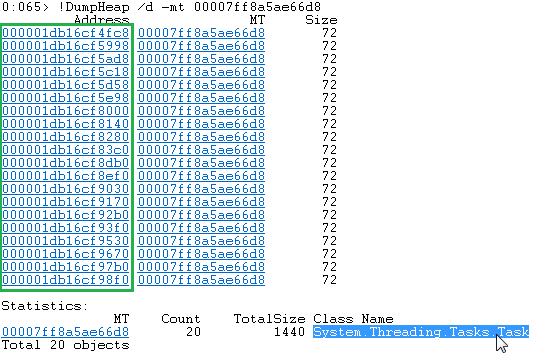
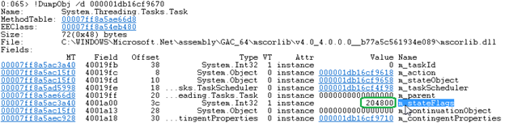
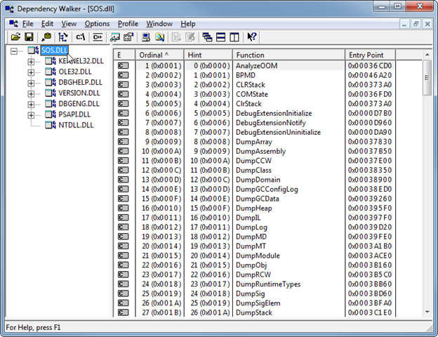
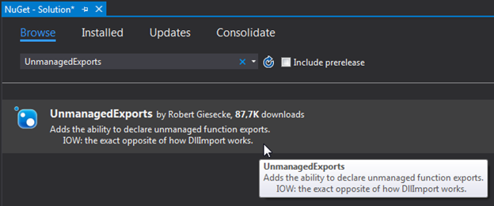
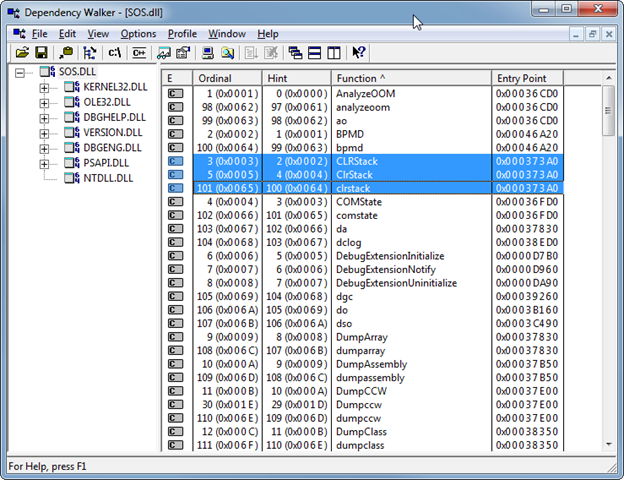
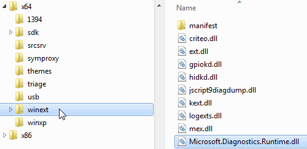

This fifth post of the ClrMD series shows how to leverage this API inside a WinDBG extension. The [associated code](https://github.com/criteo/criteo-dotnet-blog/tree/master/ClrMD-Part5_WinDBG-Extension) allows you to translate a task state into a human readable value.

Part 1: [Bootstrap ClrMD to load a dump](/posts/2017-02-21_clrmd-part-1-going-beyond/).

Part 2: [Find duplicated strings with ClrMD heap traversing](/posts/2017-03-24_clrmd-part-2-from-clrruntime/).

Part 3: [List timers by following static fields links](/posts/2017-05-03_clrmd-part-3-static-instance-fields/).

Part 4: [Identify timers callback and other properties](/posts/2017-05-31_clrmd-part-4-timer-callbacks/).

### Introduction

Since the beginning of this series, you have seen how to use ClrMD to write your own tool to extract meaningful information from a dump file (or a live process). However, most of the time, you are also using WinDBG and SOS to navigate inside the .NET data structures.

It would be convenient if you could leverage the new .NET exploration features based on ClrMD the same way you are using SOS. This post will explain how to achieve this goal by implementing an extension that exports commands callable from within WinDBG.

### Deciphering a Task status

During one of our debugging investigations, we needed to get the value of the **Status** property for a few **Task** instances. If you take a look at the implementation of the property getter in a decompiler (or from [source code](https://referencesource.microsoft.com/#mscorlib/system/threading/Tasks/Task.cs)), you will see that it is computed based on the value of the internal **m_stateFlags** field.

In WinDBG, the **!DumpHeap -stat** command lists all types with their instance count. If the **.prefer_dml 1** command has been set, you even get hyperlinks on some values such as the address or MT (for MethodTable). If you click the MT value for **System.Threading.Tasks.Task**, you get all instances of type **Task**:



Click any address and look at the value of the **m_stateFlags** field:



It is easy to automate the retrieval of the **m_stateFlags** instance field value with ClrMD as explained [earlier](/posts/2017-05-03_clrmd-part-3-static-instance-fields/):

**GetTaskStateFromAddress.cs**

```csharp
private static ulong GetTaskStateFromAddress(ulong address)
{
    var type = Runtime.GetHeap().GetObjectType(address);

    if ((type != null) && (type.Name.StartsWith("System.Threading.Task")))
    {
        // try to get the m_stateFlags field value
        ClrInstanceField field = type.GetFieldByName("m_stateFlags");
        if (field != null)
        {
            var val = field.GetValue(address);
            if (val != null)
            {
                try
                {
                    return (ulong)(int)val;
                }
                catch (InvalidCastException)
                {
                }
            }
        }
    }

    return 0;
}
```

The **ClrType** corresponding to the address is first checked to ensure that it represents a **Task** instance. Next, its **GetFieldByname** helper method returns a **ClrInstanceField** that provides the status via its **GetValue** function.

The next step is to transform this number into a **TaskStatus** enumeration value by simply using a decompiler and copying the logic from the **Task** getter code:

**GetTaskState.cs**

```csharp
private static string GetTaskState(ulong flag)
{
    TaskStatus rval;

    if ((flag & TASK_STATE_FAULTED) != 0) rval = TaskStatus.Faulted;
    else if ((flag & TASK_STATE_CANCELED) != 0) rval = TaskStatus.Canceled;
    else if ((flag & TASK_STATE_RAN_TO_COMPLETION) != 0) rval = TaskStatus.RanToCompletion;
    else if ((flag & TASK_STATE_WAITING_ON_CHILDREN) != 0) rval = TaskStatus.WaitingForChildrenToComplete;
    else if ((flag & TASK_STATE_DELEGATE_INVOKED) != 0) rval = TaskStatus.Running;
    else if ((flag & TASK_STATE_STARTED) != 0) rval = TaskStatus.WaitingToRun;
    else if ((flag & TASK_STATE_WAITINGFORACTIVATION) != 0) rval = TaskStatus.WaitingForActivation;
    else if (flag == 0) rval = TaskStatus.Created;
    else return null;

    return rval.ToString();
}
```

It would be a time saver if this translation could be done by a command right inside WinDBG instead of relying on another tool based on ClrMD in which addresses are pasted.

### WinDBG extension 101

In addition of being a native Windows debugger, WinDBG supports extensions: .dll files that you load with the **.load** command. They are exporting commands that are callable from within WinDBG with the “**!**” prefix. These commands are usual native exports that can be seen with tools such as [http://www.dependencywalker.com/](http://www.dependencywalker.com/) as shown by the next screenshot:



As you can see, all SOS commands are functions exported by the sos.dll native binary. Before digging into the extension functions implementation, notice that a few other functions could also be exported. Among them, the **DebugExtensionInitialize** function provides version information (i.e. which version of the debugging API is expected) and must be exported to be called by WinDBG when the dll is loaded.

Read [this post](https://blogs.msdn.microsoft.com/sgajjela/2013/03/02/how-to-develop-windbg-extension-dll) for more details about how to develop a native WinDBG extension.

All extension command functions take two parameters:

- **An IDebugClient** instance to interact with WinDBG
- An ANSI string for the arguments (such as “*-stat*” for !*dumpheap*)

The bridge between your extension commands and WinDBG is provided by the **IDebugClient** COM interface. But don’t be scared: no need to manually deal with native COM interface with ClrMD! The **DataTarget****.****CreateFromDebuggerInterface** method takes an **IDebugClient** interface and returns an instance of **DataTarget**. As you might remember from [the initial post of this series](/posts/2017-02-21_clrmd-part-1-going-beyond/), **DataTarget** is the gateway to the dump (or live-debugged attached process): we are now back to the known ClrMD world.

### Reuse ClrMD Samples

Hopefully, most of the glue to bind the native world to ClrMD is already available! You simply reuse the partial **DebuggerExtensions** class given [in the samples](https://github.com/Microsoft/clrmd/tree/master/src/Samples/WindbgExtension).

You extend the class with your extension methods that take the following signature:

**MyCommandSignature.cs**

```csharp
public static void MyCommand(IntPtr client, [MarshalAs(UnmanagedType.LPStr)] string args)
```

The first parameter is a pointer to the **IDebugClient** interface provided by WinDBG. The first thing to do in your extension command method is to call the **InitApi** static method with the interface pointer and let the magic happens.

**MyCommand-2.cs**

```csharp
// Must be the first thing in our extension.
if (!InitApi(client))
    return;
```

After that call, the output of the Console will be redirected to WinDBG and your code is free to use the following properties to access the dump via ClrMD:

**DebuggerExtensionPartial.cs**

```csharp
public partial class DebuggerExtensions
{
    public static IDebugClient DebugClient { get; private set; }

    public static DataTarget DataTarget { get; private set; }

    public static ClrRuntime Runtime { get; private set; }
```

The second parameter *args* received by your method is a string that contains the parameters added by the user after the name of your command. For example, if the user types “MyCommand param1 param2”, the *args* parameter will be “param1 param2”.

### Exposing native functions

The last part of magic glue is how to export a native function from a .NET assembly. This is made possible by the UnmanagedExports nuget package by Robert Giesecke.



Once added to your project, decorate the functions to export with the **DllExport** attribute and the native name of the function that will be visible in WinDBG as a command.

There is a little trick here: the names of exported functions are case sensitive for WinDBG. If you take a look again at sos.dll in Dependency Walker and sort exports by Function column, you will notice a few duplicates such as *CLRStack*/ *ClrStack*/ *clrstack* as shown in the following screenshot:



For usability sake, it is a good practice to provide several syntaxes for the same command, including short version such as !*dso* for *!DumpStackObject*in SOS. Unfortunately the **DllExport** attribute does not allow multiple applications on the same method with different exported names. You need to define a different method per exported name and all of them will call the same internal helper method.

**MultipleDllExport.cs**

```csharp
[DllExport("tks")]
public static void tks(IntPtr client, [MarshalAs(UnmanagedType.LPStr)] string args)
{
    OnTkState(client, args);
}

[DllExport("tkstate")]
public static void tkstate(IntPtr client, [MarshalAs(UnmanagedType.LPStr)] string args)
{
    OnTkState (client, args);
}

[DllExport("tkState")]
public static void tkState(IntPtr client, [MarshalAs(UnmanagedType.LPStr)] string args)
{
    OnTkState (client, args);
}

public static void OnTkState (IntPtr client, [MarshalAs(UnmanagedType.LPStr)] string args)
{
    // Must be the first thing in our extension.
    if (!InitApi(client))
        return;
    ...
}
```

Thanks to the **GetTaskStateFromAddress** and **GetTaskState** helper methods described earlier, the implementation of the **OnTkState** method is straightforward once the address or the value has been extracted from the **args** parameter.

### Don’t forget your user: implement help

A good extension always provides an help command that (1) lists the available commands with shortcuts and (2) additional details on each command. Simply add a new file that defines the exports for help/Help and parses the string argument if needed.

**DebuggerExtensionImpl.cs**

```csharp
public partial class DebuggerExtensions
{
    [DllExport("Help")]
    public static void Help(IntPtr client, [MarshalAs(UnmanagedType.LPStr)] string args)
    {
        OnHelp(client, args);
    }

   [DllExport("help")]
   public static void help(IntPtr client, [MarshalAs(UnmanagedType.LPStr)] string args)
   {
        OnHelp(client, args);
   }
 
    const string _help = "...";
    const string _tksHelp = "...";

    private static void OnHelp(IntPtr client, string args)
    {
        // Must be the first thing in our extension.
        if (!InitApi(client))
            return;

        string command = args;

        if (args != null)
            command = args.ToLower();

        switch (command)
        {
            case "tks":
            case "tkstate":
                Console.WriteLine(_tksHelp);
            break;
 
            default:
                Console.WriteLine(_help);
            break;
        }
    }
}
```

### Tips to use the extension

Don’t forget that you might need two versions of your assembly: one for the x86 version of WinDBG if your applications are 32 bit and one for the x64 version of WinDBG in the 64 bit case. If you want to be able to easily load your extension with the .load <myextension> command, copy it with Microsoft.Diagnostics.Runtime.dll (i.e. ClrMD assembly) to the winext subfolder of x64/x86 WinDBG folders:



Before being able to use any of its commands, you must load SOS with the well-known **.loadby sos clr** mantra. But this is not enough: you also have to run at least one SOS command. You are now ready to call any of your extension commands!

### Next step…

The next episodes will bring you into the mysteries under the **dynamic** keyword and how to simplify the syntax to leverage ClrMD.

---

*Co-authored with [Kevin Gosse](https://twitter.com/KooKiz)*
