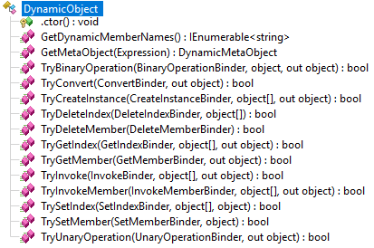

This sixth post of the ClrMD series details how to make object fields navigation simple with C# like syntax thanks to the **dynamic** infrastructure. The associated code is part of the DynaMD library and is [available on GitHub](https://github.com/kevingosse/DynaMD) and [nuget](https://www.nuget.org/packages/DynaMD/).

Part 1: [Bootstrap ClrMD to load a dump](/posts/2017-02-21_clrmd-part-1-going-beyond/).

Part 2: [Find duplicated strings with ClrMD heap traversing](/posts/2017-03-24_clrmd-part-2-from-clrruntime/).

Part 3: [List timers by following static fields links](/posts/2017-05-03_clrmd-part-3-static-instance-fields/).

Part 4: [Identify timers callback and other properties](/posts/2017-05-31_clrmd-part-4-timer-callbacks/).

Part 5: [Use ClrMD to extend SOS in WinDBG](/posts/2017-06-29_clrmd-part-5-extend-sos-windbg/).

As we’ve seen in the previous articles of the series, exploring a complex data structure using ClrMD can quickly become tedious.

Let’s take a concrete example. Imagine we have those types declared:

**Values.cs**

```csharp
public struct Size
{
   public int Width;
   public int Height;
}

public struct Description
{
   public int Id;
   public Size Size;
}

public class Sample
{
   public int Value;
   public string Name { get; }
   public Description Description;
   public Sample Child;
}
```

Given the address of the **Sample** object in the memory dump, even with the **GetFieldValue helper method** to make it simpler, the code to navigate these recursive data types is still… verbose:

**Program.cs**

```csharp
Console.WriteLine((uint)GetFieldValue(heap, currentSampleRef, "Value"));
```

And now, how to get the value of the **Name** property?

Same question for the inner **Child** fields or deeper **Size** field of its **Description**?

Wouldn’t that be great if we could navigate just like through real strongly typed instances? In short, to be able to write:

**Program.cs**

```csharp
var sample = heap.GetProxy(0x00001000); // Some address obtained by other ways

Console.WriteLine(sample.Value);
Console.WriteLine(sample.Name);
Console.WriteLine(sample.Child.Name);
Console.WriteLine(sample.Description.Id);
Console.WriteLine(sample.Description.Size.Width * sample.Description.Size.Height);
```

Instead of:

**Program.cs**

```csharp
Console.WriteLine(GetFieldValue(heap, sampleRef, "Value"));
Console.WriteLine(GetFieldValue(heap, sampleRef, "<Name>k__BackingField"));
Console.WriteLine(GetFieldValue(heap, GetFieldValue(heap, sampleRef, "Child"), "Name"));
// and so on...
```

The first issue is: what is the **GetProxy** method going to return? Since we don’t know at compilation time the properties of the object the code is going to manipulate, we need a way to support some kind of late-binding. Fortunately, this scenario is supported in C# through the usage of the **dynamic** keyword. As you will see in the rest of this post, this is not only a keyword but also an extensible mechanism that perfectly fits our need to define fields at runtime instead of compile time.

We start by creating a class inheriting from **System.Dynamic.DynamicObject**.

**DynamicProxy.cs**

```csharp
internal class DynamicProxy : DynamicObject
```

This base class provides all the facilities needed for late-binding:



As you will see, only a few of these virtual methods need to be overridden to support our scenario.

To construct our proxy, we need two parameters: the ClrMD **ClrHeap** object, that allows us to browse the objects in the memory, and the address of the object we want to impersonate.

**DynamicProxy.cs**

```csharp
public DynamicProxy(ClrHeap heap, ulong address)
{
   _heap = heap;
   _address = address;
}
```

We also provide an extension method for convenience:

**Extensions.cs**

```csharp
namespace Microsoft.Diagnostics.Runtime
{
   public static class Extensions
   {
      public static dynamic GetProxy(this ClrHeap heap, ulong address)
      {
         if (address == 0)
         {
            return null;
         }

         return new DynamicProxy(heap, address);
      }
   }
}
```

The next step is to override the virtual **TryGetMember** method, inherited from **DynamicObject**. It is automatically invoked whenever somebody tries to access a any member of the dynamic object, including its fields.

**DynamicProxy.cs**

```csharp
public override bool TryGetMember(GetMemberBinder binder, out object result)
```

The **Name** property of the **binder** parameter provides the name of the accessed member and we are supposed to return the corresponding proxy object as the out **result** parameter.

We’re going to need the type of the object. For convenience, we store it in a property:

**DynamicProxy.cs**

```csharp
protected ClrType Type
{
   get
   {
      if (_type == null)
      {
         _type = _heap.GetObjectType(_address);
      }

      return _type;
   }
}
```

Using the binder.Name property containing the name of the field we’re trying to access, we retrieve the ClrMD field description:

**DynamicProxy.cs**

```csharp
var field = Type.GetFieldByName(binder.Name);
```

From there, we get the value marshalled by ClrMD and assign it to the **result** out parameter:

**DynamicProxy.cs**

```csharp
result = field.GetValue(_address);
```

Finally, we signal that we managed to bind the invoked member:

**DynamicProxy.cs**

```csharp
return true;
```

This is just a handful of lines of code, but it’s enough for the simple cases where field values are primitive types.. This covers the “Value” field for our Sample type. For the auto-property “Name”, that’s trickier, because the name of the underlying field has characters that are forbidden in C#: “<Name>k__BackingField”. If we write this, it won’t compile:

**Program.cs**

```csharp
Console.WriteLine(proxy.<Name>k__BackingField);
```

We can handle this case by guessing the name of the compiler-generated field, then accessing it:

**DynamicProxy.cs**

```csharp
var field = Type.GetFieldByName(binder.Name);

if (field == null)
{
   // The field wasn't found, it could be an autoproperty
   field = Type.GetFieldByName($"<{binder.Name}>k__BackingField");

   if (field == null)
   {
      // Still not found
      throw new InvalidOperationException("Field not found: " + binder.Name);
   }
}
```

Thanks to this trick, we can write:

**Program.cs**

```csharp
Console.WriteLine(proxy.Name);
```

Great! The next challenge is to transparently manipulate the “Child” field as a reference to another “Sample” object. To achieve this goal, the field could simply return another **DynamicProxy** object that we can manipulate the same way as its parent.

First, we need a helper to find out whether a value is a reference or not:

**DynamicProxy.cs**

```csharp
private static bool IsReference(object result, ClrType type)
{
   return !(result is string) && type.IsObjectReference;
}
```

We treat string as a special case, because ClrMD gives us the marshaled string rather than a reference like for all other types. That’s how we were able to retrieve the value of the **Name** field previously.

Now we call the helper and return a new proxy whenever we’re dealing with a reference:

**DynamicProxy.cs**

```csharp
if (IsReference(result, field.Type))
{
   result = new DynamicProxy(_heap, (ulong)result);
}
```

We can now write:

**Program.cs**

```csharp
Console.WriteLine(proxy.Child.Name);
```

That’s it for accessing a referenced object allocated on the heap. However, this won’t work for accessing an embedded struct such as **proxy.Description.Id**. We’ll see in the next part how to handle this specific case.

---

*Co-authored with [Kevin Gosse](https://twitter.com/kookiz)*
