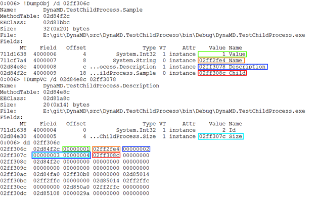

In the previous post of the ClrMD series, we’ve seen how to use **dynamic** to manipulate objects from a memory dump the same way as you would with actual objects. However, the code we wrote was limited to class instances. This time, we’re going to see how to extend it to structs. The associated code is part of the DynaMD library and is [available on GitHub](https://github.com/kevingosse/DynaMD) and [nuget](https://www.nuget.org/packages/DynaMD/).

Part 1: [Bootstrap ClrMD to load a dump](/posts/2017-02-21_clrmd-part-1-going-beyond/).

Part 2: [Find duplicated strings with ClrMD heap traversing](/posts/2017-03-24_clrmd-part-2-from-clrruntime/).

Part 3: [List timers by following static fields links](/posts/2017-05-03_clrmd-part-3-static-instance-fields/).

Part 4: [Identify timers callback and other properties](/posts/2017-05-31_clrmd-part-4-timer-callbacks/).

Part 5: [Use ClrMD to extend SOS in WinDBG](/posts/2017-06-29_clrmd-part-5-extend-sos-windbg/).

Part 6: [Manipulate memory structures like real objects](/posts/2017-08-01_clrmd-part-6-memory-structures/).

Let’s start with a reminder of the object we’re manipulating via our proxy:

**Values.cs**

```csharp
public struct Size
{
   public int Width;
   public int Height;
}

public struct Description
{
   public int Id;
   public Size Size;
}

public class Sample
{
   public int Value;
   public string Name { get; }
   public Description Description;
   public Sample Child;
}
```

Accessing the value of **proxy.Description.Id** is a special case. Why? Because **Size** is a struct, and therefore is embedded directly inside of **Sample** outside of the responsibility of the managed heap. This scenario isn’t directly supported by ClrMD, and calling **GetValue** on the **Size** field will return null instead of the address of the struct. We need to compute this address ourselves.

What is the layout of those objects in memory? To find out, we can create a **Sample** object and then check how the memory is structured within WinDBG

**Sample.cs**

```csharp
new Sample
{
   Name = "Test",
   Value = 1,
   Child = new Sample(),
   Description = new Description
   {
      Id = 2,
      Size = new Size
      {
         Width = 3,
         Height = 4
      }
   }
}
```



The first address (4 bytes because the dump was taken on a 32-bit process) points to the “method table”; some metadata used internally by the CLR to identify the strong type corresponding to this instance in the managed heap. Next, we get the “1” stored by the **Value** field, followed by a pointer to the “Test” string stored by the **Name** field. The field values of the **Description** structure (in dark blue) are then embedded directly inside of the **Sample** object. And inside of that structure, we find the values of the fields of the **Size** structure (in light blue). Finally, the reference to the **Child** field is stored last in the memory of the **Sample** object.

To sum it up, to get the address of the **Description** field, we need to take the address of the **Sample** instance, add 4 bytes for the method table (8 bytes for 64-bit memory dumps), then add the offset of the field (which counts the size of the previous fields and the padding if any):

**DynamicProxy.cs**

```csharp
private DynamicProxy LinkToStruct(ClrField field)
{
   var childAddress = _address + (ulong)field.Offset + (ulong)_heap.PointerSize;

   return new DynamicProxy(_heap, childAddress);
}
```

We call this method from **TryGetMember** when we have a struct that isn’t a primitive type. ClrMD gives that information thanks to the **HasSimpleValue** property of **ClrField**:

**DynamicProxy.cs**

```csharp
if (!field.HasSimpleValue)
{
   result = LinkToStruct(field);

   return true;
}
```

There’s another subtlety though. As we’ve seen in the layout, the **Description** struct, embedded inside of the **Sample** class, doesn’t have a method table of its own. The consequence is that we can’t find out its type by using **ClrHeap.GetObjectType**. As a workaround, we add a constructor allowing us to manually set the underlying ClrMD type of the object impersonated by the proxy:

**DynamicProxy.cs**

```csharp
private DynamicProxy(ClrHeap heap, ulong address, ClrType overrideType)
    : this(heap, address)
{
   _type = overrideType;
}
```

This constructor is called when we still have the type information (taken from the **ClrField**):

**DynamicProxy.cs**

```csharp
private DynamicProxy LinkToStruct(ClrField field)
{
   var childAddress = _address + (ulong)field.Offset + (ulong)_heap.PointerSize;

   return new DynamicProxy(_heap, childAddress, field.Type);
}
```

Now we’re able to read the value of a field of a nested struct:

**Program.cs**

```csharp
Console.WriteLine(sample.Description.Id);
```

Are we done now? Almost. There is one last case to handle, the **Size** struct that is nested inside of **Description**, itself a struct nested inside of a **Sample** instance. How is that an issue? If we use the same code to compute the address of the **Size** struct, then we will be adding the 4/8 bytes for the method table. Except that, as we’ve seen, the nested **Size** struct doesn’t have a method table! We need to add a condition to the code to know whenever we are inside of a nested struct and handle this corner case:

**DynamicProxy.cs**

```csharp
private DynamicProxy LinkToStruct(ClrField field)
{
   var childAddress = _address + (ulong)field.Offset;

   if (!_interior)
   {
      childAddress += (ulong)_heap.PointerSize;
   }

   return new DynamicProxy(_heap, childAddress, field.Type);
}
```

The Boolean flag **_interior** is set in the second constructor that accepts a **ClrType**:

**DynamicProxy.cs**

```csharp
private DynamicProxy(ClrHeap heap, ulong address, ClrType overrideType)
    : this(heap, address)
{
   _type = overrideType;
   _interior = true;
}
```

We’re finally able to read the value of the nested-nested struct:

**Program.cs**

```csharp
Console.WriteLine(sample.Description.Size.Width * sample.Description.Size.Height);
```

Next time, we’ll see how to use the same mechanisms to manipulate arrays in a convenient way.

---

*Co-authored with [Kevin Gosse](https://twitter.com/KooKiz)*
