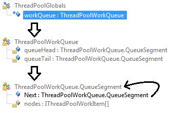
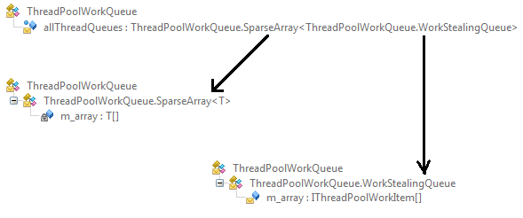
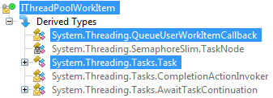

This post of the series shows how to easily list pending tasks and work items managed by the .NET thread pool using DynaMD proxies.

Part 1: [Bootstrap ClrMD to load a dump](/posts/2017-02-21_clrmd-part-1-going-beyond/).

Part 2: [Find duplicated strings with ClrMD heap traversing](/posts/2017-03-24_clrmd-part-2-from-clrruntime/).

Part 3: [List timers by following static fields links](/posts/2017-05-03_clrmd-part-3-static-instance-fields/).

Part 4: [Identify timers callback and other properties](/posts/2017-05-31_clrmd-part-4-timer-callbacks/).

Part 5: [Use ClrMD to extend SOS in WinDBG](/posts/2017-06-29_clrmd-part-5-extend-sos-windbg/).

Part 6: [Manipulate memory structures like real objects](/posts/2017-08-01_clrmd-part-6-memory-structures/).

Part 7: [Manipulate nested structs using dynamic](/posts/2017-08-28_clrmd-part-7-nested-structs-dynamic/).

### Introduction

The previous posts introduced the [DynaMD nuget](https://www.nuget.org/packages/DynaMD/) that helps navigating among type instances using a C#-like syntax “instance.field”. Let’s see how to use it to enumerate the asynchronous items queued in the .NET thread pool. As a bonus, the running tasks and work items won’t be forgotten.

### ThreadPool internals

The .NET ThreadPool is keeping track of the pending work items into [two different data structures](http://www.danielmoth.com/Blog/New-And-Improved-CLR-4-Thread-Pool-Engine.aspx):

- A global queue: stored as a **ThreadPoolWorkQueue** instance referenced by the **workQueue** static field



- several per-thread (TLS) local queues: stored in **SparseArray<ThreadPoolWorkQueue+WorkStealingQueue>** linked from the **allThreadQueues** static field



As you can see, the algorithm to list the pending tasks and work items starts from a static field and iterate on a linked list of **QueueSegment** for global queue and array of **WorkStealingQueue** for per thread queues. Both are storing arrays of **IThreadPoolWorkItem** that **Task** and **QueueUserWorkItemCallback** are implementing:



Too much theory… Let’s write some code!

### Global ThreadPool queue

You have seen in a [previous post](/posts/2017-05-03_clrmd-part-3-static-instance-fields/) how to access the value of a static field per application domain:

**EnumerateGlobalThreadPoolItems-1.cs**

```csharp
public IEnumerable<ThreadPoolItem> EnumerateGlobalThreadPoolItems()
{
    // look for the ThreadPoolGlobals.workQueue static field
    ClrModule mscorlib = GetMscorlib();
    if (mscorlib == null)
        throw new InvalidOperationException("Impossible to find mscorlib.dll");

    ClrType queueType = mscorlib.GetTypeByName("System.Threading.ThreadPoolGlobals");
    if (queueType == null)
        yield break;

    ClrStaticField workQueueField = queueType.GetStaticFieldByName("workQueue");
    if (workQueueField == null)
        yield break;

    // the CLR keeps one static instance per application domain
    foreach (var appDomain in _clr.AppDomains)
    {
```

For an application domain in which the threadpool is not used, we need to check against null for the expected **ThreadPoolWorkQueue**:

**EnumerateGlobalThreadPoolItems-2.cs**

```csharp
        object workQueueValue = workQueueField.GetValue(appDomain);
        ulong workQueueRef = (workQueueValue == null) ? 0L : (ulong)workQueueValue;
        if (workQueueRef == 0)
            continue;

        // should be System.Threading.ThreadPoolWorkQueue
        ClrType workQueueType = _heap.GetObjectType(workQueueRef);
        if (workQueueType == null)
            continue;
        if (workQueueType.Name != "System.Threading.ThreadPoolWorkQueue")
            continue;

        foreach (var item in EnumerateThreadPoolWorkQueue(workQueueRef))
        {
            yield return item;
        }
    }
}
```

The role of the **EnumerateThreadPoolWorkQueue** helper method is to iterate on each **QueueSegment** of the linked list pointed to by the **queueTail** field of the per appdomain **ThreadPoolWorkQueue** object.

At the beginning of the following code, note that **dynamic** allows writing C# code even though the **queueTail** and **nodes** fields are not known at compile time. Even more convenient, a **foreach** statement is possible when the instance behind the DynaMD proxy is an array:

**EnumerateThreadPoolWorkQueue.cs**

```csharp
private IEnumerable<ThreadPoolItem> EnumerateThreadPoolWorkQueue(ulong workQueueRef)
{
    // start from the tail and follow the Next
    var proxy = _heap.GetProxy(workQueueRef);
    var currentQueueSegment = proxy.queueTail;

    while (currentQueueSegment != null)
    {
        // get the System.Threading.ThreadPoolWorkQueue+QueueSegment nodes array
        var nodes = currentQueueSegment.nodes;
        if (nodes == null)
            continue;

        foreach (var item in nodes)
        {
            if (item == null)
                continue;

            yield return GetThreadPoolItem(item);
        }

        currentQueueSegment = currentQueueSegment.Next;
    }
}
```

The **GetThreadPoolItem** helper method will be described soon but first, let’s see how to get the items from the thread local queues.

### Local ThreadPool queues

The same static field driven operations are needed to access the sparse array containing… more arrays:

**EnumerateLocalThreadPoolItems.cs**

```csharp
public IEnumerable<ThreadPoolItem> EnumerateLocalThreadPoolItems()
{
    var queueType = GetMscorlib().GetTypeByName("System.Threading.ThreadPoolWorkQueue");
    if (queueType == null)
        yield break;

    ClrStaticField threadQueuesField = queueType.GetStaticFieldByName("allThreadQueues");
    if (threadQueuesField == null)
        yield break;

    foreach (ClrAppDomain domain in _clr.AppDomains)
    {
        ulong? threadQueueRef = (ulong?)threadQueuesField.GetValue(domain);
        if (!threadQueueRef.HasValue || threadQueueRef.Value == 0)
            continue;

        var threadQueue = _heap.GetProxy((ulong)threadQueueRef);
        if (threadQueue == null)
            continue;

        var sparseArray = threadQueue.m_array;
        if (sparseArray == null)
            continue;

        foreach (var stealingQueue in sparseArray)
        {
            if (stealingQueue == null)
                continue;

            foreach (var item in EnumerateThreadPoolStealingQueue(stealingQueue))
            {
                yield return item;
            }
        }
    }
}
```

The spare arrays contain either null or a stealing queue that itself contains… an array:

**EnumerateThreadPoolStealingQueue.cs**

```csharp
private IEnumerable<ThreadPoolItem> EnumerateThreadPoolStealingQueue(dynamic stealingQueue)
{
    var array = stealingQueue.m_array;
    if (array == null)
        yield break;

    foreach (var item in array)
    {
        if (item == null)
            continue;

        yield return GetThreadPoolItem(item);
    }
}
```

Now that we managed to retrieve the thread pool items, we can try to decipher them.

### Deciphering thread pool items

A thread pool item stored in the global or in the local queues could be a **Task**, a **QueueUserWorkItemCallback** or a simple method:

**GetThreadPoolItem.cs**

```csharp
private ThreadPoolItem GetThreadPoolItem(dynamic item)
{
    // get the ClrType directly from the dynamic proxy
    ClrType itemType = item.GetClrType();

    if (itemType.Name == "System.Threading.Tasks.Task")
    {
        return GetTask(item);
    }
    else if (itemType.Name == "System.Threading.QueueUserWorkItemCallback")
    {
        return GetQueueUserWorkItemCallback(item);
    }
    else
    {
        // create a raw information
        ThreadPoolItem tpi = new ThreadPoolItem()
        {
            Type = ThreadRoot.Raw,
            Address = (ulong)item,
            MethodName = itemType.Name
        };

        return tpi;
    }
}
```

The kind of item is computed from the **ClrType** of the object given by the **ClrHeap.GetObjectType** method. An **ulong** address is expected by this ClrMD method and it would be easy to get from the **dynamic** returned by DynaMD by just casting it to **ulong**. However, it is easier to simply call the **GetClrType** method on the dynamic proxy!

## Next step…

The next and last episode of the ClrMD series will show you how to decipher tasks and thread pool items to know which of your methods will be called. As a bonus, the running tasks and work items won’t be forgotten.

---

*Co-authored with [Kevin Gosse](https://twitter.com/KooKiz)*
