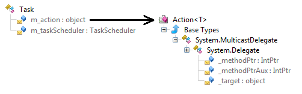
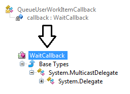

This post of the series shows how to easily list pending tasks and work items managed by the .NET thread pool using DynaMD proxies.

Part 1: [Bootstrap ClrMD to load a dump](/posts/2017-02-21_clrmd-part-1-going-beyond/).

Part 2: [Find duplicated strings with ClrMD heap traversing](/posts/2017-03-24_clrmd-part-2-from-clrruntime/).

Part 3: [List timers by following static fields links](/posts/2017-05-03_clrmd-part-3-static-instance-fields/).

Part 4: [Identify timers callback and other properties](/posts/2017-05-31_clrmd-part-4-timer-callbacks/).

Part 5: [Use ClrMD to extend SOS in WinDBG](/posts/2017-06-29_clrmd-part-5-extend-sos-windbg/).

Part 6: [Manipulate memory structures like real objects](/posts/2017-08-01_clrmd-part-6-memory-structures/).

Part 7: [Manipulate nested structs using dynamic](/posts/2017-08-28_clrmd-part-7-nested-structs-dynamic/).

Part 8: [Spelunking inside the .NET Thread Pool](/posts/2017-11-03_clrmd-part-8-net-thread-pool/)

## Introduction

The previous post showed you how to list the pending tasks and work items from the.NET thread pool. It is now time to find out which method will be called. Last but not least, the running work items will be listed.

## Understanding .NET “tasks”

The **Task** case requires more work to extract meaningful information. The **m_taskScheduler** field of the class keeps track of the custom scheduler, if any (we need this at Criteo). More importantly, the **m_action** field stores an **Action<T>** instance wrapping the callback of the **Task** as a delegate:



The **_target** field is the implicit **this** parameter of instance methods that is pointed to by the **_methodPtr**/**_methodPtrAux** field.

**GetTask.cs**

```csharp
private ThreadPoolItem GetTask(dynamic task)
{
   ThreadPoolItem tpi = new ThreadPoolItem()
   {
      Address = (ulong)task,
      Type = ThreadRoot.Task
   };

   // look for the context in m_action._target
   var action = task.m_action;
   if (action == null)
   {
      tpi.MethodName = " [no action]";
      return tpi;
   }

   var target = action._target;
   if (target == null)
   {
      tpi.MethodName = " [no target]";
      return tpi;
   }

   tpi.MethodName = BuildDelegateMethodName(target.GetClrType(), action);

   // get the task scheduler if any
   var taskScheduler = task.m_taskScheduler;
   if (taskScheduler != null)
   {
      var schedulerType = taskScheduler.GetClrType().ToString();
      if ("System.Threading.Tasks.ThreadPoolTaskScheduler" != schedulerType)
         tpi.MethodName = $"{tpi.MethodName} [{schedulerType}]";
   }

   return tpi;
}
```

The code to extract the name of the method behind the action relies on the **ClrRuntime.GetMethodByAddress** helper from ClrMD:

**BuildDelegateMethodName-1.cs**

```csharp
internal string BuildDelegateMethodName(ClrType targetType, dynamic action)
{
   var methodPtr = action._methodPtr;
   if (methodPtr != null)
   {
      ClrMethod method = _clr.GetMethodByAddress((ulong)methodPtr);

```

In case of anonymous methods used for tasks and work items, the call to GetMethodByAddress will succeed. However, if you code old style by passing a named method (static or not), then the other **_methodPtrAux** field should be used:

**BuildDelegateMethodName-2.cs**

```csharp
      if (method == null)
      {
         // could happen in case of static method
         methodPtr = action._methodPtrAux;
         method = _clr.GetMethodByAddress((ulong)methodPtr);
      }
```

The next step is to figure out the name of the method and the name of the defining type. Again, anonymous methods are treated differently:

**BuildDelegateMethodName-3.cs**

```csharp
      // anonymous method
      if (method.Type.Name == targetType.Name)
      {
         return $"{targetType.Name}.{method.Name}";
      }
      else
      // method is implemented by an class inherited from targetType
      // ... or a simple delegate indirection to a static/instance method
      {
         if (
             (targetType.Name == "System.Threading.WaitCallback") ||
             targetType.Name.StartsWith("System.Action<")
            )
         {
            return $"{method.Type.Name}.{method.Name}";
         }
         else
         {
            return $"({targetType.Name}){method.Type.Name}.{method.Name}";
         }
      }
   }
```

The last trick is that tasks and work items use different types to store the method details so the code branches based on the target type name.

## How to decode basic thread pool items

When you use **ThreadPool.QueueUserWorkItem** to ask the .NET thread pool to execute a callback asynchronously, the expected parameter is a **WaitCallback** that is stored as a **QueueUserWorkItem** by the thread pool:



Once the **WaitCallback** is extracted from the **callback** field of **QueueUserWorkItem**, the same call to **BuildDelegateMethodName** does the rest:

**GetQueueUserWorkItemCallback.cs**

```csharp
private ThreadPoolItem GetQueueUserWorkItemCallback(dynamic element)
{
   ThreadPoolItem tpi = new ThreadPoolItem()
   {
      Address = (ulong)element,
      Type = ThreadRoot.WorkItem
   };

   // look for the callback given to ThreadPool.QueueUserWorkItem()
   var callback = element.callback;
   if (callback == null)
   {
      tpi.MethodName = "[no callback]";
      return tpi;
   }

   var target = callback._target;
   if (target == null)
   {
      tpi.MethodName = "[no callback target]";
      return tpi;
   }

   ClrType targetType = target.GetClrType();
   if (targetType == null)
   {
      tpi.MethodName = $" [target=0x{(ulong)target}]";
   }
   else
   {
      // look for method name
      tpi.MethodName = BuildDelegateMethodName(targetType, callback);
   }

   return tpi;
}
```

## And what about running ThreadPool threads?

The previous code allows you to list the pending asynchronous actions that will be run by the thread pool. Getting the list of the running work items and tasks is as easy as iterating the **Threads** property from **ClrRuntime** and checking if their **IsThreadpoolWorker** property is true!

The following code lists the thread waiting on a lock first , then the dead ones and finally the real running ones:

**ForEachOrderedThread.cs**

```csharp
foreach (var thread in _host.Session.Clr.Threads
    .Where(t => t.IsThreadpoolWorker)
    .OrderBy(t => (t.LockCount > 0) ? -1 : (!t.IsAlive ? t.ManagedThreadId + 10000 : t.ManagedThreadId)))
```

For each worker **ClrThread**, you know if there was an exception (via the **CurrentException** property) but more important, you have access to the stack trace. The **ClrThread.EnumerateStackTrace** method iterate on each stack frame represented by a **ClrStackFrame** object. The **SetThreadWaiters** method in the [lockingInspection.cs](https://github.com/Microsoft/clrmd/blob/master/src/Microsoft.Diagnostics.Runtime/Desktop/lockinspection.cs) shows how to detect on what locking patterns threads are blocked such as **Monitor.Enter**, **lock**, **Join**, wait on native handles or reader/writer locks.

Last but not least, the following code allows you to know if a thread currently processes a task or a simple work item:

**TaskOrWorkitem.cs**

```csharp
if (frame.Method.Type.Name == "System.Threading.Tasks.Task")
{
   if (frame.Method.Name == "Execute")
   {
      // the previous frame should contain the name of the method called by the task
      if (lastFrame != null)
      {
         // this is a task executing the method 
         // given by lastFrame.DisplayString
      }
      break;
   }
}
else
if (frame.Method.Type.Name == "System.Threading.ExecutionContext")
{
   if (frame.Method.Name == "RunInternal")
   {
      // the previous frame should contain the name of the method called by QueueUserWorkItem
      if (lastFrame != null)
      {
         // this is a work item executing the method 
         // given by lastFrame.DisplayString
      }
      break;
   }
}
```

## Next step…

This is the last episode of the ClrMD series but it is not the end! We have started a short series about the [new version of WinDBG](https://www.microsoft.com/en-us/store/p/windbg-preview/9pgjgd53tn86). The next long series will show how to take advantage of the ETW (on Windows) and LTTng (on Linux) events emitted by the CLR to monitor your live applications at close range.

---

*Co-authored with [Kevin Gosse](https://twitter.com/KooKiz)*
