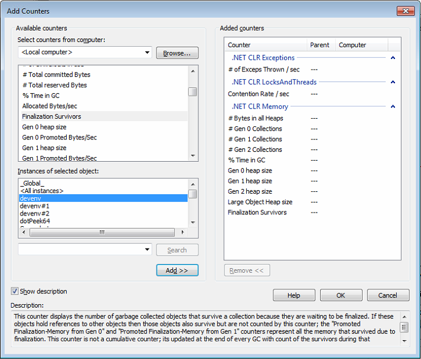
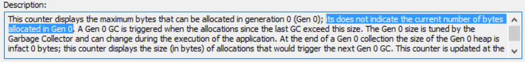
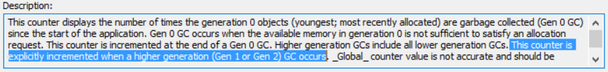
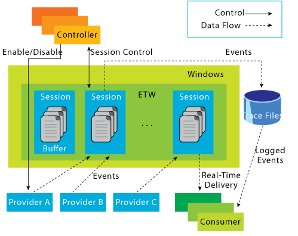
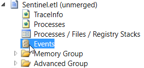
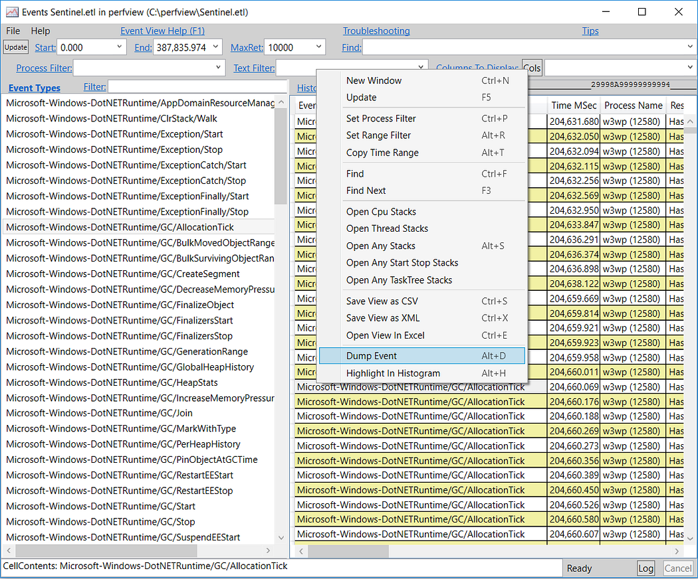
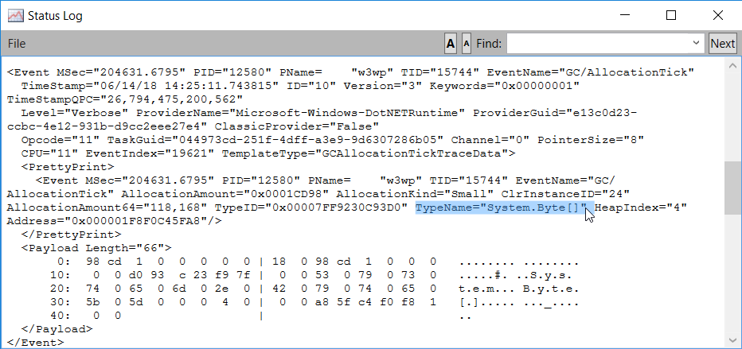

## Introduction

At Criteo, each .NET application provides custom metrics to monitor deviation and trigger alerts. This is the first line of defense against misbehaviors. The next step is to figure out what could be the cause of these deviations. After source code changes analysis, it is often needed to dig deeper into performance counters exposed by the CLR such as the following:

Again, these counters are used to detect possible deviations in usual patterns. For example, some applications are supposed to answer under a 50 ms threshold. When the corresponding “number of timeouts” or “request time” metrics start to increase, several reasons linked to the CLR might be partially responsible but it is hard to tell:

- *# of Exceps Thrown / sec*: if the number increases, it is possible that performance is impacted but how to get the list of these unusual first chance exceptions caught by the applications?
- *Contention rate / sec*: an increase might suggest that threads are spending more time waiting for locks to be released but for how many milliseconds? This information is not available among the performance counters.
- *#Gen 2 Collections*: even if this counter does vary a lot, how could we be sure that blocking gen2 collections are responsible for the lack of responsiveness: no counter exposes how many milliseconds the applications threads were frozen in case of a compacting collection.

As you can see, this second line of defense is not enough to start an investigation with a clear assumption in mind.

In addition, some counters are not showing what you might think:

- *# Gen <n> Collections*: gen0 counter is also incremented after gen1 and gen2 collection, gen1 counter is also incremented after gen2 collection. There is no counter for the exact count of per generation collection trigger even though you could compute their value.

- *# of current logical/physical threads*: it is not possible to make any link with the number of threads used by the thread pool or the TPL/Tasks. As you can see in the [early versions of the Core CLR](https://github.com/dotnet/coreclr/blob/release/1.0.0/src/vm/threads.cpp) (i.e. where the performance counters code was not removed yet), the increment and decrement of counts do not seem thread safe: that could explain some issues (always less threads than expected in our monitoring boards) we faced in the past.

You need to realize that performance counters are sampling-based and could show the same value that does not represent the current reality. For example, most of the GC counters will not change until the next garbage collection occurs; i.e. the *% Time in GC* could stay misleading (until the next GC) and this is very far from the % CPU time you are used to.

If you are moving to .NET Core, you will discover a worse situation: **There are** **no more performance counters on Windows** **to monitor your applications** And if you are targeting Linux… well…

However, as the rest of the articles will demonstrate, the CLR provides even more details via strongly typed tracing through Event Tracing for Windows (ETW) and LTTng on Linux.

## CLR and Event Tracing for Windows

The ETW framework has existed for a long long time and allows consumers to listen to events emitted by producers as explained in [a 2007 MSDN Magazine article](http://download.microsoft.com/download/3/A/7/3A7FA450-1F33-41F7-9E6D-3AA95B5A6AEA/MSDNMagazineApril2007en-us.chm).

A tracing session wraps the providers and consumers together either for real-time processing or .etl file generation. If you already know [the Perfview tool](https://github.com/microsoft/perfview/releases) or the [Windows Performance Toolkit/xperf](https://docs.microsoft.com/en-us/windows-hardware/test/wpt?WT.mc_id=DT-MVP-5003325), you should be familiar with the generated .etl files.

For debugging purpose, listening to events during a live session with a minimal impact on production machines is even more practical. The [list of documented CLR events](https://docs.microsoft.com/en-us/dotnet/framework/performance/clr-etw-events?WT.mc_id=DT-MVP-5003325) is huge but no fear: this series of posts will focus on exceptions, finalizers, thread contention and garbage collection.

In addition to the documentation, I would recommend that you take a look at how the tracing is implemented in [.NET Core source code](https://github.com/dotnet/coreclr/tree/master/src) for two reasons. First, you get access to the [exact payload schema](https://github.com/dotnet/coreclr/blob/master/src/vm/ClrEtwAll.man) of all generated events (even those not documented). Second, by searching the Core CLR source code for the FireEtw-prefixed methods generated at build time, you will get a better understanding of when things are happening. Don’t forget the higher level [ETW::-prefixed methods and enums](https://github.com/dotnet/coreclr/blob/master/src/vm/eventtrace.cpp) that are also called by the runtime to emit traces.

Perfview has already been mentioned earlier to help analyzing traces but it is also useful for deciphering events produced by the CLR. On a trace, double-click the **Events** node:

In the new window that pops up, select an event on the left side to get the list of occurrences on the right side:

Right-click an event occurrence and select **Dump Event** to get its payload details:

such as the type name of the new instance that led the GC to trigger the [AllocationTick event](https://docs.microsoft.com/en-us/dotnet/framework/performance/garbage-collection-etw-events#gcallocationtick_v2_event?WT.mc_id=DT-MVP-5003325) after ~100KB was allocated.

In addition to [the tooling available](https://docs.microsoft.com/en-us/dotnet/framework/performance/controlling-logging?WT.mc_id=DT-MVP-5003325) to get the traces, Microsoft is providing [theMicrosoft.Diagnostics.Tracing.TraceEventNuget package](https://www.nuget.org/packages/Microsoft.Diagnostics.Tracing.TraceEvent/). With this library, you will be able to build your own tool or listen to the CLR events from within your running applications to replace the performance counters. The next episode of the series will ramp you up with the implementation of a basic listener.

---

*Co-authored with [Kevin Gosse](https://twitter.com/kookiz)*
