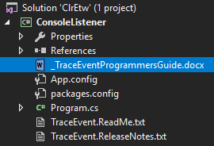
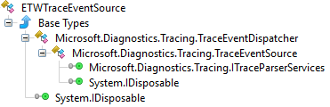
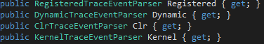
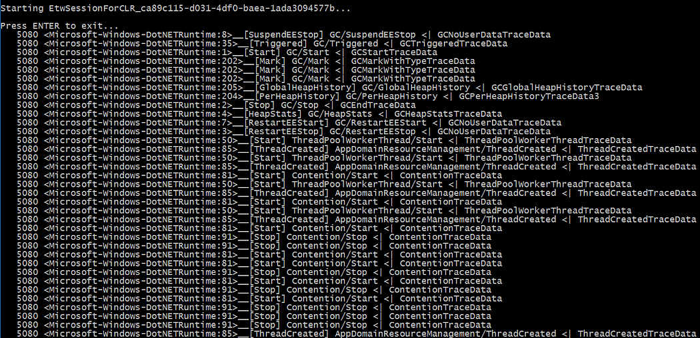
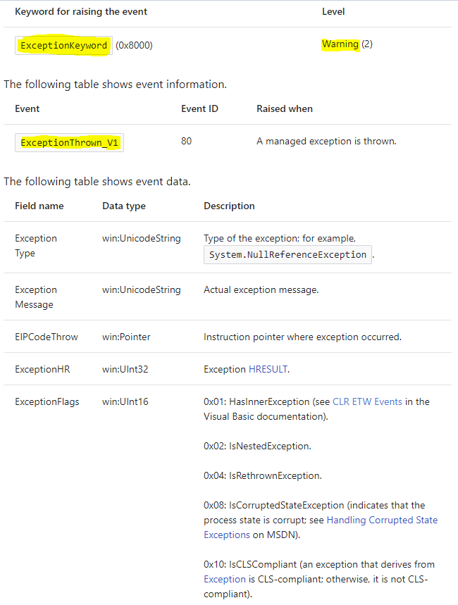
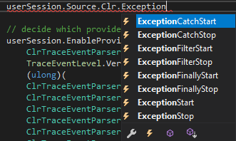
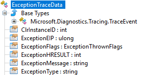

Part 1: [Replace .NET performance counters by CLR event tracing](/posts/2018-06-19_replace-net-performance-counters/).

In the previous post, you saw that the CLR is emitting traces that could (should?) replace the performance counters you are using to monitor your application and investigate when something goes wrong. The perfview tool that was demonstrated is built on top of the [Microsoft.Diagnostics.Tracing.TraceEvent Nuget package](https://www.nuget.org/packages/Microsoft.Diagnostics.Tracing.TraceEvent) and you should leverage it to build your own monitoring system. In addition, the [Microsoft.Diagnostics.Tracing.TraceEvent.Samples Nuget package](https://www.nuget.org/packages/Microsoft.Diagnostics.Tracing.TraceEvent.Samples/) contains sample code to help you ramping up.

## Manage an ETW session

Create a console application and add the TraceEvent Nuget package. Your project now contains a TraceEvent.ReadMe.txt and a more detailed _TraceEventProgrammersGuide.docx Word document. You should really take the time to read the latter: it describes the architecture in great details and helps understanding what is going on under the scene.



In the **Main** entry point, add the following code to list existing ETW sessions:

**ShowETWSessions.cs**

```csharp
Console.WriteLine("Current ETW sessions:");
foreach(var session in TraceEventSession.GetActiveSessionNames())
{
   Console.WriteLine(session);
}
Console.WriteLine("--------------------------------------------");
```

Like **logman -ets** command, this piece of code might be handy during debugging session. Why? Just because when you debug your code that creates an ETW session and if you stop the debugger before disposing it, the session becomes orphan and after a while, Windows simply refuses to create new ones. In addition to easily find your orphans sessions, another good reason to give a meaningful name to your session is to be able to stop it. Type the following command line: **logman -ets stop <session name>** to close a running session and clean up the mess your debugging sessions might have created. This is definitively better than rebooting the machine.

The next step is to create a session. You get a **TraceEventSession** object either by attaching to an existing session or by creating a new one as shown in this code:

**MainETW.cs**

```csharp
string sessionName = "EtwSessionForCLR_" + Guid.NewGuid().ToString();
Console.WriteLine($"Starting {sessionName}...\r\n");
using (TraceEventSession userSession = new TraceEventSession(sessionName, TraceEventSessionOptions.Create))
{
   Task.Run(() =>
   {
      // register handlers for events on the session source
      // more on this later...

      // decide which provider to listen to with filters if needed

      // process the events in a blocking call
   });

   // wait for the user to dismiss the session
   Console.WriteLine("Presse ENTER to exit...");
   Console.ReadLine();
}
```

Why is it necessary to run the code that manipulates the session in another thread with **Task.Run**? The call to the **Process** method is synchronous so it would not be possible to get the user input. When the user exits, the session is disposed and the **Process** method returns. If you close the session with logman, the **Process** method will also return. This behavior applies because the **TraceEventSession.StopOnDispose** property is set to true by default.

Note that if you want to use TraceEvent to parse an .etl file, you simply need to pass the filename as an additional parameter to the **TraceEventSession** constructor; the rest of the code will be the same.

The code running in the task first registers handlers to the events as you will soon see. Next, you need to enable the providers you are interested in receiving events from. In our case, only the ClrTraceEventParser.ProviderGuid CLR provider is enabled (read [https://docs.microsoft.com/en-us/dotnet/framework/performance/clr-etw-providers](https://docs.microsoft.com/en-us/dotnet/framework/performance/clr-etw-providers?WT.mc_id=DT-MVP-5003325) for more details about the two available CLR providers). In addition to the [verbosity level](https://docs.microsoft.com/en-us/dotnet/framework/performance/clr-etw-keywords-and-levels#etw-event-levels), you should set the keywords with the ClrTraceEventParser.Keywords enumeration values corresponding to [the categories of events you want to receive](https://docs.microsoft.com/en-us/dotnet/framework/performance/clr-etw-keywords-and-levels?WT.mc_id=DT-MVP-5003325)

**ProviderAndSource.cs**

```csharp
// register handlers for events on the session source
// more on this later...

// decide which provider to listen to with filters if needed
userSession.EnableProvider(
   ClrTraceEventParser.ProviderGuid,
   TraceEventLevel.Verbose,
   (ulong)(
      ClrTraceEventParser.Keywords.Contention | // thread contention timing
      ClrTraceEventParser.Keywords.Threading | // threadpool events
      ClrTraceEventParser.Keywords.Exception | // get the first chance exceptions
      ClrTraceEventParser.Keywords.GCHeapAndTypeNames | 
      ClrTraceEventParser.Keywords.Type | // for finalizer and exceptions type names
      ClrTraceEventParser.Keywords.GC // garbage collector details
);

// this is a blocking call until the session is disposed
userSession.Source.Process();
Console.WriteLine("End of session");
```

Additional filters such as which process to monitor can be set by passing TraceEventProviderOptions to the **EnableProvider()** method. But wait! On a Windows 7 machine this kind of filtering is not working and you get events from all processes… No specific documentation to look at… This is where knowing what Win32 APIs are called behind the scene could help. Instead of decompiling the TraceEvent assembly, you should instead take a look at its implementation… because it is [open sourced](https://github.com/Microsoft/perfview/blob/master/src/TraceEvent) with Perfview! The [Microsoft documentation](https://docs.microsoft.com/en-us/dotnet/framework/performance/clr-etw-keywords-and-levels?WT.mc_id=DT-MVP-5003325) for the called **EnableTraceEx2** function states that *there are several types of scope filters that allow filtering based on the event ID, the process ID (PID), executable filename, the app ID, and the app package name.* **This feature is supported on Windows 8.1,Windows Server 2012 R2, and later**. If you need to filter out events based on process id, don’t worry: each event will provide it.

## Listen to CLR events



This class derives from **TraceEventDispatcher** that provides the **Process** method. The **TraceEventSource** ancestor class is where the event handlers can be registered on the following properties:



Behind the scene, each provider emits strongly typed traces that could be difficult to parse manually: don’t worry, the TraceEvent library does the job for you through dedicated parsers exposed by **TraceEventSource**.

In case of .NET events, you usually rely on the **ClrTraceEventParser** that exposes via .NET event the 100+ different traces emitted by the CLR ETW provider… plus one called **All** just in case you want to see all of them.



Here is the first naïve implementation to display all CLR traces as shown in the previous screenshot:

**NaiveListener.cs**

```csharp
// listen to all CLR events
userSession.Source.Clr.All += delegate (TraceEvent data)
{
   // skip verbose and unneeded events
   if (SkipEvent(data))
      return;

   // raw dump of the events
   Console.WriteLine($"{data.ProcessID,7} <{data.ProviderName}:{data.ID}>__[{data.OpcodeName}] {data.EventName} <| {data.GetType().Name}");
};
```

The **SkipEvent** method is here just for you to filter out traces… and this is very helpful to remove meaningless noise when you are beginning to work with CLR traces and you need to see which events are generated.

Each trace payload is received as a generic **TraceEvent** object that exposes common properties:

- **ProcessID**/**ProcessName**: information related to the process in which the trace has been emitted by the CLR
- **ThreadID**: numeric identifier of the thread from which the trace was sent
- **ID**: numeric identifier of the trace that helps you find the corresponding event in the Microsoft documentation (i.e. *Event ID*)
- **OpcodeName**: human readable name of the trace
- **EventName**: concatenation of task (= group such as “Contention” corresponding to the [Keyword](https://docs.microsoft.com/en-us/dotnet/framework/performance/clr-etw-keywords-and-levels?WT.mc_id=DT-MVP-5003325) mentioned earlier) and **OpcodeName** separated by ‘/’

## But… what are the events to listen to?

Son, the next big step is to learn which events are interesting for you to monitor. I would suggest you read the rest of this post before going to [the Microsoft documentation](https://docs.microsoft.com/en-us/dotnet/framework/performance/clr-etw-events?WT.mc_id=DT-MVP-5003325) that describes all CLR events in details.

Let’s start with the simplest case: one trace is emitted when an exception is thrown. Microsoft [documents theExceptionThrown_V1](https://docs.microsoft.com/en-us/dotnet/framework/performance/exception-thrown-v1-etw-event?WT.mc_id=DT-MVP-5003325) event with **ExceptionKeyword** and **Warning** verbosity level:



Unfortunately, there is no **ExceptionThrown_V1** event at the **ClrTraceEventParser** level:



In fact, the ID property of the received traces maps the “Event ID” of the documentation so the **ExceptionStart** event happens to bring the same level of information as **ExceptionThrown_V1** via the **ExceptionTraceData** parameter passed to the handler:



The corresponding handler implementation is straightforward:

**ExceptionStartHandler.cs**

```csharp
private static void OnExceptionStart(ExceptionTraceData data)
{
   Console.WriteLine($"{data.EventName} --> {data.ExceptionType} : {data.ExceptionMessage}");
}
```

The interesting properties are **ExceptionType** for the name of the thrown exception and **ExceptionMessage** for its message. Note that if the exception contains inner exceptions, you know it by taking a look at the **ExceptionFlags** property but you can’t access them. Remember that you should have received earlier the trace corresponding to the inner exception when it was thrown so you are just missing the relationship between the two.

If for an unknown reason the number of exceptions raises for one of your applications, listening to this event is a very cheap way to know which exceptions are thrown and search for them into the source code!

The next episode will detail other important CLR traces you need to monitor your applications and even start an investigation.

---

*Co-authored with [Kevin Gosse](https://twitter.com/kookiz)*
