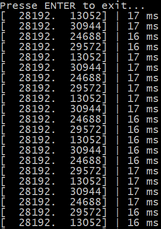
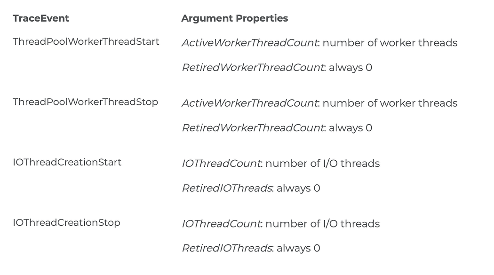

Part 1: [Replace .NET performance counters by CLR event tracing](/posts/2018-06-19_replace-net-performance-counters/).

Part 2: [Grab ETW Session, Providers and Events](/posts/2018-07-26_grab-etw-session-providers/).

## Introduction

In the previous post, you saw how the TraceEvent nuget helps you deciphering simple ETW events such as the one emitted when a first chance exception happens. Most situations trigger more than one event and could make their processing more complicated.

## Who said Finalizer?

In the early days of .NET, you might had to deal with native resources that you were responsible for cleaning up with the related unmanaged API or legacy COM component. It was a best practice to implement a ~finalizer method to ensure that everything was deleted the right way. These times are over for most of us now. If you don’t have an **IntPtr** field in your class, chances are that you don’t need a ~finalizer method.

The [Microsoft documentation about IDisposable/Finalizer](https://docs.microsoft.com/en-us/dotnet/standard/garbage-collection/implementing-dispose?WT.mc_id=DT-MVP-5003325) often leads people to implement both even though only **IDisposable** is needed (i.e. some fields of the class implement **IDisposable**). Having a large number of finalizers could impact memory consumption by having objects staying alive for a longer time and maybe even increase garbage collection total duration. Last but not least, some finalizers code outside of your code base could “block” on locks during their cleanup and… drastically slow down everything else.

Getting the name of these types with TraceEvent is a two steps process. First, a **TypeBulkType** event is received: it contains a list of **GCBulkTypeValues** which binds a **TypeID** integer to a string type name:

**OnTypeBulkType.cs**

```csharp
private void OnTypeBulkType(GCBulkTypeTraceData data)
{
   if (data.ProcessID != _processId)
      return;

   // keep track of the id/name type associations
   for (int currentType = 0; currentType < data.Count; currentType++)
   {
      GCBulkTypeValues value = data.Values(currentType);
      _types[value.TypeID] = value.TypeName;
   }
}
```

This association is needed because when a finalizer is notified via the **GCFinalizeObject** event, the received data only contains the type ID:

**OnGCFinalizeObject.cs**

```csharp
private void OnGCFinalizeObject(FinalizeObjectTraceData data)
{
   if (data.ProcessID != _processId)
      return;

   // the type id should have been associated to a name via a previous TypeBulkType event
   NotifyFinalize(data.TimeStamp, data.ProcessID, data.TypeID, _types[data.TypeID]);
}
```

Note that in the two code snippets, there is an explicit check to keep the events only from the process we are interested in: as explained in part 1, this is needed for older versions of Windows.

## Thread contention duration

With .NET CLR LocksAndThreads “Contention Rate / sec” and “Total # of Contentions” performance counters, you can monitor how many times threads have been blocked while waiting for a lock owned by another thread. However, you don’t know for how long. The two TraceEvent **ContentionStart** and **ContentionStop** events allow you to get this crucial piece of information.

As their names imply and [the corresponding documentation explains](https://docs.microsoft.com/en-us/dotnet/framework/performance/contention-etw-events?WT.mc_id=DT-MVP-5003325), these two events let you know respectively when a thread starts to wait on a lock and when the lock has been acquired. In addition to the process and thread identifiers, the **ContentionTraceData** event argument gives you the type of contention with its **ContentionFlags** property: either managed or native

**ContentionTraceData.cs**

```csharp
public sealed class ContentionTraceData : TraceEvent
{
   public ContentionFlags ContentionFlags { get; }
```

Since contention is a per-thread waiting operation, you need to keep track of the starting time on a per-thread basis when **ContentionStart** happens.

**OnContentionStart.cs**

```csharp
private void OnContentionStart(ContentionTraceData data)
{
   ContentionInfo info = _contentionStore.GetContentionInfo(data.ProcessID, data.ThreadID);
   if (info == null)
      return;

   info.TimeStamp = data.TimeStamp;
   info.ContentionStartRelativeMSec = data.TimeStampRelativeMSec;
}
```

The **ContentionStore** class keeps track of the monitored processes and assign them a **ContentionInfo** instance where the contention details are stored.

Now you retrieve it back when the matching **ContentionStop** event occurs. The rest is just a matter of computing the time difference between the two events based on their **TimeStampRelativeMSec** property.

**OnContentionStop.cs**

```csharp
private void OnContentionStop(ContentionTraceData data)
{
   ContentionInfo info = _contentionStore.GetContentionInfo(data.ProcessID, data.ThreadID);
   if (info == null)
      return;

   // unlucky case when we start to listen just after the ContentionStart event
   if (info.ContentionStartRelativeMSec == 0)
      return;

   var contentionDurationMSec = data.TimeStampRelativeMSec - info.ContentionStartRelativeMSec;
   var isManaged = (data.ContentionFlags == ContentionFlags.Managed);
}
```

You are now able to detect when thread contention occurs but also if the contention duration increases over time.



If you want to test contention, here is the kind of code you could use:

**TestContention.cs**

```csharp
_workers = new Task[workerCount];
for (int i = 0; i < workerCount; i++)
{
   _workers[i] = Task.Run(async () =>
   {
      while (true)
      {
         lock (_lock)
         {
            Thread.Sleep(5);
         }
      }
   });
}
```

A few tasks are created to acquire the same lock over and over and sleeping 5 milliseconds before releasing it.

## How to count threads or monitor the ThreadPool usage?

In [a previous post](/posts/2018-06-19_replace-net-performance-counters/), it was mentioned that CLR performance counters related to threads were not able to provide an accurate count of the running threads. In fact, you could use the **Process/Thread Count** Windows kernel performance counter to get the accurate value. If you build .NET Core applications to run on Linux, you have to find other ways such as described [on stackoverflow](https://stackoverflow.com/questions/268680/how-can-i-monitor-the-thread-count-of-a-process-on-linux). However, there is an easy programmatic way to get the number of running threads in an application that works both on Windows and Linux: call **Process.GetProcessById(<pid>).Threads.Count** with its process ID.

Since this is a series dedicated to ETW, you would expect to simply listen to a few events to get the thread count. Well… It is almost that simple. Each time a thread gets started, the **AppDomainResourceManagement/ThreadCreated** event is emitted with basically the ID of the created thread as payload. In order to receive the sibling **AppDomainResourceManagement/ThreadTerminated** event, you need to call **AppDomain.MonitoringIsEnabled** in the monitored application. The [other ways described by the documentation](https://docs.microsoft.com/en-us/dotnet/standard/garbage-collection/app-domain-resource-monitoring?WT.mc_id=DT-MVP-5003325) did not work for me.

If you want to figure out if your applications are not hammering too much the .NET thread pool, the CLR provides [many ETW events](https://docs.microsoft.com/en-us/dotnet/framework/performance/thread-pool-etw-events?WT.mc_id=DT-MVP-5003325) for you to listen that map to the following TraceEvent events:



The [ThreadPoolWorkerThreadAdjustementAdjustment](https://docs.microsoft.com/en-us/dotnet/framework/performance/thread-pool-etw-events#threadpoolworkerthreadadjustmentadjustment?WT.mc_id=DT-MVP-5003325) event (there is no typo in this name) provides a **Reason** property. If its value is 0x06, then it means **Starvation**: if this event frequency is ~1 per second, it could be a good indication that the **ThreadPool** is receiving a burst of workitems or tasks to process. In addition, the **ThreadPoolWorkerThreadAdjustmentTraceData** argument received by the handler also gives the count of threads via the **NewWorkerThreadCount** property.

With all these events, you should be able to monitor how the .NET **ThreadPool** is used in your application.

The next post will be entirely dedicated to garbage collection analysis.

---

*Co-authored with [Kevin Gosse](https://twitter.com/kookiz)*
