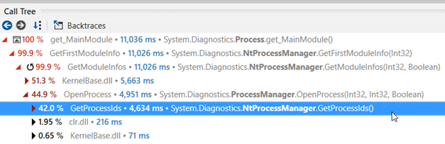
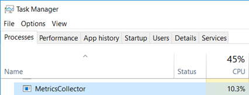
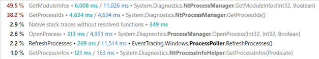
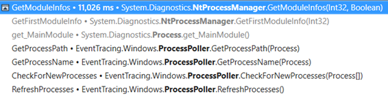
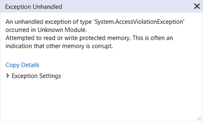
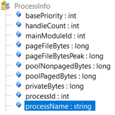
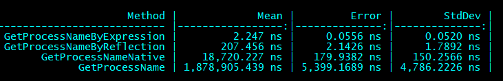
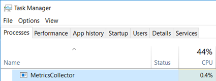

---



## Unexpected CPU consumption

At Criteo, CLR metrics are collected by a service that listens to ETW events ([see the related series](http://labs.criteo.com/2018/09/monitor-finalizers-contention-and-threads-in-your-application/)). This metrics collector is given the process name of applications to monitor. Since applications could crash, be stopped or restarted, the metrics collector must be able to detect such an event. The previous implementation was using ETW kernel events (TraceEvent `ProcessStart `and `ProcessStop `events from `ETWTraceEventSource.Kernel`). However, in rare cases, it seems that a new application start was not detected and therefore the metrics were not collected for it.

An easy fix for this situation is to poll the list of running processes every second and detect which one is new or has left since the last time the list was polled. The implementation is straightforward: just call `Process.GetProcesses()` and get the process name from the `Process MainModule.FileName` property. After a few seconds testing this implementation on my laptop the fan started spinning: a quick look at Task Manager shows that the metrics collector is using ~10% CPU time!



I’ve used these P/Invoked PSAPI functions 20 years ago but I don’t remember such an impact: for our monitoring service, we would like to keep the CPU impact below 1%.

## Measure, measure… and profile

This was a good opportunity to start profiling the metrics collector with dotTrace on a Friday afternoon!

`NtProcessManager.GetModuleInfos` and `NtProcessManager.GetProcessIds` are at the methods top list of CPU consumption the worst offenders by far:



The callstack to reach `GetModuleInfos()` shows the following:



The `GetProcessPath()` method of the metrics collector is asking for the value of `Process.MainModule.FileName` property that ends up calling `GetModuleInfos`.

And the callstack for the `MainModule `getter execution shows the following:


This call stack looks weird for two reason:

- Since the `Process `object exists, why is it needed to call `OpenProcess `again to get the main module?
- Why would `OpenProcess `need to call `GetProcessIds `(i.e. get the list of running processes) since its id is already known?!

Just take a look at the decompiled source code to get the answer:

```csharp
public static SafeProcessHandle OpenProcess(int processId, int access, bool throwIfExited)
{
  SafeProcessHandle safeProcessHandle = NativeMethods.OpenProcess(access, false, processId);
  int lastWin32Error = Marshal.GetLastWin32Error();
  if (!safeProcessHandle.IsInvalid)
    return safeProcessHandle;
  
  // error handling 
  if (processId == 0)
    throw new Win32Exception(5);
  if (ProcessManager.IsProcessRunning(processId))
    throw new Win32Exception(lastWin32Error);
...
```

And `IsProcessRunning `calls `GetProcessIds`:

```csharp
public static bool IsProcessRunning(int processId)
{
   return IsProcessRunning(processId, GetProcessIds());
}
```

It does not appear in the callstack most probably because it was inlined by the JIT.

So, the code of `ProcessManager.OpenProcess` calls the Win32 `OpenProcess` API to get… the handle of the process corresponding to the given id and desired access rights. From there, it is spending most of its CPU time dealing with error cases (i.e. when a process information cannot be accessed maybe due to access right limitation). We definitively don’t need all that in our case!

## What next?

At that point of the investigation, my colleague [Kevin](https://twitter.com/KooKiz) and I went to different directions. A few decades ago, I spent a lot of time digging into Windows internals using Win32 APIs and I remember that calling `PSAPI.GetModuleFilenameEx` with a pid and 0 as module handle should return the path name of the process (BTW, this is also what `GetModuleInfos `ends up calling but more on that later). So it should not be too complicated to P/Invoke this function from PSAPI.dll.

At the beginning of .NET programming, the [https://pinvoke.net/](https://pinvoke.net/) web site was very useful to figure out the right syntax for a lot of APIs if you did not want to read the 1579 pages of the [Complete Interoperability Guide](https://www.amazon.com/NET-COM-Complete-Interoperability-Guide-ebook/dp/B003AYZB7U)! The description of `GetModuleFileNameEx `is [available](https://pinvoke.net/default.aspx/psapi/GetModuleFileNameEx.html), and even come with a code sample.

```csharp
[DllImport("psapi.dll", BestFitMapping = false, CharSet = CharSet.Auto, SetLastError = true)]
private static extern int GetModuleFileNameEx(SafeProcessHandle processHandle, IntPtr moduleHandle, StringBuilder baseName, int size);
```

Note that marshaling strings should always be done with care: the Win32 API is not always consistent when a pointer to a C-like string is supposed to be filled up by a function. An additional parameter is given to state the size of the buffer in which the characters of the string will be copied. In some cases, this parameter counts the number of characters and in some others, it counts the number of bytes available in the buffer. I let you imagine what a nightmare it was when you had to deal with ANSI/UNICODE strings. In the `GetModuleFileNameEx `case, the size parameter takes [the number of characters](https://docs.microsoft.com/en-us/windows/win32/api/psapi/nf-psapi-getmodulefilenameexw?WT.mc_id=DT-MVP-5003325).

If you take a look at the `NtProcessManager.GetModuleInfos` implementation, you find the following code in the implementation:

```csharp
StringBuilder stringBuilder2 = new StringBuilder(1024);
if (Microsoft.Win32.NativeMethods.GetModuleFileNameEx(
    safeProcessHandle, 
    new HandleRef(null, handle), 
    stringBuilder2, 
    stringBuilder2.Capacity * 2
 ) == 0)
```

Since the capacity of the `StringBuilder `is set to 1024, this code tells `GetModuleFileNameEx `that it is allowed to write up to 2048 characters. This looks like a bug… but hard to trigger with the [usual 260 characters limitation for filenames](https://docs.microsoft.com/en-us/windows/desktop/fileio/naming-a-file). However, if, one day, you decide to use the extended syntax with the “\\?\” prefix syntax to create a looooong folder for your application, the bug will trigger an `AccessViolationException `beyond 1025 characters.



Here is my safer implementation:

```
private readonly StringBuilder _baseNameBuilder = new StringBuilder(1024);
public static string GetProcessNameNative(Process p)
{
    _baseNameBuilder.Clear();
    if (GetModuleFileNameEx(p.SafeHandle, IntPtr.Zero, _baseNameBuilder, _baseNameBuilder.Capacity) == 0)
    {
        _baseNameBuilder.Append("???");
    }

    return _baseNameBuilder.ToString();
}
```

When I presented Kevin my oldies but goodies solution, he told me that he found a smarter solution. While I was digging into my memories, he kept decompiling the implementation of the `Process `class and realized that it contains a `processInfo` private field:


And its internal class exposes a public field called… `processName`: exactly what we needed!



So I was ready to implement a reflection-based solution like:

```csharp
private static Type _processInfoType = null;
private static FieldInfo _processNameField = null;
public static string GetProcessNameByReflection(Process p)
{
    var processInfoField = typeof(System.Diagnostics.Process)
        .GetField("processInfo", BindingFlags.Instance | BindingFlags.NonPublic);
    var processInfo = processInfoField.GetValue(p);

    if (_processInfoType == null)
    {
        _processInfoType = processInfo.GetType();
        _processNameField = _processInfoType.GetField("processName");
    }

    return _processNameField.GetValue(processInfo).ToString();
}
```

And Kevin was able to give me a definitively smarter solution based on compiled expressions:

```csharp
private static Func<Process, string> GetProcessNameAccessor()
{
    var param = Expression.Parameter(typeof(Process), "arg");
    var processInfoMember = Expression.Field(param, "processInfo");
    var processNameMember = Expression.Field(processInfoMember, "processName");

    var lambda = Expression.Lambda(typeof(Func<Process, string>), processNameMember, param);

    return (Func<Process, string>)lambda.Compile();
}

private static readonly Func<Process, string> _getProcessNameFunc = GetProcessNameAccessor ();
public string GetProcessNameByExpression()
{
    return _getProcessNameFunc(_process);
}
```

However, when I tested them on my laptop, I got null reference exceptions while it was working fine on Kevin’s machine… There was a tiny difference between us: I was calling `Process.GetProcessById` while Kevin was using `Process.GetProcesses` to get the `Process` instance. It looks like the implementation of both methods is not doing the same initialization. This kind of things happen when you are trying to use undocumented implementation details… Also note that the .NET Core implementation is different ([and does not contain the string length bug](https://github.com/dotnet/corefx/blob/e34fa6ac5fcc49be5cb22f46119c6d99219483b6/src/System.Diagnostics.Process/src/System/Diagnostics/ProcessManager.Win32.cs)).

## Comparing the different solutions

So which solution should I pick for our metrics collector?

It’s time to do some benchmarking thanks to [BenchmarkDotNet ](https://github.com/dotnet/BenchmarkDotNet)and the results give different order of magnitude!



The winner is without contest based on expressions and the worst one is… the initial implementation that does not even fall into the error case during our tests!

After updating the implementation with the compiled expression-based solution, the CPU usage of our metrics collector seems more reasonable:



It is now a good time to go back home… to write this article :^)
