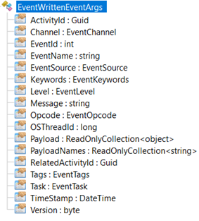

---


As the [.NET Core 2.2 blog post](https://devblogs.microsoft.com/dotnet/announcing-net-core-2-2/?WT.mc_id=DT-MVP-5003325) introduced, it is now possible for a .NET Core application to listen to the events generated by the CLR that power it up. If you remember the [Grab ETW Session, Providers and Events](http://labs.criteo.com/2018/07/grab-etw-session-providers-and-events/) post, the CLR is emitting a lot of valuable events through ETW on Windows and LTTng on Linux. Thanks to [TraceEvent nuget package](https://www.nuget.org/packages/Microsoft.Diagnostics.Tracing.TraceEvent/), it is not that difficult to fetch these events at runtime on Windows, either in-process or out of process. However, it is much more complicated to achieve the same goal on Linux… With .NET Core 2.2, it is now super easy to listen to the events emitted by the CLR while your application is running: you simply need to implement a class that derives from [System.Diagnostics.Tracing.EventListener](https://docs.microsoft.com/en-us/dotnet/api/system.diagnostics.tracing.eventlistener?WT.mc_id=DT-MVP-5003325?view=netcore-2.2) and create an instance of it. Nothing more.

This class exists since .NET Framework 4.5 and .NET Core 1.0 but it could only be used to listen events pushed by managed code. Since .NET Core 2.2, it can also be used to listen to native events pushed by the CLR. The usage is simple, even a little bit magical.

```csharp
sealed class GcFinalizersEventListener : EventListener
{
    // from https://docs.microsoft.com/en-us/dotnet/framework/performance/garbage-collection-etw-events
    private const int GC_KEYWORD =                 0x0000001;
    private const int TYPE_KEYWORD =               0x0080000;
    private const int GCHEAPANDTYPENAMES_KEYWORD = 0x1000000;

    protected override void OnEventSourceCreated(EventSource eventSource)
    {
        Console.WriteLine($"{eventSource.Guid} | {eventSource.Name}");

        // look for .NET Garbage Collection events
        if (eventSource.Name.Equals("Microsoft-Windows-DotNETRuntime"))
        {
            EnableEvents(
                eventSource, 
                EventLevel.Verbose, 
                (EventKeywords) (GC_KEYWORD | GCHEAPANDTYPENAMES_KEYWORD | TYPE_KEYWORD)
                );
        }
    }

    // from https://blogs.msdn.microsoft.com/dotnet/2018/12/04/announcing-net-core-2-2/
    // Called whenever an event is written.
    protected override void OnEventWritten(EventWrittenEventArgs eventData)
    {
        ...
    }
}

class Program
{
    static void Main(string[] args)
    {
        GcFinalizersEventListener listener = new GcFinalizersEventListener();

        Console.WriteLine("\nPress ENTER to trigger a few finalizers...");
        Console.ReadLine();
        for (int i = 0; i < 4; i++)
        {
            Thread t = new Thread(()=> {});
        }
        GC.Collect(2, GCCollectionMode.Forced, true, true);

        Console.WriteLine("\nPress ENTER to exit...");
        Console.ReadLine();
    }
}
```

First, you implement a class that derives from `EventListener` and override the following two methods:

```csharp
   void OnEventSourceCreated(EventSource eventSource)
   void OnEventWritten(EventWrittenEventArgs eventData)
```

As soon as you new up an instance of your class, the `OnEventSourceCreated`override is called for each *event source* defined in the application. An event source, as its name implies, produces events. You can define your own in managed code if you wish. For the sake of this post, I will focus on listening to the ***Microsoft-Windows-DotNETRuntime*** event source. The `EventSource`instance passed to the `OnEventSourceCreated`method provides two interesting properties to let us identify the available sources. The following code :

```csharp
protected override void OnEventSourceCreated(EventSource eventSource)
{
    Console.WriteLine($"{eventSource.Guid} | {eventSource.Name}");
}
```

generates the following output :

```
5e5bb766-bbfc-5662-0548-1d44fad9bb56 | Microsoft-Windows-DotNETRuntime
 2e5dba47-a3d2-4d16-8ee0-6671ffdcd7b5 | System.Threading.Tasks.TplEventSource
 8e9f5090-2d75-4d03-8a81-e5afbf85daf1 | System.Diagnostics.Eventing.FrameworkEventSource
```

You can imagine that the first one is the source we are interested in listening to its events!

By default, there is no connection between the sources and your listeners: you need to enable the source by calling the `EnableEvents`method in your `OnEventSourceCreated`override. This `EventListener`method takes the following arguments:

- `EventSource eventSource`: the event source you want to listen to
- `EventLevel level`: minimum verbosity level for the received events
- `EventKeywords matchAnyKeyword`: a keyword to filter on specific events

The Microsoft Docs provides [the level and keywords](https://docs.microsoft.com/en-us/dotnet/framework/performance/clr-etw-keywords-and-levels?WT.mc_id=DT-MVP-5003325) for [each events](https://docs.microsoft.com/en-us/dotnet/framework/performance/clr-etw-events?WT.mc_id=DT-MVP-5003325) documented in the CLR. For the complete list, you take a look at [ClrETWAll.man in CoreClr source code](https://github.com/dotnet/coreclr/blob/master/src/vm/ClrEtwAll.man) or in `ClrTraceEventParser` class of TraceEvent. In the sample code at the beginning of this post, I selected a group of keywords `GC_KEYWORD | GCHEAPANDTYPENAMES_KEYWORD | TYPE_KEYWORD` to receive only events related to the garbage collector and type information ([read this previous post for more details](http://labs.criteo.com/2018/09/monitor-finalizers-contention-and-threads-in-your-application/)).

Once the source has been paired to the listener, each time an event is emitted by the source with the right level and for the given keywords, the `OnEventWritten`override will get called. The `EventWrittenEventArgs`instance received as a parameter describes each event.



The `Payload` contains the value of the different properties stored in a `ReadOnlyCollection` and the corresponding property names are provided via the `ReadOnlyCollection` `PayLoadNames`. The following code shows how to extract all properties values:

```csharp
// from https://blogs.msdn.microsoft.com/dotnet/2018/12/04/announcing-net-core-2-2/
// Called whenever an event is written.
protected override void OnEventWritten(EventWrittenEventArgs eventData)
{
    // Write the contents of the event to the console.
    Console.WriteLine($"ThreadID = {eventData.OSThreadId} ID = {eventData.EventId} Name = {eventData.EventName}");
    for (int i = 0; i < eventData.Payload.Count; i++)
    {
        string payloadString = eventData.Payload[i] != null ? eventData.Payload[i].ToString() : string.Empty;
        Console.WriteLine($"    Name = \"{eventData.PayloadNames[i]}\" Value = \"{payloadString}\"");
    }
    Console.WriteLine("\n");
}
```

Here is the kind of output you get for common garbage collector and finalizer events:

```
ThreadID = 17456 ID = 200 Name = IncreaseMemoryPressure
Name = "BytesAllocated" Value = "1672"
Name = "ClrInstanceID" Value = "8"
```

```
ThreadID = 17456 ID = 9 Name = GCSuspendEEBegin_V1
Name = "Reason" Value = "1"
Name = "Count" Value = "0"
Name = "ClrInstanceID" Value = "8"
```

```
ThreadID = 17456 ID = 8 Name = GCSuspendEEEnd_V1
Name = "ClrInstanceID" Value = "8"
```

```
ThreadID = 17456 ID = 35 Name = GCTriggered
Name = "Reason" Value = "10"
Name = "ClrInstanceID" Value = "8"
```

```
ThreadID = 17456 ID = 1 Name = GCStart_V2
Name = "Count" Value = "1"
Name = "Depth" Value = "2"
Name = "Reason" Value = "10"
Name = "Type" Value = "0"
Name = "ClrInstanceID" Value = "8"
Name = "ClientSequenceNumber" Value = "0"
```

```
ThreadID = 18860 ID = 29 Name = FinalizeObject
Name = "TypeID" Value = "1210056592"
Name = "ObjectID" Value = "1371069040"
Name = "ClrInstanceID" Value = "8"
```

```
ThreadID = 18860 ID = 15 Name = BulkType
Name = "Count" Value = "1"
Name = "ClrInstanceID" Value = "8"
```

The fact that there is no strongly typed event argument per event is not as good as what TraceEvent provides. In addition, after a few tests, it seems that the .NET Core 2.2 implementation [is not complete](https://github.com/dotnet/coreclr/issues/21380):

- GC events are not all received when in Server Mode
- Properties are missing for BulkType event necessary to figure out finalizer type names

However, with `EventListener`, Microsoft is giving us a very simple way to get valuable information, in-process, from the CLR while the application is running. A forthcoming blog post will show how to leverage this infrastructure to provide insights on how the garbage collection impacts an application.

Before leaving you building your own event listeners, you should know a couple of last details. Under the hood, the framework is [creating a dedicated thread](https://github.com/dotnet/coreclr/blob/78570a239101f69200cfceab5e7527ca8cc312b8/src/System.Private.CoreLib/src/System/Diagnostics/Eventing/EventPipeEventDispatcher.cs#L141) for you that will execute the two `OnXXX`methods of your `EventListener`-derived class. It means that your code should not block or spend to much time processing the events if you want to keep on receiving events at a regular pace.

This thread will last as long as one of your listeners still exists. When I say “exist”, I mean until you decide to dispose them. This is the way for you to tell the sources that you are no more interested in receiving events. When all your listeners are disposed, then the processing thread will exit.
