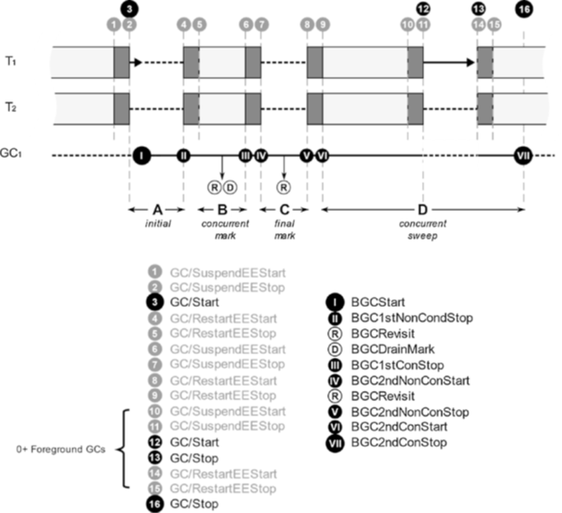
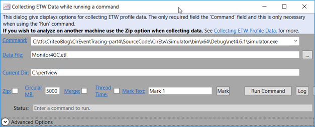
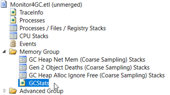
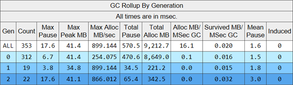
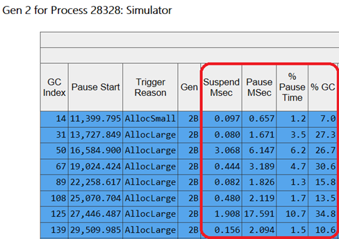
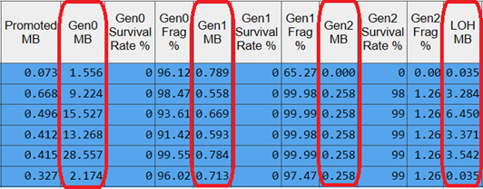
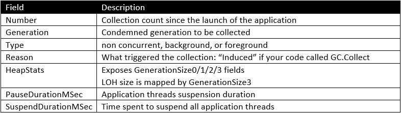
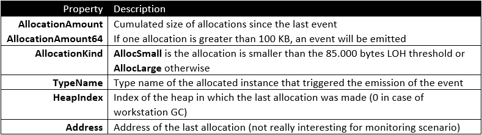

---

This post of the series focuses on CLR events related to garbage collection in .NET.

Part 1: [Replace .NET performance counters by CLR event tracing](http://labs.criteo.com/2018/06/replace-net-performance-counters-by-clr-event-tracing).

Part 2: [Grab ETW Session, Providers and Events](http://labs.criteo.com/2018/07/grab-etw-session-providers-and-events/).

Part 3: [CLR Threading events with TraceEvent](http://labs.criteo.com/2018/09/monitor-finalizers-contention-and-threads-in-your-application/).

## Introduction

The allocator and garbage collector components of the CLR may have a real impact on the performances of your application. The Book of the Runtime describes the allocator/collector design goals in the must read [Garbage Collection Design page](https://github.com/dotnet/coreclr/blob/master/Documentation/botr/garbage-collection.md) written by Maoni Stephens, lead developer of the GC. In addition, Microsoft provides large [garbage collection documentation](https://docs.microsoft.com/en-us/dotnet/standard/garbage-collection/?WT.mc_id=DT-MVP-5003325). And if you want more details about .NET garbage collector, take a look at [Pro .NET Memory Management](https://www.amazon.com/Pro-NET-Memory-Management-Performance/dp/148424026X) by [Konrad Kokosa](https://twitter.com/konradkokosa). In this post, I will focus on the events emitted by the CLR and how you could use them to better understand how your application is behaving, related to its memory consumption.

The impact on how your application behaves is mostly related to a couple of topics:

- *How many times and how long your threads get suspended during a collection
*Desktop applications and games provide fluent User Interfaces where glitches are less and less acceptable. In the opposite side of the spectrum, low latency server applications have short SLAs to answer each request. In both cases, applications cannot afford freezing for too long while the high priority GC threads are cleaning up the .NET heaps for background GCs or blocking non concurrent GCs.
- *How much memory is dedicated to your process
*With the rise of containers and their quotas, your application needs to trim down its memory consumption. For example, with server GC enabled, the amount of memory used by your application could grows big (depending on the number of cores) before a gen 0 collection kicks in (read [this discussion](https://github.com/aspnet/AspNetCore/issues/3409) about real world cases including StackOverflow web site and what are the possible solutions)
The memory pressure on the system is also taken into account by the GC and could lead to more collections being triggered (read Maoni Stephen blog post about [how Windows jobs are taken into account by the GC and how to leverage them if needed](https://devblogs.microsoft.com/dotnet/running-with-server-gc-in-a-small-container-scenario-part-0/?WT.mc_id=DT-MVP-5003325)). It becomes more and more important to detect leaks and memory consumption spikes.

In the previous post, you saw how to get the type name of instances being finalized. The CLR provides many more events related to memory management. They definitively help understand the interactions between this crucial part of .NET and your own code. In this article, you will see how to replace [the not always consistent performance counters](http://labs.criteo.com/2018/06/replace-net-performance-counters-by-clr-event-tracing/) such as generation sizes or collection counts. More importantly, you will get very useful metrics information like the type of GC (foreground or background) and your application threads suspension time.

## Sequences of events during Garbage Collection phases

Ephemeral collections (of generation 0 and 1) are called “stop-the-world”: your application threads will be frozen during the whole collection. For generation 2 background collections, it is a little bit more complicated. As shown in the following figure (with [Konrad Kokosa](https://twitter.com/konradkokosa) courtesy from [his book](https://www.amazon.com/Pro-NET-Memory-Management-Performance/dp/148424026X))



The applications threads will be frozen during different phases:

- Initial internal step at the beginning of the collection,
- At the end of the marking phase to reconcile the changes (allocations, references updates) done while background collection threads are running (also if compaction is needed). Look for documentation about card table usage to get more details,
- If a compaction occurs.

Please read [Understanding different GC modes with Concurrency Visualizer](https://devblogs.microsoft.com/premier-developer/understanding-different-gc-modes-with-concurrency-visualizer/?WT.mc_id=DT-MVP-5003325) to go deeper and blog posts from [Matt](http://mattwarren.org/2017/01/13/Analysing-Pause-times-in-the-.NET-GC/) [Warren](http://mattwarren.org/2016/06/20/Visualising-the-dotNET-Garbage-Collector/) and [Maoni Stephens](https://devblogs.microsoft.com/dotnet/gc-etw-events-2/?WT.mc_id=DT-MVP-5003325) about GC pauses.

## What are the available garbage collections metrics?

The [Perfview tool](https://github.com/Microsoft/perfview/blob/master/documentation/Downloading.md) could help you analyze how many garbage collections occurred and for which reason. Select Run in the Collect menu and click the Run Command button.



You could also trigger a collection after the application is started with Collect | Collect. When you want to stop collecting information, click the Stop Collection. When the .etl file gets generated, go to the GCStats node



Look for your application to get statistics related to garbage collections. The first ***GC Rollup By Generation*** table gives you high level metrics such as the number of collections per generation and the mean pause time:



The next two sections list the collections with a pause time longer than 200ms before the section that lists all generation 2 collections:



The ***Suspend Msec*** columns gives you the time it took to suspend your application threads while ***Pause MSec*** counts the time during which your threads were actually suspended.

In addition to this, memory details such as the size of all generations after each collection are available:



However, my goal is to get these details to feed monitoring dashboards **as the application runs**. I can’t use Perfview but I can still rely on the same CLR events.

## A solution for runtime please!

Since version 2 of TraceEvent, there is an easy way to get already computed metrics about GC as [described by Maoni Stephens](https://devblogs.microsoft.com/dotnet/glad-part-2/?WT.mc_id=DT-MVP-5003325). It relies on the same code as Perfview for its *GCStats* window.

You only need to subscribe to two events; one when a GC starts and one when it ends:

```csharp
var source = userSession.Source;
source.NeedLoadedDotNetRuntimes();
source.AddCallbackOnProcessStart((TraceProcess proc) =>
{
    proc.AddCallbackOnDotNetRuntimeLoad((TraceLoadedDotNetRuntime runtime) =>
    {
        runtime.GCStart += (TraceProcess p, TraceGC gc) =>
        {
            // a GC is starting
        };
        runtime.GCEnd += (TraceProcess p, TraceGC gc) =>
        {
            // a GC ends
        };
    });
});
```

The **TraceGC** class provides too many details beyond the scope of this post but here are the main fields that should be used in **GCEnd** event handler to monitor your applications:



Note that the **IsNotCompacting** method [currently returns invalid value](https://github.com/Microsoft/perfview/issues/811).

## Final words

I would like to mention one last event related to memory management. The **GCAllocationTick** CLR event (mapped by the **ClrTraceEventParser.GCAllocationTick** event) is emitted after ~100 KB has been allocated by your application. As you can infer from the [Microsoft documentation](https://docs.microsoft.com/en-us/dotnet/framework/performance/garbage-collection-etw-events#gcallocationtick_v2-event?WT.mc_id=DT-MVP-5003325), the field of the **GCAllocationTickTraceData** argument received by your handler provides the following properties:



As you can see, listening to this **GCAllocationTick** event gives you a sampling of the allocations made in your application. This is not as precise as what a .NET profiler (relying on expensive [ObjectAllocated](https://docs.microsoft.com/en-us/dotnet/framework/unmanaged-api/profiling/icorprofilercallback-objectallocated-method?WT.mc_id=DT-MVP-5003325) and [ObjectAllocatedByClass](http://?WT.mc_id=DT-MVP-5003325) **ICorProfilerCallback** hooks) would provide but it is much less intrusive. However, I would not recommend to systematically listen to this event in production, especially if your application is allocating GBs of memory per minute. Unlike what the documentation states, you need to set the verbosity to **TraceEventLevel.Verbose** (and not **Informational**) when you enable the CLR provider and this could impact your application performances due to the high number of emitted CLR events.

This event could be very helpful in case of unusual LOH allocations because you would get the type of the objects in the LOH almost each time (the 85.000 bytes threshold is close to the 100 KB trigger limit) or simply to have an hint on the most allocated types over time. Note that you won’t get the callstack leading to the allocations triggering the event. Instead, for memory leak or memory usage analysis, I would definitively recommend you to use Perfview. Vance Morrison has published a series of videos that detail [.NET memory investigations](https://channel9.msdn.com/Series/PerfView-Tutorial/PerfView-Tutorial-9-NET-Memory-Investigation-Basics-of-GC-Heap-Snapshots?WT.mc_id=DT-MVP-5003325), [collecting the data](https://channel9.msdn.com/Series/PerfView-Tutorial/Tutorial-10-Investigating-NET-Heap-Memory-Leaks-Part1-Collecting-the-data?WT.mc_id=DT-MVP-5003325) and [analyzing the data](https://channel9.msdn.com/Series/PerfView-Tutorial/Tutorial-11-Investigating-NET-Heap-Memory-Leaks-Part2-Analyzing-the-data?WT.mc_id=DT-MVP-5003325) with Perfview. You will also find a lot of detailed memory-related investigations guidelines in [Konrad Kokosa’s book](https://www.amazon.com/Pro-NET-Memory-Management-Performance/dp/148424026X).

You now have a complete view of the CLR events interesting to understand the different phases of a garbage collection and a few interactions (suspension) with the Execution Engine. Everything is in hands to replace the performance counters by CLR events: the metrics are more accurate and you get access to more information such as suspension time or contention time. The code presented during all episodes is available [on Github](https://github.com/chrisnas/ClrEvents) with an easy to reuse **ClrEventManager** class that you could plug into your own applications or monitoring service!
