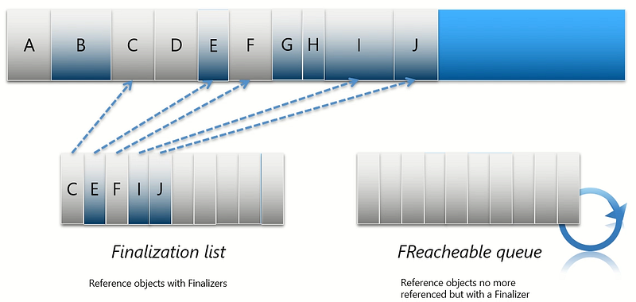
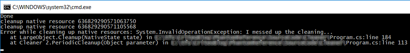

---



My colleague Kevin has just described [how to implement Java ReferenceQueue in C#](https://medium.com/@kevingosse/implementing-java-referencequeue-and-phantomreference-in-c-827d7141b6e4) as a follow-up to [Konrad Kokosa’s article](http://tooslowexception.com/do-we-need-jvms-phantomreference-in-net/) on this Java class. Among the different discussed features, one is still missing. This post will discuss how to deal with the “middle age crisis” scenario and control finalizer threading issues. I’m sure that my former Microsoft colleague [Sebastien](https://twitter.com/sbovo) won’t be surprised by my interest in the subject.

When a class references both `IDisposable` instances and native resources, the usual C# pattern is to implement both `IDisposable` for explicit cleanup and a Finalizer to deal with developers who would have forgotten the explicit cleanup. This pattern might have a side effect when these classes are also referencing a large objects graph.

Let’s take a minute to describe how finalizers are managed by the CLR

This animation shows what happens at the end of a collection. The darkened objects are no more referenced and should be collected. B, G and H do not implement finalizers so that could be discarded. It is different for E, I and J because their classes implement a finalizer. First, a *Finalization* list was holding a “weak” reference to them since they were created. Then, at the end of a collection, these references are moved to the *FReacheable* queue and the collection ends. Later on, after the collection ends, the finalizer thread wakes up and calls the finalizer of all objects referenced by the *FReacheable* queue. This is the important part of the issue: it means that even though those objects weren’t referenced anymore, they couldn’t be collected nor their memory be reclaimed because the finalizer thread has not run yet. As they could not be reclaimed, they are promoted to the next generation just like other survivors. So if those objects were in generation 0, they now end up in generation 1, extending their lifetime. It’s even worse if they get promoted from generation 1 to generation 2, as the next gen 2 collection might happen only very far in the future. This artificially increases the memory consumption of the application.

To summarize, in case of business objects that hold a large references tree with also native resources, it would be great to be able to:

- Allow explicit cleanup resources with the `IDisposable` pattern
- Discard the managed memory when the objects are collected
- Automatically cleanup native resources AFTER they are collected
- Have control on the thread that is cleaning up native resources

## Mix a Phantom with IDisposable

The requirement #3 seems impossible to fulfill: how to access to field of an object if its memory has been reclaimed? Maybe it is possible to cheat: what if these native resources usually held as `IntPtr` field would be copied when the object is still alive? That way, the cleanup code could be moved outside of the object itself. This is basically the `PhantomReference` Java idea implemented in C# by Kevin with his `PhantomObjectFinalizer`:

```csharp
public class PhantomObjectFinalizer : PhantomReference<LargeObject>
{
    private int _handle;

    public PhantomObjectFinalizer(ReferenceQueue<LargeObject> queue, LargeObject value)
        : base(queue, value)
    {
        _handle = value.Handle;
    }

    public void FinalizeResources()
    {
        Console.WriteLine("I'm cleaning handle " + _handle);
    }
}
```

Let’s make it generic in term of native payload:

```csharp
public class PhantomObjectFinalizer<T, S> : PhantomReference<T> where T : class
{
    public S State;

    public PhantomObjectFinalizer(ReferenceQueue<T> queue, T value, S state)
        : base(queue, value)
    {
        State = state;
    }
}
```

Also note that the cleaning method has been removed due to the requirement #1: the `LargeObject`should be responsible for cleaning the resources because it will also implements `IDisposable`. The cleaning native part will obviously be shared with the `Dispose` method.

The `LargeObject` could be rewritten to use it and the first step is group native resources in a state:

```csharp
public class LargeObject : IDisposable
{
    ...

    
    class NativeState
    {
        public bool _disposed;
        public IntPtr _handle1;
        public IntPtr _handle2;
    }

    private NativeState _state;
    // Plus some heavy stuff that we don't want to keep around once the object 
    // is no more referenced

    public LargeObject()
    {
        _state = new NativeState()
        {
            _handle1 = (IntPtr) (DateTime.Now.Ticks),
            _handle2 = (IntPtr) (DateTime.Now.Ticks + 1),
        };

        // this is where we imagine using a PhantomObjectFinalizer 
    }

    public void Dispose()
    {
        if (_state._disposed)
            return;

        Cleanup(_state);
        CleanupIDisposableFields();
    }

    private void CleanupIDisposableFields()
    {
        // call Dispose on all IDisposable fields
    }

    private static void Cleanup(NativeState state)
    {
        if (state._disposed)
            return;
        state._disposed = true;

        Console.WriteLine($"cleanup native resource {state._handle1.ToString()}");
        Console.WriteLine($"cleanup native resource {state._handle2.ToString()}");
        throw new InvalidOperationException("I messed up the cleaning...");
    }
}
```

The native payload is stored in a `NativeState` object that also contains the `_disposed` `IDisposable`status. This is required to be able to know if the object has been disposed explicitly when the static `Cleanup` method is called. This implementation fulfills the requirement #1 even though the cleanup code is throwing an exception: we will have to see how to control it.

## Introducing the Cleaner a la Java

The next step is to focus on requirements #2 and #3: how to ensure that our `LargeObject` memory gets reclaimed by the garbage collector but still automatically cleanup the native resources? This scenario is handled by the [Cleaner class in Java](https://docs.oracle.com/javase/9/docs/api/java/lang/ref/Cleaner.html) mentioned reading [Konrad’s article](http://tooslowexception.com/do-we-need-jvms-phantomreference-in-net/) and that I have learnt to know better by discussing at length with [Jean-Philippe](https://twitter.com/jpbempel), our team Java internals expert.

You can register an object, a state and a callback that will be called when the object is no more referenced. It is a kind of secondary finalization mechanism.

Let’s see how I would like to use it in C#:

```csharp
public class LargeObject : IDisposable
{
    private static readonly Cleaner<LargeObject, NativeState> _cleaner;

    static LargeObject()
    {
        _cleaner = new Cleaner<LargeObject, NativeState>(Cleanup, OnError);
    }

    private NativeState _state;
    // Plus some heavy stuff that we don't want to keep around once the object is no more referenced

    public LargeObject()
    {
        _state = new NativeState()
        {
            _handle1 = (IntPtr) (DateTime.Now.Ticks),
            _handle2 = (IntPtr) (DateTime.Now.Ticks + 1),
        };

        _cleaner.Track(this, _state);
    }
```

There will be a unique `Cleaner` object for all `LargeObject` instances. Each one will register itself and its native state in its constructor by calling the `Cleaner.Track` method.

The `Cleaner` instance receives two static callbacks:

- **Cleanup**: this method will be called by the cleaner after a tracked `LargeObject` instance has been collected. As you can see, there is no need to change its initial implementation. It was static and receives the `NativeState` that stores the native state of a `LargeObject`. Since the `NativeState` type is a private inner class, the implementation details does not leak from `LargeObject` like it was the case with Kevin’s `PhantomObjectFinalizer` implementation.
- **OnError**: when an exception occurs during the cleanup (like my naïve implementation did by throwing an `InvalidOperationException`), the method gets called. This is a new feature compared to a .NET finalizer: you are notified if something goes wrong and you are able to log it. However, I would recommend to still exit the application like the default CLR behavior when a finalizer throws an exception.

The `LargeObject` code is therefore responsible for cleaning both `IDisposable`and native resources: no need for its users to know the gory details.

The high-level API of the `Cleaner` class has been defined; it is now time to see how to implement it. If you have read [Kevin’s post](https://medium.com/@kevingosse/implementing-java-referencequeue-and-phantomreference-in-c-827d7141b6e4), the first step should be obvious: a `ReferenceQueue` will keep track of the `PhantomObjectFinalizer` bound to each “business object” like `LargeObject`. When the latter is collected, the phantom finalizer gets called to enqueue itself to the `ReferenceQueue`.

```csharp
///   T is the type to finalize
///   S contains the native state of T to be cleaned up
/// This separation enforces the pattern where the "native" part stored by a managed type is kept in a State
/// The state could even be used as is in T (kind of a SafeHandle holding several native resources)
public class Cleaner<T, S> 
    where T : class
{
    ...

    private readonly ReferenceQueue<T> _queue;

    public Cleaner(Action<S> onCleanup, Action<Exception> onError)
    {
        _onCleanup = onCleanup;
        _onError = onError;

        _queue = new ReferenceQueue<T>();

        ...

    }

    private Action<S> _onCleanup;
    private Action<Exception> _onError;

    ...

    public void Track(T value, S state)
    {
        var phantomReference = new PhantomObjectFinalizer<T, S>(_queue, value, state);
    }

    ...
}
```

There is one big missing step: who will call the queue `Poll` method to get the finalized `PhantomObjectFinalizer` that contains the native state to cleanup?

## Stay in control of the cleaner job

The simple implementation I’ve chosen is to create a dedicated thread that will poll the queue every period you want and call the cleanup callback. I did not want to add pressure on the `ThreadPool` that is shared with the application. If an exception is raised, the error callback will be called.

```csharp
public class Cleaner<T, S> 
    where T : class
{
    private const int DefaultCleanupPeriod = 1000;

    private Action<S> _onCleanup;
    private Action<Exception> _onError;
    private readonly ReferenceQueue<T> _queue;
    private readonly Thread _cleanerThread;
    private readonly ManualResetEvent _exitEvent;
    private readonly int _cleanupPeriod;

    public Cleaner(Action<S> onCleanup, Action<Exception> onError, int cleanupPeriod = DefaultCleanupPeriod)
    {
        _onCleanup = onCleanup;
        _onError = onError;
        _cleanupPeriod = cleanupPeriod;

        _queue = new ReferenceQueue<T>();

        _exitEvent = new ManualResetEvent(false);
        _cleanerThread = new Thread(PeriodicCleanup);
        _cleanerThread.IsBackground = true; // allow process exit even though the thread is still running
        _cleanerThread.Start(this);
    }

    private void PeriodicCleanup(object parameter)
    {
        Cleaner<T, S> cleaner = (Cleaner<T, S>) parameter;

        while (true)
        {
            var exit = _exitEvent.WaitOne(cleaner._cleanupPeriod);
            if (exit) return;

            try
            {
                PhantomReference<T> reference;
                while ((reference = _queue.Poll()) != null)
                {
                    var finalizedReference = (PhantomObjectFinalizer<T, S>) reference;

                    // cleanup native fields
                    _onCleanup(finalizedReference.State);
                }
            }
            catch (Exception x)
            {
                _onError(x);
            }
        }
    }

    public void Track(T value, S state)
    {
        var phantomReference = new PhantomObjectFinalizer<T, S>(_queue, value, state);
    }

    public void Untrack(T value)
    {
        _queue.Untrack(value);
    }

    public void Dispose()
    {
        _exitEvent.Set();
    }
}
```

Since I’ve created the thread as a background thread, it won’t block .NET to exit the process when the last foreground thread returns. However, you are free to follow the `IDisposable` pattern, and call `Dispose` to explicitly stop the cleaning thread at the right time of your application lifecycle.

In the `IDisposable`/finalizer pattern, the `GC` class provides the `SuppressFinalize` static method to remove an object when it has been explicitly disposed: that way, the object won’t go to the *FReacheable* queue nor be promoted into the next generation after it is collected. The Cleaner class provides the `Untrack` method to achieve the same effect: the object native payload won’t be cleaned up. I just had to update the `ReferenceQueue` to remove the object from the `ConditionalWeakTable` and remove the `PhantomReference` from the *FinalizationList*:

```csharp
public class ReferenceQueue<T>
    where T : class
{
    ...

    internal void Track(T value, PhantomReference<T> reference)
    {
        _table.Add(value, reference);
    }

    internal void Untrack(T value)
    {
        if (_table.TryGetValue(value, out var reference))
        {
            _table.Remove(value);
            GC.SuppressFinalize(reference);
        }
    }
}
```

The requirement #4 is now fulfilled. You are obviously free to pick another implementation more suitable to your needs than a thread-based periodic cleanup. I would like to mention that if the cleanup callback never returns, the effect is almost the same as in the case of a stuck finalizer: the native resources won’t be cleaned up anymore.

The following code shows how all this “complicated” code does not leak in a C# application:

```csharp
class Program
{
    static void Main(string[] args)
    {
        InnerScope();

        GC.Collect();
        GC.WaitForPendingFinalizers();

        Console.WriteLine("Done");
        Console.ReadLine();

        // use the following code to explicitly stop the cleaner thread
        //LargeObject.DisposeCleaner();
        // the code is working without this call because the ticking thread
        // is a background thread and won't stop the CLR to exit the process
    }

    static void InnerScope()
    {
        var largeObject = new LargeObject();

        // it is also possible to support explicit disposing
        // var largeObject2 = new LargeObject();
        // largeObject2.Dispose();

        GC.Collect();
        GC.WaitForPendingFinalizers();

        GC.KeepAlive(largeObject);
    }
}
```

And you get the expected output:



Maybe [Konrad](https://twitter.com/konradkokosa) will integrate a smarter Java `Cleaner`-like feature within the CLR itself or [Alexandre](https://twitter.com/xoofx) in his new .NET ;^)
