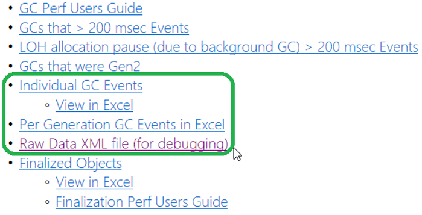
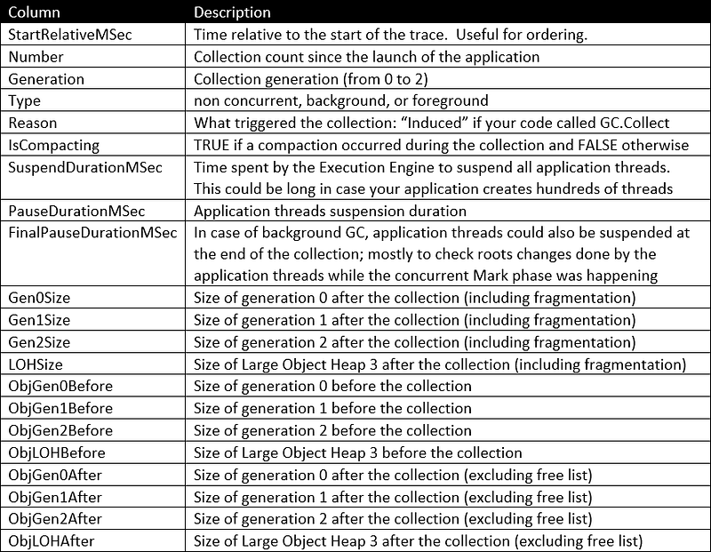
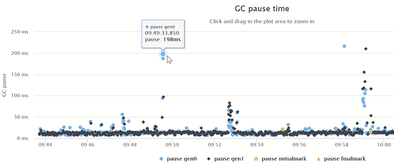
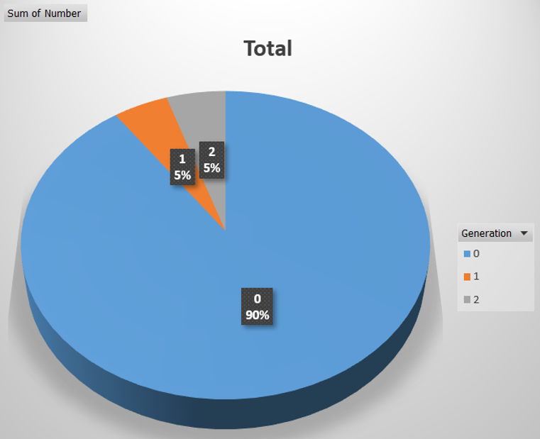
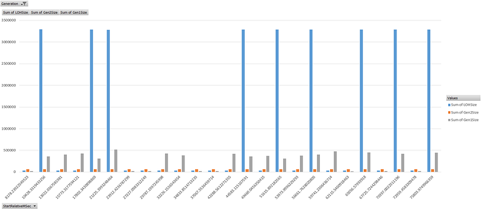
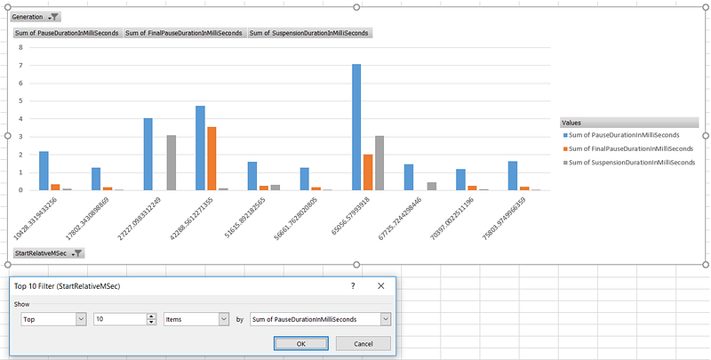

---

This post of the series focuses on logging each GC details in a file and how to leverage it during investigations.

Part 1: [Replace .NET performance counters by CLR event tracing](http://labs.criteo.com/2018/06/replace-net-performance-counters-by-clr-event-tracing).

Part 2: [Grab ETW Session, Providers and Events](http://labs.criteo.com/2018/07/grab-etw-session-providers-and-events/).

Part 3: [Monitor Finalizers, contention and threads in your application](https://labs.criteo.com/2018/09/monitor-finalizers-contention-and-threads-in-your-application/).

Part 4: [Spying on .NET Garbage Collector with TraceEvent](/posts/2018-12-15_spying-on-net-garbage/).

## Introduction

I’m working in a team where we investigate issues in production: both for Java and .NET applications. This is a good opportunity to learn what are the features provided by Java that are missing in .NET. One of the features heavily discussed with my colleague [Jean-Philippe](https://twitter.com/jpbempel) is called the *GC Log*. It is possible to start an application with parameters that tell the GC to save tons of details about each garbage collection in a file : the GC Log. Based on this file, it is possible to extract the reason of a collection, the times of the different phases including the suspension time. This is a great source of information during investigations… when you know how GC is working or by leveraging [automatic report generation](https://gceasy.io/).

In addition, you can also build your own UI to more easily understand what is going on and get a more visual representation of the situation.

In the short video above you can see the heap evolution during several days. Then, as this is an interactive HTML page you can zoom in an interesting period to have a more detailed view of the evolution between GCs.

Also for the pause time graph, you can follow the behavior of the GC with different kinds of pauses and associated phases. In this example, we have minor GCs happening and then an “initial mark” is triggered, followed by “final remark” and “cleanup” pauses. After an extra minor GC, we have a series of mixed GCs that is the result of what was planned by the GC after the marking phase.

In the .NET world, there is no such thing as a GC Log. However, as shown [in the previous post](/posts/2018-12-15_spying-on-net-garbage/), it is possible to use Perfview to analyze traces corresponding to collected CLR events. The GCStats view shows high level details in the “All GC Events” section. In addition to this HTML rendering, you can get access to the data itself in different formats



The more complete one is the Raw Data XML file that you could parse to extract the details you need. This is very close to a .NET GC Log but it is complicated to build an automated process to get it from a production machine.

It would be great if you could tell a .NET application to generate such a GC Log like in Java instead of relying on manual steps with Perfview (and more scripts on Linux). This post will show you how to achieve this goal!

## Defining the goal: basic GcLog implementation

In Java, you have to set on or off the GC log before the application starts and you can’t change it while it runs. Since I’m working with server applications, I would prefer to enable/disable the generation of a GC log file without having to stop and restart the application.

So I’ve defined the simple **IGcLog** interface:

```csharp
public interface IGcLog
{
    void Start(string filename);

    void Stop();
}
```

In a dedicated *administration handler* (i.e. http endpoint of the application), the code could just use a class that implements this interface and call `Start `when the log is enabled and `Stop` when it is no more needed.

To make the implementation easier, I’ve written the following `GcLogBase` abstract class:

```csharp
public abstract class GcLogBase : IGcLog
{
    protected string Filename;
    private StreamWriter _fileWriter;

    public void Start(string filename)
    {
        if (string.IsNullOrEmpty(filename))
            throw new ArgumentNullException(nameof(filename));

        if (_fileWriter != null)
            throw new InvalidOperationException("Start can't be called twice: Stop must be called first.");

        _fileWriter = new StreamWriter(filename);
        Filename = filename;

        OnStart();
    }

    public void Stop()
    {
        if (string.IsNullOrEmpty(Filename))
            return;

        OnStop();
        Filename = null;
        _fileWriter.Flush();
        _fileWriter.Dispose();
        _fileWriter = null;
    }

    protected bool WriteLine(string line)
    {
        if (_fileWriter == null)
            return false;   // just in case the method is called AFTER Stop

        _fileWriter.WriteLine(line);

        return true;
    }

    protected abstract void OnStart();

    protected abstract void OnStop();
}
```

Its main goal is to hide the file management by providing the `WriteLine` method that child classes would call to save the details of a garbage collection into a single line of text. The write operations are flushed when `Stop`is called. This combination allows asynchronous writes with low performance impact: don’t be scared if you don’t see the file size change because the `StreamWriter` class is caching write operations.

The next step is to implement `OnStart` and `OnStop` in a derived class to enable/disable GC details retrieval.

## How to get the GC details: the easy way?

As already discussed in the previous posts of the series, the CLR is emitting traces (via ETW on Windows and LTTng on Linux) that can be collected in C#. You have already seen [how TraceEvent could help](/posts/2018-12-15_spying-on-net-garbage/) collecting and parsing GC traces from any application like what Perfview is doing. With TraceEvent, the `TraceGC`[ instance ](https://github.com/Microsoft/perfview/blob/master/src/TraceEvent/Computers/TraceManagedProcess.cs#L1698)received when a garbage collection ends contains tons of information: it’s mapped to the `GarbageCollectionArgs`[ structure](https://github.com/chrisnas/ClrEvents/blob/master/src/ClrCounters/GarbageCollectionArgs.cs) that you get while listening to the `GarbageCollection`[ event](https://github.com/chrisnas/ClrEvents/blob/master/src/ClrCounters/ClrEventsManager.cs#L24) of my `ClrEventsManager` helper class. The only information to provide is the ID of the .NET process I’m interested in: that way, is it easy to filter the events for this process only.

```csharp
EtwGcLog gcLog = EtwGcLog.GetProcessGcLog(pid);
var filename = GetUniqueFilename(pid);
gcLog.Start(filename);

// in a simple Console application, wait for the user to press ENTER.
// in a more realistic case, keep track of the EtwLog instance and 
// call Stop to end the processing of events when needed.

gcLog.Stop();
```

The **GetUniqueFilename** method builds a filename based on the process ID and the time of the day:

```csharp
private static string GetUniqueFilename(int pid)
{
    var now = DateTime.Now;
    string filename = Path.Combine(Environment.CurrentDirectory, 
        $"{pid.ToString()}_{now.Year}{now.Month}{now.Day}_{now.Hour}{now.Minute}{now.Second}.csv"
        );
    return filename;
}
```

The `GetProcessGcLog` method is a factory-like helper to build an instance bound to the given process ID.

```csharp
public static EtwGcLog GetProcessGcLog(int pid)
{
    EtwGcLog gcLog = null;
    try
    {
        var process = Process.GetProcessById(pid);
        process.Dispose();

        gcLog = new EtwGcLog(pid);
    }
    catch (System.ArgumentException)
    {
        // there is no running process with the given pid
    }

    return gcLog;
}
```

The implementation of `OnStart` and `OnStop` overrides is straightforward based [on the previous post](https://medium.com/criteo-labs/spying-on-net-garbage-collector-with-traceevent-f49dc3117de):

```csharp
protected override void OnStart()
{
    string sessionName = $"GcLogEtwSession_{_pid.ToString()}_{Guid.NewGuid().ToString()}";
    Console.WriteLine($"Starting {sessionName}...\r\n");
    _userSession = new TraceEventSession(sessionName, TraceEventSessionOptions.Create);

    Task.Run(() =>
    {
        // only want to receive GC event
        ClrEventsManager manager = new ClrEventsManager(_userSession, _pid, EventFilter.GC);
        manager.GarbageCollection += OnGarbageCollection;

        // this is a blocking call until the session is disposed
        manager.ProcessEvents();
        Console.WriteLine("End of CLR event processing");
    });

    // add a header to the .csv file
    WriteLine(Header);
}

protected override void OnStop()
{
    // when the session is disposed, the call to ProcessEvents() returns
    _userSession.Dispose();
}
```

The created `TraceEventSession` is passed to the `ClrEventManager` with the process ID with a filter to receive only **GarbageCollection** event notifications. The `OnGarbageCollection` handler is super simple:

```csharp
private void OnGarbageCollection(object sender, GarbageCollectionArgs e)
{
    _line.Clear();
    _line.AppendFormat("{0},", e.StartRelativeMSec.ToString());
    _line.AppendFormat("{0},", e.Number.ToString());
    _line.AppendFormat("{0},", e.Generation.ToString());
    _line.AppendFormat("{0},", e.Type);
    _line.AppendFormat("{0},", e.Reason);
    _line.AppendFormat("{0},", e.IsCompacting.ToString());
    _line.AppendFormat("{0},", e.SuspensionDuration.ToString());
    _line.AppendFormat("{0},", e.PauseDuration.ToString());
    _line.AppendFormat("{0},", e.BGCFinalPauseDuration.ToString());
    _line.AppendFormat("{0},", e.Gen0Size.ToString());
    _line.AppendFormat("{0},", e.Gen1Size.ToString());
    _line.AppendFormat("{0},", e.Gen2Size.ToString());
    _line.AppendFormat("{0},", e.LOHSize.ToString());
    _line.AppendFormat("{0},", e.ObjSizeBefore[0].ToString());
    _line.AppendFormat("{0},", e.ObjSizeBefore[1].ToString());
    _line.AppendFormat("{0},", e.ObjSizeBefore[2].ToString());
    _line.AppendFormat("{0},", e.ObjSizeBefore[3].ToString());
    _line.AppendFormat("{0},", e.ObjSizeAfter[0].ToString());
    _line.AppendFormat("{0},", e.ObjSizeAfter[1].ToString());
    _line.AppendFormat("{0},", e.ObjSizeAfter[2].ToString());
    _line.AppendFormat("{0}", e.ObjSizeAfter[3].ToString());

    WriteLine(_line.ToString());
}
```

Each garbage collection appears as a textual line with the following columns separated by a comma:



The last twelve pieces of information require some explanation:

· **xxxBefore **: size of a generation before the collection; without free list

· **xxxAfter **: size of a generation after the collection; without free list

· **xxxSize **: size of a generation (including LOH) after the collection; including free list (i.e. fragmentation)

The computation of these sizes relies on inner fields of the `TraceGC` argument receives from TraceEvent. The **xxxSize** are grouped in the **GenerationSize0/1/2/3** fields of the `HeapStat` property. It is a little bit more complicated for the **Before**/**After** sizes. The Garbage Collector keeps track of these numbers in the `PerHeapHistories` field: an array of `GCPerHeapHistory` elements; one per heap (i.e. one per core for server GC). The next level is provided by the `GenData` field storing an array of `GCPerHeapHistoryGenData` elements; one per generation with LOH as the last index 3. So, to compute the size of each generation, it is needed to iterate on each heap:

```csharp
private long[] GetGenerationSizes(TraceGC gc, bool before)
{
    var sizes = new long[4];
    if (gc.PerHeapHistories == null)
    {
        return sizes;
    }

    for (int heap = 0; heap < gc.PerHeapHistories.Count; heap++)
    {
        // LOH = 3
        for (int gen = 0; gen <= 3; gen++)
        {
            sizes[gen] += before ? 
                gc.PerHeapHistories[heap].GenData[gen].ObjSpaceBefore:
                gc.PerHeapHistories[heap].GenData[gen].ObjSizeAfter;
        }
    }

    return sizes;
}
```

The code of the `GetGenerationSizes` helper method does that sum the value of either `ObjSpaceBefore` or `ObjSizeAfter`.

As you have probably noticed from the implementation, it is possible that the `PerHeapHistories` field is not filled up and all **Before**/**After** values are zero. This happens for a background gen2 collection. Also note that for gen0 and gen1 collection the value for gen2 and LOH is also 0 (make sense that gen2 and LOH do not change during such a collection).

## A little bit of UI

Now that a .csv file containing all garbage collections details is available, it is time to provide some UI on top of it such as the following for GC pauses:



Let’s start what you can get for Excel champions:

- **Generation ratio**



- **Sizes of generations including Large Object Heap**



- **Top 10 pauses (including suspension time comparison)**



But you can get better interaction thanks to [Jean-Philippe](https://twitter.com/jpbempel). My colleague [adapted his script for JVM to my .NET GC log .csv format](https://github.com/jpbempel/gclogs-analyzer): it generates some nice zoomable HTML UI.

This short video above shows the heap evolution during ~20 minutes. Then, as this is an interactive HTML page you can focus on gen2 and LOH impact on memory consumption.

For the pause time graph on the same period, it is very easy to detect long pauses (even for gen0 collection) and zoom into smaller period to figure out the impact of different collections.

The code available on [Github](https://github.com/chrisnas/ClrEvents) has been updated to make the **EtwGcLog** class available to you.
