---

## Introduction

At Criteo, CLR metrics are collected by a service that listens to ETW events ([see the related series](http://labs.criteo.com/2018/09/monitor-finalizers-contention-and-threads-in-your-application/)). On a few servers, the metrics stopped being collected and we had to fix the problem [by manually polling new and dead processes](/posts/2018-11-13_get-process-name-challenge/). After deploying the new version, the same scenario started to happen: on some servers, the metrics were no more collected.

In an investigation, the first step is always trying to check the environment. In our case, on a server where the metrics collector is up and running, a dedicated ETW session should be created to listen to the CLR events.

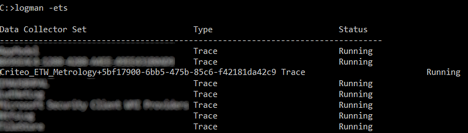

The name given to the session allows us to easily detect if the session is present or not. In the case of a faulted server, the session was not present.

If you look at the code described in [a previous post](http://labs.criteo.com/2018/07/grab-etw-session-providers-and-events/), it is not easy to guess why the session would be stopped by the metrics collector:

```csharp
private void ListenToEtw(TraceEventSession etwSession)
{
    try
    {
        // this call is blocking... until ewtSession.Stop is called (done in Dispose)
        etwSession.Source.Process();
    }
    finally
    {
        etwSession.Dispose();
    }
}
```

A `TraceEventSession` is created and passed to a dedicated thread to process the events until `Stop` is called at the end of the application.

The second step of an investigation is trying to reproduce the issue in a controlled environment such as… my developer machine. I setup the Exception Settings of the debugger to stop on any managed exception:

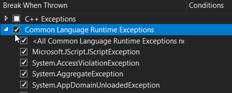

That way, if something bad happens while I’m debugging the application, Visual Studio tells me exactly where the exception was thrown.

After starting and stopping applications monitored by the metrics collector a few times, an exception was thrown in the code responsible for mapping the application id and the component in charge of storing the metrics of this process. When looking at the code, it seems that there was a “timing” conflict between the code in charge of detecting new and dead processes (in a timer) and the code receiving the events from ETW (in the dedicated thread described earlier). A CLR event was received after the corresponding process was detected as being dead. The net effect of the uncaught exception was fast: the TraceEvent session stopped its execution and the `Process` method returned. Nothing special visible outside of a debugger with the right exception settings. This is a great scenario to understand why swallowing all exceptions is not a good pattern…

## Still not working

The next step is to fix the code to handle the dead process case, build it and test it. Unfortunately, the new metrics collector, from time to time, does not seem to receive any CLR event. Even worse, this time the ETW session is still here as shown by **logman -ets**. Going back inside the Visual Studio debugger, everything is working fine: the TraceEvent session is created, its `Process` method called and blocked in a dedicated thread and… the events are received! It means that I’m not able to reproduce the problem while running under debugger control. Maybe the problem could come from the code responsible to filter out events sent by unmonitored applications.

So, I’m adding a Breakpoint in the method responsible for checking monitored process to ensure that there is no bug there (events could be received but skipped due to invalid process ID mapping for example):

```csharp
private bool IsMonitoredEvent(TraceEvent traceEvent)
{
    var isMonitored = traceEvent.ProcessID == _monitoredPid;
    if (isMonitored)
    {
        NotifyProcessedEvent(traceEvent);
    }

    return isMonitored;
}
```

The breakpoint is hit and I’m able to validate that there is no problem in the mapping code

I can even check that the events I’m expecting are all received by asking Visual Studio to trace the event name with a tracepoint when `isMonitored` is true:

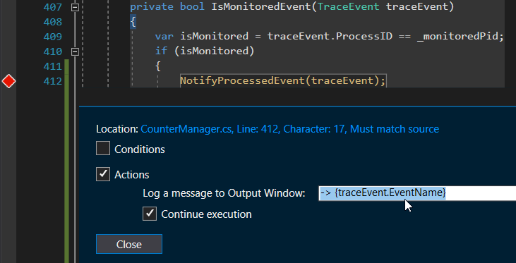

And I get all expected events in the Output Window. If some events were missing, it could have explained that metrics based on events series (such as contention duration) were not computed.

I’m now running the application outside of the debugger… and no event. Just to confirm that I’m not crazy, I decide to add traces in the source code:

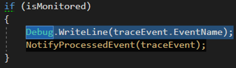

But how to get the output without an attached debugger? The trick is to start [SysInternals Debug View](https://docs.microsoft.com/en-us/sysinternals/downloads/debugview?WT.mc_id=DT-MVP-5003325) and wait for the event names to appear: nothing. Even by moving the `Debug.WriteLine` call outside of the `if` block, no event is ever received, even from unmonitored processes.

## Navigating memory by stack frame

Let’s summarize the investigation status:

- The metrics collector is working only when under the control of a debugger.
- If the debugger is attached after it is started, the events are not received.

I don’t know why but this kind of weird behaviors is always happening at Criteo on a Friday. So let’s start a joined debugging session with [Kevin](https://twitter.com/KooKiz), [Jean-Philippe](https://twitter.com/jpbempel) and [Gregory](https://twitter.com/GregoryLeocadie)!

To better understand what is the state of the metrics collector when the events are not received, the application is launched and the debugger is then attached to it. I open the *Parallel Stacks* panel and double-click the stack frame with a valuable context:

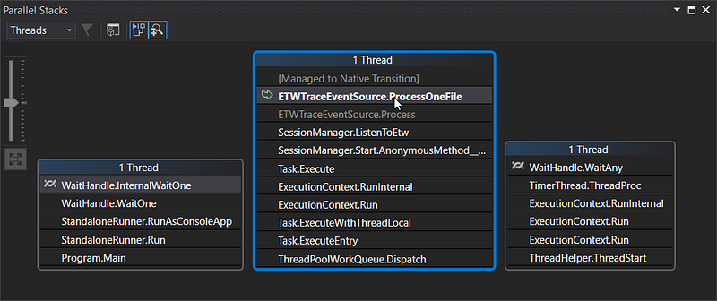

In our case, it would be interesting to get a view on the state of the `ETWTraceEventSource` object used by TraceEvent to process the events. Even if you don’t have the source code, it is still possible for the debugger to get a view of the object used as implicit “this” pointer by the `ProcessOneFile` method. Summon the *Quick Watch* dialog (Shift-F9 with my old VC 6 keyboard shortcut) and type “this”

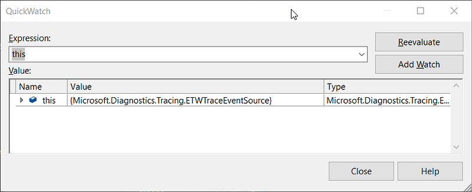

Based on own understanding of how the `ETWTraceEventSource` is working, we know that registered event handlers are associated to entries in its `templates` field.

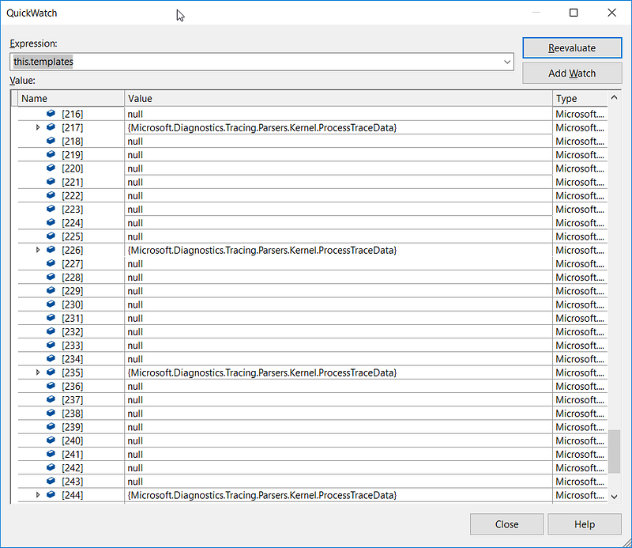

Instead of the expected GC, thread pool, exception and contention events, only kernel related events are defined:

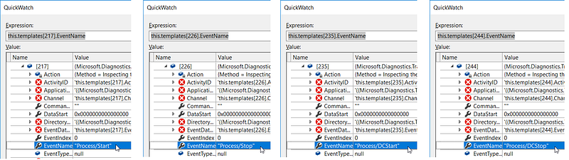

But breakpoints have been set and hit on the code that registers our own event handlers! Well… it was the case when we debugged the application from start. What if… the event source we are looking at now is not the one our code has registered its handlers to?

Without the address of the object available like in C++, it is complicated to easily check if two references actually point to the same object in memory. However, it is still possible to associate a numeric ID to an object with *Make Object ID*:

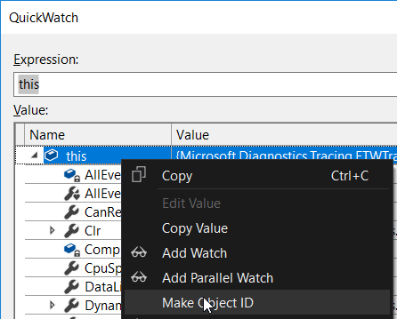

And its ID **{$1}** is now visible after the type name:

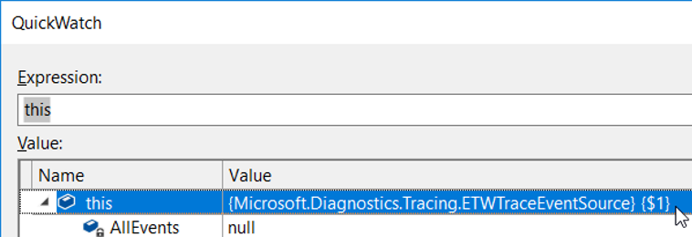

To compare with the `ETWTraceEventSource` object manipulated by our own source code, double-click the right frame in *Parallel Stack*:

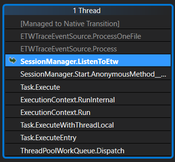

In the `ListenToEtw` method, `this` refers to our `SessionManager` in which the `ClrTraceEventParser` property references the `ETWTraceEventSource` object we believe we initialized with the right event handlers:

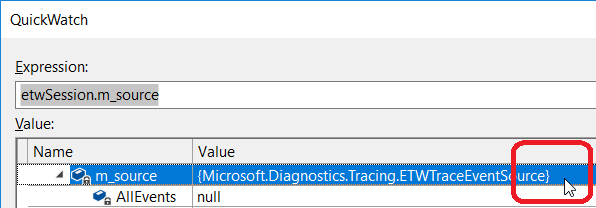

And… this object does not have any ID: it should be **{$1}**.

To confirm that we are not looking at the source object **{$1}** that TraceEvent uses to receive events, it is just a question of checking its `template` field:

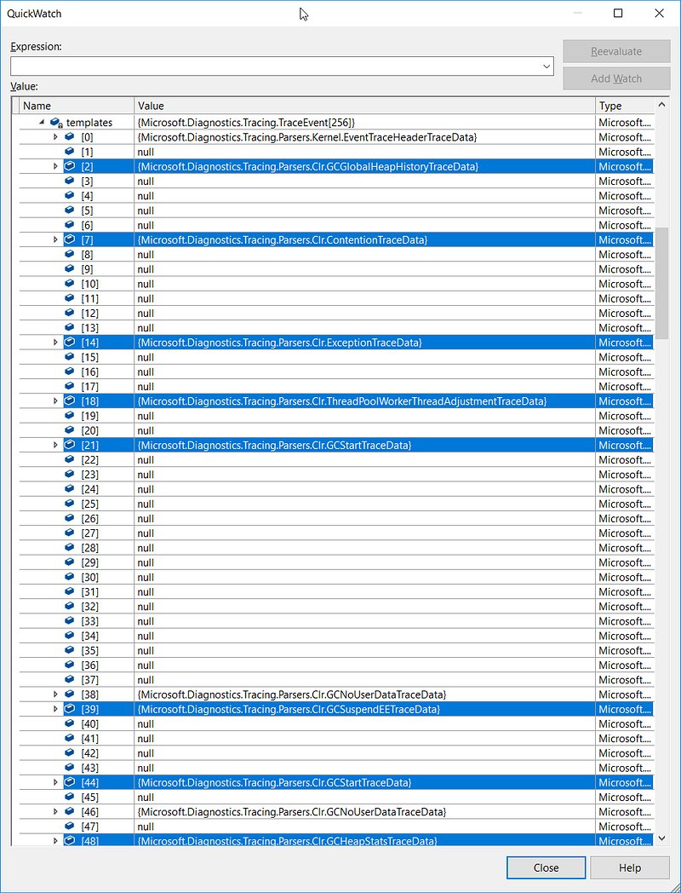

And here are the expected CLR events we are interested in!

## Race condition… again

So now the question is: how is it possible to have two instances of a TraceEvent internal class?

Here is the sequence of execution in our code:

- Thread 1 is creating a `TraceEventSession` object
- Thread 1 starts Thread 2
- Thread 1 accesses the `clrTraceEventParser` via `_currentSession?.Source.Clr`

and

- Thread 2 calls `etwSession.Source.Process()`

So the `Source` property getter could be called from two different threads. Unfortunately, [in the getter](https://github.com/Microsoft/perfview/blob/b19c4099ccf6b0037b12811f25c924a35af4a447/src/TraceEvent/TraceEventSession.cs#L1267), the source is lazily created in a non thread-safe way.

```csharp
public ETWTraceEventSource Source
{
   get
   {
      if (m_source == null)
      {
         ... // long code 
         m_source = new ETWTraceEventSource(SessionName, TraceEventSourceType.Session);
      }
      return m_source;
   }
}
```

When both threads enter the getter, `m_source` could be null and in that case, two `ETWTraceEventSource` objects are created and returned. One is used by TraceEvent to listen to events and the other by our code to register handlers to events that will never be received.

The fix is simply to force the initialization of the `Source` object in the first thread.

It is now a good time to go back home… to take a well deserved vacation!
