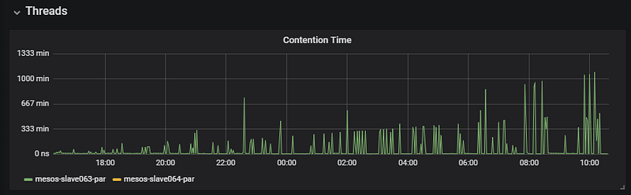
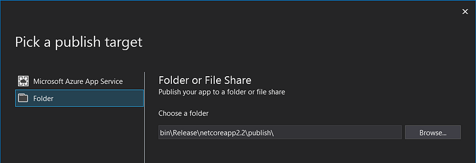
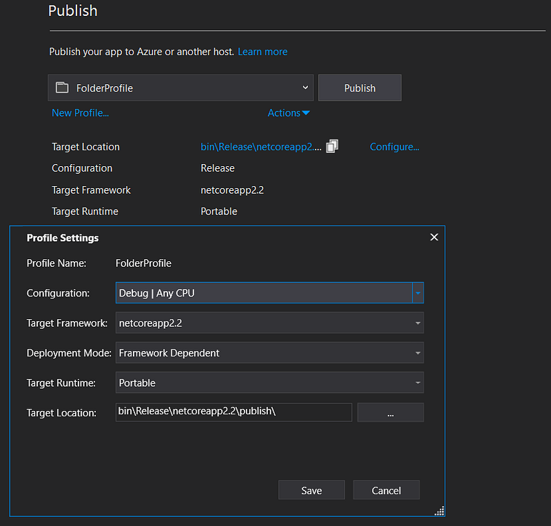
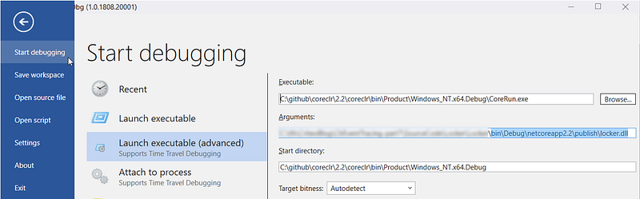
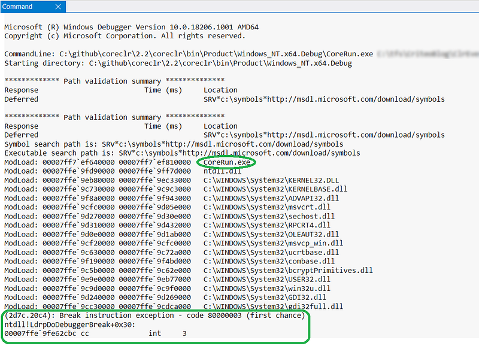
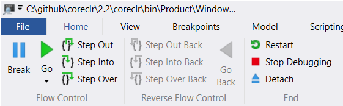
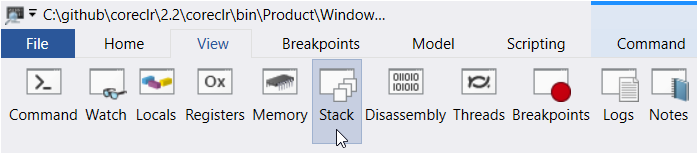
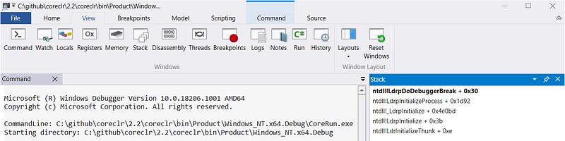
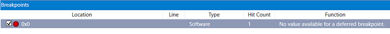
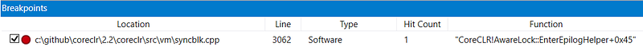

---

This post of the series shows how we debugged the Core CLR to figure out insane contention duration.

Part 1: [Replace .NET performance counters by CLR event tracing](http://labs.criteo.com/2018/06/replace-net-performance-counters-by-clr-event-tracing).

Part 2: [Grab ETW Session, Providers and Events](http://labs.criteo.com/2018/07/grab-etw-session-providers-and-events/).

Part 3: CLR Threading events with TraceEvent.

Part 4: [Spying on .NET Garbage Collector with TraceEvent](/posts/2018-12-15_spying-on-net-garbage/).

Part 5: [Building your own Java GC logs in .NET](/posts/2019-02-12_building-your-own-java/).

## Introduction

Long before migrating our .NET applications to Linux, our first step was to build a monitoring pipeline based on LTTng instead of ETW on Windows. To achieve this goal, the open source TraceEvent Nuget package needed to be updated in order to listen to LTTng live session (only a file based implementation was provided by Microsoft; mostly to allow Perfview to be able to open traces taken on Linux machines). This was a [huge development task](https://github.com/criteo-forks/perfview/pull/1) that led sometimes to weird results. Among the metrics we wanted to monitor, the contention duration gave insane value such as thousands of minutes… per minute:

As shown in [a previous episode](https://labs.criteo.com/2018/09/monitor-finalizers-contention-and-threads-in-your-application/), this duration is computed by comparing the time between the two events **ContentStart** and **ContentionStop**. What could be the possible reasons to get such insane values?

1. A lot of small contentions are happening

2. A few very long contentions are happening

As a first step, it would be great to be able to debug the Core CLR and figure out what call stacks end up to triggering these contention events. Unfortunately for us, the .NET debugging ecosystem on Linux is far from being as rich as on Windows. So this episode is detailing the steps to compile and debug the Core CLR on Windows with WinDBG.

## From the source to debugging the runtime

To better understand the implementation details in the CLR, we needed to find where the two events are emitted. In fact, during the CLR compilation, a lot of helpers are created based on the name of the event. In our case, `FireEtwContentionStart_V1` and `FireContentionStop` are the two helpers in charge. Both are called [in the **AwareLock::EnterEpilogHelper** function](https://github.com/dotnet/coreclr/blob/master/src/vm/syncblk.cpp#L2993).

As a Windows developer, I would like to debug the CLR code and set a breakpoint in the `EnterEpilogHelper` with Visual Studio to see what are the call stacks that end up to contention. However, I did not find a way to do it with Visual Studio. I turned to WinDBG and things gets “easier”… in a certain way.

Here are the different steps you need to follow before setting a breakpoint on any Core CLR function in WinDBG:

- Clone the Core CLR repository from [https://github.com/dotnet/coreclr](https://github.com/dotnet/coreclr)
- Build it:
- Get the Visual Studio, .NET Core SDK, CMake, Python, Powershell prerequisites from [the documentation](https://github.com/dotnet/coreclr/blob/master/Documentation/building/windows-instructions.md)
- Goto the root folder and type `.\build -skiptests` to build a DEBUG version of the Core CLR
- Leave your desk and go to lunch (ok… maybe just take a coffee break)

3. When you go back, the result of the compilation should be available in the following folder:

…\coreclr\bin\Product\Windows_NT.x64.debug.

4. the next step is to [use your custom Core CLR build](https://github.com/dotnet/coreclr/blob/master/Documentation/workflow/UsingYourBuild.md) in the application:

- the application must be [self-contained](https://docs.microsoft.com/en-us/dotnet/core/deploying/#self-contained-deployments-scd) by adding `win-x64` (or linux-x64 for Linux) in a `PropertyGroup` section of the .csproj.
- publish the application by running `dotnet publish` or from within Visual Studio

- Click the *Configure* link and select Debug configuration

- after clicking *Save* and *Publish*, you should now have the result under the \bin\Debug\netcoreapp2.2\publish folder.
- after clicking *Save* and *Publish*, you should now have the result under the \bin\Debug\netcoreapp2.2\publish folder.

5. It is now time to copy the following files from the Core CLR output to your application publication folder:

- coreclr.dll (for the native part of the CLR) and System.Private.CoreLib.dll (if the CLR C# code has been modified)
- in the PDB subfolder, coreclr.pdb and System.Private.CoreLib.pdb
- note that you might also need the sos.dll and mscordaccore.dll files for any investigation in WinDBG.

If you wonder why the CoreFx repo is not rebuilt, the answer is simple: the contention related code is in the CoreCLR. Also, most of the managed “mscorlib” is defined in System.Private.CoreLib.dll that gets built with CoreCLR. The rest of the BCL is covered by CoreFX and not needed in this investigation.

## From running to debugging in WinDBG

You should use [corerun.exe](https://github.com/dotnet/coreclr/blob/master/Documentation/workflow/UsingCoreRun.md) instead of dotnet.exe to run an application with the debug version of the Core CLR you’ve just built.

Open up a command prompt in the **coreclr\bin\Product\Windows_NT.x64.debug** folder and type `corerun`** c:\<your path to the **bin\Debug\netcoreapp2.2\publish** folder of your application>\<yourApp.dll>**

You have to tell `corerun` where to find the CoreFx assemblies via the `CORE_LIBRARY` environment variable:

`CORE_LIBRARIES=C:\Program Files\dotnet\shared\Microsoft.NETCore.App\2.2.0`

If you forget about it, don’t be surprised if the application stops with `FileNoteFoundException` for a missing assembly (usually **System.Runtime**)…

If, like me, your applications are running with server mode GC, you know that it is set in the application .csproj file to end up into the runtimeconfig.json file. Unfortunately, this is not taken into account by `corerun` (yet?) and you need to set it (and if you need concurrent version too) explicitly through the following environment variables:

`COMPlus_gcServer=1
COMPlus_gcConcurrent=1`

From there, ([install WinDBG if not already done](https://www.microsoft.com/en-us/p/windbg-preview/9pgjgd53tn86) and) start the debugger: click the *File* menu and select *Launch Executable (advanced)* to setup a debugging session:

The *Executable* text field points to the **corerun.exe** file generated during the compilation of the Core CLR. The same folder is used as *Start Directory* and the *Arguments* text field contains the full path of the application to debug. You could also attach to a running process but sometimes you need to access Core CLR data structures before any C#-compiled managed code of your application starts executing (to see how the garbage collector initializes for example).

As soon as you click the *Ok* button, the application starts but is almost immediately stopped by WinDBG

Don’t be scared by the last lines of the output: even through you read the word **exception**, this `int 3`** **assembly instruction tells you that a breakpoint has been set for you by WinDBG, has been hit when the application reached it and the application is now paused just before calling its entry point.

As you can see from the list of loaded modules, even though CoreRun.exe is there, no managed assembly (especially your application) has been loaded yet; not even the Core CLR itself! This means that you have to tell WinDBG to keep on executing the application until a point you would be interested in. To achieve that task, you will first need a quick tour of WinDBG user interface even though this post is not there to replace the [WinDBG online help](https://docs.microsoft.com/en-us/windows-hardware/drivers/debugger/debugging-using-windbg-preview) nor provide a detailed walkthrough.

The debugging section of the *Home* tab is not too different from what you get in Visual Studio:

The icons are even easier to understand because their action is also displayed. If you want to see the current call stack, select the *View* tab and click the **Stack** icon:

Like in Visual Studio, you are able to pin each panel wherever you want into the IDE

The next step would be to set a breakpoint on the line of code you are interested in. But let’s be clear here: I’m talking about a line of code in a function exported by a native dll; not a line of C# code in a managed assembly. Remember that WinDBG is a native debugger and it debugs only native code. If you want to debug managed code with WinDBG, you need to use commands from the sos extension; but [this is another story](https://docs.microsoft.com/en-us/archive/blogs/tess/setting-breakpoints-in-net-code-using-bpmd?WT.mc_id=DT-MVP-5003325).

So let’s go back to the native world. Even though WinDBG does not have the notion of “solution” like Visual Studio provides, it is still possible to open a C++ file and set a breakpoint in it. Click *File |Open Source File* menu and go to your Core CLR github repo to select syncblk.cpp under the \src\vm folder. Look for `AwareLock::EnterEpilogHelper` with CTRL+F (yes: search is working in WinDBG) and go down to the call to the `FireEtwContentionStart_V1` helper. Setting a breakpoint on this line is as simple as pressing **F9 **like in Visual Studio. Press the *View* tab and click the *Breakpoint* button to see the result:

Since the dll in which the breakpoint is set is not loaded yet, you can’t see the details of the breakpoint.

There is a way to tell WinDBG to continue the execution of the application until a dll get’s loaded. For coreclr.dll, type the following command:

`sxeld:coreclr`

and type **F5** (or type `g` as a command or click the green triangle in the *Home* toolbar) to resume the execution of the application. The *Breakpoints* panel shows more details now:

Press **F5** to resume the execution and the breakpoint should be triggered when the first contention happens.

## From symbols to call stacks in WinDBG

Before digging into call stacks, I would like to show you one of the differences between native dlls and managed assemblies. As a .NET developer, you are used to Intellisense and strongly typed environment provided by the metadata stored in an assembly itself. For native dll, the story is different. Exported functions are visible with tools such as [Dependency Walker](http://www.dependencywalker.com/) or `dumpbin /exports` from the SDK. If the dll exports symbols built by the C++ compiler, their name gets *mangled* to describe their signature. To get human readable symbols, you need the associated .pdb file. It will also be required to map a function address to its name in call stacks.

WinDBG allows you to browse these symbols with the `dt` command. For example, if you want to know all members defined by the **AwareLock** class, use the following command:

`dt CoreClr!AwareLock::*`

Like what was shown in the previous *Breakpoints* screenshot, the prefix of a name is the dll in which the symbol is defined. Next, use `!` as separator before the class name. Since Visual Studio is really slow to navigate the source code of the Core CLR or search in the thousands of include and C/C++ files, this is a very convenient way to navigate and learn its different parts. Don’t forget that the compilation could also inline functions (that won’t be visible in the symbols) and expand macros.

If you want to set a breakpoint on a function, use the `bp` command with the same syntax as `dt`. For example, the following command:

`bp coreClr!AwareLock::EnterEpilogHelper`

sets a breakpoint at the beginning of the function in which I already set a breakpoint.

This is the very basics of breakpoints in WinDBG. You are also able to define which actions to start when a breakpoint is hit. This is extremely powerful! For example, in the case of thread contention, you typically don’t want to stop the execution of the application because it will pause all threads and disturb the normal flow of execution that could lead to thread contention. Instead, you could ask WinDBG to dump the call stack leading to the function we are interested in and lets the execution resume with the following syntax:

`bp coreClr!AwareLock::EnterEpilogHelper "!clrstack; g"`

The commands to execute after the breakpoint is hit are defined between quotes. In this example, I’m using the `clrstack` command exported by the sos.dll extension (that must be previously loaded via `.loadby sos coreclr`) and once it is done, `g` resumes the execution.

## What’s next?

Due to automatic suspension of all threads when the `clrstack` command gets executed (before `g` resumes), the interactions between threads are not the same as normal execution outside of a debugger. I have even used [some code available in DEBUG to dump the callstacks outside of a debugger](https://github.com/criteo-forks/coreclr/commit/7394345097a78c7be3241939d357595ebad9b26a) if the contention last more than a threshold. However, it was not possible to reproduce the problem on Windows.

In parallel on Linux, another colleague investigated another lead: some events may also be skipped by our LTTng implementation. Due to complicated event management, if a **ContentionStop** and **ContentionStart** are missed, a possible previous **ContentionStart** could be used by the next **ContentionStop** and the duration would be unrelated to the real contention that happened.

So there could be a simpler way to narrow down the issue: instead of relying on two events, why not simply compute the duration of the contention in the `AwareLock::EnterEpilogHelper` function and emit only one new event with the duration as payload? Well… this will be the topic of the next episode of this series.

## References

Series of videos from the Defrag Tools show where [Maoni Stephens](https://twitter.com/maoni0) explains how to debug the Garbage Collector for a better understanding of its arcana

- [https://channel9.msdn.com/Shows/Defrag-Tools/Defrag-Tools-33-CLR-GC-Part-1](https://channel9.msdn.com/Shows/Defrag-Tools/Defrag-Tools-33-CLR-GC-Part-1)
- [https://channel9.msdn.com/Shows/Defrag-Tools/Defrag-Tools-34-CLR-GC-Part-2](https://channel9.msdn.com/Shows/Defrag-Tools/Defrag-Tools-34-CLR-GC-Part-2)
- [https://channel9.msdn.com/Shows/Defrag-Tools/Defrag-Tools-35-CLR-GC-Part-3](https://channel9.msdn.com/Shows/Defrag-Tools/Defrag-Tools-35-CLR-GC-Part-3)
- [https://channel9.msdn.com/Shows/Defrag-Tools/Defrag-Tools-36-CLR-GC-Part-4](https://channel9.msdn.com/Shows/Defrag-Tools/Defrag-Tools-36-CLR-GC-Part-4)
