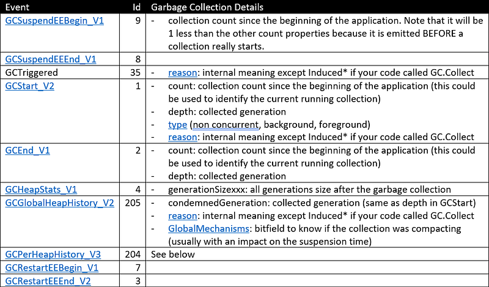
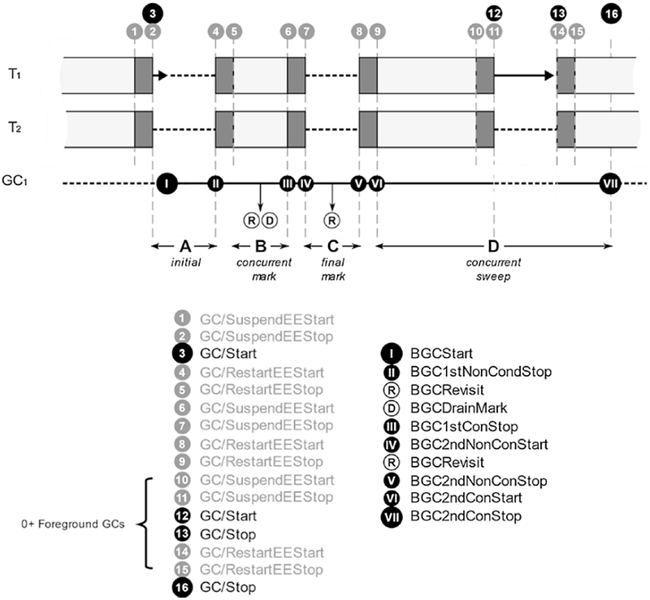
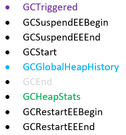
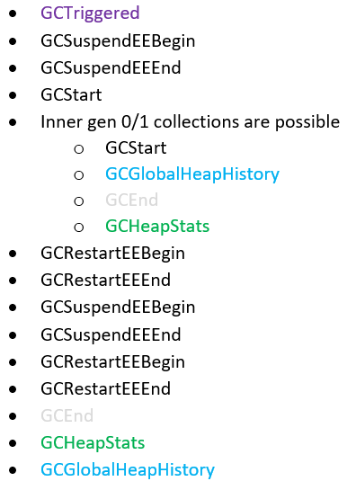
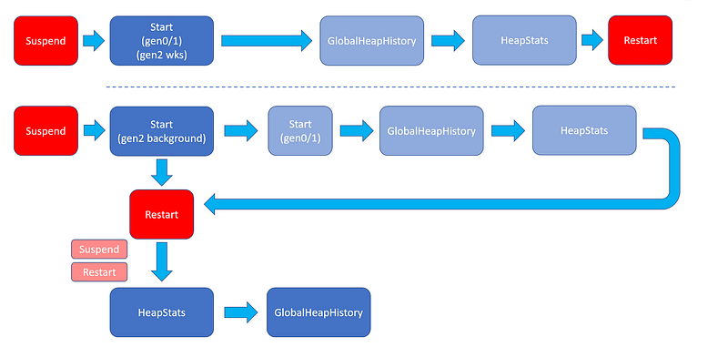

---

This post of the series shows how to generate GC logs in .NET Core with the new event pipes architecture and details the events emitted by the CLR during a collection.

Part 1: [Replace .NET performance counters by CLR event tracing](http://labs.criteo.com/2018/06/replace-net-performance-counters-by-clr-event-tracing).

Part 2: [Grab ETW Session, Providers and Events](http://labs.criteo.com/2018/07/grab-etw-session-providers-and-events/).

Part 3: CLR Threading events with TraceEvent.

Part 4: [Spying on .NET Garbage Collector with TraceEvent](/posts/2018-12-15_spying-on-net-garbage/).

Part 5: [Building your own Java GC logs in .NET](/posts/2019-02-12_building-your-own-java/)

## Introduction

The previous episode of the series introduced the notion of “GC log”, well known in the Java world and how to implement it in .NET thanks to ETW and TraceEvent on Windows. This solution is easy but requires to create an ETW session (and to remember to close it)… and is also not supported on Linux. However, [.NET Core 2.2 introduced](/posts/2018-12-06_in-process-clr-event/) the [EventListener class](https://docs.microsoft.com/en-us/dotnet/api/system.diagnostics.tracing.eventlistener?WT.mc_id=DT-MVP-5003325?view=netcore-2.2) as the best way to receive CLR events both on Windows and Linux but only from inside the process itself. As of today, TraceEvent is not supporting live session with EventPipe/EventListener, only [a file-based constructor is available](https://github.com/Microsoft/perfview/blob/master/src/TraceEvent/EventPipe/EventPipeEventSource.cs#L28). This is unfortunate because it means that you can’t rely on the huge work done by TraceEvent to parse the CLR events; especially those related to garbage collections. The rest of the post will explain how to decipher raw events.

In addition, there is a bigger problem: the current .NET Core 2.2 implementation is [not working for all CLR events](https://github.com/dotnet/coreclr/issues/21380). Long story short, the `EventPipe` class relies on specific Thread Local Storage slot that is not set by GC background worker threads: the events are not emitted in that case. In addition, there is no per event timestamp information in 2.2. The implementation presented in this post relies on tests done with ETW traces and on the [Pull Request](https://github.com/dotnet/coreclr/pull/21817) that fixes the issue for .NET Core 3.0, available in Preview 5.

## Back to the basics: what events are emitted by the GC?

The previous posts of the series were based on C# events raised by the TraceEvent parser with names different from the original CLR events and the [corresponding Microsoft Docs](https://docs.microsoft.com/en-us/dotnet/framework/performance/garbage-collection-etw-events?WT.mc_id=DT-MVP-5003325). When you implement your EventListener-derived class, each event is received as an `EventWrittenEventArgs` object in the `OnEventWritten` override. The `EventId` and `EventName` properties allow you to figure out which event is received. If you have worked with TraceEvent before, you might be using the `Opcode` property but even if a property with the same name exists in `EventWrittenEventArgs`, the value is completely different and should not be used.

The CLR is versioning the emitted events to be able to add information over time. For example, the `EventId` of the “GCStart” event is 1 but the `EventName` could be *GCStart*, *GCStart_V1* or *GCStart_V2* even though the Microsoft Docs seems to be [stuck on version 1](https://docs.microsoft.com/en-us/dotnet/framework/performance/garbage-collection-etw-events#gcstart_v1_event?WT.mc_id=DT-MVP-5003325). The following table lists the interesting GC events for .NET Core 2.2/3.0:



Look at [the documentation related to each event](https://docs.microsoft.com/en-us/dotnet/framework/performance/garbage-collection-etw-events?WT.mc_id=DT-MVP-5003325).

If you go back to [this previous article](/posts/2019-02-12_building-your-own-java/) of the series, you notice that all details provided by the `TraceGC` argument are available except for the objects size before and after the collection. These values are embedded in the workload of the *GCPerHeapHistory* event by the GC code. Unfortunately, these details are not marshalled by the current `EventPipe` implementation to your `OnEventWritten` override (read [https://github.com/dotnet/coreclr/issues/24506](https://github.com/dotnet/coreclr/issues/24506) for more details and when it will be fixed).

There is no strongly typed `EventArgs` per event and you need to know the name of the field you are interested in to get its index. From this index, you get its corresponding value from the `Payload` property of the received `EventWrittenArgs`. The following helper method is doing the heavy lifting for you:

```csharp
private T GetFieldValue<T>(EventWrittenEventArgs e, string fieldName)
{
    // this is not very optimum in term of performance but should not be a problem
    var index = e.PayloadNames.IndexOf(fieldName);
    if (index == -1)
        return default(T);

    return (T) e.Payload[index];
}
```

Now that all interesting events are known, it is time to figure out what is the sequence of events emitted during a garbage collection: a new line with the details should be added to the GC log file when the last event is received.

## What is the exact sequence of GC events

So let’s go back to the main phases of a garbage collection with the related CLR events as shown in the following figure (with [Konrad Kokosa](https://twitter.com/konradkokosa) courtesy from [his book](https://www.amazon.com/Pro-NET-Memory-Management-Performance/dp/148424026X))



This is the expected events for the most complicated case: a background collection with possible foreground ephemeral (gen0 and gen1) collections while the GC threads are concurrently sweeping. However, it is not possible to rely on this specific order of events because the order changes, depending on workstation/background mode and generation 2/ephemeral. Each type of collection triggers events in different order as shown below:

## Gen0/Gen1 and Gen 2 (non concurrent)



## Gen 2 (background)



Here is a more visual view of what could happen (dark blue is gen 2 and light blue are ephemeral gen0/1):



## When exactly does a GC start…

The **GCTriggered** event notifies that a new collection will start except in the case of foreground ephemeral gen0/gen1 collections triggered during a background gen2. In that case, you could rely on the **GCStart** event and check if a background gen2 is running. This **GCStart** event provides the condemned generation in its `Depth` property. So I keep track of both the current background GC (if any) and the foreground GC (if any) in a `GCInfo` object:

```csharp
internal class GCInfo
{
    ...

    // When a background garbage collection (BGC) is started,
    // other foreground garbage collection (FGC) for gen 0 and 1 could happen
    // before the original BGC ends
    //
    public GCDetails CurrentBGC { get; set; }

    // this could contain a FGC after a BGC has started
    // or a non-concurrent gen0/gen1/gen2 collection
    public GCDetails GCInProgress { get; set; }
}
```

The `GCDetails` class keeps tracks of all the details gathered during a garbage collection:

```csharp
internal class GCDetails
{
    public DateTime TimeStamp { get; set; }
    public double PauseDuration { get; set; }
    public int Number { get; set; }
    public GCReason Reason { get; set; }
    public GCType Type { get; set; }
    public int Generation { get; set; }
    public bool IsCompacting { get; set; }
    public HeapDetails Heaps;
}
```

The `HeapDetails` stores the size of each generation after a collection:

```csharp
public struct HeapDetails
{
    public long Gen0Size { get; set; }
    public long Gen1Size { get; set; }
    public long Gen2Size { get; set; }
    public long LOHSize { get; set; }
}
```

The `GCDetails` instance is created when the **GCStart** event is received:

```csharp
private void OnGcStart(EventWrittenEventArgs e)
{
    // This event is received after a collection is started
    var newGC = BuildGCDetails(e);

    // If a BCG is already started, FGC (0/1) are possible and will finish before the BGC
    //
    if (
        (GetFieldValue<uint>(e, "Depth") == 2) && 
        ((GCType)GetFieldValue<uint>(e, "Type") == GCType.BackgroundGC)
        )
    {
        _gcInfo.CurrentBGC = newGC;
    }
    else
    {
        _gcInfo.GCInProgress = newGC;
    }

    // forthcoming expected events for gen 0/1 collections are GCGlobalHeapHistory then GCHeapStats
}

private GCDetails BuildGCDetails(EventWrittenEventArgs e)
{
    return new GCDetails()
    {
        Number = (int)GetFieldValue<uint>(e, "Count"),
        Generation = (int)GetFieldValue<uint>(e, "Depth"),
        Type = (GCType)GetFieldValue<uint>(e, "Type"),
        Reason = (GCReason)GetFieldValue<uint>(e, "Reason")
    };
}
```

This is where it is important to remember if either a background or foreground GC is starting. In the former case, the `CurrentBGC` field is set and the `GCInProgress` field is set otherwise with a new `GCDetails` instance.

That way, when either of **GCGlobalHistory** or **GCHeapStarts** is received, it is easy to know what is the GC in progress; i.e. if a foreground GC is in progress, an event happens in its context (until the last one **GCHeapStats **that will clean the `GCInProcess` field):

```csharp
private GCDetails GetCurrentGC(GCInfo info)
{
    if (info.GCInProgress != null)
    {
        return info.GCInProgress;
    }

    return info.CurrentBGC;
}
```

## … suspend, pause application threads and end of ephemeral collections

The suspension and pause time are not that complicated to compute. The garbage collector code is relying on the `SuspendEE` and `RestartEE` methods provided by the .NET Execution Engine to suspend and restart the application threads respectively. Each of these methods emits a pair of **GCxxxBegin** and **GCxxxEnd** events. After **GCSuspendEEBegin** is emitted, the Execution Engine waits for the application threads to suspend their execution. When all threads are suspended, **GCSuspendEEEnd** gets emitted.

The **GCRestartEEBegin** event is emitted when the applications threads begin to resume their execution. When all application threads are resumed, **GCRestartEEEnd** gets emitted. The elapsed time between the **GCSuspendEEEnd** and **GCRestartEEBegin** events is counted as *suspension time*. However, for simplicity sake, my current implementation sums both the time spent by the Execution Engine to suspend the threads and the pause time due to the GC work.

The suspension start time is kept in **GCInfo**:

```csharp
// time when SuspendEEBegin is received for this process
// --> from here, all app threads will be suspended until RestartEEStop is received
// Note that we don't know yet what will be the triggered GC
public DateTime? SuspensionStart { get; set; }
```

It will be set when the **GCSuspendEEBegin** event is received:

```csharp
private void OnGcSuspendEEBegin(EventWrittenEventArgs e)
{
    // we don't know yet what will be the next GC corresponding to this suspension
    // so it is kept until next GCStart 
    _gcInfo.SuspensionStart = e.TimeStamp;
}
```

This implementation decision does not provide the same level of suspension details (no fine grain suspension time for inner foreground collections) as the one provided by the TraceEvent parsing.

The sibling **GCRestartEEEnd** event is used to (1) compute the total pause time and (2) detect when gen0/gen1/non concurrent gen2 collections end:

```csharp
private void OnGcRestartEEEnd(EventWrittenEventArgs e)
{
    var currentGC = GetCurrentGC(_gcInfo);
    if (currentGC == null)
    {
        // this should never happen, except if we are unlucky to have missed a GCStart event
        return;
    }

    // compute suspension time
    double suspensionDuration = 0;
    if (_gcInfo.SuspensionStart.HasValue)
    {
        suspensionDuration = (e.TimeStamp - _gcInfo.SuspensionStart.Value).TotalMilliseconds;
        _gcInfo.SuspensionStart = null;
    }
    else
    {
        // bad luck: a xxxBegin event has been missed
    }
    currentGC.PauseDuration += suspensionDuration;

    // could be the end of a gen0/gen1 or of a non concurrent gen2 GC
    if (
        (currentGC.Generation < 2) ||
        (currentGC.Type == GCType.NonConcurrentGC)
        )
    {
        GcEvents?.Invoke(this, BuildGcArgs(currentGC));
        _gcInfo.GCInProgress = null;
        return;
    }

    // in case of background gen2, just need to sum the suspension time
    // --> its end will be detected during GcGlobalHistory event
}
```

## Detect other collections end (and more details)

As shown in the events workflow figure, the **GCRestartEEBegin**/**GCRestartEEEnd** duo of events are used to detect the end of non-concurrent gen0/1/2 collections. It is more complicated to detect the end of a gen2 background or inner ephemeral gen0/1 collections: **GCGlobalHeapHistory** for the former and **GCHeapStats** for the latter. However, these two events payload does not contain the piece of information to know if we are in a middle of a background gen 2 or not. With this details in mind, the code of the different event handlers is quite straightforward.

The generations size are retrieved from the **GCHeapStat** event:

```csharp
// This event provides the size of each generation after the collection
// Note: last event for non background GC (will be GCGlobalHeapHistory for background gen 2)
private void OnGcHeapStats(EventWrittenEventArgs e)
{
    var currentGC = GetCurrentGC(_gcInfo);
    if (currentGC == null)
        return;

    currentGC.Heaps.Gen0Size = (long)GetFieldValue<ulong>(e, "GenerationSize0");
    currentGC.Heaps.Gen1Size = (long)GetFieldValue<ulong>(e, "GenerationSize1");
    currentGC.Heaps.Gen2Size = (long)GetFieldValue<ulong>(e, "GenerationSize2");
    currentGC.Heaps.LOHSize = (long)GetFieldValue<ulong>(e, "GenerationSize3");

    // this is the last event for non background collections  during a background gen2 collections
    if (
        (_gcInfo.CurrentBGC != null) &&
        (currentGC.Generation < 2)
       )
    {
        GcEvents?.Invoke(this, BuildGcArgs(currentGC));
        _gcInfo.GCInProgress = null;
    }
}
```

Remember this is the last event received for a gen0/gen1/foreground gen2 collection so I’m using it to clear the `GCInProgress` field: the next event will be for the current background gen2 if any (`CurrentBGC` field is not null) or a new collection.

As of today with Preview 5, the before/after generation sizes are not marshalled through event pipes (see the [corresponding bug](https://github.com/dotnet/coreclr/issues/24506) for more details) so the **GCPerHeapHistory **event does not bring any value.

The last **GCGlobalHeapHistory** event of background gen 2 collection is also used to detect compaction:

```csharp
// This event is used to figure out if a collection is compacting or not
// Note: last event for background GC (will be GCHeapStats for ephemeral (0/1) and non concurrent gen 2 collections)
private void OnGcGlobalHeapHistory(EventWrittenEventArgs e)
{
    var currentGC = GetCurrentGC(_gcInfo);

    // check unexpected event (we should have received a GCStart first)
    if (currentGC == null)
        return;
    var globalMask = GetFieldValue<GCGlobalMechanisms>(e, "GlobalMechanisms");
    currentGC.IsCompacting =
        (globalMask & GCGlobalMechanisms.Compaction) == GCGlobalMechanisms.Compaction;

    // this is the last event for gen 2 background collections
    if ((GetFieldValue<int>(e, "CondemnedGeneration") == 2) && (currentGC.Type == GCType.BackgroundGC))
    {
        // check unexpected generation mismatch
        var globalMask = (GCGlobalMechanisms)GetFieldValue<uint>(e, "GlobalMechanisms");
        currentGC.IsCompacting =
            (globalMask & GCGlobalMechanisms.Compaction) == GCGlobalMechanisms.Compaction;

        // this is the last event for gen 2 background collections
        if ((GetFieldValue<uint>(e, "CondemnedGeneration") == 2) && (currentGC.Type == GCType.BackgroundGC))
 {
            GcEvents?.Invoke(this, BuildGcArgs(currentGC));
            ClearCollections(_gcInfo);
        }
    }
}
```

In case of a background gen 2, this is the last event so there should not be any collection in progress:

```csharp
private void ClearCollections(GCInfo info)
{
    info.CurrentBGC = null;
    info.GCInProgress = null;
}
```

The next received event will start a new garbage collection cycle of events.

This post concludes the series about CLR events and how to use them to better understand how the runtime is behaving under the workloads of your applications. The code available on [Github](https://github.com/chrisnas/ClrEvents) has been updated to provide the `EventListenerGcLog` class that uses the code demonstrated in this post to generate GC logs with event pipes.
