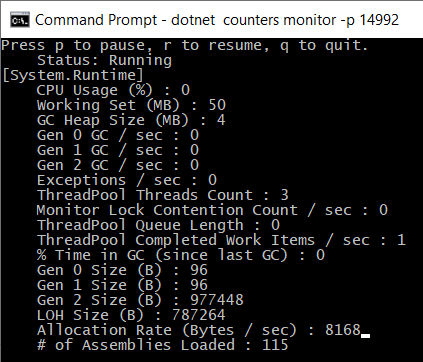
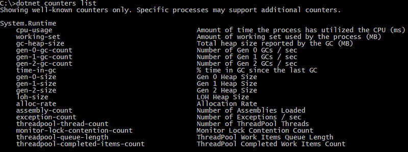
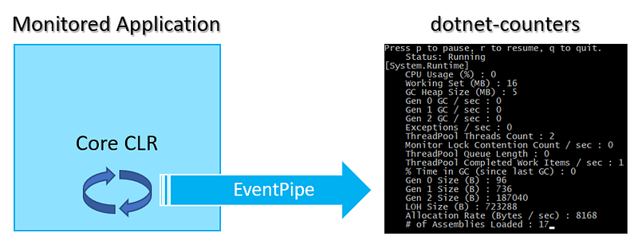
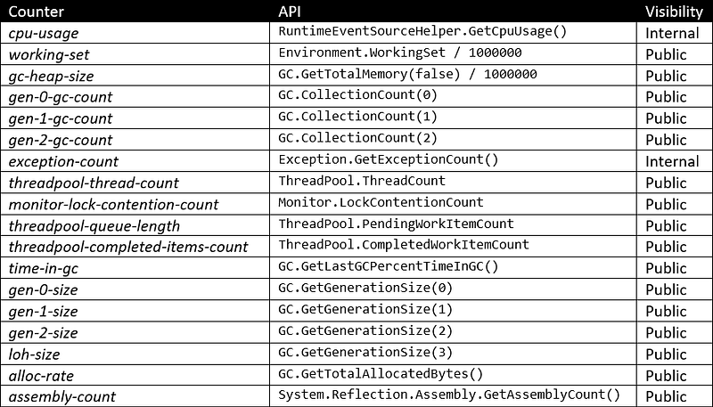
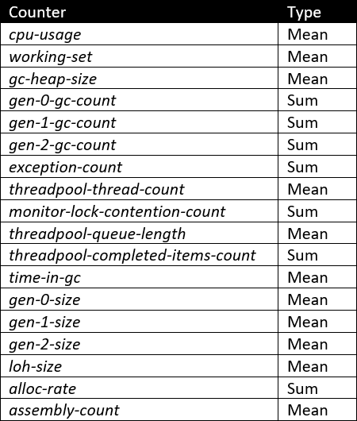
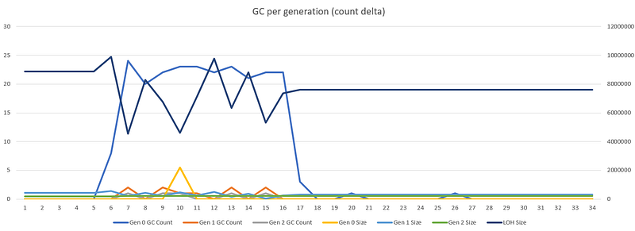
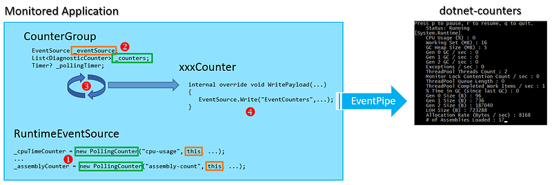
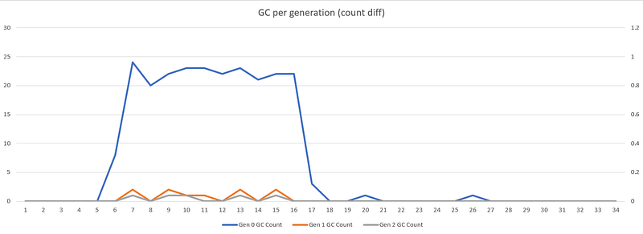
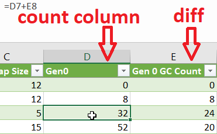
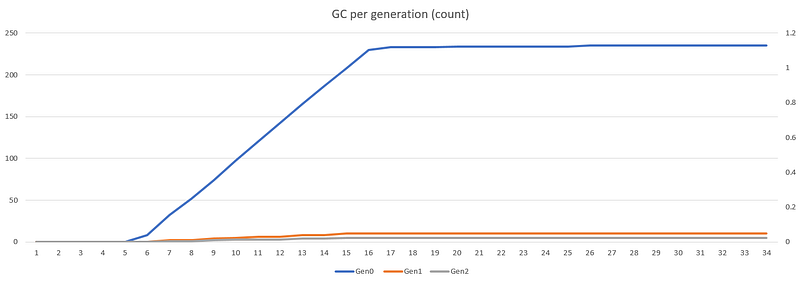

---

This post of the series digs into the implementation details of the new .NET Core counters.

Part 1: [Replace .NET performance counters by CLR event tracing](http://labs.criteo.com/2018/06/replace-net-performance-counters-by-clr-event-tracing).

Part 2: [Grab ETW Session, Providers and Events](http://labs.criteo.com/2018/07/grab-etw-session-providers-and-events/).

Part 3: [CLR Threading events with TraceEvent](http://labs.criteo.com/2018/09/monitor-finalizers-contention-and-threads-in-your-application/).

Part 4: [Spying on .NET Garbage Collector with TraceEvent](/posts/2018-12-15_spying-on-net-garbage/).

Part 5: [Building your own Java GC logs in .NET](/posts/2019-02-12_building-your-own-java/)

Part6: [Spying on .NET Core Garbage Collector with .NET Core EventPipes](/posts/2019-05-28_spying-on-net-garbage/)

## Introduction

As explained in [a previous post](/posts/2018-12-06_in-process-clr-event/), [.NET Core 2.2 introduced](/posts/2018-12-06_in-process-clr-event/) the [EventListener class](https://docs.microsoft.com/en-us/dotnet/api/system.diagnostics.tracing.eventlistener?WT.mc_id=DT-MVP-5003325?view=netcore-2.2) to receive in-proc CLR events both on Windows and Linux. Starting with .NET Core 3.0 Preview 6, the **EventPipe**-based infrastructure makes it now possible to get these events from another process. The [diagnostics repository](https://github.com/dotnet/diagnostics) contains the cross-platform tools leveraging this infrastructure:

- [**dotnet-dump**](https://github.com/dotnet/diagnostics/blob/master/documentation/dotnet-dump-instructions.md): take memory snapshot and allow analysis based on most SOS commands
- [**dotnet-trace**](https://github.com/dotnet/diagnostics/blob/master/documentation/dotnet-trace-instructions.md): collect events emitted by the Core CLR and generate trace file to be analyzed with Perfview
- [**dotnet-counters**](https://github.com/dotnet/diagnostics/blob/master/documentation/dotnet-counters-instructions.md): collect the metrics corresponding to some performance counters that used to be exposed by the .NET Framework

At Criteo, our metrics are exposed in Grafana dashboards and it is interesting to figure out how the new counters are implemented and see how to fetch them via the **EventPipe** infrastructure. With this knowledge in hand, I’ve implemented helpers to let you get counters in less than 10 lines of code:

```csharp
_counterMonitor = new CounterMonitor(_pid, GetProviders());
_counterMonitor.CounterUpdate += // receive the value of one counter after the other

Task monitorTask = new Task(() => {
    _counterMonitor.Start();
});
monitorTask.Start();
```

At the end of this post you will be able to very easily integrate any counter to your own monitoring pipeline!

## .NET Core replacement for .NET Framework Performance Counters

With .NET Core being cross-platform, performance counters were gone and, as explained in the previous posts of the series, CLR events were the only way to get metrics about how your .NET Core applications were behaving. However, with .NET Core 3.0, it is now possible to view a few metrics thanks to the **dotnet-counters** tool.

You can download and install the tools automatically if you have installed .NET Core SDK 2.1+. Microsoft is currently working to provide other ways to directly download the tools binaries without having to install the SDK or recompile the diagnostics repository.

Use the following command line to install dotnet-counters:
`dotnet tool install --global dotnet-counters --version 3.0.0-preview7.19365.2`

Note that you need to have the same version both for the Core CLR runtime and for the tools because, as you will soon see, the monitoring and the monitored applications are communicating via a dedicated protocol (that have changed between previews) on top of a transport layer different between Windows and Linux.

After the installation, use the following command line `dotnet counters monitor -p ` and you get a 1 second auto-refreshed view of counters.



These counters are exposed by the *System.Runtime* provider and are detailed with the `list` argument:



This list is currently hard-coded in the `CreateKnownProviders` method. However, you are free to create your own provider and expose your application metrics as shown in [this tutorial](https://github.com/dotnet/corefx/blob/master/src/System.Diagnostics.Tracing/documentation/EventCounterTutorial.md) (and in the next forthcoming post). In addition, if you are using ASP.NET Core, starting from Preview 7, then you could get a few counters from the “Microsoft.AspNetCore.Hosting” provider defined in `HostingEventSource.cs`.

## What are these “counters”

Even though it is nice to have a console-based cross-platform tool to see the values of counters change, what would be the cost to get them into your own monitoring pipeline? For example, at Criteo, we are pushing our metrics to Graphite in order to get nice Grafana dashboards. These graphical representations allow us to have a visual representation of the evolution of metrics over time. In addition, it is also possible to define alerts based on threshold for some metrics values (when CPU > 85% for more than 5 seconds for example).

In a nutshell, dotnet-counters tool is listening to another application via **EventPipe**. Unlike .NET Framework performance counters that are polled by the monitoring application, the counters are pushed by the monitored .NET Core process.



In term of implementation, these counters are values that you could get via .NET internal or public APIs if you were running in-proc as shown [in RuntimeEventSource.cs](https://github.com/dotnet/coreclr/blob/master/src/System.Private.CoreLib/src/System/Diagnostics/Eventing/RuntimeEventSource.cs#L47):



Unlike most of the events that previous posts of this series presented, counters are metrics that are computed by the CLR in the monitored application. They are supposed to provide a set of values changing over time in the monitored application without impacting the performance nor flooding the listener client. I highly recommend to take a look at [this issue](https://github.com/dotnet/diagnostics/issues/346) for a deeper discussion about **EventCounters** compared to regular events.

As of Preview 7, two types of counters are used:

- *Mean*: supposed to contain a mean of all values during the polling interval with its min and max values. However, based on [the current implementation](https://github.com/dotnet/coreclr/blob/master/src/System.Private.CoreLib/shared/System/Diagnostics/Tracing/PollingCounter.cs#L70), all contain only the current value.
- *Sum*: contains an increment between the previous value and the current one



The question is now to figure out how to get the values of the counters.

## How to receive the counters?

Like the Perfview tool that relies on **TraceEvent** library, dotnet-counters uses an API exposed by **Microsoft.Diagnostics.Tools.RuntimeClient** assembly. Note that it is currently [not (yet) available from nuget](https://github.com/dotnet/diagnostics/issues/343) so you need to recompile it with the [diagnostics git repo](https://github.com/dotnet/diagnostics/issues/343).

To receive counters, you need to create an **EventPipe** session that communicates via IPC (named pipes on Windows and domain sockets on Linux) with the CLR of the monitored process. Here is an excerpt of the `CounterMonitor.StartMonitoring` [implementation](https://github.com/dotnet/diagnostics/blob/master/src/Tools/dotnet-counters/CounterMonitor.cs#L177) that connects and listens to counter events:

```csharp
var configuration = new SessionConfiguration(
    circularBufferSizeMB: 1000,
    outputPath: "",
    providers: Trace.Extensions.ToProviders(providerString));

var binaryReader = EventPipeClient.CollectTracing(_processId, configuration, out _sessionId);
EventPipeEventSource source = new EventPipeEventSource(binaryReader);
source.Dynamic.All += ProcessEvents;
source.Process();
```

The important method call is call is `EventPipeClient.CollectTracing()` that returns a `Stream` from which an `EventPipeEventSource` instance gets created. This class has been added to **TraceEvent** so you can now leverage the event parsing infrastructure on top of **EventPipe**! As shown in [a previous post](http://labs.criteo.com/2018/07/grab-etw-session-providers-and-events/), it is easy to attach a listener to the source `All` .NET event and get notified each time an event is received after the `Process` method is called.

A few parameters are given to `CollectTracing` via the `SessionConfiguration` object: the size of the circular buffer used by the CLR and no file path because we want a live session. The last one is supposed to filter which providers and counters you would like to listen to: it expects a list of `Provider` instances. This struct [is created with a few parameters](https://github.com/dotnet/diagnostics/blob/master/src/Microsoft.Diagnostics.Tools.RuntimeClient/Eventing/Provider.cs#L10):

```csharp
    public struct Provider
    {
        public Provider(string name, ulong keywords = ulong.MaxValue, 
                        EventLevel eventLevel = EventLevel.Verbose, 
                        string filterData = null)
        { ... }
```

As we have already mentioned, the name of the provider is “*System.Runtime*” for the Core CLR counters. The keywords and event level are expected to have these max values. The filter data string starts with “*EventCounterIntervalSec=*” followed by the refresh interval in seconds. Internally, the CLR in the monitored application [is creating a timer](https://github.com/dotnet/coreclr/blob/master/src/System.Private.CoreLib/shared/System/Diagnostics/Tracing/CounterGroup.cs#L135) with that frequency to push the counters via **EventPipe** (more on this later).

Here is a helper class to easily create your providers:

```csharp
public class CounterHelpers
{
    public static Provider MakeProvider(string name, int refreshIntervalInSec)
    {
        var filterData = BuildFilterData(refreshIntervalInSec);
        return new Provider(name, 0xFFFFFFFF, EventLevel.Verbose, filterData);
    }

    private static string BuildFilterData(int refreshIntervalInSec)
    {
        if (refreshIntervalInSec < 1)
            throw new ArgumentOutOfRangeException(nameof(refreshIntervalInSec), $"must be at least 1 second");

        return $"EventCounterIntervalSec={refreshIntervalInSec}";
    }
}
```

Note that `dotnet-counters` allows you to pass a subset of the counters with the *System.Runtime[counter1,counter2,counter2]* syntax: events for all System.Runtime counters will be received but only these three will be displayed in the console.

## Show time for counter events!

Next, the important part of the job takes place in the `EventSourc.All` event listener. Each new counter value is received in the payload of an event named “*EventCounters*”.

```csharp
private void ProcessEvents(TraceEvent data)
{
    if (data.EventName.Equals("EventCounters"))
    {
        IDictionary<string, object> countersPayload = (IDictionary<string, object>)(data.PayloadValue(0));
        IDictionary<string, object> kvPairs = (IDictionary<string, object>)(countersPayload["Payload"]);

        var name = string.Intern(kvPairs["Name"].ToString());
        var displayName = string.Intern(kvPairs["DisplayName"].ToString());

        var counterType = kvPairs["CounterType"];
        if (counterType.Equals("Sum"))
        {
            OnSumCounter(name, displayName, kvPairs);
        }
        else
        if (counterType.Equals("Mean"))
        {
            OnMeanCounter(name, displayName, kvPairs);
        }
        else
        {
            throw new InvalidOperationException($"Unsupported counter type '{counterType}'");
        }
    }
}
```

The `Name` and `DisplayName` values are self-explanatory. The *Sum*/*Mean* type is retrieved from `CounterType`.

The value for each counter type is retrieved from the payload with “Increment” (*Sum* type) or “Mean” (*Mean *type) keys.

```csharp
 private void OnSumCounter(string name, string displayName, IDictionary<string, object> kvPairs)
{
    double value = double.Parse(kvPairs["Increment"].ToString());

    // send the information to your metrics pipeline
}

private void OnMeanCounter(string name, string displayName, IDictionary<string, object> kvPairs)
{
    double value = double.Parse(kvPairs["Mean"].ToString());

    // send the information to your metrics pipeline
}
```

The `CounterMonitor` class has been added on my [Github](https://github.com/chrisnas/ClrEvents) to expose a `CounterUpdate` C# event when a counter event is received:

```csharp
public class CounterMonitor
{
    ...
    public event Action<CounterEventArgs> CounterUpdate;
    private void OnSumCounter(string name, string displayName, IDictionary<string, object> kvPairs)
    {
        double value = double.Parse(kvPairs["Increment"].ToString());

        // send the information to your metrics pipeline
        CounterUpdate(new CounterEventArgs(name, displayName, CounterType.Sum, value));
    }

    private void OnMeanCounter(string name, string displayName, IDictionary<string, object> kvPairs)
    {
        double value = double.Parse(kvPairs["Mean"].ToString());

        // send the information to your metrics pipeline
        CounterUpdate(new CounterEventArgs(name, displayName, CounterType.Mean, value));
    }
}
```

The event argument contains the expected properties but other could be added if needed such as the timestamp for example:

```csharp
public class CounterEventArgs : EventArgs
{
    internal CounterEventArgs(string name, string displayName, CounterType type, double value)
    {
        Counter = name;
        DisplayName = displayName;
        Type = type;
        Value = value;
    }

    public string Counter { get; set; }
    public string DisplayName { get; set; }
    public CounterType Type { get; set; }
    public double Value { get; set; }
}

public enum CounterType
{
    Sum = 0,
    Mean = 1,
}
```

## Let’s show some graphs!

With these helpers in hand, it is easy to integrate any counter to your monitoring pipeline. As an example, let’s see how to generate a .csv file used to create visual representations in Excel.



With a refresh rate of 1 second, one line containing the value of the CLR counters should be added to the .csv file every second. Since we get one event per counter, we need to know which is the “last” counter event sent by the CLR for a given 1 second counters push.

As mentioned earlier the [RuntimeEventSource](https://github.com/dotnet/coreclr/blob/master/src/System.Private.CoreLib/src/System/Diagnostics/Eventing/RuntimeEventSource.cs#L47) class defines the CLR counters. Each one is an instance of a type derived from the `DiagnoticCounter` class that [associates its instances](https://github.com/dotnet/coreclr/blob/master/src/System.Private.CoreLib/shared/System/Diagnostics/Tracing/DiagnosticCounter.cs#L45) to a `CounterGroup` also bound to the `RuntimeEventSource`. The `CounterGroup` class will setup a repeating timer responsible for creating the payload for its `DiagnosticCounter`-derived instances and ask the event source to send each to the monitoring application via **EventPipe**.



So we can rely on the order defined by the counters creation code in `RuntimeEventSource`: for a given push of counters, the name of the last one will be “*assembly-count*”. Beware that in a case of new counters (such as for ASP.NET Core), you would need to check what would be the last one of the counters series. Another way to work around would be to rely on the timestamps of each event but this could become flaky over time. It would have been great if a “*CounterSeries*”event containing the list of counter names would have been sent before any “*EventCounters*” of a series push (good idea for a pull request :^)

The `CsvCounterListener` class wraps the few lines of code needed to handle the events and add a line into the .csv file each time a series of counters is received:

```csharp
public class CsvCounterListener
{
    private readonly string _filename;
    private readonly int _pid;
    private CounterMonitor _counterMonitor;
    private List<(string name, double value)> _countersValue;

    public CsvCounterListener(string filename, int pid)
    {
        _filename = filename;
        _pid = pid;
        _countersValue = new List<(string name, double value)>();
    }

    public void Start()
    {
        if (_counterMonitor != null)
            throw new InvalidOperationException($"Start can't be called multiple times");

        _counterMonitor = new CounterMonitor(_pid, GetProviders());
        _counterMonitor.CounterUpdate += OnCounterUpdate;

        Task monitorTask = new Task(() => {
            try
            {
                _counterMonitor.Start();
            }
            catch (Exception x)
            {
                Environment.FailFast("Error while listening to counters", x);
            }
        });
        monitorTask.Start();
    }

    private void OnCounterUpdate(CounterEventArgs args)
    {
        _countersValue.Add((args.DisplayName, args.Value));

        // we know that the last CLR counter is "assembly-count"
        if (args.Counter == "assembly-count")
        {
            SaveLine();
            _countersValue.Clear();
        }
    }

    bool isHeaderSaved = false;
    private void SaveLine()
    {
        if (!isHeaderSaved)
        {
            File.AppendAllText(_filename, GetHeaderLine());
            isHeaderSaved = true;
        }

        File.AppendAllText(_filename, GetCurrentLine());
    }

    private string GetHeaderLine()
    {
        StringBuilder buffer = new StringBuilder();
        foreach (var counter in _countersValue)
        {
            buffer.AppendFormat("{0}\t", counter.name);
        }

        // remove last tab
        buffer.Remove(buffer.Length - 1, 1);

        // add Windows-like new line because will be used in Excel
        buffer.Append("\r\n");

        return buffer.ToString();
    }

    private string GetCurrentLine()
    {
        StringBuilder buffer = new StringBuilder();
        foreach (var counter in _countersValue)
        {
            buffer.AppendFormat("{0}\t", counter.value.ToString());
        }

        // remove last tab
        buffer.Remove(buffer.Length - 1, 1);

        // add Windows-like new line because will be used in Excel
        buffer.Append("\r\n");

        return buffer.ToString();
    }

    public void Stop()
    {
        if (_counterMonitor == null)
            throw new InvalidOperationException($"Stop can't be called before Start");

        _counterMonitor.Stop();
        _counterMonitor = null;

        _countersValue.Clear();
    }

    private IReadOnlyCollection<Provider> GetProviders()
    {
        var providers = new List<Provider>();

        // create default "System.Runtime" provider with a refresh every second
        var provider = CounterHelpers.MakeProvider("System.Runtime", 1);
        providers.Add(provider);

        return providers;
    }
}
```

## What’s next?

You have seen how easy it is to be notified of CLR counters update. The integration to your own monitoring system should not be more complicated. However, you need to pay attention to the meaning of counter types between *Mean *and *Sum*. For example, the value you get for **gen-0-count** (*Sum*) counters is a difference between now and the previous computation. It means that you can’t have the “current” number of gen 0 collection at a given time.



This is not a problem in the Excel example because you can “rebuild” a column that will contain the “current” count based on the previous value + the diff returned by the counter.



Here is the resulting graph:



In other cases, you might need to feed your monitoring system with real count values and benefit from advanced charting such as non derivative computation to show a rate based on a series of values. At the end of the day, it is just a question of initial value from which rebuild a count. And if you think about it, you are often more interested in unexpected variations (i.e. differences returned by counters) when monitoring your application.

In addition to your business metrics, .NET Core Counters are usually enough to monitor the health of your applications. However, in order to investigate situations where counters value are showing weird results, you often need more details. For example spikes in garbage collections count might not be a problem if the pause time is not too long. Listening to specific CLR events as shown in previous posts of this series is a great way to unveil important metrics such as GC pause time, contentions duration or exception names without performance hit.

The code available on [Github](https://github.com/chrisnas/ClrEvents) has been updated to provide the `CounterMonitor` and `CsvCounterListener` classes that demonstrates how to get .NET Core counters and generate .csv file usable in Excel.
