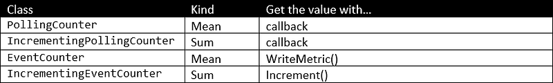
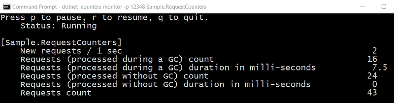

---

This post of the series explains how to implement your own counters.

Part 1: [Replace .NET performance counters by CLR event tracing](http://labs.criteo.com/2018/06/replace-net-performance-counters-by-clr-event-tracing).

Part 2: [Grab ETW Session, Providers and Events](http://labs.criteo.com/2018/07/grab-etw-session-providers-and-events/).

Part 3: [CLR Threading events with TraceEvent](http://labs.criteo.com/2018/09/monitor-finalizers-contention-and-threads-in-your-application/).

Part 4: [Spying on .NET Garbage Collector with TraceEvent](/posts/2018-12-15_spying-on-net-garbage/).

Part 5: [Building your own Java GC logs in .NET](/posts/2019-02-12_building-your-own-java/)

Part 6: [Spying on .NET Core Garbage Collector with .NET Core EventPipes](/posts/2019-05-28_spying-on-net-garbage/)

Part 7: [.NET Core Counters internals: how to integrate counters in your monitoring pipeline](/posts/2019-07-23_net-core-counters-internals/)

## Introduction

The** EventPipe** counters are the .NET Core replacement for Windows performance counters. In the [previous post](/posts/2019-07-23_net-core-counters-internals/), I’ve explained how to listen to CLR event pipes to get the counter’s value over time both on Windows and Linux. This post shows you how easy it is to provide your counters via the same infrastructure.

The example I’m using is based on a real-world case we had to investigate at Criteo. We needed to correlate request duration with garbage collections, so we decided to add new metrics to our testing dashboard: number and duration of requests but split between those processed without being interrupted by a GC and the others.

For the sake of the ASP.NET Core code example, a [dedicated middleware](https://docs.microsoft.com/en-us/aspnet/core/fundamentals/middleware/write?WT.mc_id=DT-MVP-5003325?view=aspnetcore-3.0) is created: it simply measures the time spent to process a request and if the count of garbage collections has changed before and after the request is processed:

```csharp
public class RequestMetricsMiddleware
{
    private readonly RequestDelegate _next;

    public RequestMetricsMiddleware(RequestDelegate next)
    {
        _next = next;
    }

    public async Task InvokeAsync(HttpContext context)
    {
        // get the count of GCs before processing the request
        var collectionCountBeforeProcessingTheRequest = GetCurrentCollectionCount();

        var sw = Stopwatch.StartNew();

        try
        {
            // Call the next delegate/middleware in the pipeline
            await _next(context);
        }
        finally
        {
            // compare the counter of GCs after processing the request
            // if the count changed, a garbage collection occurred during the processing 
            // and might have slowed it down and maybe reaching SLA limit: this could 
            // explain 9x-percentile in slow requests for example
            if (GetCurrentCollectionCount() - collectionCountBeforeProcessingTheRequest != 0)
            {
                // update with collection metric
               RequestCountersEventSource.Instance.AddRequestWithGcDuration(sw.ElapsedMilliseconds);
            }
            else
            {
                // update without collection metric
                RequestCountersEventSource.Instance.AddRequestWithoutGcDuration(sw.ElapsedMilliseconds);
            }
        }
    }

    private int GetCurrentCollectionCount()
    {
        int count = 0;
        for (int i = 0; i < GC.MaxGeneration; i++)
        {
            count += GC.CollectionCount(i);
        }

        return count;
    }
}
```

The interesting part is in the `RequestCountersEventSource` implementation.

## Use an EventSource Luke!

As explained in the previous post, an `EventSource` instance is used as the “server” part of the **EventPipe** communication channel. It exposes a name that is used to identify it, but more important to listen to it with **dotnet-trace**, **dotnet-counters,** or your own listener as the *provider* name.

```csharp
[EventSource(Name = RequestCountersEventSource.SourceName)]
public class RequestCountersEventSource : EventSource
{
    // this name will be used as "provider" name with dotnet-counters
    // ex: dotnet-counters monitor -p <pid> Sample.RequestCounters
    //
    const string SourceName = "Sample.RequestCounters";

    public RequestCountersEventSource() 
        : base(RequestCountersEventSource.SourceName, EventSourceSettings.EtwSelfDescribingEventFormat)
    {
        // create the counters: they'll be bound to this event source + CounterGroup
        CreateCounters();
    }
```

This name is exposed via an `EventSourceAttribute` that decorates your `EventSource`-derived class (you could also pass it to the constructor). The counters are created in the constructor through the `CreateCounters` helper.

## Pick the right Counter class

Before looking at the implementation of the `CreateCounters` method, you need to understand what kind of counters are available for you. In the previous post, I mentioned that the CLR was using *Mean* (that provides mean, max, and min values over the update interval) and *Sum* (to increment a single value) kinds of counters. Note that dotnet-counter will only show the mean value for *Mean* counters.
 
 In addition, the counters could either automatically poll the value from a callback (the method used by the CLR today), or your code could change a counter value by calling the `WriteMetric` method. The `EventCounter` class provides this helper and it does its best to compute the min/max/mean in [a lock-free way](https://github.com/dotnet/coreclr/blob/master/src/System.Private.CoreLib/shared/System/Diagnostics/Tracing/EventCounter.cs#L144).



The next question to answer is which one should you use.

In the case of the request with(out) GC example, I want to expose different metrics:

- *Request count*: a `PollingCounter` will be used in addition to an int field incremented when a request is received.
- *Request count delta*: an `IncrementingCounter` associated with the same int value will provide the delta (i.e., number of requests processed during an interval)
- *Request with GC and without GC counts*: two `PollingCounter` instances based on two int fields incremented when a request with (or without respectively) GC are processed.
- *Duration of requests with and without GC*: two `EventCounter` instances updated when requests are processed.

Here is the implementation of`CreateCounters`:

```csharp
private void CreateCounters()
{
    // the same request count can be used for two counters:
    // - raw request counter that will always increase
    // - increment counter that will automatically compute the delta
    //   between the current value and the value when the counter
    //   was previously sent
    _requestCount ??= new PollingCounter("request-count", this,
        () => _requestCountValue)
    { DisplayName = "Requests count" };
    _requestCountDelta ??= new IncrementingPollingCounter("request-count-delta", this,
        () => _requestCountValue)
    { DisplayName = "New requests", DisplayRateTimeScale = new TimeSpan(0, 0, 1) };

    // split the request counts between those for which a GC occured or not 
    // during their processing
    _noGcRequestCount ??= new PollingCounter("no-gc-request-count", this,
        () => _noGcRequestCountValue)
    { DisplayName = "Requests (processed without GC) count" };
    _withGcRequestCount ??= new PollingCounter("with-gc-request-count", this,
        () => _withGcRequestsCountValue)
    { DisplayName = "Requests (processed during a GC) count" };

    // request duration counters (with or without GC happening during the processing)
    _noGcRequestDuration ??= new EventCounter("no-gc-request-duration", this)
    { DisplayName = "Requests (processed without GC) duration in milli-seconds" };

    _withGcRequestDuration ??= new EventCounter("with-gc-request-duration", this)
    { DisplayName = "Requests (processed during a GC) duration in milli-seconds" };
}
```

The request processing code of the ASP.NET Core middleware is relying on the following helper methods to update the counters:

```csharp
internal void AddRequestWithoutGcDuration(long elapsedMilliseconds)
{
    IncRequestCount();
    Interlocked.Increment(ref _noGcRequestCountValue);

    // compute min/max/mean
    _noGcRequestDuration?.WriteMetric(elapsedMilliseconds);
}

internal void AddRequestWithGcDuration(long elapsedMilliseconds)
{
    IncRequestCount();
    Interlocked.Increment(ref _withGcRequestsCountValue);

    // compute min/max/mean
    _withGcRequestDuration?.WriteMetric(elapsedMilliseconds);
}

private void IncRequestCount()
{
    Interlocked.Increment(ref _requestCountValue);
}
```

And that’s it!

## How to get these custom counters?

The controller of the ASP.NET Core sample application is triggering (or not) garbage collections based on the parameters passed via the url:

```csharp
[Route("api/[controller]")]
[ApiController]
public class RequestController : ControllerBase
{

    // GET: api/Request/5
    [HttpGet("{id}")]
    public string Get(int id)
    {
        if (id == -1)
        {
            return $"pid = {Process.GetCurrentProcess().Id}";
        }
        else
        if ((id >= 0) && (id <= 2))
        {
            GC.Collect(id);
            return $"triggered GC {id}";
        }
        else
        if (id <= 10)
        {
            // trigger a given number of GCs up to 10
            TriggerGCs(id);
            return $"triggered {id} garbage collections";
        }

        return $"value = {id}";
    }

    private void TriggerGCs(int count)
    {
        for (int current = 0; current < count; current++)
        {
            GC.Collect(0);
        }
    }
```

As explained earlier, it is possible to see the counter values with **dotnet-counters** by using the event source name as a provider with the following command line:

> dotnet counters monitor -p <pid> **Sample.RequestCounters**

Then if you trigger a few requests with and without GC, you should see the numbers change:



The code available on [Github](https://github.com/chrisnas/ClrEvents) has been updated to provide the middleware and the event source classes that demonstrate how to expose custom .NET Core counters.
