---

This post shows how to attach to a .NET Core process running on Linux with WSL and also how to start a Linux process with Visual Studio debugger

Coming from the Windows world, I don’t find that easy to develop .NET Core applications for Linux. I’m used to code and debug in Visual Studio. Now, I need to build on Windows (due to our Criteo continuous integration), deploy an artifact to Marathon in order to get an application running inside a Mesos container. At Criteo, we had to build a whole set of services to allow remote debugging or memory dump analysis.

But what if I just wanted to test and debug a small scenario on my beloved Windows machine? Windows Subsystem for Linux (aka WSL) is perfect for running a Linux .NET Core application on Windows. However, how to attach to it or even start a debugging session from Visual Studio? In the rest of this post, I’ll explain how to setup your Windows 10 machine to achieve these miracles.

**Linux on Windows: welcome WSL**

It is obviously not the place to dig into Windows Subsystem for Linux. You just need to know that once installed, it allows you open up a Linux shell on your Windows machine without any virtual machine kind of technology. It is also possible to share folders between Windows (where you want to build your application) and Linux (where you want to execute the built assemblies).

The first step is to turn on WSL feature in your Windows:

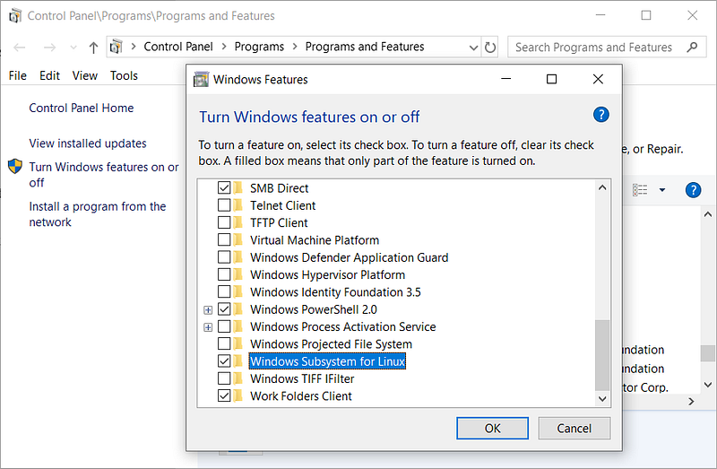

After a reboot, you are able to start a WSL prompt:

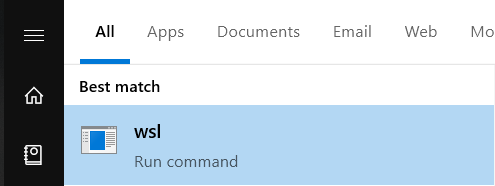

You can also [install your favorite Linux distro](https://docs.microsoft.com/en-us/windows/wsl/install-win10?WT.mc_id=DT-MVP-5003325) if you want.

The next step is to install [.NET Core runtime](https://dotnet.microsoft.com/download/linux-package-manager/ubuntu18-04/runtime-current) or SDK so you are able to run your application on Linux.

It is now time to look at your hard drive from a Linux perspective:

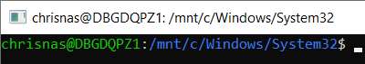

Your drives are mapped under /mnt without the “:”. In my case, I created a wsl folder under my d: drive to do my experiments. With Visual Studio, I generated a TestConsole application with the following code:

```csharp
using System;
 
namespace TestConsole
{
    class Program
    {
        static void Main(string[] args)
        {
            Console.WriteLine("Enter x to EXIT...");
            while(true)
            {
                var cmd = Console.ReadLine();
                if (cmd.ToLower() == "x")
                    return;
 
                Console.WriteLine($"> {cmd}");
            }
        }
    }
}
```

I’m publishing the application to get all needed assemblies:

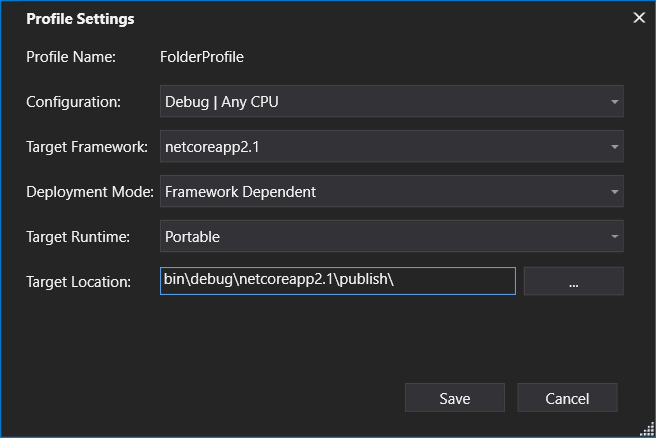

In a WSL prompt, type **dotnet** with the name of your application assembly et voila!

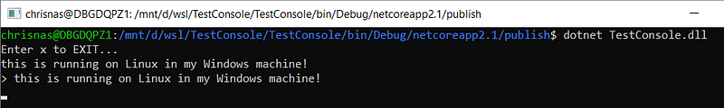

A Linux .NET Core application is running on your Windows machine.

**How to attach to a running Linux application**

Let’s say that I’m detecting a problem and I want to debug the Linux application with Visual Studio. When attaching the Visual Studio debugger to a process, several connection types are available:

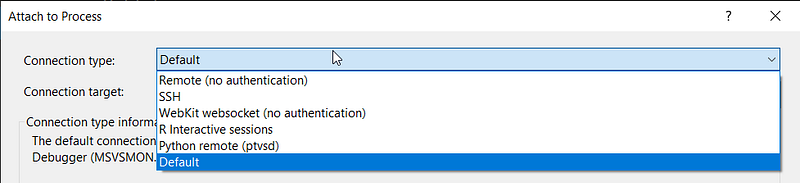

The SSH connection type will be used with WSL with the following kind of communications architecture:

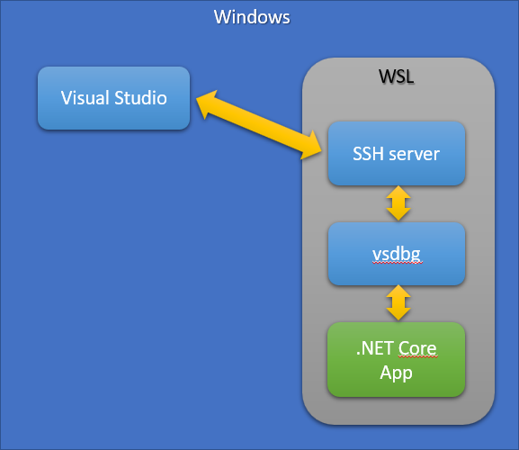

The Visual Studio debugger is sending commands to the remote Linux debugger vsdbg via an SSH channel. Here are the steps to follow to install the missing components:

- By default, an SSH server is installed with WSL. However, I was not able to make the whole pipeline work with it so I had to uninstall and reinstall it:
`sudo apt-get remove openssh-server`
`sudo apt-get install openssh-server`
- The SSH configuration needs also to be changed in order to allow username/password kind of security needed by Visual Studio (if you prefer key-based security, look at the end of the post for available resources). If you don’t know how to use vi efficiently to simply edit a file, install nano (thanks @kookiz for the tips :^)
`sudo apt-get install nano`
- In /etc/ssh/sshd_config, change the PasswordAuthentication settings
`sudo nano /etc/ssh/sshd_config
PasswordAuthentication yes`
- Restart the ssh server
`sudo service ssh start`
- You need to install unzip in order to get vsdbg
`sudo apt-get install unzip
curl -sSL https://aka.ms/getvsdbgsh | bash /dev/stdin -v latest -l ~/vsdbg`

You are now ready to select SSH as connection type and enter your machine name before clicking the Refresh button. At that time, a new dialog should pop up for you to enter your WSL credentials:

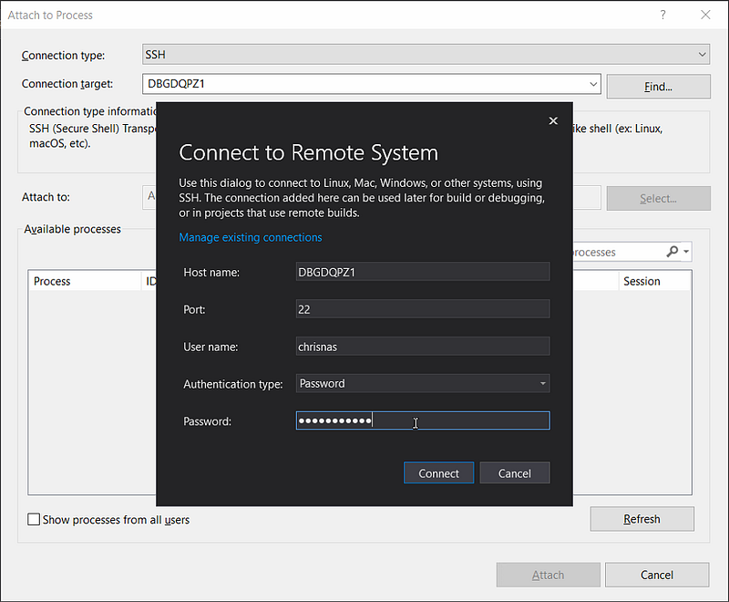

After you click the Refresh button, the list at the bottom should contain the Linux processes running in WSL

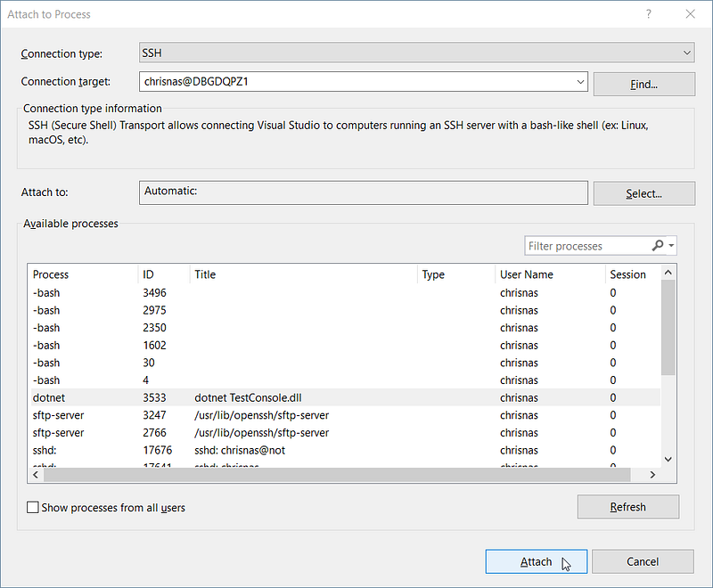

Select your .NET Core application and click Attach to select the Managed debugger:

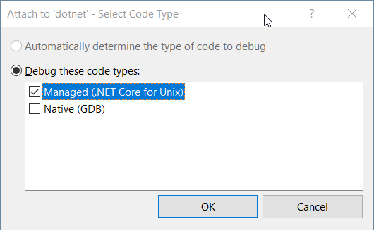

Now, if you set a breakpoint in the code and trigger it with an appropriate action in your WSL prompt

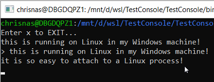

then the debugger will break as expected:

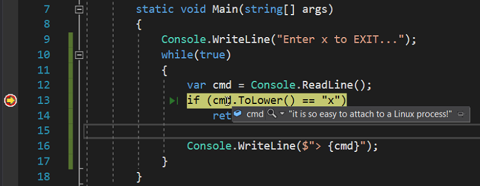

Note that when you stop your debugging session, the Linux application is not stopped; just detached from the debugger and keeps on running.

**Showtime for F5!**

Attaching to a running Linux application is nice but it would be even better to start a Linux process from Visual Studio debugger. In order to achieve this goal you need to add another piece to the architecture puzzle:

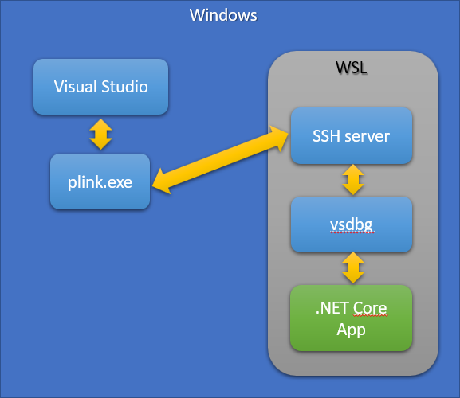

As detailed in [this WIKI page](https://github.com/Microsoft/MIEngine/wiki/Offroad-Debugging-of-.NET-Core-on-Linux---OSX-from-Visual-Studio), it is possible to tell Visual Studio to execute debugging actions thanks to a launch.json file such as the following:

```json
{
  "version": "0.2.0",
  "adapter": "c:\\tools\\plink.exe",
  "adapterArgs": "-ssh -pw <password> chrisnas@DBGDQPZ1 -batch -T ~/vsdbg/vsdbg --interpreter=vscode",
  "configurations": [
    {
      "name": ".NET Core Launch",
      "type": "coreclr",
      "cwd": "/mnt/d/wsl/TestConsole/TestConsole/bin/Debug/netcoreapp2.1/publish",
      "program": "TestConsole.dll",
      "request": "launch"
    }
  ]
}
```

The [plink tool from putty](https://www.chiark.greenend.org.uk/~sgtatham/putty/latest.html) will be used as an adapter for Visual Studio to communicate with vsdbg running in WSL. The **adapterArgs** property gives the same SSH/machine/user/password information that you provide via Visual Studio UI in the Attach scenario. The **configuration** section defines which request (“launch” instead of attach and which folder/assembly to start) will be sent to vsdbg.

Once this file is created (in my case in d:\wsl\vs folder), you just need to type the following command in the Immediate pane of Visual Studio:

`DebugAdapterHost.Launch /LaunchJson:d:\wsl\vs\launch.json`

and if you had set a breakpoint on the first line of your application, the debugger should break there:

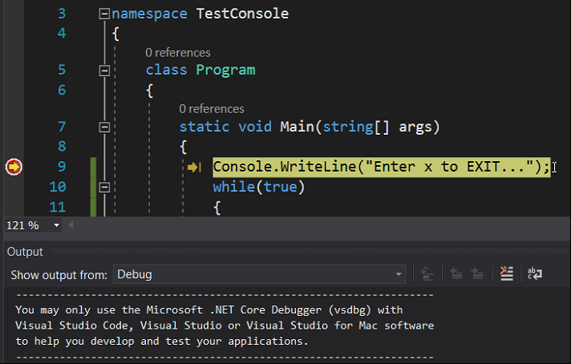

In a WSL prompt, you can see the expected 2 new spawned processes:

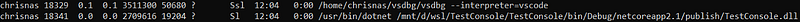

But wait!

I have a problem now: I don’t have any prompt in which typing input for my console application… However, as always in Linux, you simply need to write to a file to fix this. The stdin stream of your application is accessible under `/proc//fd/0`.

So, when I type the following command:

`echo "Launching a Linux app is not a problem!" > /proc/18341/fd/0`

my breakpoint is hit in Visual Studio:

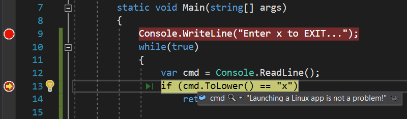

Also note that everything that is sent to the console appears in Visual Studio Output pane:

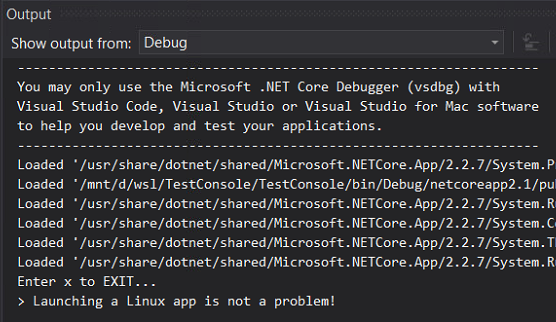

Note that, unlike the Attach scenario, if you stop the debugging session, the Linux application (and vsdbg) will be terminated.

**Resources**

During my investigations I’ve found a few resources you might find useful (especially about configuring SSL with keys instead of passing clear user/password)

- [Basic VS + WSL](https://devblogs.microsoft.com/devops/debugging-net-core-on-unix-over-ssh/?WT.mc_id=DT-MVP-5003325)
- [Good description about how to use VS 2017 to attach to .NET Core app running in WSL](https://devblogs.microsoft.com/devops/debugging-net-core-on-unix-over-ssh/?WT.mc_id=DT-MVP-5003325)
- [Debugging .NET Core from VS 2017 and WSL](https://devblogs.microsoft.com/devops/debugging-net-core-on-unix-over-ssh/?WT.mc_id=DT-MVP-5003325)
- [VS/C++ with WSL ](https://devblogs.microsoft.com/devops/debugging-net-core-on-unix-over-ssh/?WT.mc_id=DT-MVP-5003325)(describe how to install WSL and setup open ssh server)
- [Setup SSH on WSL](https://devblogs.microsoft.com/devops/debugging-net-core-on-unix-over-ssh/?WT.mc_id=DT-MVP-5003325)
- [Wiki for VSDBG](https://devblogs.microsoft.com/devops/debugging-net-core-on-unix-over-ssh/?WT.mc_id=DT-MVP-5003325)
- [Great description about how to setup your linux dev environment with VS Code and WSL](https://devblogs.microsoft.com/commandline/an-in-depth-tutorial-on-linux-development-on-windows-with-wsl-and-visual-studio-code/?WT.mc_id=DT-MVP-5003325)
