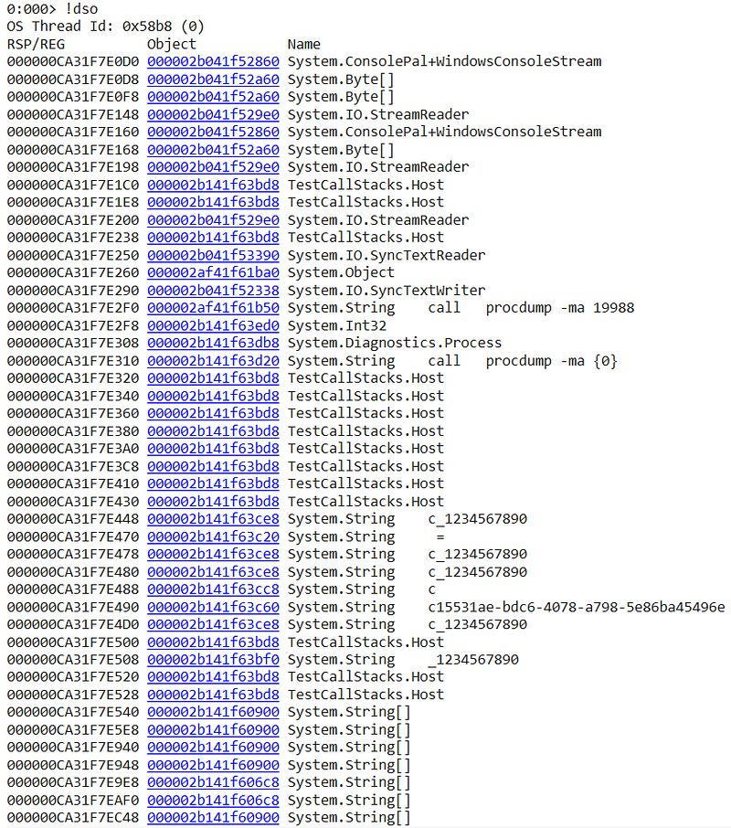
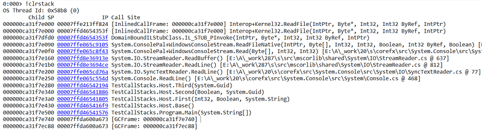
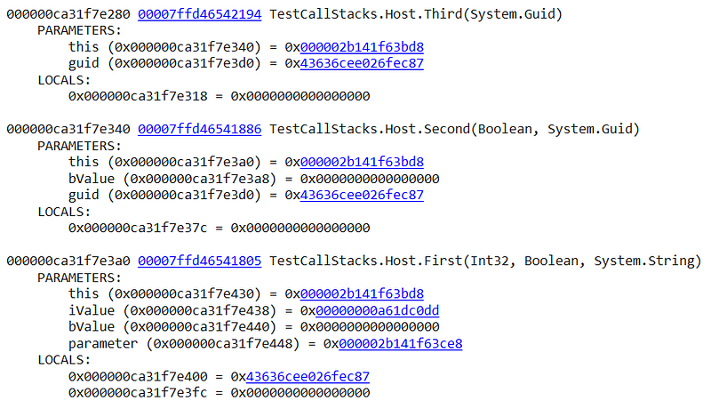
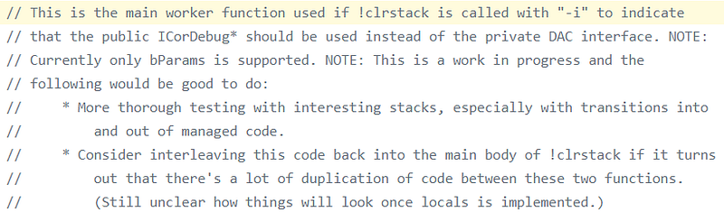
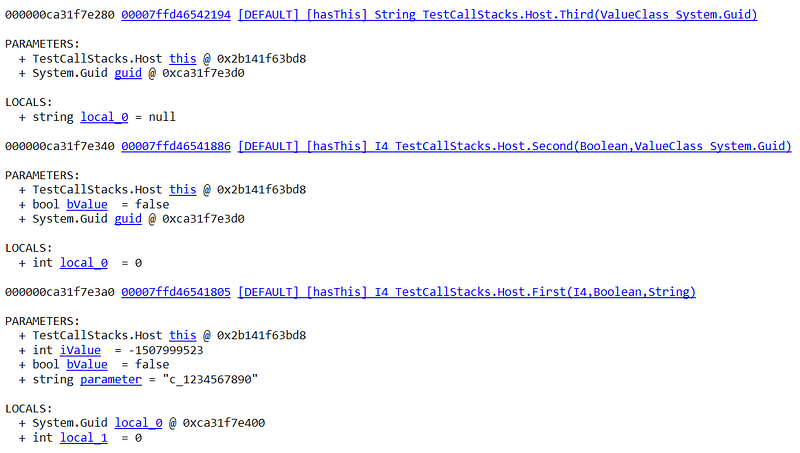
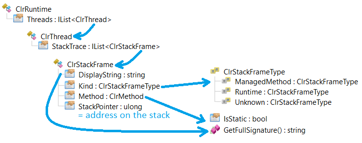
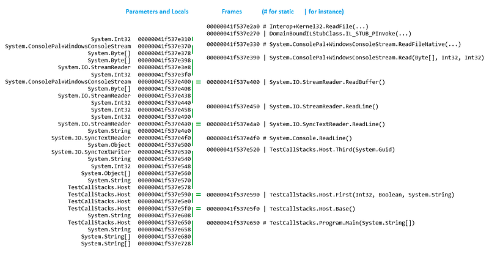
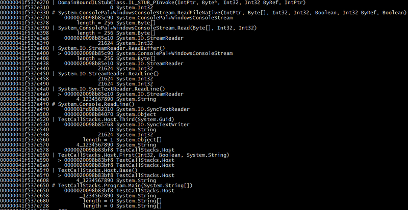

---

This post of the series details how to look into your threads stack with ClrMD.

## Introduction

It’s been a long time (see the resources at the end) since I’ve been discussing what ClrMD could bring to .NET developers/DevOps! My colleague [Kevin](https://twitter.com/KooKiz) just wrote [an article about how to emulate SOS **DumpStackObjects**](https://medium.com/@kevingosse/dumping-stack-objects-with-clrmd-c002dab4651b) command both on Windows and Linux with ClrMD. This implementation lists the objects on the stack but without their values (like strings content for example) nor the stack frames corresponding to the method calls.

The rest of the post will show you, with ClrMD, how to get an higher view, closer to what the SOS **ClrStack** command could provide.

Let’s take this simple application as an example:

```csharp
class Program
{
    static void Main(string[] args)
    {
        Host h = new Host();
        h.Base();
    }
}

class Host
{
    public void Base()
    {
        int iValue = Guid.NewGuid().GetHashCode();
        bool bValue = (iValue % 2) == 0;
        string parameter = Guid.NewGuid().ToString().Substring(0,1) + "_1234567890";

        Console.WriteLine(parameter + " = " + First(iValue, bValue, parameter));
    }

    private int First(int iValue, bool bValue, string parameter)
    {
        Guid guid = Guid.NewGuid();
        return Second(bValue, guid) / 2;
    }

    private int Second(bool bValue, Guid guid)
    {
        return Third(guid).Length;
    }

    private string Third(Guid guid)
    {
        Console.WriteLine($"call   procdump -ma {Process.GetCurrentProcess().Id}");
        Console.ReadLine();
        return $"{guid.GetHashCode()}#{guid.GetHashCode()}#{guid.GetHashCode()}";
    }
}
```

As you can see, I’ve mixed value and reference types as parameters and local variables up to the call to the `Third` method that displays the [**procdump**](https://docs.microsoft.com/en-us/sysinternals/downloads/procdump) command line to execute in order to generate a memory dump of the process.

## Use WinDBG + SOS Luke!

When you open it with WinDBG and load SOS, here is the result of the **dso** command:



The **clrstack** command shows the stacked method calls:



And if you use the **-a** parameter, you will get methods with their parameters and local variables (or **-p** for parameters only and **-l** for local variables only):



It is weird that SOS implementation does not give the type of both the parameters and locals. But wait! While researching for this post, I looked at the SOS implementation (now in the strike.cs file moved from the **coreclr** to the **diagnostics** repository) to [find this nice comment](https://github.com/dotnet/diagnostics/blob/master/src/SOS/Strike/strike.cpp#L13165):



So I tried **clrstack** with **-i** and I got the types for parameters (and locals unlike what the comments implies):



Even though **clrstack** supports the **-all** flag to dump the call stack of all managed threads, you might need to do your own automatic analysis on hundreds of threads and this is where ClrMD shines.

## Merging methods and parameters/locals

When I read Kevin’s post, I immediately thought about adding the method call on the stack based on the [work I’ve done in March 2019](https://github.com/chrisnas/DebuggingExtensions/commit/4061a2c885241edd2bf964db9b7af94fc7dcd778) to implement the [pstacks tool](https://github.com/chrisnas/DebuggingExtensions/releases/download/1.6.3/pstacks1.3.zip). At that time, my goal was to aggregate the call stacks of a large number of threads in order to find out pattern of blocked threads, sharing the “same” call stacks. Visual Studio provides a great “Parallel Stacks” pane but I needed it for both Windows and Linux.

To list all the call stack with ClrMD, you [simply](https://github.com/chrisnas/DebuggingExtensions/blob/master/src/ParallelStacks.Runtime/ParallelStack.cs#L11) enumerate the managed threads and for each one, its `StackTrace` property contains the list of `StackFrame` objects corresponding to each method call.



The `StackPointer` property of each frame contains the address of the frame in the call stack, allowing a mapping of the method call with its parameters and locals:



As always with stacks, lower addresses correspond to the last things added to the stack (i.e. last called method). While checking between what is shown by SOS, the parameters/locals addresses and frame stack pointers, you realize that all objects at an address in the stack equal or below the `StackPointer` of a frame are either parameters or local variables of the frame method.

Even better, for non static method, you can guess what is the ***this**** *implicit parameter if the address is the same as the frame `StackPointer`; shown with the green **=** sign in the previous screenshot and prefixed by **>** in Kevin’s updated code that merges the method calls to the parameters and locals:

```csharp
for (ulong ptr = stackTop; ptr <= stackLimit; ptr += (ulong)runtime.PointerSize)
{
    // look for the frame corresponding to the current position in the stack
    if (currentFrame.StackPointer <= ptr)
    {
        Console.WriteLine(FormatFrame(currentFrame));

        nFrame++;
        if (nFrame < frames.Count)
        {
            currentFrame = frames[nFrame];
        }
        else
        {
            break;
        }
    }

    ulong obj;
    if (!runtime.ReadPointer(ptr, out obj))
    {
        break;
    }

    if (!IsInHeap(heap, obj))
    {
        continue;
    }

    var type = heap.GetObjectType(obj);
    if (type == null || type.IsFree)
    {
        continue;
    }

    // try to find implicit "this" parameter in case of non-static method
    var myFrame = (nFrame == 0) ? currentFrame : frames[nFrame-1];
    separator = ((myFrame.StackPointer == ptr) &&
                 (myFrame.Method != null) &&
                 (!myFrame.Method.IsStatic))
        ? ">" 
        : " ";
    Console.Write($"{ptr:x16}   {separator} ");
    DumpObject(heap, type, (ulong)obj);

}
```

The `FormatFrame` helper method simply prefix static methods with **#** instead of **|** for instance methods:

Unfortunately, I did not find any way with ClrMD to make the difference between parameters and locals. Based on what you can see in SOS implementation [of this part](https://github.com/dotnet/diagnostics/blob/master/src/SOS/Strike/strike.cpp#L12916) of the **clrstack** command, it relies on the `EnumerateArguments` and `EnumetateLocalVariables` methods of `ICorDebugILFrame` which is not exposed by ClrMD. There is another undocumented implementation based on [private interfaces](https://github.com/dotnet/coreclr/blob/master/src/pal/prebuilt/inc/xclrdata.h#L6067) I could not leverage neither. For a larger discussion around stack walking in .NET, read [this great post](https://mattwarren.org/2019/01/21/Stackwalking-in-the-.NET-Runtime/) by Matt Warren.

Also, without any explicit access to specific parameter or local, I did not find a way to get the value of primitive and value type instances stored on the stack. However, it is still possible to get them for boxed ones and reference type instances such as string for example.

## Getting instances from the stack

In the last code excerpt, I did not describe the `DumpObject` helper method used to display an object on the stack. The implementation provided by Kevin was used to show the address and the type of the object:

```csharp
Console.WriteLine($"{objAddress:x16} {type.Name}");
```

The next step would be to display value for primitive types such as numbers, boolean, string and even array size:

```csharp
private static void DumpObject(ClrHeap heap, ClrType type, ulong objAddress)
{
    // get value for simple types
    string valueOrAddress = 
        (type.Name == "System.Char") ? $"{type.GetValue(objAddress),16}" :
        (type.Name == "System.String") ? $"{FormatString(type.GetValue(objAddress).ToString())}" :
        (type.Name == "System.Bool") ? $"{FormatString(((bool)type.GetValue(objAddress)).ToString())}" :
        (type.Name == "System.Byte") ? $"{FormatString(((byte)type.GetValue(objAddress)).ToString())}" :
        (type.Name == "System.SByte") ? $"{FormatString(((sbyte)type.GetValue(objAddress)).ToString())}" :
        (type.Name == "System.Decimal") ? $"{FormatString(((decimal)type.GetValue(objAddress)).ToString())}" :
        (type.Name == "System.Double") ? $"{FormatString(((double)type.GetValue(objAddress)).ToString())}" :
        (type.Name == "System.Single") ? $"{FormatString(((float)type.GetValue(objAddress)).ToString())}" :
        (type.Name == "System.Int32") ? $"{FormatString(((int)type.GetValue(objAddress)).ToString())}" :
        (type.Name == "System.SInt32") ? $"{FormatString(((uint)type.GetValue(objAddress)).ToString())}" :
        (type.Name == "System.Int64") ? $"{FormatString(((long)type.GetValue(objAddress)).ToString())}" :
        (type.Name == "System.SInt64") ? $"{FormatString(((ulong)type.GetValue(objAddress)).ToString())}" :
        (type.IsArray) ? $"{FormatString(GetArrayAsString(type, objAddress))}" :
        $"{objAddress:x16}";  // work also for IntPtr
    Console.WriteLine($"{valueOrAddress} {type.Name}");
}
```

Most of this code is based on the `GetValue` helper from `ClrType`: it returns the right “thing” for simple types. Look at ClrMD [implementation details](https://github.com/microsoft/clrmd/blob/c35e2115241e7dc6f9c835b4c59b9e396ec6471b/src/Microsoft.Diagnostics.Runtime/src/Implementation/ValueReader.cs#L33) to get a better understanding of how the value is rebuilt.

The `GetArrayAsString` simply returns the number of elements in the array:

```csharp
private static string GetArrayAsString(ClrType type, ulong objAddress)
{
    var elementCount = type.GetArrayLength(objAddress);
    return $"length = {elementCount}";
}
```

And the call stack is now complete!



Note that you may even get more locals or parameters than with WinDBG+SOS but don’t ask me why…

For more advanced object formatting cases such as dumping structs or enumerating fields and their value, I would highly recommend to look at the related [ClrMD documentation page](https://github.com/microsoft/dotnet-samples/blob/master/Microsoft.Diagnostics.Runtime/CLRMD/docs/TypesAndFields.md) (just replace `GCHeapType` by `ClrType` and you’ll be safe).

## Resources

- [Dumping stack objects with ClrMD](https://medium.com/@kevingosse/dumping-stack-objects-with-clrmd-c002dab4651b) by [Kevin Gosse](https://twitter.com/KooKiz)
- [Stack walking in the .NET Runtime](https://mattwarren.org/2019/01/21/Stackwalking-in-the-.NET-Runtime/) by [Matt Warren](https://twitter.com/matthewwarren)
- Part 1: [Bootstrap ClrMD to load a dump](http://labs.criteo.com/2017/02/going-beyond-sos-clrmd-part-1).
- Part 2: [Find duplicated strings with ClrMD heap traversing](http://labs.criteo.com/2017/03/clrmd-part-2-clrruntime-clrheap-traverse-managed-heap/).
- Part 3: [List timers by following static fields links](http://labs.criteo.com/2017/04/clrmd-part-3-dea…s-to-list-timers/).
- Part 4: [Identify timers callback and other properties](http://labs.criteo.com/2017/05/clrmd-part-4-callbacks-called-timers/).
- Part 5: [Use ClrMD to extend SOS in WinDBG](http://labs.criteo.com/2017/06/clrmd-part-5-how-to-use-clrmd-to-extend-sos-in-windbg/).
- Part 6: [Manipulate memory structures like real objects](http://labs.criteo.com/2017/08/clrmd-part-6-manipulate-memory-structures-like-real-objects/).
- Part 7: [Manipulate nested structs using dynamic](http://labs.criteo.com/2017/08/clrmd-part-7-manipulate-nested-structs-using-dynamic/).
- Part 8: [Spelunking inside the .NET Thread Pool](http://labs.criteo.com/2017/11/clrmd-part-8-spelunking-inside-the-net-thread-pool/)
- Part 9: [Deciphering Tasks and Thread Pool items](https://labs.criteo.com/2017/12/clrmd-part-9-deciphering-tasks-thread-pool-items/)
