---


## Introduction

Last Wednesday was a great day for [Kevin](https://twitter.com/KooKiz) and myself: We spent a lot of time investigating the reasons why a test was failing. Let’s share with you these frustrating but interesting minutes.

One of our colleagues came to us because an integration test would get stuck in some specific conditions. Here is the simplified code of the service that is supposed to do some background processing until it is stopped:

```csharp
public class Service
{
    private CancellationTokenSource _cancellationSource;
    private Task _backgroundProcessing;
    private Task _cleanup;

    ...
}
```

In the test, the service is created: Two `Task` instances are created in the constructor (for background processing irrelevant for this discussion) that (1) are started when the service starts and (2) are canceled when the service is stopped. A `CancellationTokenSource` is used to cancel the tasks if needed.

```csharp
public Service()
{
    _cancellationSource = new CancellationTokenSource();
    var cancellationToken = _cancellationSource.Token;
    _backgroundProcessing = new Task(DoStuffInTheBackground,
        cancellationToken, TaskCreationOptions.LongRunning);
    _cleanup = new Task(DoStuffInTheBackground, 
        cancellationToken, TaskCreationOptions.LongRunning);
}
```

However, in the specific conditions of this test, the `Start` method would never be called, skipping straight to the `Stop` method.

```csharp
public void Start()
{
    _backgroundProcessing.Start();
    _cleanup.Start();
}

public async Task Stop()
{
    _cancellationSource.Cancel();
    await _backgroundProcessing;
    await _cleanup;
}
```

The task is never started because the test skips the `Service.Start()` method, but it should transition to “Cancelled” state as soon as the `CancellationTokenSource` associated with the `CancellationToken` passed to the `Task` gets canceled. In that particular situation, we expect the `await _backgroundProcessing` code to immediately return in the `Stop()` method.

In our colleague Visual Studio, the debugger never came back from `await _backgroundProcessing`, indicating that the task never completed…

## Reproduce the problem

I wanted to un-validate any side effect related to our test framework or custom Criteo libraries and confirm my understanding of task cancellation, so I wrote a small Console application with the same 4.7.2 version of .NET Framework with the following code:

```csharp
static async Task ReproduceWorking()
{
    var source = new CancellationTokenSource();
    var token = source.Token;
    var t = new Task(
        () => Console.WriteLine("Done"), token, TaskCreationOptions.LongRunning);

    source.Cancel();

    try
    {
        await t;
    }
    catch (TaskCanceledException x)
    {
        Console.WriteLine(x.ToString());
    }
}
```

And guess what?
I got the expected `TaskCancellationException`:

> System.Threading.Tasks.TaskCanceledException: A task was canceled.
at System.Runtime.CompilerServices.TaskAwaiter.ThrowForNonSuccess(Task task)
at System.Runtime.CompilerServices.TaskAwaiter.HandleNonSuccessAndDebuggerNotification(Task task)
at System.Runtime.CompilerServices.TaskAwaiter.GetResult()
at TaskCancellation.Program.d__2.MoveNext()

The next step was to double-check the understanding of how tasks are working related to cancellation. So I set a breakpoint after the task is instantiated

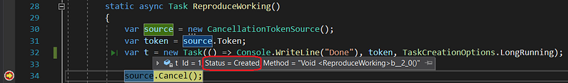

And its status is **Created**.

Doing the same after `Cancel()` is called on the `CancellationTokenSource`, gives the expected **Canceled** status.

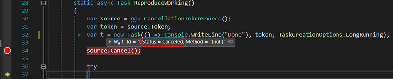

So, let’s do the same when debugging the test code:

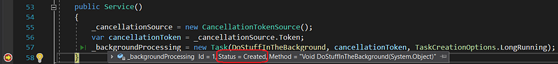

It gives the same **Created** status after the task creation but after canceling the source:

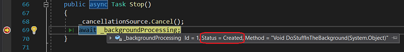

…the status does not switch to **Canceled** like in my Console repro!

## Looking for cancellation

The only thing that came to my mind was: maybe the cancellation token is not taken into account. However, a `CancellationToken` is just a struct that keeps a reference to its `CancellationTokenSource`. It should be easy in Visual Studio debugger to double-check that our task keeps track of the token somewhere and goes back to the cancellation source. Well… the token is not kept as a field of the task but stored inside the `m_contingentProperties` field [deep during the task construction code path](https://referencesource.microsoft.com/#mscorlib/system/threading/Tasks/Task.cs,674).

Let’s look at the value in the **Quick Watch** after the cancellation source gets canceled:

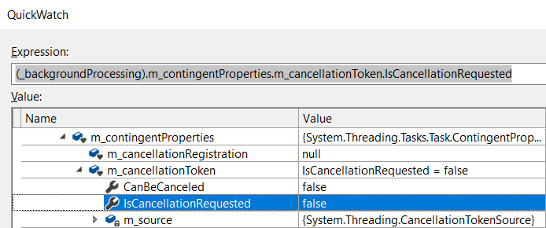

It sounds like the cancellation token is not canceled… But if we look at the source `Token` property of our canceled `CancellationTokenSource`,

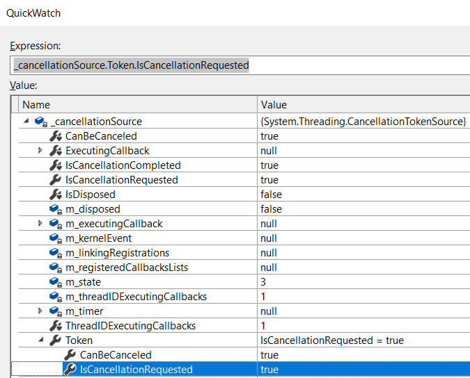

we don’t have the same value for `IsCancellationRequested`!

It’s like we don’t look at the same cancellation source… To find out, we just have to compare the reference to our `CancellationTokenSource` with the one we see in the `m_contingentProperties` token of the task. To achieve that, we could copy the expression from QuickWatch, paste it into the **Debug | Windows | Memory…** pane and press ENTER to get the address where the object is stored in memory

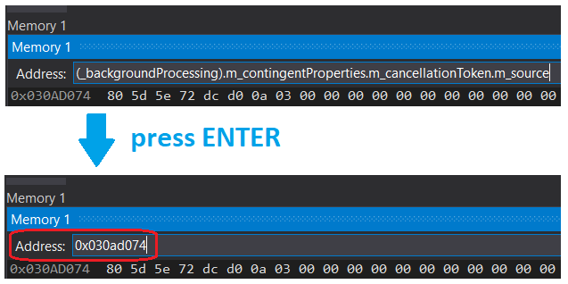

After having done the same with `_cancellationSource`, I did not get the same address:

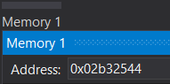

It means that we were dealing with two different instances of `CancellationTokenSource`.

But this might be too C++ish for you… Kevin prefers leveraging the *Make Object ID* feature of the C# debugger. You simply right-click the Data Tip of the cancellation source and select **Make Object ID**:

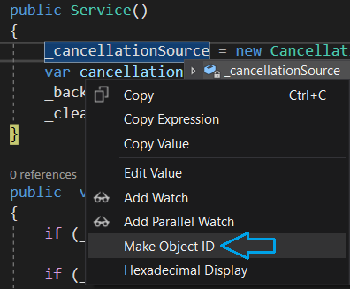

Once this is done, a numeric identifier is displayed for this instance in Data Tip and any Watch window (#1 in this screenshot):

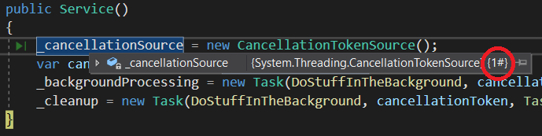

When we looked at the cancellation source of the token stored by the task,

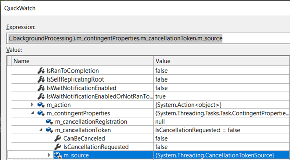

we didn’t see any ID so it was not the same object.

So we decided to use Make Object ID on this `m_source` that became marked as #2.

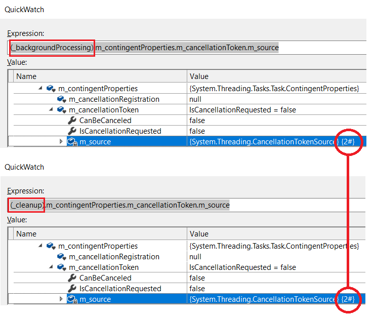

And when we looked at the `m_source` of the second cleanup `Task`, we realized that it was the same object but not the one we created!

We started to think that we were becoming crazy. So, let’s restart from the beginning and follow the `CancellationTokenSource` from its creation because we are sure that we passed a valid cancellation token (linked to this source) to the task constructor. Or… Did we? The QuickWatch gives a different answer just after the task gets created compared to what we’ve seen already: a token with an empty source property now!

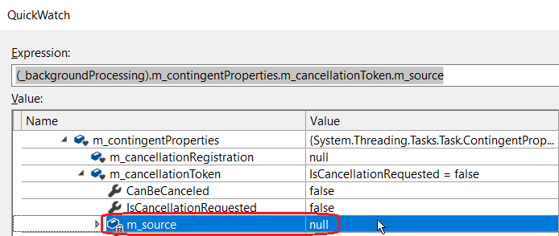

I closed the QuickWatch pane and reopened it for Kevin to confirm. And like in a nightmare, the source was not null anymore…

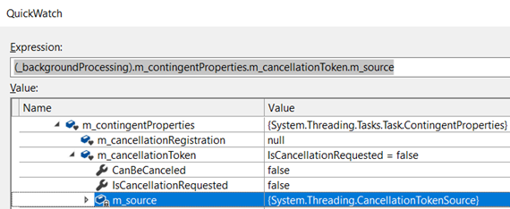

Visual Studio must be responsible for that weird behavior!

Kevin remembered the *”Enable property evaluation”* settings in the Options dialog. If it is checked (which is the default), it means that the Debugger would fetch the value of an instance field and then call the Getter of each property in order to display its value.

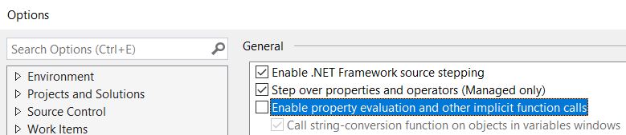

However, if you uncheck it, only the fields are displayed. So in our case, we then always got a null `m_contingentProperties` field (and, as expected, all property would not be displayed):

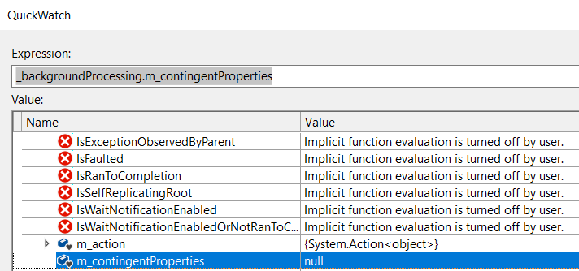

The `m_contingentProperties` is initialized in `EnsureContingentPropertiesInitialized()` when called by `AssignCancellationToken()` from the `TaskContructorCore()` helper used by the `Task` constructor but it did not seem to be the case because it was definitively **null**…

Kevin decided to stop at the `CancellationTokenSource` constructor with a new breakpoint (more on how to set a breakpoint on a .NET Framework method soon) to see where the one shown in the Debugger was created but the breakpoint was never hit. So the `CancellationTokenSource` #2 must have been created even before our own was created by our code. In fact, a static `CancellationTokenSource` is created and is set to `m_source` when `InitializeDefaultSource()` gets called by one of the Getter. This explains why we saw the same instance #2 in both tasks token.

To sum up, we were now sure that the passed token was not “received” by the `Task`.

## Eureka!

Maybe there is a magic trick done by the .NET Framework to lazily set the token source after the creation of the task. However, we did not find such a code in [the .NET Framework](https://referencesource.microsoft.com/#mscorlib/system/threading/Tasks/Task.cs) and this is not what we see in our repro.

Back to the basics: are we sure that we are executing the code we think is executed? We looked for mscorlib in the **Debug | Windows | Modules** pane,

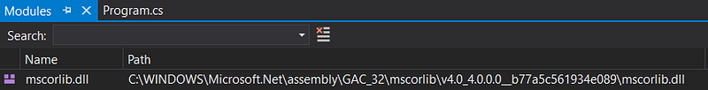

and we opened it with a decompiler: the code of the methods called during the `Task`** **construction was the same as the one shown in [https://referencesource.microsoft.com/#mscorlib/system/threading/Tasks/Task.cs](https://referencesource.microsoft.com/#mscorlib/system/threading/Tasks/Task.cs).

Next, in order to better follow the execution and the passing of parameters (including our token), we decided to set breakpoints on `Task` [private method responsible](https://referencesource.microsoft.com/#mscorlib/system/threading/Tasks/Task.cs,590) for its initialization.

```
internal void TaskConstructorCore(object action, object state, CancellationToken cancellationToken, TaskCreationOptions creationOptions, InternalTaskOptions internalOptions, TaskScheduler scheduler)
```

In the **Debug | Windows | Breakpoints** pane, click **New** | **Function Breakpoint…**

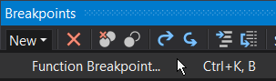

and type the full name of the method. This is working even for a method of a class defined in the .NET Framework assembly for which you do not have the source code:

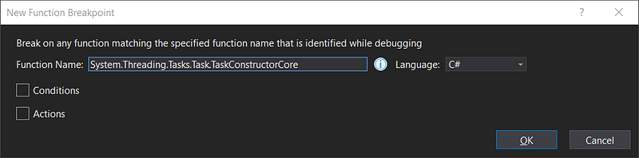

We checked that the breakpoints were well set (i.e. no typo in the full name) by looking at the filled red circle:

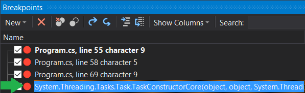

The `cancellationToken` parameter should contain the token that we passed at `Task` creation. Unfortunately, the QuickWatch pane displayed a “cannot read memory” error that we never saw in Visual Studio before!

At that time, we thought we were doomed but we looked at the **Call Stack** pane and we realized that the code was calling [the wrong **Task** constructor](https://referencesource.microsoft.com/#mscorlib/system/threading/Tasks/Task.cs,505):

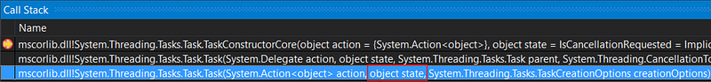

```
public Task(Action<object> action, object state, TaskCreationOptions creationOptions)
```

Its signature is compatible with our code:

```
_backgroundProcessing = new Task(DoStuffInTheBackground, cancellationToken, TaskCreationOptions.LongRunning);
```

and this is why the compiler did not complain.

Our `CancellationToken` was passed as the `state` parameter is given directly to our `DoStuffInTheBackground Action`: the created `Task` had no idea that it was supposed to be its `CancellationToken`.

Note that if we had noticed the **Auto Completion** (Ctrl + Shift + Space) hint, we might have figured out the root cause much sooner…

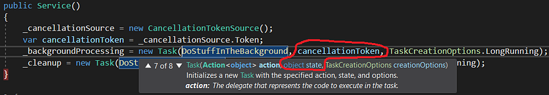

The fix was straightforward; just using [the right constructor](https://referencesource.microsoft.com/#mscorlib/system/threading/Tasks/Task.cs,533):

```
public Task(Action<object> action, object state, CancellationToken cancellationToken, TaskCreationOptions creationOptions)
```

that accepts both a state for the callback and a `CancellationToken` for the `Task` to create:

```
_backgroundProcessing = new Task(DoStuffInTheBackground, cancellationToken, cancellationToken, TaskCreationOptions.LongRunning);
```

Under the debugger, we validated that the source was now the expected one:

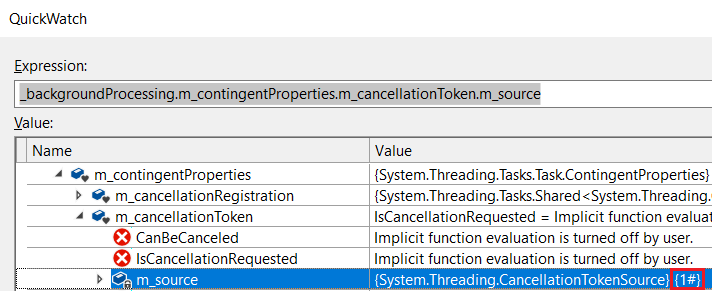

and the test did not hang anymore.

If, from the beginning, we would have been able to step into .NET Framework compiled code as we do with Jetbrains Resharper integration in Visual Studio, we would have found the issue almost immediately. Thankfully, Microsoft has just announced [decompilation of C# code made easy with Visual Studio](https://devblogs.microsoft.com/visualstudio/decompilation-of-c-code-made-easy-with-visual-studio?WT.mc_id=DT-MVP-5003325).

We wish we had it last Wednesday…

---

**Interested in reading more about Christophe’s & Kevin’s work? Check out their latest articles:**

[**Build your own .NET memory profiler in C#**
*This post explains how to collect allocation details by writing your own memory profiler in C#.*medium.com](https://medium.com/criteo-labs/build-your-own-net-memory-profiler-in-c-allocations-1-2-9c9f0c86cefd)[](https://medium.com/criteo-labs/build-your-own-net-memory-profiler-in-c-allocations-1-2-9c9f0c86cefd)[**Switching back to the UI thread in WPF/UWP, in modern C#**
*Leveraging the async machinery to transparently switch to the UI thread when needed*medium.com](https://medium.com/criteo-labs/switching-back-to-the-ui-thread-in-wpf-uwp-in-modern-c-5dc1cc8efa5e)[](https://medium.com/criteo-labs/switching-back-to-the-ui-thread-in-wpf-uwp-in-modern-c-5dc1cc8efa5e)

---

**If you are looking for a change and would love to work with these two, head over to our careers page and let us know if there is something that sounds like you!**

[**Product, Research & Development | Criteo Careers**
*Come and meet our teams …*careers.criteo.com](https://careers.criteo.com/working-in-R&D)[](https://careers.criteo.com/working-in-R&D)
