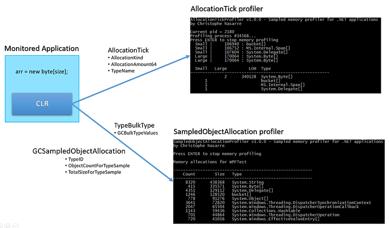
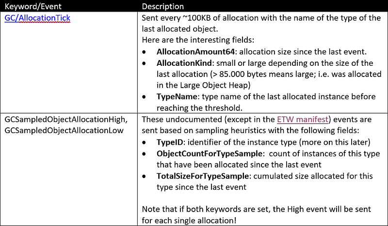
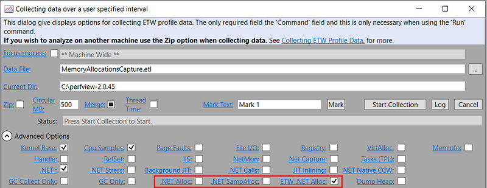
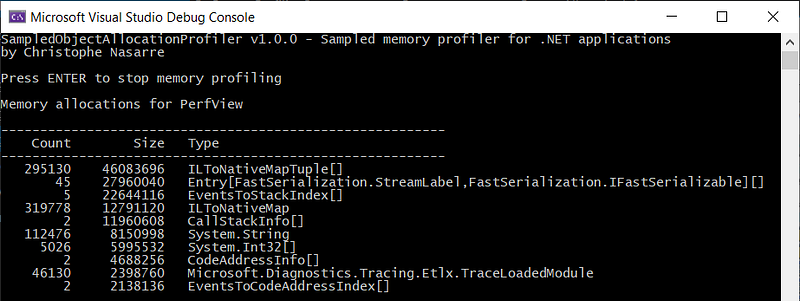

---

In a [previous post](/posts/2019-05-28_spying-on-net-garbage/), I explained how to get statistics about the .NET Garbage Collector such as suspension time or generation sizes. But what if you would need more details about your application allocations such as how many times instances of a given type were allocated and for what cumulated size or even the allocation rate? This post explains how to get access to such information by writing your own memory profiler. The next one will show how to collect each sampled allocation stack trace.

## Introduction

I have already used commercial tools to get detailed information about allocated type instances in an application; Visual Studio Profiler, dotTrace, ANTS memory profiler, or Perfview to name a few. With these tools in mind, I started to look at the .NET profiler API documentation and it reminded me the first time I read about the .NET profiler API. It was in December 2001 in [Matt Pietrek’s MSDN Magazine article](https://docs.microsoft.com/en-us/archive/msdn-magazine/2001/december/under-the-hood-the-net-profiling-api-and-the-dnprofiler-tool?WT.mc_id=DT-MVP-5003325) (I still have the paper version). When your application is starting, based on an environment variable, the .NET Framework (and now .NET Core) runtime is loading a profiler COM object that implements a specific [**ICorProfilerCallback**](https://docs.microsoft.com/en-us/dotnet/framework/unmanaged-api/profiling/icorprofilercallback9-interface?WT.mc_id=DT-MVP-5003325) interface (today, runtimes are supporting the 9th version **ICorProfilerCallback9** interface). The methods of this interface will be called by the runtime at specific moments during the application lifetime. For example, the [**ObjectAllocated**](https://docs.microsoft.com/en-us/dotnet/framework/unmanaged-api/profiling/icorprofilercallback-objectallocated-method?WT.mc_id=DT-MVP-5003325) method is called each time an instance of a class is allocated: perfect for the job but it requires going back to COM and writing native code. Don’t be scared: I won’t go that way :^)

*However, if you would like to get more details about writing your own .NET profiler in C or C++, I would recommend looking at the Microsoft ClrProfiler *[*initial .NET Framework implementation*](https://github.com/microsoftarchive/clrprofiler/tree/master/CLRProfiler)* and also Pavel Yosifovich DotNext session about *[*Writing a .NET Core cross platform profiler in an hour*](https://www.youtube.com/watch?v=TqS4OEWn6hQ)* with the corresponding (more recent and cross platform) *[*source code*](https://github.com/zodiacon/DotNextMoscow2019)*.*

Instead, several events that are emitted by the CLR are providing interesting details:





The **GCSampledObjectAllocation** events payload provides a type ID instead of a plain text type name. In order to retrieve the type name given its ID, we need to listen to **TypeBulkType** event that contains the mapping as I described in [my post about finalizers](https://labs.criteo.com/2018/09/monitor-finalizers-contention-and-threads-in-your-application/). This is why the last two **GCHeapAndTypeNames** and **Type** keywords are needed.

Remember that if both **GCSampledObjectAllocationLow** and **GCSampledObjectAllocationHigh** keywords are set, an event will be received for EACH allocation. This could be a performance issue both for the monitored application and the profiler. I would recommend starting with either low or high (more on this later).

Last but not least, enabling at least one of these keywords is also [switching the CLR to use “slower” allocators](https://github.com/dotnet/runtime/blob/fcd862e06413a000f9cafa9d2f359226c60b9b42/src/coreclr/src/vm/jitinterfacegen.cpp#L69). This is why you should check that it does not impact your application performance. These slower allocators are also used when your **ICorProfilerCallback.Initialize** method calls **SetEventMask** with **COR_PRF_ENABLE_OBJECT_ALLOCATED** flag to receive allocation notifications.

When you use [Perfview](https://github.com/Microsoft/perfview/releases) for memory investigation, you are relying on these events without knowing it. In the Collect/Run dialog, three checkboxes are defining how to get the memory profiling details:



- *.NET Alloc*: use a custom native C++ **ICorProfilerCallback** implementation (noticeable impact on the profiled application performance).
- *.NET SampAlloc*: use the same custom native profiler but with sampled events.
- *ETW .NET Alloc*: use **GCSampledObjectAllocationHigh** events

In all cases, the profiled application needs to be started after the collection begins.

## How to listen to allocation events

As I have already explained in previous posts, the Microsoft [**TraceEvent** nuget](https://www.nuget.org/packages/Microsoft.Diagnostics.Tracing.TraceEvent/) helps you listening to CLR events. First, you create a **TraceEventSession** and setup the providers you want to receive events from:

```csharp
session.EnableProvider(
    ClrTraceEventParser.ProviderGuid,
    TraceEventLevel.Verbose,    // this is needed in order to receive AllocationTick_V2 event
    (ulong)(

    // required to receive AllocationTick events
    ClrTraceEventParser.Keywords.GC |

    // the CLR source code indicates that the provider must be set before the monitored application starts
    ClrTraceEventParser.Keywords.GCSampledObjectAllocationLow | 
    //ClrTraceEventParser.Keywords.GCSampledObjectAllocationHigh | 

    // required to receive the BulkType events that allows 
    // mapping between the type ID received in the allocation events
    ClrTraceEventParser.Keywords.GCHeapAndTypeNames |   
    ClrTraceEventParser.Keywords.Type |
);
```

Second, you set up the handlers for the events you are interested in:

```csharp
private void SetupListeners(TraceLogEventSource source)
{
    source.Clr.GCAllocationTick += OnAllocationTick;

    source.Clr.GCSampledObjectAllocation += OnSampleObjectAllocation;

    // required to receive the mapping between type ID (received in GCSampledObjectAllocation)
    // and their name (received in TypeBulkType)
    source.Clr.TypeBulkType += OnTypeBulkType;
}
```

And lastly, the processing of received events is done in a dedicated thread until the session is disposed of:

```csharp
await Task.Factory.StartNew(() =>
{
    using (_session)
    {
        SetupProviders(_session);
        SetupListeners(_session.Source);
        
        _session.Source.Process();
    }
});
```

Now let’s see the difference between the two sets of events.

## The AllocationTick way

My first idea was to use the **AllocationTick** event because it seemed easy: one sampled event with a size, a type name, and LOH/ephemeral kind. However, how this sampling works makes it impossible to get an exact per type allocated size. Let’s have a look at this list of events received from a WPF test application:

```
Small | 105444 : FreezableContextPair[]
Small | 111908 : FreezableContextPair[]
Small | 106720 : System.String
Small | 102488 : System.String
Small | 107028 : System.TimeSpan[]
Small | 106100 : System.String
```

All allocations were s**mall** (i.e. not in the LOH: < 85.000 bytes) and the second column gives the cumulated size of all allocations to reach the 100 KB threshold but not for this particular type! There is no easy way to make a valid guess of the specific last allocation size for which we get the type name.

For example, the first array of **FreezableContextPair** triggered the event for a cumulated size of 105.444 bytes. But how big was this array? We don’t know: could have been 100.000 because only 5444 bytes were allocated before or only 10444 bytes because 95.000 were allocated before. It would have been so useful that the size of the last allocated object would be passed in the event payload…

It is a little bit different (but not that better) for objects allocated in LOH because they have to be at least 85.000 bytes long. For example, allocate 4-byte arrays, each one 85.000 bytes long and let’s see the corresponding events:

```
Large | 170064 : System.Byte[]
Large | 170064 : System.Byte[]
```

Two **AllocationTick** events are received with 170064 as cumulated size. Still hard to figure out what was the size of the last allocated array: the only thing we know is that it was larger (or equal) to 85.000 bytes because it was allocated in LOH.

For larger objects, it might seem a little bit more accurate. Let’s allocate 2 byte arrays, each one 110.000 bytes long:

```
Large | 195064 : System.Byte[]
Large | 110032 : System.Byte[]
```

There are ~85.000 bytes difference between the two events even though the same 110.000 bytes were allocated. You could remove 85.000 bytes from the value and have an approximation of the LOH allocated object: the larger the allocation the less the error. But still: could be 85.000 size error…

So we won’t be able to rely on the size provided by the **AllocationTick** event; only the type name. In addition, you get a view of objects allocated in LOH. Maybe the other events will provide better results.

## The GCSampledObjectAllocation way

When an object is allocated by the GC allocator, a **GCSampledObjectAllocation** event is emitted under certain conditions:

- Both **GCSampledObjectAllocationLow** and **GCSampledObjectAllocationHigh** keywords are set on the CLR provider,
- The object size is larger than 10.000 bytes,
- At least 1000 instances of the type have been allocated,
- Just before the application exits, current statistics for all types [are flushed](https://github.com/dotnet/runtime/blob/61ec7c7bdacb70ffd51dece09e30179f86156a0d/src/coreclr/src/vm/eventtrace.cpp#L3668),
- A [complicated piece of code](https://github.com/dotnet/runtime/blob/61ec7c7bdacb70ffd51dece09e30179f86156a0d/src/coreclr/src/vm/eventtrace.cpp#L3067) decides based on time since the last event and the type allocation rate.

Picking one or the other keyword [changes the maximum number of milliseconds between two events](https://github.com/dotnet/runtime/blob/61ec7c7bdacb70ffd51dece09e30179f86156a0d/src/coreclr/src/vm/eventtrace.cpp#L2902) for a given type:

- High (10 ms) : 100 events / second
- Low (200 ms) : 5 events / second

You should use low or high depending on the monitored application memory allocation workload to avoid impacting too much the profiler (and even the monitored application performance)

The interesting feature of these events is that, for a given type, the payload contains both the number of allocated instances since the last event and the cumulated size of these instances. Let’s take the same allocation of 4 arrays of byte, each 85000 long:

```
226 | 103616 : System.Byte[]
  1 |  85012 : System.Byte[]
  1 |  85012 : System.Byte[]
  1 |  85012 : System.Byte[]
```

This time, we get the exact count in the first column (**ObjectCountForTypeSample**) and the exact cumulated size in the second column (**TotalSizeForTypeSample**). If the count is 1, we have the exact size of that allocation and if it is bigger than 85000 bytes, we know it has been allocated in the LOH. Same accuracy for the 2-byte array of 110.000 elements:

```
198 | 123552 : System.Byte[]
  1 | 110012 : System.Byte[]
```

Sounds good. However, you have to remember that profiled applications need to be started after the session was created: it means that you can’t write a tool that will listen to a specific process ID like with **AllocationTick**. Three dictionaries are used by **PerProcessProfilingState** to keep track of per type allocations, type ID mappings, and process names:

```csharp
public class PerProcessProfilingState
{
    private readonly Dictionary<int, string> _processNames = new Dictionary<int, string>();
    private readonly Dictionary<int, ProcessTypeMapping> _perProcessTypes = new Dictionary<int, ProcessTypeMapping>();
    private readonly Dictionary<int, ProcessAllocationInfo> _perProcessAllocations = new Dictionary<int, ProcessAllocationInfo>();

    public Dictionary<int, string> Names => _processNames;
    public Dictionary<int, ProcessTypeMapping> Types => _perProcessTypes;
    public Dictionary<int, ProcessAllocationInfo> Allocations => _perProcessAllocations;
}
```

The **SampledObjectAllocationMemoryProfiler** class uses it for the events processing:

```csharp
public class SampledObjectAllocationMemoryProfiler
{
    private readonly TraceEventSession _session;
    private readonly PerProcessProfilingState _processes;
    
    // because we are not interested in self monitoring
    private readonly int _currentPid;

    private int _started = 0;

    public SampledObjectAllocationMemoryProfiler(TraceEventSession session, PerProcessProfilingState processes)
    {
        _session = session;
        _processes = processes;
        _currentPid = Process.GetCurrentProcess().Id;
    }
```

The constructor of the profiler keeps track of its own process ID in **_currentPid** to skip its own events.

## Gathering type mapping

The processing of **TypeBulkType** events is quite straightforward: store the type ID/name association into a per-process dictionary:

```csharp
private void OnTypeBulkType(GCBulkTypeTraceData data)
{
    if (FilterOutEvent(data)) return;

    ProcessTypeMapping mapping = GetProcessTypesMapping(data.ProcessID);
    for (int currentType = 0; currentType < data.Count; currentType++)
    {
        GCBulkTypeValues value = data.Values(currentType);
        mapping[value.TypeID] = value.TypeName;
    }
}

private ProcessTypeMapping GetProcessTypesMapping(int pid)
{
    ProcessTypeMapping mapping;
    if (!_processes.Types.TryGetValue(pid, out mapping))
    {
        AssociateProcess(pid);

        mapping = new ProcessTypeMapping(pid);
        _processes.Types[pid] = mapping;
    }
    return mapping;
}
```

Remember that I choose to skip events from the current process detected by **FilterOutEvent()**.

## How to get process names

Even though each event contains the ID of the emitting process, it would be better to display its name instead. You could use **Process.GetProcessById(pid).ProcessName** when analyzing the details but the process might be long gone at that time.

Another solution would be to enable the Kernel ETW provider and listen to the **ProcessStart** event. The **ImageFileName** field of the payload contains the process filename with the extension. However, it is obviously not working on Linux.

The easiest solution is to use **GetProcessById** but just when you receive the first type mapping for a given process. This is the role of the **AssociateProcess** method called in **GetProcessTypesMapping** shown previously:

```csharp
private void AssociateProcess(int pid)
{
    try
    {
        _processes.Names[pid] = Process.GetProcessById(pid).ProcessName;
    }
    catch (Exception)
    {
        Console.WriteLine($"? {pid}");
        // we might not have access to the process
    }
}
```

It is now time to process allocation events.

## Collecting allocation details

The **GCSampledObjectAllocationTraceData** payload contains the size and count of instances since the last event. We just need to store them for the corresponding process:

```csharp
private void OnSampleObjectAllocation(GCSampledObjectAllocationTraceData data)
{
    if (FilterOutEvent(data)) return;
    
    GetProcessAllocations(data.ProcessID)
        .AddAllocation(
            (ulong)data.TotalSizeForTypeSample, 
            (ulong)data.ObjectCountForTypeSample, 
            GetProcessTypeName(data.ProcessID, data.TypeID)
            );
}
private string GetProcessTypeName(int pid, ulong typeID)
{
    if (!_processes.Types.TryGetValue(pid, out var mapping))
    {
        return typeID.ToString();
    }

    var name = mapping[typeID];
    return string.IsNullOrEmpty(name) ? typeID.ToString() : name;
}
```

The **AddAllocation()** helper method is simply accumulating these numbers for a given type in the **ProcessAllocationInfo** associated to the related process.

## Displaying the results

When the profiling session ends, it is easy to show the allocated count and size per type:



The code is using a Linq syntax to get top allocations sorted either by count or by size:

```csharp
private static void ShowResults(string name, ProcessAllocationInfo allocations, bool sortBySize, int topTypesLimit)
{
    Console.WriteLine($"Memory allocations for {name}");
    Console.WriteLine();
    Console.WriteLine("---------------------------------------------------------");
    Console.WriteLine("    Count        Size   Type");
    Console.WriteLine("---------------------------------------------------------");
    IEnumerable<AllocationInfo> types = (sortBySize)
        ? allocations.GetAllocations().OrderByDescending(a => a.Size)
        : allocations.GetAllocations().OrderByDescending(a => a.Count)
        ;
    if (topTypesLimit != -1)
        types = types.Take(topTypesLimit);

    foreach (var allocation in types)
    {
        Console.WriteLine($"{allocation.Count,9} {allocation.Size,11}   {allocation.TypeName}");
    }
}
```

Another usage could be a long-running monitoring system that shows the allocation rate: a nice complement to the other GC metrics. However, compared to the other profilers, one important feature is missing: if an unexpected number of instances are created, how to know which part of the code is responsible for the spike?

The next post will explain how to enhance such a sampled memory profiler with call stacks per sampled allocation.

---

## Resources

- Source code available [on Github](https://github.com/chrisnas/ClrEvents).
- [Spying on .NET Garbage Collector with TraceEvent](/posts/2018-12-15_spying-on-net-garbage/)
- Pavel Yosifovich — [Writing a .NET Core cross-platform profiler in an hour](https://www.youtube.com/watch?v=TqS4OEWn6hQ)
- [Original Microsoft ClrProfiler source code and documentation](https://github.com/microsoftarchive/clrprofiler/tree/master/CLRProfiler)

---

**Like what you read? Don’t forget to check out part 2 on this topic:**

[**Build your own .NET memory profiler in C# — call stacks (2/2–1)**
*This post explains how to get the call stack corresponding to the allocations with CLR events.*medium.com](/posts/2020-05-18_build-your-own-net/)

---

**Interested in joining our journey? Check this out:**

[**Product, Research & Development | Criteo Careers**
*Product, Research & Development at Criteo. At Criteo, come and meet our teams and join our R & D and also enjoy…*careers.criteo.com](https://careers.criteo.com/working-in-R&D)[](https://careers.criteo.com/working-in-R&D)
