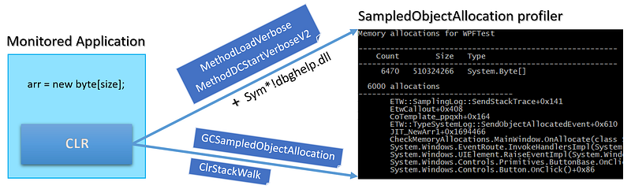
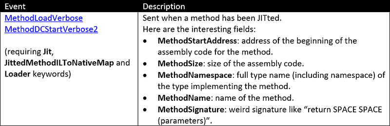
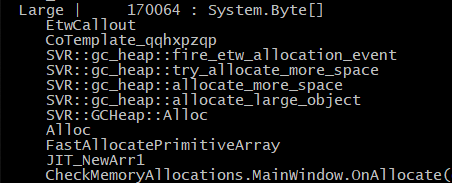

---

In the [previous episode](/posts/2020-04-18_build-your-own-net/) of this series, you have seen how to get a sampling of .NET application allocations thanks to the **AllocationTick** and **GCSampleObjectAllocation**(**High**/**Low**) CLR events. However, this is often not enough to investigate unexpected memory consumption: you would need to know which part of the code is triggering the allocations. This post explains how to get the call stack corresponding to the allocations, again with CLR events.


## Introduction

If you look carefully at the payload of the `TraceEvent` object mapped by Microsoft **TraceEvent** library (not my fault if they have the same name) for each CLR event, you won’t see anything related to a call stack. However, in the **TraceEvent** [sample 41](https://github.com/microsoft/perfview/blob/master/src/TraceEvent/Samples/41_TraceLogMonitor.cs#L204), the following line looks promising:

> var callStack = data.CallStack();

with data being a `TraceEvent` object received for each CLR event!

This `CallStack` method is [an extension method](https://github.com/microsoft/perfview/blob/master/src/TraceEvent/TraceLog.cs#L10539) provided by the `TraceLog` special kind of event source. You might not have noticed but I have used it in the **AllocationTick** code sample from the [previous post](/posts/2020-04-18_build-your-own-net/). This class (and many more helper classes) is doing a lot of work to :

- “attach” a call stack to each CLR event; i.e. a list of addresses of assembly code
- to translate addresses into string symbols (method names or full signatures), listen to a bunch of JIT related events for managed methods (more on this later), using COM-based [Debug Interface Access](https://docs.microsoft.com/en-us/visualstudio/debugger/debug-interface-access/debug-interface-access-sdk?WT.mc_id=DT-MVP-5003325?view=vs-2019) (a.k.a. DIA) and [**MetadataReaderProvider**](https://www.nuget.org/packages/System.Reflection.Metadata)** **for native functions

Notice that since events from all managed processes on the machine are handled by `TraceLog`, the internal cache for JITted methods description could consume a lot of memory. During my tests with two Visual Studio running, my test profiler consumed more than 500 MB before even handling call stacks. If you are in such an environment with multiple .NET processes, I will show how to “manually” get the same stacks (+ symbols in the next episode) with CLR events and a few methods from dbghelp.dll in a cheaper way.



The new provider (more on **ClrRundown** later), keywords and events need to be received to make all this work:



## TraceLog: the easy way

As you have seen in the previous posts, the `TraceEventSession` class exposes a `Source` property of `ETWTraceEventSource` type. This source has event parsers properties from which you register handler methods that will be called when CLR events are received. Instead of directly using this source, you should wrap it with a `TraceLogEventSource` object that provides the same event parsers.

```csharp
await Task.Factory.StartNew(() =>
{
    using (_session)
    {
        SetupProviders(_session);

        using (TraceLogEventSource source = TraceLog.CreateFromTraceEventSession(_session))
        {
            SetupListeners(source);

            source.Process();
        }
    }
});
```

## What’s new with providers?

The code for my`SetupProviders` method is a little bit different from the previous post even though no new event listeners are needed:

```csharp
private void SetupProviders(TraceEventSession session)
{
    // Note: the kernel provider MUST be the first provider to be enabled
    // If the kernel provider is not enabled, the callstacks for CLR events are still received 
    // but the symbols are not found (except for the application itself)
    // TraceEvent implementation details triggered when a module (image) is loaded
    session.EnableKernelProvider(
        KernelTraceEventParser.Keywords.ImageLoad |
        KernelTraceEventParser.Keywords.Process,
        KernelTraceEventParser.Keywords.None
    );

    session.EnableProvider(
        ClrTraceEventParser.ProviderGuid,
        TraceEventLevel.Verbose,    // this is needed in order to receive AllocationTick_V2 event
        (ulong)(
        // required to receive AllocationTick events
        ClrTraceEventParser.Keywords.GC |
        ClrTraceEventParser.Keywords.Jit |                      // Turning on JIT events is necessary to resolve JIT compiled code 
        ClrTraceEventParser.Keywords.JittedMethodILToNativeMap |// This is needed if you want line number information in the stacks
        ClrTraceEventParser.Keywords.Loader |                   // You must include loader events as well to resolve JIT compiled code.
        ClrTraceEventParser.Keywords.Stack
        )
    );

    // this provider will send events of already JITed methods
    session.EnableProvider(ClrRundownTraceEventParser.ProviderGuid, TraceEventLevel.Informational,
    (ulong)(
        ClrTraceEventParser.Keywords.Jit |              // We need JIT events to be rundown to resolve method names
        ClrTraceEventParser.Keywords.JittedMethodILToNativeMap | // This is needed if you want line number information in the stacks
        ClrTraceEventParser.Keywords.Loader |           // As well as the module load events.  
        ClrTraceEventParser.Keywords.StartEnumeration   // This indicates to do the rundown now (at enable time)
        ));

}
```

- The kernel provider needs to be enabled with the **ImageLoad** and **Process** keywords in order to let TraceEvent detect when a process loads “images” (i.e. dlls) and at which address (needed to convert Relative Virtual Addresses (RVA) to addresses in the address space). Note that this provider must be enabled before any other provider or your code will trigger an exception.
- The CLR provider needs to be enabled with **Jit**, **JittedMethodILToNativeMap**, and **Loader** (in addition to the usual **GC** one).
- The **Stack** keyword has to be set on the same CLR provider to receive call stacks events for “normal” CLR event (more on this later)
- The CLR Rundown provider is enabled with the same **Jit**, **JittedMethodILToNativeMap**, and **Loader** keywords. That way, JIT events corresponding to *already* JITted methods will be received (not only the new ones). This is important because otherwise, you won’t be able to map these methods with the address in memory of their JITted native code in the case of processes that have been started before the profiler. This is the case for my AllocationTickProfiler sample.

## Callstacks and symbols

Now, when an **AllocationTick** event is received, calling the `CallStack` extension method on the `GCAllocationTickTraceData` argument returns a `TraceCallStack` object. [This class](https://github.com/microsoft/perfview/blob/master/src/TraceEvent/TraceLog.cs#L7501) is a linked list of `TraceCodeAddress` representing each stack frame (i.e. address in assembly code). These classes are at the heart of TraceEvent and Perfview callstack management. The method names and signatures are retrieved behind the scene thanks to JIT events and the `SymbolReader`[ class](https://github.com/microsoft/perfview/blob/01b14294ca97b8f3bb2534624fb9cf2405881193/src/TraceEvent/Symbols/SymbolReader.cs#L21) that digs into .pdb files.

You first need to initialize a `SymbolReader` instance:

- Set the path to find the .pdb; including the Microsoft HTTP endpoint for public .NET versions symbols,
- Allow pdb next to the executable to be loaded.

```csharp
// By default a symbol Reader uses whatever is in the _NT_SYMBOL_PATH variable.  However you can override
// if you wish by passing it to the SymbolReader constructor.  Since we want this to work even if you 
// have not set an _NT_SYMBOL_PATH, so we add the Microsoft default symbol server path to be sure/
var symbolPath = new SymbolPath(SymbolPath.SymbolPathFromEnvironment).Add(SymbolPath.MicrosoftSymbolServerPath);
_symbolReader = new SymbolReader(_symbolLookupMessages, symbolPath.ToString());

// By default the symbol reader will NOT read PDBs from 'unsafe' locations (like next to the EXE)  
// because hackers might make malicious PDBs. If you wish ignore this threat, you can override this
// check to always return 'true' for checking that a PDB is 'safe'.  
_symbolReader.SecurityCheck = (path => true);
```

Then, displaying a `TraceCallStack` from a received CLR event in a human-readable format is simple:

- Get one frame after the other from the linked list,
- If the `CodeAddress` field is not cached yet, load the symbols for its module,
- Display the `FullMethodName` field of the frame (or the address if not found).

```csharp
private void DumpStack(TraceCallStack callStack)
{
    while (callStack != null)
    {
        var codeAddress = callStack.CodeAddress;
        if (codeAddress.Method == null)
        {
            var moduleFile = codeAddress.ModuleFile;
            if (moduleFile == null)
            {
                Debug.WriteLine($"Could not find module for Address 0x{codeAddress.Address:x}");
            }
            else
            {
                codeAddress.CodeAddresses.LookupSymbolsForModule(_symbolReader, moduleFile);
            }
        }
        if (!string.IsNullOrEmpty(codeAddress.FullMethodName))
            Console.WriteLine($"     {codeAddress.FullMethodName}");
        else
            Console.WriteLine($"     0x{codeAddress.Address:x}");
        callStack = callStack.Caller;
    }
}
```

Note that the first frame in the linked list is the last on the stack (i.e. last executed method).

As I mentioned at the beginning of the post, I have been facing OutOfMemory errors due to the TraceEvent symbols management large memory usage when a few other .NET applications were running. Let’s see how to get the call stacks in a less memory consuming way.

## Manually rebuilding the allocations call stack

Instead of using the call stack and symbol management provided by `TraceLog` in TraceEvent, I would prefer to manually get them. If you remember the [last post](/posts/2020-04-18_build-your-own-net/), thanks to **GCSampledObjectAllocation** CLR events, it is possible to have a sampling of the allocation size and count per process and per type. What I would like to add to the type picture is the list of call stacks leading to these allocations.

## How to manually get CLR events call stack

The first step is to understand how to get the CLR events call stacks. If you use the `TraceLog`-based code just presented, you should see the following kind of call stack:



The `ETWCallout` [CLR helper function](https://github.com/dotnet/runtime/blob/5178041776634bfbc4f868425710e60d95f7066f/src/coreclr/src/vm/eventtrace.cpp#L4423) is in charge of sending a special event containing the call stack of other normal events from the four supported CLR providers. If you set the **Stack** keyword to the CLR provider, each time an event is sent by a thread, a **ClrStackWalk** event will be sent just after. It means after each **SampleObjectAllocation** event, a **ClrStackWalk** event containing the call stack will be immediately received. In fact, since an application will probably be using more than one thread, it is required to do the mapping between the two events on a per-thread basis.

Each allocation event received by the `OnSampleObjectAllocation` handler contains the `ThreadID` property so it is easy to keep track of the last received allocation event per thread. In my case, the `ProcessAllocations` class stores this information in its `_perThreadLastAllocation` field:

```csharp
public class ProcessAllocations
{
    ...
    private readonly Dictionary<string, AllocationInfo> _allocations;
    private readonly Dictionary<int, AllocationInfo> _perThreadLastAllocation;
```

Now, each time a **SampleObjectAllocation** event is received, the id of the sending thread is passed to the updated`ProcessAllocations.AddAllocation()` method:

```csharp
public AllocationInfo AddAllocation(int pid, ulong size, ulong count, string typeName)
{
    if (!_allocations.TryGetValue(typeName, out var info))
    {
        info = new AllocationInfo(typeName);
        _allocations[typeName] = info;
    }

    info.AddAllocation(size, count);

    // the last allocation is still here without the corresponding stack
    if (_perThreadLastAllocation.TryGetValue(pid, out var lastAlloc))
    {
        Console.WriteLine("no stack for the last allocation");
    }

    // keep track of the allocation for the given thread
    // --> will be used when the corresponding call stack event will be received
    _perThreadLastAllocation[pid] = info;

    return info;
}
```

The `_perThreadLastAllocation` dictionary stores the `AllocationInfo` per thread. If an allocation happens, it is added into the dictionary. When a **ClrStackWalk** event is received for a given thread, the stack will be associated with the last `AllocationInfo` and removed from the dictionary. If some events are missed (it never happens during my tests but who knows), error message could be logged.

The `ClrStackWalkTraceData` argument received by the **ClrStackWalk** listener has a `FrameCount` property that returns the number of frames in the call stack. In addition, its `InstructionPointer()` method takes a frame position in the stack (starting at 0) and returns the address (in assembly code) at this position on the call stack.

```csharp
private void OnClrStackWalk(ClrStackWalkTraceData data)
{
    if (FilterOutEvent(data)) return;

    var callstack = BuildCallStack(data);
    GetProcessAllocations(data.ProcessID).AddStack(data.ThreadID, callstack);
}
private AddressStack BuildCallStack(ClrStackWalkTraceData data)
{
    var length = data.FrameCount;
    AddressStack stack = new AddressStack(length);

    // frame 0 is the last frame of the stack (i.e. last called method)
    for (int i = 0; i < length; i++)
    {
        stack.AddFrame(data.InstructionPointer(i));
    }

    return stack;
}
```

The `AddressStack` class returned by `BuildCallStack` stores the frames as a list of addresses so it can be stored in `AllocationInfo`.

```csharp
public class AddressStack
{
    // the first frame is the address of the last called method 
    private readonly List<ulong> _stack;

    public AddressStack(int capacity)
    {
        _stack = new List<ulong>(capacity);
    }

    // No need to override GetHashCode because we don't want to use it as a key in a dictionary
    public override bool Equals(object obj)
    {
        if (obj == null) return false;

        var stack = obj as AddressStack;
        if (stack == null) return false;

        var frameCount = _stack.Count;
        if (frameCount != stack._stack.Count) return false;

        for (int i = 0; i < frameCount; i++)
        {
            if (_stack[i] != stack._stack[i]) return false;
        }

        return true;
    }

    public IReadOnlyList<ulong> Stack => _stack; 

    public void AddFrame(ulong address)
    {
        _stack.Add(address);
    }
}
```

This class overrides the `Equals` method for a single reason: I want to be able to detect when the “same” stack (i.e. with the exact same frame addresses) is received for a given type allocation. That way, I just need to keep a counter for each different `AddressStack` and not all call stacks in `AllocationInfo`. Remember that `AllocationInfo` is used to keep track of allocations per type:

```csharp
public class AllocationInfo
{
    private readonly string _typeName;
    private ulong _size;
    private ulong _count;
    private List<StackInfo> _stacks;
```

The `StackInfo` class contains an `AddressStack` and how many times it led to this type of allocation.

```csharp
public class StackInfo
{
    private readonly AddressStack _stack;
    public ulong Count;

    internal StackInfo(AddressStack stack)
    {
        Count = 0;
        _stack = stack;
    }

    public AddressStack Stack => _stack;
}
```

So, when a stack event is received, `AddStack` is called on the last `AllocationInfo` for the same thread:

```csharp
public void AddStack(int tid, AddressStack stack)
{
    if (_perThreadLastAllocation.TryGetValue(tid, out var lastAlloc))
    {
        lastAlloc.AddStack(stack);
        _perThreadLastAllocation.Remove(tid);
        return;
    }
}
```

The job of `AllocationInfo.AddStack()` the method is to check if a previous allocation was made with the same call stack (hence the `Equals` override). If this is the case, just increment the corresponding `StackInfo` count. Otherwise, create a new `StackInfo` for this call stack with a count set to 1.

```csharp
internal void AddStack(AddressStack stack)
{
    var info = GetInfo(stack);
    if (info == null)
    {
        info = new StackInfo(stack);
        _stacks.Add(info);
    }

    info.Count++;
}

private StackInfo GetInfo(AddressStack stack)
{
    for (int i = 0; i < _stacks.Count; i++)
    {
        var info = _stacks[i];
        if (stack.Equals(info.Stack)) return info;
    }

    return null;
}
```

Knowing the address in code of each frame for all events call stack is nice but it would be much more useful to translate them into method names… You have to deal with two different cases: managed and native methods. I will cover these topics in the next episode.

## Resources

- Source code available [on Github](https://github.com/chrisnas/ClrEvents).
- TraceEvent [sample 41](https://github.com/microsoft/perfview/blob/master/src/TraceEvent/Samples/41_TraceLogMonitor.cs#L204) source code.

---

Missed the first part of this story? Check this out:

[**Build your own .NET memory profiler in C#**
*This post explains how to collect allocation details by writing your own memory profiler in C#.*medium.com](/posts/2020-04-18_build-your-own-net/)

---

**Interested in joining our journey? Check this out:**

[**Product, Research & Development | Criteo Careers**
careers.criteo.com](https://careers.criteo.com/working-in-R&D)[](https://careers.criteo.com/working-in-R&D)
