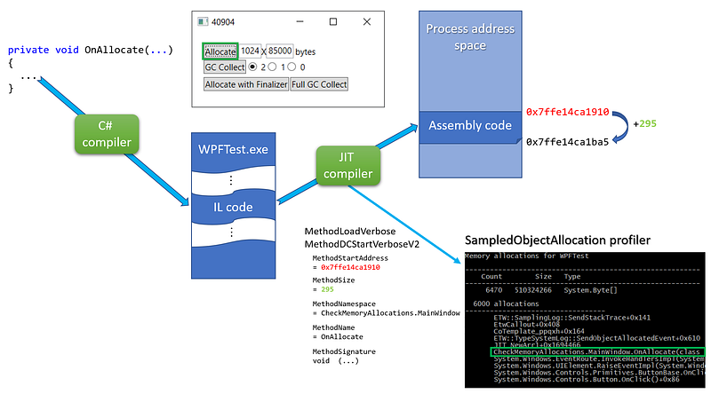
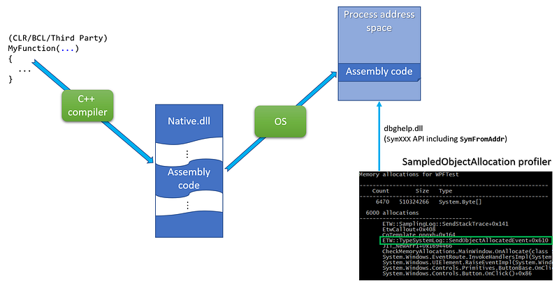

---

In the past two episodes of this series I have explained how to [get a sampling of .NET application allocations](/posts/2020-04-18_build-your-own-net/) and [one way to get the call stack](/posts/2020-05-18_build-your-own-net/) corresponding to the allocations; all with CLR events. In this last episode, I will detail how to transform addresses from the stack into methods name and possibly signature.

## From managed address to method signature

In order to transform an address on the stack into a managed method name, you need to know where in memory (i.e. at which address) is stored the method JITted assembly code and what is its size:



For each JITted method, the `MethodLoadVerbose`/`MethodDCStartVerboseV2` events are providing this information in addition to 3 properties to rebuild the full method name and signature (more on this later). I’m storing each method description as a `MethodInfo` into a `MethodStore` per process.

```csharp
public class PerProcessProfilingState : IDisposable
{
    ...
    private readonly Dictionary<int, MethodStore> _methods = new Dictionary<int, MethodStore>();

public class MethodStore : IDisposable
{
    // JITed methods information (start address + size + signature)
    private readonly List<MethodInfo> _methods;
    ...
```

The only interesting part of the `MethodInfo` class is the computation of the full method name stored in the `_fullName` field:

```csharp
public class MethodInfo
{
    private readonly ulong _startAddress;
    private readonly int _size;
    private readonly string _fullName;
    ...
```

The `ComputeFullName` helper merges together the 3 properties given by the `MethodxxxVerbose` events including special processing for constructors:

```csharp
private string ComputeFullName(ulong startAddress, string namespaceAndTypeName, string name, string signature)
{
    var fullName = signature;

    // constructor case: name = .ctor | namespaceAndTypeName = A.B.typeName | signature = ...  (parameters)
    // --> A.B.typeName(parameters)
    if (name == ".ctor")
    {
        return $"{namespaceAndTypeName}{ExtractParameters(signature)}";
    }

    // general case: name = Foo | namespaceAndTypeName = A.B.typeName | signature = ...  (parameters)
    // --> A.B.Foo(parameters)
    fullName = $"{namespaceAndTypeName}.{name}{ExtractParameters(signature)}";
    return fullName;
}

private string ExtractTypeName(string namespaceAndTypeName)
{
    var pos = namespaceAndTypeName.LastIndexOf(".", StringComparison.Ordinal);
    if (pos == -1)
    {
        return namespaceAndTypeName;
    }
    
    // skip the .
    pos++;

    return namespaceAndTypeName.Substring(pos);
}
```

Only the parameters (not the return type) are extracted from the “return type SPACE SPACE (parameters)” signature format:

```csharp
private string ExtractParameters(string signature)
{
    var pos = signature.IndexOf("  (");
    if (pos == -1)
    {
        return "(???)";
    }

    // skip double space
    pos += 2;

    var parameters = signature.Substring(pos);
    return parameters;
}
```

With the starting address and the size of each JITted methods, it is easy to find the one corresponding to a given address on the stack: look for the `MethodInfo` where this address could be between the start address and the start address + the code size:

```csharp
public string GetFullName(ulong address)
{
    if (_cache.TryGetValue(address, out var fullName))
        return fullName;
    
    // look for managed methods
    for (int i = 0; i < _methods.Count; i++)
    {
        var method = _methods[i];
        
        if ((address >= method.StartAddress) && (address < method.StartAddress + (ulong)method.Size))
        {
            fullName = method.FullName;
            _cache[address] = fullName;
            return fullName;
        }
    }

    // look for native methods
    fullName = GetNativeMethodName(address);
    _cache[address] = fullName;

    return fullName;
}
```

For performance sake, the `_cache` dictionary property speeds up the process by keeping track of the address/full name mappings.

It is now time to look at the details of the `GetNativeMethodName` helper that takes care of the native functions scenario.

## The native part of the symbols story

Unlike for JITted methods, the CLR does not send events to describe native functions even for the CLR itself. Instead, you need to find a way to map a call stack address to a native function by yourself. Unlike Perfview, I will be using the **dbghelp** native API instead of **DIA** mostly because my scenario is to get the stacks while the applications are still running:



After reading the [march 2002 MSDN article about DBGHELP](https://docs.microsoft.com/en-us/archive/msdn-magazine/2002/march/under-the-hood-improved-error-reporting-with-dbghelp-5-1-apis?WT.mc_id=DT-MVP-5003325) by Matt Pietrek, the updated symbols [related Microsoft Docs](https://docs.microsoft.com/en-us/windows/win32/debug/dbghelp-functions#symbol-handler?WT.mc_id=DT-MVP-5003325) and the dbghelp.h include a file from the Windows SDK, I wrote a C# wrapper around the dbghelp function needed to get a method name from an address in a process address space:

```csharp
internal static class NativeDbgHelp
{
    // from C:\Program Files (x86)\Windows Kits\10\Debuggers\inc\dbghelp.h
    public const uint SYMOPT_UNDNAME = 0x00000002;
    public const uint SYMOPT_DEFERRED_LOADS = 0x00000004;

    [StructLayout(LayoutKind.Sequential)]
    public struct SYMBOL_INFO
    {
        public uint SizeOfStruct;
        public uint TypeIndex;      // Type Index of symbol
        private ulong Reserved1;
        private ulong Reserved2;
        public uint Index;
        public uint Size;
        public ulong ModBase;       // Base Address of module containing this symbol
        public uint Flags;
        public ulong Value;         // Value of symbol, ValuePresent should be 1
        public ulong Address;       // Address of symbol including base address of module
        public uint Register;       // register holding value or pointer to value
        public uint Scope;          // scope of the symbol
        public uint Tag;            // pdb classification
        public uint NameLen;        // Actual length of name
        public uint MaxNameLen;
        [MarshalAs(UnmanagedType.ByValTStr, SizeConst = 1024)]
        public string Name;
    }

    [DllImport("dbghelp.dll", SetLastError = true)]
    public static extern bool SymInitialize(IntPtr hProcess, string userSearchPath, bool invadeProcess);

    [DllImport("dbghelp.dll", SetLastError = true)]
    public static extern uint SymSetOptions(uint symOptions);

    [DllImport("dbghelp.dll", SetLastError = true, CharSet = CharSet.Ansi)]
    public static extern ulong SymLoadModule64(IntPtr hProcess, IntPtr hFile, string imageName, string moduleName, ulong baseOfDll, uint sizeOfDll);

    // use ANSI version to ensure the right size of the structure 
    // read https://docs.microsoft.com/en-us/windows/win32/api/dbghelp/ns-dbghelp-symbol_info
    [DllImport("dbghelp.dll", SetLastError = true, CharSet = CharSet.Ansi)]
    public static extern bool SymFromAddr(IntPtr hProcess, ulong address, out ulong displacement, ref SYMBOL_INFO symbol);

    [DllImport("dbghelp.dll", SetLastError = true)]
    public static extern bool SymCleanup(IntPtr hProcess);
}
```

Note that you will need to download the dbghelp.dll (SymSrv.dll if needed) from [the Windows SDK](https://developer.microsoft.com/en-us/windows/downloads/windows-10-sdk/?WT.mc_id=DT-MVP-5003325) and copy it next to your memory profiler binaries.

The usage of the dbghelp API is straightforward. First, for each new process, call `SymSetOptions`/`SymInitialize`** **with a handle of the process:

```csharp
private bool SymInitialize(IntPtr hProcess)
{
    // read https://docs.microsoft.com/en-us/windows/win32/api/dbghelp/nf-dbghelp-symsetoptions for more details
    // maybe SYMOPT_NO_PROMPTS and SYMOPT_FAIL_CRITICAL_ERRORS could be used
    NativeDbgHelp.SymSetOptions(
        NativeDbgHelp.SYMOPT_DEFERRED_LOADS |   // performance optimization
        NativeDbgHelp.SYMOPT_UNDNAME            // C++ names are not mangled
        );

    // https://docs.microsoft.com/en-us/windows/win32/api/dbghelp/nf-dbghelp-syminitialize
    // search path for symbols:
    //   - The current working directory of the application
    //   - The _NT_SYMBOL_PATH environment variable
    //   - The _NT_ALTERNATE_SYMBOL_PATH environment variable
    //
    // passing false as last parameter means that we will need to call SymLoadModule64 
    // each time a module is loaded in the process
    return NativeDbgHelp.SymInitialize(hProcess, null, false);
}
private IntPtr BindToProcess(int pid)
{
    try
    {
        _process = Process.GetProcessById(pid);

        if (!SymInitialize(_process.Handle))
            return IntPtr.Zero;

        return _process.Handle;
    }
    catch (Exception x)
    {
        Console.WriteLine($"Error while binding pid #{pid} to DbgHelp:");
        Console.WriteLine(x.Message);
        return IntPtr.Zero;
    }
}
```

In the case of protected processes, `Process.GetProcessById` might throw an exception. The `_hProcess` field storing the process handle will be cleaned up in the `IDisposible.Dispose` implementation of the `MethodStore`:

```csharp
public void Dispose()
{
    if (_hProcess == IntPtr.Zero)
        return;
    _hProcess = IntPtr.Zero;

    _process.Dispose();
}
```

After a process has been bound, each time one of its modules is loaded, `SymLoadModule64` must be called. You can be notified of such a loaded module by enabling the Kernel provider with the `ImageLoad` keyword.

```csharp
session.EnableKernelProvider(
    KernelTraceEventParser.Keywords.ImageLoad |
    KernelTraceEventParser.Keywords.Process,
    KernelTraceEventParser.Keywords.None
);
```

The handler attached to the `ImageLoaded` event will be called each time a dll gets loaded.

```csharp
private void SetupListeners(ETWTraceEventSource source)
{
    ...

    // get notified when a module is load to map the corresponding symbols
    source.Kernel.ImageLoad += OnImageLoad;
}

const int ERROR_SUCCESS = 0;
private void OnImageLoad(ImageLoadTraceData data)
{
    if (FilterOutEvent(data)) return;

    GetProcessMethods(data.ProcessID).AddModule(data.FileName, data.ImageBase, data.ImageSize);
}
public void AddModule(string filename, ulong baseOfDll, int sizeOfDll)
{
    var baseAddress = NativeDbgHelp.SymLoadModule64(_hProcess, IntPtr.Zero, filename, null, baseOfDll, (uint)sizeOfDll);
    if (baseAddress == 0)
    {
        // should work if the same module is added more than once
        if (Marshal.GetLastWin32Error() == ERROR_SUCCESS) return;

        Console.WriteLine($"SymLoadModule64 failed for {filename}");
    }
}
```

Now everything is in place to get a native function name from an address on the stack:

```csharp
private string GetNativeMethodName(ulong address)
{
    var symbol = new NativeDbgHelp.SYMBOL_INFO();
    symbol.MaxNameLen = 1024;
    symbol.SizeOfStruct = (uint)Marshal.SizeOf(symbol) - 1024;   // char buffer is not counted
    // the ANSI version of SymFromAddr is called so each character is 1 byte long

    if (NativeDbgHelp.SymFromAddr(_hProcess, address, out var displacement, ref symbol))
    {
        var buffer = new StringBuilder(symbol.Name.Length);

        // remove weird "$##" at the end of some symbols
        var pos = symbol.Name.LastIndexOf("$##");
        if (pos == -1)
            buffer.Append(symbol.Name);
        else
            buffer.Append(symbol.Name, 0, pos);

        // add offset if any
        if (displacement != 0)
            buffer.Append($"+0x{displacement}");

        return buffer.ToString();
    }

    // default value is the just the address in HEX
    return $"0x{address:x}";
}
```

Note that I needed to remove some unexpected **$##** strings are the end of some symbols.

***This is the last episode of the series about building your own memory profiler in C#. In case you missed the first episodes, check them out on Medium:***

[**Build your own .NET memory profiler in C# — call stacks (2/2–1)**
*This post explains how to get the call stack corresponding to the allocations with CLR events.*medium.com](https://medium.com/criteo-labs/build-your-own-net-memory-profiler-in-c-call-stacks-2-2-1-f67b440a8cc)[](https://medium.com/criteo-labs/build-your-own-net-memory-profiler-in-c-call-stacks-2-2-1-f67b440a8cc)[**Build your own .NET memory profiler in C#**
*This post explains how to collect allocation details by writing your own memory profiler in C#.*medium.com](/posts/2020-04-18_build-your-own-net/)

---

## Resources

- Source code available [on Github](https://github.com/chrisnas/ClrEvents).
- Download [Debugging Tools for Windows](https://developer.microsoft.com/en-us/windows/downloads/windows-10-sdk/?WT.mc_id=DT-MVP-5003325) for dbghelp.dll and SymSrv.dll
- Matt Pietrek [article in MSDN Magazine](https://docs.microsoft.com/en-us/archive/msdn-magazine/2002/march/under-the-hood-improved-error-reporting-with-dbghelp-5-1-apis?WT.mc_id=DT-MVP-5003325) about DBGHELP
- Dbghelp samples -[http://www.debuginfo.com/examples/dbghelpexamples.html](http://www.debuginfo.com/examples/dbghelpexamples.html)

---

**Join the crowd!**

[**Careers at Criteo | Criteo jobs**
*Find opportunities everywhere. ​Choose your next challenge. Find the job opportunities at Criteo in Product, research &…*careers.criteo.com](https://careers.criteo.com/)[](https://careers.criteo.com/)
