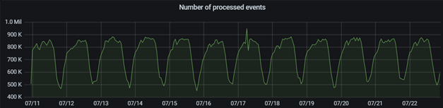
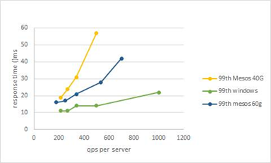
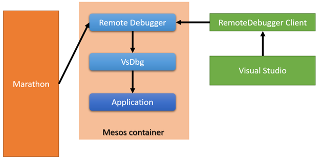
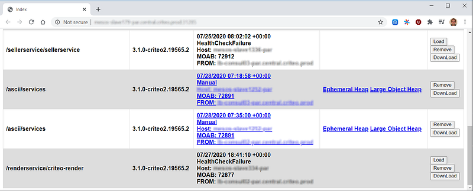

---

## Introduction

When I arrived at Criteo in late 2016, I joined the .NET Core “guild” (i.e. group of people from different teams dedicated to a specific topic). The first meeting I attended included Microsoft folks led by Scott Hunter (head of .NET program management) and including David Fowler (SignalR and ASP.NET Core). The goal for Criteo was simple: Moving a set of C# applications from Windows/.NET Framework to Linux/.NET Core. I guess that for Microsoft we were a customer with workloads that could be interesting to support with .NET Core. At that time, I did not realize how strong their commitment to work with us was. Our Open Source mindset was the selling point.

How complicated could it be? Well… this post will show you the challenges that we had to face to run, monitor and debug our applications.

---

## Try it

Once we got a build of all .NET Core assemblies (more on this in a forthcoming blog post), it was time to run a few applications. The first issues that we faced were related to missing features between .NET Framework and .NET Core. For example, we need cryptography support of [3DES and AES with cypher mode CFB](https://github.com/dotnet/corefx/issues/4647) but it is (still) not available in .NET Core for Linux. Thanks to the Open Source status of .NET Core, we were able to [add it to CoreFx](https://github.com/criteo-forks/corefx/tree/aes_3des_cfb_mode_implementation_unix). However, since we did not implement it on MacOS/Windows as Microsoft requested for our change to be accepted as a Pull Request, we had to keep our Criteo-forked branch.

The second class of runtime problems we had to solve were due to differences between Windows and Linux but also with the “containerization” of the runtime environment. Let’s take two examples involving the .NET Garbage Collector. First, our containers were using Linux cgroups to manage quotas including memory and number of CPU cores usable by applications. However, at CLR startup, the GC was counting the **total** count of CPU cores to compute the number of heaps to allocate instead of the one defined at the cgroup level: We ended up with instant Out Of Memory automatic killing. This time our fix was done and merged in the CLR repository.

The second example is related to a GC optimization: During background generation 2 collections, the CLR threads working underneath are affinitized to each different CPU core to avoid locks. We were lucky enough to welcome [Maoni Stephens](https://twitter.com/@maoni0) (Lead Dev on the GC) in our Paris office early 2018 to share our weird allocation patterns that impacted the GC. During her stay, she was kind enough to help us investigate a behavior on our servers: When [SysInternals ProcessExplorer](https://docs.microsoft.com/en-us/sysinternals/downloads/process-explorer?WT.mc_id=DT-MVP-5003325) was running, the garbage collections were taking more time than usual. Maoni found out ProcessExplorer had an affinitized high priority thread conflicting with GC threads. During investigations related to longer response time on Linux compared to Windows. We realized that GC threads were not affinitized like it was the case on Windows and the issue was [fixed by Jan Vorlicek](https://github.com/dotnet/coreclr/pull/24801).

*Here is our lesson: Sometimes fixes are merged into the official release and sometimes they are not. If your workloads are pushing .NET to its limits, you will probably have to build and manage your *[*own Core fork*](https://github.com/criteo-forks/coreclr)* and make it available to your deployments.*

## Monitor it

At Criteo, our Grafana dashboards measuring .NET Framework application health were based on metrics computed from Windows performance counters. Even without going to Linux, .NET Core is no more exposing performance counters so we had to entirely rebuild our metrics collection system!

Based on Microsoft feedbacks, we decided to listen to CLR events emitted via ETW on Windows and LTTng on Linux. In addition to work for both Operating Systems, these events are also providing accurate details about thread contention, exceptions and garbage collections not available with Performance counters. Please refer to our [series of blog posts](/posts/2019-10-17_how-to-expose-your/) for more details and reusable code samples to integrate these events into your own systems.

Our first Linux metrics collection implementation was based on LTTng and we presented our journey during the [Tracing Summit in 2017](https://www.youtube.com/watch?v=pMl9RM9h2eg&list=PLuo4E47p5_7bfeZyYIyNYM-f-2tmr0neu&index=6). Microsoft already built [TraceEvent](https://github.com/microsoft/perfview/blob/master/documentation/TraceEvent/TraceEventLibrary.md), an assembly allowing .NET code to parse CLR events for both Windows and Linux. Unfortunately for us, the Linux part was only able to load traces files but we needed live session like on Windows where you can listen to events emitted by running applications. Since this code is Open Source, [Gregory](https://twitter.com/@GregoryLeocadie) was able to add the [live session feature](https://github.com/microsoft/perfview/pull/340) to TraceEvent.

With .NET Core 3.0 Microsoft provided a way to exchange events common to Linux and Windows called EventPipes. So… we moved our collection implementation from LTTng to EventPipe (look at our [blog series](/posts/2019-10-17_how-to-expose-your/) and [DotNext conference session](https://www.youtube.com/watch?v=Jpoy3O6x-wM) for more details and reusable code sample). With the new EventPipe implementation in the CLR came performance issues not seen by Microsoft. The reason is simple: Some of our applications are running hundreds of threads to process thousands of requests per second and allocate memory like crazy. In that kind of context, the CLR has a lot to do and so, has a lot of events to generate and emit via LTTng or EventPipes.

The initial implementation was [lacking some](https://github.com/dotnet/runtime/issues/12204) filtering and too many events were generated or expensive event payload was created even though the events were not emitted. Based on our feedback, the Microsoft Diagnostic team was very responsive and quickly fixed the problem.

*Microsoft did not “just” move to Open Source, the teams are working deeply integrated with the issue/pull request model of GitHub. So don’t be shy and if you find a problem, create an issue with a detailed reproduction and even better, provide a pull request with the fix. Everyone in the community will benefit!*

## Run it

With these metrics, we started to investigate some performance differences (mostly response time) between Windows and containerized Linux.

We saw a huge performance difference on Linux: Both response time (x2) and scalability (timeout increase with QPS). Our team spent a lot of time to improve the situation up to the point where it was possible to send the applications to production.

In the new containerized environment we faced the same kind of *noisy neighbor* symptoms that we had with Process Explorer. If the CPU cores are not dedicated to a container (as it was for us at the beginning), this scenario happens a lot. So we updated the scheduling system to dedicate CPU cores to containers.

On a totally different area, we found out that the way .NET Core handles network I/O continuation had an impact on our main application. To give a bit of context, this application has to handle a lot of requests and is response-time driven. During the processing of a request, the current thread might have to send an HTTP request before continuing its processing. Since this is done asynchronously, the thread is now available to process more incoming requests and this is good for throughput. However, it means that when the inner HTTP request comes back, all available threads might be processing new incoming requests and it will take time to complete the old one. The net effect is to increase the median response time and this is not something we want!

The .NET Core implementation is relying on the .NET ThreadPool that shares its threads with all the async/await magic and the incoming requests processing (The .NET Framework implementation is using a totally different implementation based on I/O completion ports on Windows). To solve the issue, [Kevin](https://twitter.com/KooKiz) [implemented a custom thread pool](https://github.com/criteo-forks/corefx/commit/dda2c4d80fd2d74b3dc7e0833e2a6794f1e290d3) to handle network I/O and we keep on [optimizing it](https://github.com/criteo-forks/corefx/commit/2acc917aef47798243cc221afc9b360c86ed60b7). When you work on this kind of deep area of code-shared by so many different workloads, you realize that it is impossible to find the silver bullet.

## Debug it

What would you do if something would go wrong in an application? On Windows, with Visual Studio, we are able to remote debug a rogue application to set a breakpoint, look at fields and properties or even have a high-level view of what threads are doing with the ParallelStacks view. In the worst case, SysInternals [procdump ](https://docs.microsoft.com/en-us/visualstudio/debugger/remote-debugging-dotnet-core-linux-with-ssh?WT.mc_id=DT-MVP-5003325&view=vs-2019)allows us to take a snapshot of the application and analyze it on our developer’s machine with WinDBG or Visual Studio.

In terms of remote debugging a Linux application, Microsoft provides an [SSH-based solution](https://docs.microsoft.com/en-us/visualstudio/debugger/remote-debugging-dotnet-core-linux-with-ssh?WT.mc_id=DT-MVP-5003325) to attach to a running application. However, for security reasons, it is not allowed to run an SSH server in our Criteo containers. *The solution was to implement the communication protocol with VsDbg for Linux on top of WebSockets.*

Well… this was not enough. Hosting architecture (Marathon and Mesos in our case) ensures that applications in containers are running smoothly by sending requests to *health check* endpoints. If the application replies that everything is fine, then the container is safe. If the application does not answer as expected (including retries), then Marathon/Mesos kills the application and cleans up the container. Now think about what will happen if you set a breakpoint in the application and you dig into the data structures content in Visual Studio Watch/Quick Watch panels for a few minutes. Behind the scene, the debugger has to freeze all application threads, including the ones from the thread pool responsible to answer health checks. As you have probably guessed already, the debugging session will not end well.

This is why the previous figure shows an arrow between Marathon and the Remote Debugger which acts as a proxy for the application health check. When a debugging session starts (i.e. when the WebSockets code executes the protocol), the Remote Debugger knows that it should answer OK instead of calling the application endpoint that might never answer.

When remote debugging is not enough, how do you take a memory snapshot of the application? For example, if the health check does not answer after a series of retry, the Remote Debugger is calling the [createdump tool](https://github.com/dotnet/runtime/blob/master/docs/design/coreclr/botr/xplat-minidump-generation.md) installed with the .NET Core runtime to generate a dump file. Again, since the memory dump creation of 40+ GB applications could take several minutes, the same health check proxy mechanism has been put in place.

Once the dump file is created, the remote debugger let Marathon kill the application. But wait! This is not enough because in that case, the container will be cleaned up and the disk storage will disappear. Not a problem, after a dump has been generated by createdump, the file is sent to a “Dump Navigator” application (one per data center). This application is providing a simple HTML user interface to get high-level details of the application state such as thread stacks or managed heap content.

On Windows, we have built our own set of [extension commands](https://github.com/chrisnas/DebuggingExtensions/blob/master/Documentation/gsose.md) that allow us to investigate memory, threadpool starvation, thread contention, or timer leak scenarios in a Windows memory dump with WinDBG as shown during this [NDC Oslo conference session](https://www.youtube.com/watch?v=biDJkJ4L_K8). Note that they are also [usable with LLDB](https://github.com/kevingosse/LLDB-LoadManaged) on Linux. These commands are leveraging the [ClrMD Microsoft library](https://github.com/microsoft/clrmd) that gives you access to a live process or a memory dump in C#. Thanks to the Linux support that has been added to this library by Microsoft developers, it was easy to reuse the code into our Dump Navigator application. I definitively recommend to look at the API provided by ClrMD to automate and build your own tools. The [long Criteo blog series](/posts/2019-12-31_getting-another-view-on/) is a good start in addition to my [DotNext conference session](https://www.youtube.com/watch?v=O8c5WwfbGFU).

## Conclusion

Even though some of our main applications moved to .NET Core running on containerized Linux with a large set of monitoring/debugging tools, the journey is not over. We are now testing the preview of .NET Core 5.0 (like we did for 3.0) to check if it supports Criteo specific needs. If this is not the case, we will figure out why and find solutions to integrate into the code. Same for the tools: I have started to [add our extension commands](https://github.com/dotnet/diagnostics/pull/1376) to Microsoft dotnet-dump CLI tool used to analyze both Windows and Linux dumps.

At least we could say that we not only helped ourselves but also Microsoft to understand how far .NET Core could go and even the whole .NET Windows and Linux community. This is where Open Source shines!

---

**Stay tuned for the next article in our mini-series. Don’t forget to head over to our previous articles of this journey:**

[**Migrating Arbitrage to Apache Mesos**
*Lessons learned from migrating our largest application to our container platform.*medium.com](https://medium.com/criteo-labs/migrating-arbitrage-to-apache-mesos-3f474179ec0b)[**Moving .NET to Linux at Scale**
*The story of a multi-year migration: How we changed Criteo’s whole foundation.*medium.com](https://medium.com/criteo-labs/moving-net-to-linux-at-scale-d8ff49b42661)

---

**Interested in joining the challenge? Head over to our career site!**

[**Product, Research & Development | Criteo Careers**
careers.criteo.com](https://careers.criteo.com/working-in-R&D)
