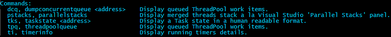
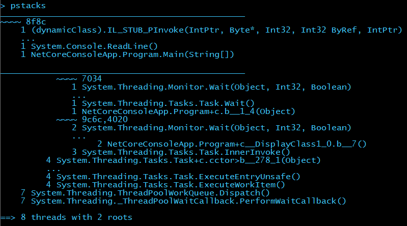
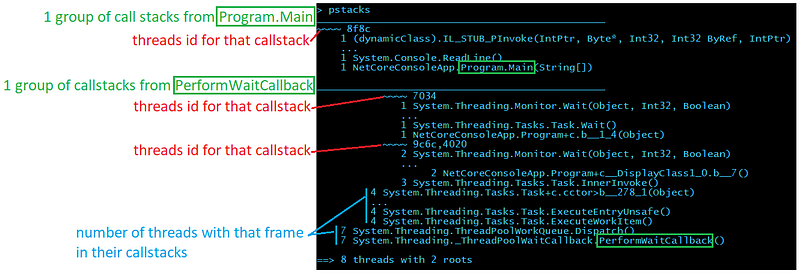
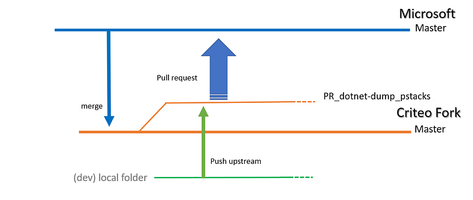
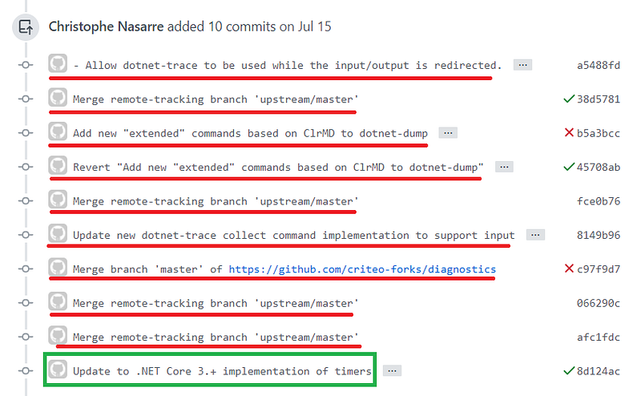

---

## Introduction

To ease our troubleshooting sessions at Criteo, new high level commands for WinDBG have been written and grouped in the [gsose extension](https://github.com/chrisnas/DebuggingExtensions/blob/master/Documentation/gsose.md). As we moved to Linux, [Kevin](https://twitter.com/KooKiz) implemented the plumbing to be able to load gsose into LLDB. In both cases, our extension commands are based on ClrMD to dig into a memory dump.

As Microsoft pushed for dotnet-dump as the new cross-platform way to deal with memory dump, it was obvious that we would have to be able to use our extension commands in dotnet-dump. Unfortunately dotnet-dump does not support any extension mechanism. In May this year, Kevin updated [a minimum of code](https://github.com/kevingosse/diagnostics/commit/4abf635b6313bf733b2450a2ffee8fa06befd7b6) to load a list of extension assemblies at the startup of dotnet-dump. I followed another direction by [adding a “load” command](https://github.com/chrisnas/diagnostics/commit/235a3347fcf2369e408664137cd29a721879b42d) to dynamically add extensions commands.

However, the Diagnostics team was focusing on supporting .NET Core 5 release and adding extensibility was not planned before next year. Due to our own time constraints at Criteo, gsose extension commands were really needed so we agreed with the Diagnostics team to implement these commands directly into dotnet-dump as pull requests.

This first post describes the new commands, when to use them, and the git setup I used to implement them.

## Commands details and challenges

Here is the list of extension commands as shown by the **help** command:



As of today with the last 3.1.141901 official version, only **timerinfo** is available but feel free to [clone the repository](https://github.com/dotnet/diagnostics/) and rebuild it to get all commands.

## pstacks: almost Parallel Stacks a la Visual Studio

When you start an investigation, you are usually interested in getting a high level view of what the running threads are doing and this is what **pstacks** provides. When hundreds of threads are running, commands such as **clrthreads** are useless. Instead, **pstacks** merges the common parts of each call stack and present them in a tree:



Don’t be scared by the layout; here is a description of each section:



If you look at the threads 9c6c and 4020 (after the last ~~~~), it means that 2 threads (only the first 4 threads id are shown except if you pass — all as a parameter) share the same callstack:

```
~~~~ 9c6c,4020
2 System.Threading.Monitor.Wait(Object, Int32, Boolean)
4 System.Threading.Tasks.Task+c.cctor>b__278_1(Object)
  ...
4 System.Threading.Tasks.Task.ExecuteEntryUnsafe()
4 System.Threading.Tasks.Task.ExecuteWorkItem()
7 System.Threading.ThreadPoolWorkQueue.Dispatch()
7 System.Threading._ThreadPoolWaitCallback.PerformWaitCallback()
```

Compared to the “list” representation, the “tree” representation is useful when you have a lot of threads to deal with and see the different branches in the groups of stack frames.

## ti: see all your timers

If you don’t find anything interesting in the running threads (i.e. not hundreds of threads with the same code stack blocked on a **Wait** call for example), you should look at what will run as timer callbacks with the **ti** command.

Here is example of what you will get:

```
> ti
(S) 0x00007F7D84529CD0 @    1000 ms every     1000 ms |  0000000000000000 () -> Kafka.Batching.AccumulatorByTopic<Kafka.Routing.FetchMessage>.Tick
    ...
(L) 0x00007F7D844FA7A0 @    1000 ms every     1000 ms |  0000000000000000 () -> Kafka.Batching.AccumulatorByTopic<Kafka.Routing.OffsetMessage>.Tick
    ...
(L) 0x00007F7D842042F8 @     999 ms every     1000 ms |  0000000000000000 () -> Criteo.DevKit.TimeStamp+<>c.cctor>b__35_0
    ...
(L) 0x00007F7D846314C8 @     999 ms every     1000 ms |  00007F7D8462ED70 (Microsoft.AspNetCore.Server.Kestrel.Core.Internal.Infrastructure.Heartbeat) ->
    ...
 
   190 timers
-----------------------------------------------
   1 | (S) @     999 ms every     1000 ms | 0000000000000000 () -> Kafka.Batching.AccumulatorByTopic<Kafka.Routing.FetchMessage>.Tick
   1 | (L) @     996 ms every     1000 ms | 0000000000000000 () -> Kafka.Batching.AccumulatorByTopic<Kafka.Routing.OffsetMessage>.Tick
   1 | (L) @     993 ms every     1000 ms | 0000000000000000 () -> Kafka.Batching.AccumulatorByTopic<Kafka.Routing.FetchMessage>.Tick
   1 | (L) @     999 ms every     1000 ms | 0000000000000000 () -> Criteo.DevKit.TimeStamp+<>c.cctor>b__35_0
   ...
   9 | (L) @    1000 ms every     1000 ms | 0000000000000000 () -> Kafka.Batching.AccumulatorByTopic<Kafka.Routing.FetchMessage>.Tick
  33 | (L) @     999 ms every     1000 ms | 0000000000000000 () -> Kafka.Batching.AccumulatorByTopic<Kafka.Routing.FetchMessage>.Tick
  34 | (L) @    2000 ms every     2000 ms | 0000000000000000 () -> Kafka.Batching.AccumulatorByTopicByPartition<Kafka.Cluster.ProduceMessage>.Tick
  38 | (L) @     999 ms every     1000 ms | 0000000000000000 () -> Kafka.Batching.AccumulatorByTopic<Kafka.Routing.OffsetMessage>.Tick
```

The first part of the output lists each instance of **Timer** with start/repeat information followed by the callback parameter and callback if available. The second list groups timer so you could identify cases where the same timers have been created many times.

## tpq: what is in the ThreadPool queues

If no culprit is identified in timers, it is time to look at what is in the ThreadPool with the **tpq** command.

```
> tpq
 
global work item queue________________________________
0x000002AC3C1DDBB0 Work | (ASP.global_asax)System.Web.HttpApplication.ResumeStepsWaitCallback
                       ...
0x000002AABEC19148 Task | System.Threading.Tasks.Dataflow.Internal.TargetCore<System.Action>.<ProcessAsyncIfNecessary_Slow>b__3
 
local per thread work items_____________________________________
0x000002AE79D80A00 System.Threading.Tasks.ContinuationTaskFromTask
                       ...
0x000002AB7CBB84A0 Task | System.Net.Http.HttpClientHandler.StartRequest
 
   7 Task System.Threading.Tasks.Dataflow.Internal.TargetCore<System.Action>.<ProcessAsyncIfNecessary_Slow>b__3
                       ...
  84 Task System.Net.Http.HttpClientHandler.StartRequest
----
6039
 
1810 Work  (ASP.global_asax) System.Web.HttpApplication.ResumeStepsWaitCallback
----
1810
```

Both work items from the global queue and the local queues are displayed with each identified callback. The final summary spits work items and tasks.

## Miscellaneous commands

Two other helper commands are also available.

### tks: Task State

Pass a **Task** object reference to **tks** to get its human readable state.

```
> help tks
-------------------------------------------------------------------------------
TaskState [hexa address] [-v <decimal state value>]
 
TaskState translates a Task m_stateFlags field value into human readable format.
It supports hexadecimal address corresponding to a task instance or -v <decimal state value>.
 
> tks 000001db16cf98f0
Running
 
> tks -v 73728
WaitingToRun
```

### dcq : Dump ConcurrentQueue

Dump elements stored in a **ConcurrentQueue**. Due to implementation details, more manual steps are required in case of value types.

```
> help dcq
-------------------------------------------------------------------------------
DumpConcurrentQueue
 
Lists all items in the given concurrent queue.
 
For simple types such as numbers, boolean and string, values are shown.
> dcq 00000202a79320e8
System.Collections.Concurrent.ConcurrentQueue<System.Int32>
   1 - 0
   2 - 1
   3 - 2
 
In case of reference types, the command to dump each object is shown.
> dcq 00000202a79337f8
System.Collections.Concurrent.ConcurrentQueue<ForDump.ReferenceType>
   1 - dumpobj 0x202a7934e38
   2 - dumpobj 0x202a7934fd0
   3 - dumpobj 0x202a7935078
 
For value types, the command to dump each array segment is shown.
The next step is to manually dump each element with dumpvc <the Element Methodtable> <[item] address>.
> dcq 00000202a7933370
System.Collections.Concurrent.ConcurrentQueue<ForDump.ValueType>
   1 - dumparray 202a79334e0
   2 - dumparray 202a7938a88
```

Note that for reference type items, the **dumpobj** command is provided to get the value of the item fields: you just copy and paste them to get instance fields.

## GIT hell

Before digging into the implementation details, I want to spend some time on how to properly create a pull request. Since the Diagnostics repository is hosted on Github, you have to [create a fork](https://docs.github.com/en/github/getting-started-with-github/fork-a-repo) and push your changes on a dedicated branch to then submit a pull request.

Due to my previous Team Foundation Server experience, it seems that I have problems with Git commands: too many different ways to do simple things maybe. So I was faithfully relying on the documentation to [configure](https://help.github.com/en/articles/configuring-a-remote-for-a-fork)/[sync](https://help.github.com/en/articles/syncing-a-fork) a fork and I ended up merging the Microsoft Master branch to our Criteo fork Master before creating my own branch dedicated to my pull request:



After a while, in the next pull requests, I started to have unrelated commits in the pull requests:



It was due to the fact that I was merging the Criteo fork master with Diagnostics master to stay in sync.

My coworker [Guillaume](https://twitter.com/g_turri) explained to me that I should follow a different path. This time, I’m just creating a branch on the Microsoft repository (so no need to merge) and I’m passing by the Criteo fork just to push upstream:

```
git clone https://github.com/dotnet/diagnostics
cd diagnostics
git checkout -b PR_dotnet-dump_pstacks
```

Now I can change my local source code before pushing upstream to Criteo fork

```
git add/gui 
git commit
git remote add upstream https://github.com/criteo-forks/diagnostics
git push upstream PR_dotnet-dump_pstacks
```

That way, I can synchronize the Criteo fork without “impacting” the history of commits brought with my dedicated pull request branch.

The next episode will cover command implementation details.

---

**What’s next? Read the second part of this article:**

[**How to write commands for dotnet-dump**
*This post describes the different steps, tips and tricks to write your own commands for dotnet-dump*medium.com](/posts/2020-11-09_how-to-write-commands/)

**Like what you are reading? Check out more articles from Christophe on our medium account.**

[**The .NET Core Journey at Criteo**
*This post shows the challenges we faced during the migration to .NET Core on containerized Linux for our main…*medium.com](/posts/2020-07-31_the-net-core-journey/)

**Are you interested to work with Christophe and other talented Engineers at Criteo? Take a look at our open positions:**

[**Product, Research & Development | Criteo Careers**
careers.criteo.com](https://careers.criteo.com/working-in-R&D)[](https://careers.criteo.com/working-in-R&D)
