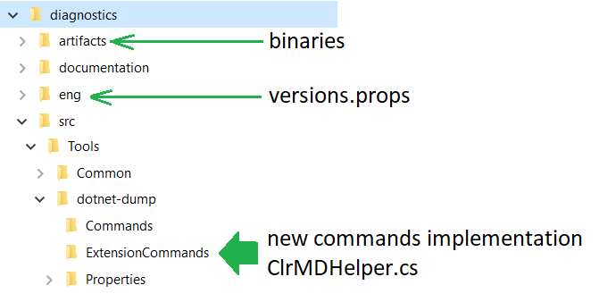

---

In the [previous post](/posts/2020-09-29_how-to-extend-dotnet/), I presented the new commands that were added to dotnet-dump and how to use them. It is now time to show how to implement such a command.

But before jumping into the code, you should first ensure that you have a valid use case that the Diagnostics team is not currently working on. I recommend to create an issue in the Diagnostics repository to explain what is missing for which scenario and propose to implement the corresponding command.

## What is a dotnet-dump command?

Here is the directory structure related to the dotnet-dump tool in the Diagnostics repository:

The built binaries are generated under artifacts\bin\dotnet-dump\<Release or Debug>\netcoreapp2.1 folder if you need to test them outside of Visual Studio.

The **eng** folder contains the **versions.props** file that lists the versions for nuget dependencies. In my case, I had to reference the ParallelStacks.Runtime nuget so I added the following line:`2.0.1`

And in the **dotnet-dump.csproj**, this nuget is referenced with the same variable:
`

---

**Missed the first part of the story? Read it here:**

[**How to extend dotnet-dump (1/2) — What are the new commands?**
*This first post describes the new commands, when to use them, and the git setup I used to implement them.*medium.com](/posts/2020-09-29_how-to-extend-dotnet/)

**Want to work with Christophe or other teams? Check out our open positions:**

[**Careers at Criteo | Criteo jobs**
*Find opportunities everywhere. ​Choose your next challenge. Find the job opportunities at Criteo in Product, research &…*careers.criteo.com](http://careers.criteo.com)
