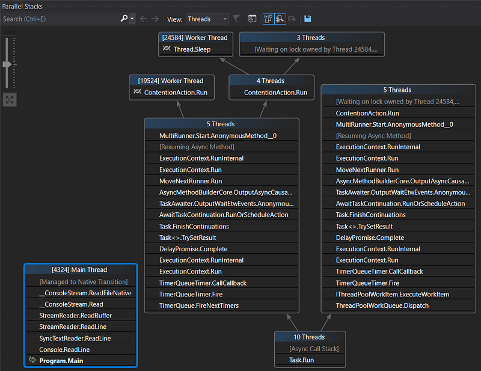
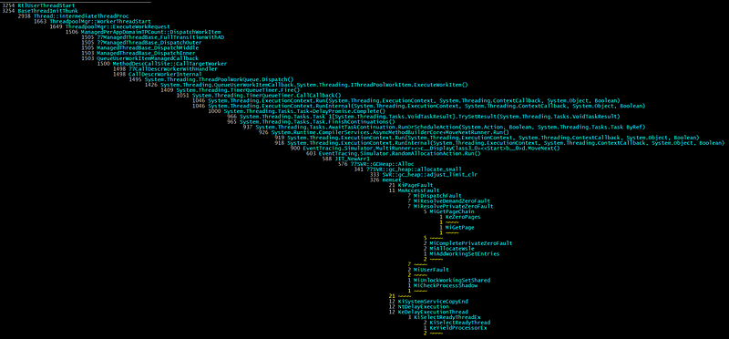

---

The last series was describing how to get details about your .NET application allocation patterns in C#.

- [Get a sampling of .NET application allocations](/posts/2020-04-18_build-your-own-net/)
- [A simple way to get the call stack](/posts/2020-05-18_build-your-own-net/)
- [Getting the call stack by hand](/posts/2020-06-19_build-your-own-net/)

It is now time to do the same but for the CPU consumption of your .NET applications.

## Thanks you Mr Windows Kernel!

Under Windows, the kernel ETW provider allows you to get notified every milli-second with the call stack of all threads running on a core. Without any surprise, it is easy with TraceEvent to listen to these events. As explained in an [old posts](http://labs.criteo.com/2018/07/grab-etw-session-providers-and-events/), you simply need to create a session, enable providers and listen to the right event.

For sampled CPU profiling, I’m using the `TraceLogEventSource` to wrap the event source and automatically get the stack frames symbol resolution:

```csharp
string sessionName = "Cpu_Profiling_Session+" + Guid.NewGuid().ToString();
_session = new TraceEventSession(sessionName, TraceEventSessionOptions.Create);
if (!EnableProviders(_session))
{
    _session.Dispose();
    _session = null;
    return false;
}

_profilingTask = Task.Factory.StartNew(() =>
{
    using (TraceLogEventSource source = TraceLog.CreateFromTraceEventSession(_session))
    {
        // CPU sampling kernel events
        source.Kernel.PerfInfoSample += (SampledProfileTraceData data) =>
        {
            ...
        };

        // this call exits when the session is stopped
        source.Process();
    }
});
```

You need to enable three providers:

- Kernel: get the profiling event every milli-second and be notified when a dll gets loaded by a process to let TraceEvent manage the symbols
- Clr: get JIT events describing managed method details
- ClrRundown: get already JITted methods details

```csharp
protected bool EnableProviders(TraceEventSession session)
{
    session.BufferSizeMB = 256;

    // Note: it could fail if the user does not have the required privileges
    var success = session.EnableKernelProvider(
        KernelTraceEventParser.Keywords.ImageLoad |
        KernelTraceEventParser.Keywords.Process |
        KernelTraceEventParser.Keywords.Profile,
        stackCapture: KernelTraceEventParser.Keywords.Profile
        );
    if (!success) return false;

    // this call always returns false  :^(
    session.EnableProvider(
        ClrTraceEventParser.ProviderGuid,
        TraceEventLevel.Verbose,
        (ulong)(
        // events related to JITed methods
        ClrTraceEventParser.Keywords.Jit |                       // Turning on JIT events is necessary to resolve JIT compiled code 
        ClrTraceEventParser.Keywords.JittedMethodILToNativeMap | // This is needed if you want line number information in the stacks
        ClrTraceEventParser.Keywords.Loader                      // You must include loader events as well to resolve JIT compiled code.
        )
    );

    // this provider will send events of already JITed methods
    session.EnableProvider(
        ClrRundownTraceEventParser.ProviderGuid,
        TraceEventLevel.Verbose,
        (ulong)(
        ClrTraceEventParser.Keywords.Jit |              // We need JIT events to be rundown to resolve method names
        ClrTraceEventParser.Keywords.JittedMethodILToNativeMap | // This is needed if you want line number information in the stacks
        ClrTraceEventParser.Keywords.Loader |           // As well as the module load events.  
        ClrTraceEventParser.Keywords.StartEnumeration   // This indicates to do the rundown now (at enable time)
        ));

    return true;
}
```

The code to handle the event is really simple:

```csharp
source.Kernel.PerfInfoSample += (SampledProfileTraceData data) =>
{
    if (data.ProcessID != Pid) return;

    var callstack = data.CallStack();
    if (callstack == null) return;

    MergeCallStack(callstack, Reader);
};
```

I’m only interested in profiling a given process (hence the check on process id) and events with a call stack. The callstack is returned by the extension method `CallStack()` (see the [previous post](/posts/2020-05-18_build-your-own-net/) for more details). The main processing is done by the `MergeCallStack()` method. But before looking at the only complicated part, it is time to discuss a useful tip.

## Tip: use ETLx Luke!

Like the previous posts about memory profiling, my goal is to demonstrate how to monitor applications as they run. However when you monitor an application CPU consumption, you would like to avoid any noisy neighbor that could highjack some cores. So minimizing the work of your profiling code is always a good idea. In addition, it could also be valuable to record the events and analyze them later. Microsoft [Perfview](https://github.com/microsoft/perfview/releases) is the open source tool that I’m using the most to dig into CPU consumption. So the solution is to simply record the events and generate an .etlx file for Perfview.

The first code change is small: the session is created with a filename.

```csharp
string sessionName = "Cpu_Profiling_Session+" + Guid.NewGuid().ToString();
_session = new TraceEventSession(sessionName, _filename);
```

I’m using a naming convention that contains the process ID I want to monitor so it will be easy to remember when I will analyze the recording in Perfview:

```csharp
profiler = new EtlCpuSampleProfiler($"trace-{parameters.pid}.etl");
```

The second step to generate the .etlx file is a one liner:

```csharp
var traceLog = TraceLog.OpenOrConvert(_filename, new TraceLogOptions() { ConversionLog = SymbolMessages });
```

The `ConversionLog TraceLogOptions` property is expecting a `TextWriter` to log all possible messages related to symbols resolution.

The parsing of kernel profiling samples is done on the `TraceLog` in a more manual way by selecting the events based on `TaskGuid` corresponding to the kernel profiling task and the `OpCode`:

```csharp
// parse profiling kernel events
// from https://github.com/microsoft/perfview/blob/master/src/TraceEvent/Samples/41_TraceLogMonitor.cs#L150
// from https://docs.microsoft.com/en-us/windows/win32/etw/perfinfo
// from https://github.com/microsoft/perfview/blob/master/src/TraceEvent/Parsers/KernelTraceEventParser.cs#L3128
// and https://github.com/microsoft/perfview/blob/master/src/TraceEvent/Parsers/KernelTraceEventParser.cs#L2298
//
Guid perfInfoTaskGuid = new Guid(0xce1dbfb4, 0x137e, 0x4da6, 0x87, 0xb0, 0x3f, 0x59, 0xaa, 0x10, 0x2c, 0xbc);
int profileOpcode = 46;
foreach (var data in traceLog.Events)
{
    if (data.ProcessID != Pid) continue;
    if (data.TaskGuid != perfInfoTaskGuid) continue;
    if ((uint)data.Opcode != profileOpcode) continue;

    var callstack = data.CallStack();
    if (callstack == null) continue;

    MergeCallStack(callstack, Reader);
}
```

## How to “merge” call stacks

In both live and file based implementations, I end up merging call stacks by calling the `MergeCallStack()` method. Instead of jumping directly into the C# code, I prefer to describe what I’m expecting from “merging“ call stacks.

If you think about what frames (i.e. method call) would appear at the beginning all these threads call stacks, it seems obvious that they should start with the same code: either the main thread startup, timer/thread pool initialization or custom thread bootstrap. In case of server applications, the same request processing calls would lead to specific handlers or controllers code. Each time a common group of frames appears in different call stacks, it would be more readable to see them as different branches starting from the same trunk like in Visual Studio Parallel Stack panel.



In order to build a “visual” representation, I have to count the number of time each frame appears at the same place in the recorded call stacks. My data structure looks like a tree where each node contains the current frame, the sampling count (as node or as leaf) and a list of different child frames corresponding to the different execution branches:

```csharp
public class MergedSymbolicStacks
{
    private int _countAsNode;
    private int _countAsLeaf;

    public ulong Frame { get; private set; }
    public string Symbol { get; private set; }
    public int CountAsNode => _countAsNode;
    public int CountAsLeaf => _countAsLeaf;

    public List<MergedSymbolicStacks> Stacks { get; set; }
```

Each frame contains both the address and the method signature that have been extracted from the callstack retrieved from the events:

```csharp
protected void MergeCallStack(TraceCallStack callStack, SymbolReader reader)
{
    var currentFrame = callStack.Depth;
    var frames = new SymbolicFrame[callStack.Depth];

    // the first element of callstack is the last frame: we need to iterate on each frame
    // up to the first one before adding them into the MergedSymbolicStack
    while (callStack != null)
    {
        var codeAddress = callStack.CodeAddress;
        if (codeAddress.Method == null)
        {
            var moduleFile = codeAddress.ModuleFile;
            if (moduleFile != null)
            {
                // TODO: this seems to trigger extremely slow retrieval of symbols 
                //       through HTTP requests: see how to delay it AFTER the user
                //       stops the profiling
                if (!_missingSymbols.TryGetValue(moduleFile, out var _))
                {
                    codeAddress.CodeAddresses.LookupSymbolsForModule(reader, moduleFile);
                    if (codeAddress.Method == null)
                    {
                        _missingSymbols[moduleFile] = true;
                    }
                }
            }
        }
        frames[--currentFrame] = new SymbolicFrame(
            codeAddress.Address,
            codeAddress.FullMethodName
            );

        callStack = callStack.Caller;
    }

    _stackCount++;
    _stacks.AddStack(frames);
}
```

The `MergedSymbolicStack.AddStack()` method is doing the real merging. The idea of merging call stacks is to start from the bottom and if the frame has already been seen (at this position), increment its sampling count. If not, remember it before incrementing the count. Look at the next frame and do the same match/remember + increment up to the top of the stack.

Here is an animation of what it would look like on a piece of paper (like the one I wrote down before starting to write the C# implementation :^)


Here is the corresponding C# code to merge a stack (i.e. an array of frames)

```csharp
public void AddStack(SymbolicFrame[] frames, int index = 0)
{
    _countAsNode++;

    var firstFrame = frames[index];

    // search if the frame to add has already been seen
    var callstack = Stacks.FirstOrDefault(s => string.CompareOrdinal(s.Symbol, firstFrame.Symbol) == 0);

    // if not, we are starting a new branch
    if (callstack == null)
    {
        callstack = new MergedSymbolicStacks(frames[index].Address, frames[index].Symbol);
        Stacks.Add(callstack);
    }

    // it was the last frame of the stack
    if (index == frames.Length - 1)
    {
        callstack._countAsLeaf++;
        return;
    }

    callstack.AddStack(frames, index + 1);
}
```

Last but not least, the constructors of the class reflect how to (1) create the root instance and (2) each node in the tree:

```csharp
public MergedSymbolicStacks() : this(0, string.Empty)
{
    // this will be the root of all stacks
}

private MergedSymbolicStacks(ulong frame, string symbol)
{
    Frame = frame;
    Symbol = symbol;
    _countAsNode = 0;
    _countAsLeaf = 0;
    Stacks = new List<MergedSymbolicStacks>();
}
```

The code to render the merged stack



is not that complicated because everything is already in the tree of frames.

```csharp
private static void RenderStack(MergedSymbolicStacks stack, IRenderer visitor, bool isRoot, int increment)
{
    var alignment = new string(' ', Padding * increment);
    var padding = new string(' ', Padding);
    var currentFrame = stack.Frame;

    // special root case
    if (isRoot)
        visitor.WriteCount($"{Environment.NewLine}{alignment}{stack.CountAsNode, Padding} ");
    else
        visitor.WriteCount($"{Environment.NewLine}{alignment}{stack.CountAsLeaf + stack.CountAsNode, Padding} ");

    visitor.WriteMethod(stack.Symbol);

    var childrenCount = stack.Stacks.Count;
    if (childrenCount == 0)
    {
        visitor.WriteFrameSeparator("");
        return;
    }
    foreach (var nextStackFrame in stack.Stacks.OrderByDescending(s => s.CountAsNode + s.CountAsLeaf))
    {
        // increment when more than 1 children
        var childIncrement = (childrenCount == 1) ? increment : increment + 1;
        RenderStack(nextStackFrame, visitor, false, childIncrement);
        if (increment != childIncrement)
        {
            visitor.WriteFrameSeparator($"{Environment.NewLine}{alignment}{padding}{nextStackFrame.CountAsNode + nextStackFrame.CountAsLeaf, Padding} ");
            visitor.WriteFrameSeparator($"~~~~ ");
        }
    }
}
```

The `IRenderer` interface implementations are simply changing foreground color depending on what kind of information to display:

I have used the same “Visitor” pattern for the [**pstack**](https://github.com/chrisnas/DebuggingExtensions/tree/master/src/ParallelStacks.Runtime) tool/extension for WinDBG.

## Not for Admin only

I always thought that I needed to be a member of the Administrator group and running elevated to be allowed to start a kernel profiling session. Well… This is in fact not the case! You have to dig into the documentation for [configuring and starting a **SystemTraceProvider** session](https://docs.microsoft.com/en-us/windows/win32/etw/configuring-and-starting-a-systemtraceprovider-session) to read the following note:

If you want a non-administrators or a non-TCB process to be able to start a profiling trace session using the `SystemTraceProvider` on behalf of third party applications, then you need to grant the user profile privilege and then add this user to both the session **GUID** (created for the logger session) and the system trace provider **GUID** to enable the system trace provider. For more information, see the [**EventAccessControl**](https://docs.microsoft.com/en-us/windows/desktop/api/Evntcons/nf-evntcons-eventaccesscontrol) function.

Long story short, you need a user to be part of the **Performance Log Users** group (makes sense) or grant her the TRACELOG_ACCESS_REALTIME permission. Obviously, you need an administrator account to do both but this can be done once on a machine by your IT in a secure way.

I wrapped a managed implementation of the corresponding code to add the permission in a `ProfilingPermission` class that hides all the P/Invoke and weird marshalling stuff to the native Windows API. Simply pass a user name to `EnableProfileUser()` and it should work just fine.

```csharp
public static class ProfilingPermission
{
    private const uint TRACELOG_GUID_ENABLE = 0x0080;
    private const int NO_ERROR = 0;  // ERROR_SUCCESS in C++
    private const int ERROR_INSUFFICIENT_BUFFER = 122;

    // read https://docs.microsoft.com/en-us/windows/win32/etw/configuring-and-starting-a-systemtraceprovider-session 
    // for more details 
    public static void EnableProfilerUser(string accountName)
    {
        // Kernel provider from https://github.com/microsoft/perfview/blob/master/src/TraceEvent/Parsers/KernelTraceEventParser.cs#L43
        Guid kernelProviderGuid = new Guid("{9e814aad-3204-11d2-9a82-006008a86939}");
        byte[] sid = LookupSidByName(accountName);

        // from https://docs.microsoft.com/en-us/windows/win32/etw/configuring-and-starting-a-systemtraceprovider-session
        uint operation = (uint)EventSecurityOperation.EventSecurityAddDACL;
        uint rights = TRACELOG_GUID_ENABLE;
        bool allowOrDeny = ("Allow" != null);
        uint result = EventAccessControl(
            ref kernelProviderGuid,
            operation,
            sid,
            rights,
            allowOrDeny
        );

        if (result != NO_ERROR)
        {
            var lastErrorMessage = new Win32Exception((int)result).Message;
            throw new InvalidOperationException($"Failed to add ACL ({result.ToString()}) : {lastErrorMessage}");
        }
    }

    private static byte[] LookupSidByName(string accountName)
    {
        byte[] sid = null;
        uint cbSid = 0;
        StringBuilder referencedDomainName = new StringBuilder();
        uint cchReferencedDomainName = (uint)referencedDomainName.Capacity;
        SID_NAME_USE sidUse;

        int err = NO_ERROR;
        if (!LookupAccountName(null, accountName, sid, ref cbSid, referencedDomainName, ref cchReferencedDomainName, out sidUse))
        {
            err = Marshal.GetLastWin32Error();
            if (err == ERROR_INSUFFICIENT_BUFFER)
            {
                sid = new byte[cbSid];
                referencedDomainName.EnsureCapacity((int)cchReferencedDomainName);
                err = NO_ERROR;
                if (!LookupAccountName(null, accountName, sid, ref cbSid, referencedDomainName, ref cchReferencedDomainName, out sidUse))
                    err = Marshal.GetLastWin32Error();
            }
        }

        if (err != NO_ERROR)
        {
            var lastErrorMessage = new Win32Exception(err).Message;
            throw new InvalidOperationException($"LookupAccountName fails ({err.ToString()}) : {lastErrorMessage}");
        }

        // display the SID associated to the given user
        IntPtr ptrSid;
        if (!ConvertSidToStringSid(sid, out ptrSid))
        {
            err = Marshal.GetLastWin32Error();
            var lastErrorMessage = new Win32Exception(err).Message;
            Console.WriteLine($"No SID string associated to user {accountName} ({err.ToString()}) : {lastErrorMessage}");
        }
        else
        {
            string sidString = Marshal.PtrToStringAuto(ptrSid);
            ProfilingPermission.LocalFree(ptrSid);
            Console.WriteLine($"Account ({referencedDomainName}){accountName} mapped to {sidString}");
        }

        return sid;
    }

    [DllImport("Sechost.dll", SetLastError = true)]
    static extern uint EventAccessControl(
        ref Guid providerGuid,
        uint operation,
        [MarshalAs(UnmanagedType.LPArray)] byte[] Sid,
        uint right,
        bool allowOrDeny // true means ALLOW
        );

    [DllImport("kernel32.dll")]
    static extern IntPtr LocalFree(IntPtr hMem);

    [DllImport("advapi32.dll", SetLastError = true)]
    static extern bool LookupAccountName(
        string systemName,
        string accountName,
        [MarshalAs(UnmanagedType.LPArray)] byte[] Sid,
        ref uint cbSid,
        StringBuilder referencedDomainName,
        ref uint cchReferencedDomainName,
        out SID_NAME_USE nameUse);

    [DllImport("advapi32.dll", CharSet = CharSet.Auto, SetLastError = true)]
    static extern bool ConvertSidToStringSid(
        [MarshalAs(UnmanagedType.LPArray)] byte[] pSID,
        out IntPtr ptrSid); // can't be an out string because we need to explicitly call LocalFree on it;
                            // the marshaller would call CoTaskMemFree in case of a string

    // from http://pinvoke.net/default.aspx/advapi32/LookupAccountName.html
    enum SID_NAME_USE
    {
        SidTypeUser = 1,
        SidTypeGroup,
        SidTypeDomain,
        SidTypeAlias,
        SidTypeWellKnownGroup,
        SidTypeDeletedAccount,
        SidTypeInvalid,
        SidTypeUnknown,
        SidTypeComputer
    }

    // from evntcons.h
    enum EventSecurityOperation
    {
        EventSecuritySetDACL = 0,
        EventSecuritySetSACL,
        EventSecurityAddDACL,
        EventSecurityAddSACL,
        EventSecurityMax
    } // EVENTSECURITYOPERATION
}
```

You are now ready to profile your application memory allocation patterns and CPU consumption!

---

**Thanks for checking in with us again on our C# series. Like what you are reading? Head over to our latest blog posts on the topic:**

[**Build your own .NET memory profiler in C#**
*This post explains how to collect allocation details by writing your own memory profiler in C#.*medium.com](https://medium.com/criteo-labs/build-your-own-net-memory-profiler-in-c-allocations-1-2-9c9f0c86cefd)[](https://medium.com/criteo-labs/build-your-own-net-memory-profiler-in-c-allocations-1-2-9c9f0c86cefd)[**Build your own .NET memory profiler in C# — call stacks (2/2–1)**
*This post explains how to get the call stack corresponding to the allocations with CLR events.*medium.com](/posts/2020-05-18_build-your-own-net/)

---

**If you are interested in joining our team, check out our open positions and apply today!**

[**Careers at Criteo | Criteo jobs**
*Find opportunities everywhere. ​Choose your next challenge. Find the job opportunities at Criteo in Product, research &…*careers.criteo.com](http://careers.criteo.com)[](http://careers.criteo.com)
