---

## Introduction

With my colleague [Eugene](https://twitter.com/ezsilmar), we spent a long time analyzing performances of one of Criteo main applications with Perfview. The application is processing thousand of requests in an asynchronous pipeline full of **async**/**await **calls. During our research, we ended up with weird callstacks that looked kind of “reversed”. The goal of this post is to describe why this could happen (even in Visual Studio).

## Let’s see the result of profiling in Visual Studio

I wrote a simple .NET Core application that simulates a few **async**/**await **calls:

```csharp
static async Task Main(string[] args)
{
    Console.WriteLine($"pid = {Process.GetCurrentProcess().Id}");
    Console.WriteLine("press ENTER to start...");
    Console.ReadLine();
    await ComputeAsync();

    Console.WriteLine("press ENTER to exit...");
    Console.ReadLine();
}

private static async Task ComputeAsync()
{
    await Task.WhenAll(
        Compute1(),
        ...
        Compute1()
        ); 
}
```

`ComputeAsync` is starting a bunch of tasks that will await other **async **methods:

```csharp
private static async Task Compute1()
{
    ConsumeCPU();
    await Compute2();
    ConsumeCPUAfterCompute2();
}

private static async Task Compute2()
{
    ConsumeCPU();
    await Compute3();
    ConsumeCPUAfterCompute3();
}

private static async Task Compute3()
{
    await Task.Delay(1000);
    ConsumeCPUinCompute3();
    Console.WriteLine("DONE");
}
```

Unlike the `Compute1` and `Compute2` methods, the last `Compute3` is waiting 1 second before consuming some CPU with square root computation in `CompusumeCPUXXX` helpers:

```csharp
[MethodImpl(MethodImplOptions.NoInlining)]
private static void ConsumeCPUinCompute3()
{
    ConsumeCPU();
}

[MethodImpl(MethodImplOptions.NoInlining)]
private static void ConsumeCPUAfterCompute3()
{
    ConsumeCPU();
}

[MethodImpl(MethodImplOptions.NoInlining)]
private static void ConsumeCPUAfterCompute2()
{
    ConsumeCPU();
}

private static void ConsumeCPU()
{
    for (int i = 0; i < 1000; i++)
        for (int j = 0; j < 1000000; j++)
        {
            Math.Sqrt((double)j);
        }
}
```

From Visual Studio, profile the CPU usage of this test program via **Debug | Performance Profiler…**

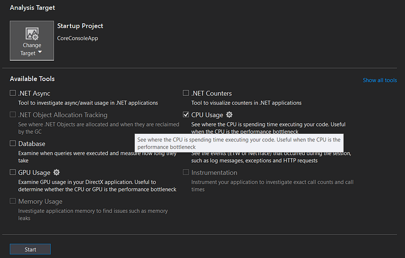

In the summary result panel, click the **Open Details…** link

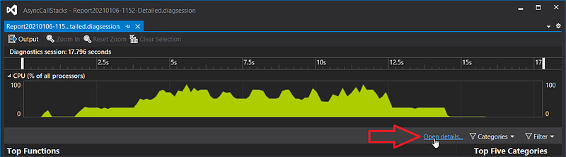

And pick the **Call Tree** view

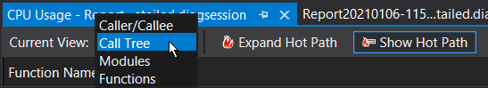

You should see two paths of execution:

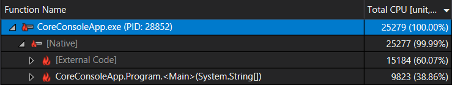

If you open the last one, you should see the expected chain of calls:

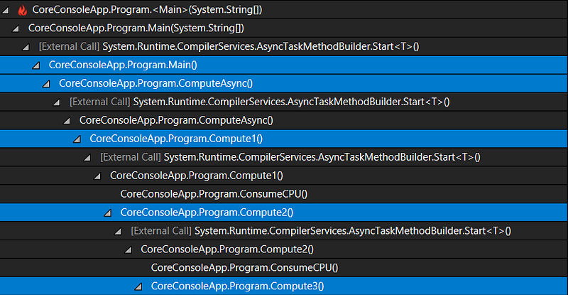

… if the methods were synchronous; which is not the case. So Visual Studio did a great job in dealing with the implementation details of **async**/**await **to present a nice call stack.

However, if you open the first node, you get something more disturbing:

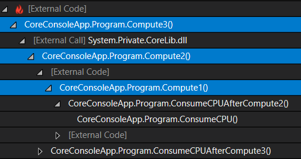

… if you don’t know how **async**/**await **is implemented. My `Compute3` code is definitively not calling `Compute2` which is not calling `Compute1`! This is where Visual Studio smart frame/callstack reconstruction brings more confusion than anything else. So what’s going on?

## Understanding async/await implementation

Unlike Visual Studio that is hiding real calls, you should be able to see what methods are really called when analyzing a memory dump with **dotnet-dump** and the **pstacks** command:

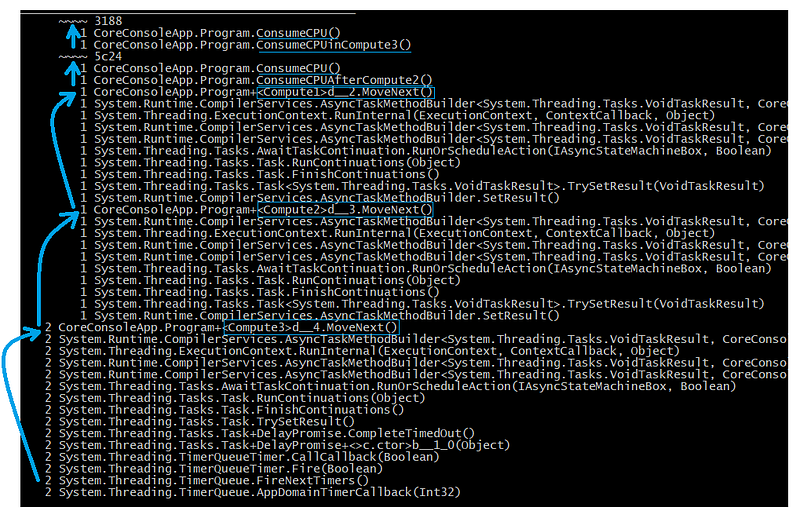

If you follow the arrows from the bottom to the top, you should see the following synchronous (because as frame in thread callstacks) calls:

- a timer callback is calling `d__4.MoveNext()` : this corresponds to the end of the `Task.Delay` in`Compute3` method.
- `d__3.MoveNext()` gets called to continue the code after `await Compute3`
- `d__.MoveNext()` gets called to continue the code after `await Compute2`
- `ConsumeCPUAfterCompute2()` gets called as expected
- `ComputeCPU()`** **or `ConsumeCPUInCompute3()` get called as expected

All the fancy methods names are due to “state machine” types that is generated by the C# compiler when you (1) define **async **methods that (2) await other **async **methods (or any “awaitable” object). Their role is to manage a “state machine” to execute code synchronously up to an **await** call, and again up to the next **await** call, and again and again until the method returns.

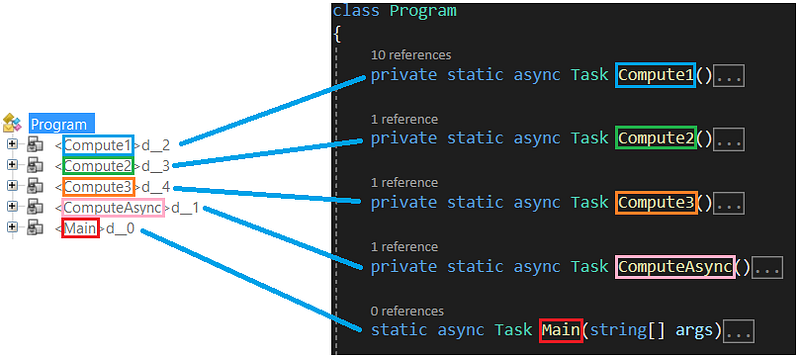

All these `d__*` types contains fields corresponding to each **async** method local variables and parameters if any. For example, here is what is generated for the `ComputeAsync`** **and `Compute1/2/3` **async** methods without any local or parameter:

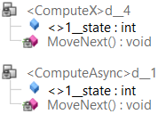

The integer `<>1__state` field keeps track of the “execution state” of the machine. For example, after the state machine is created in `Compute1`, this field is set to **-1**:

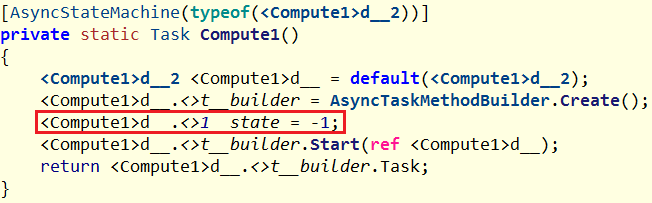

I don’t want to dig into the builder details but just let’s just say that the `MoveNext` method of the state machine `d__2` gets executed (by the same thread).

Before looking at the `MoveNext` implementation corresponding to the `Compute1` method (without exception handling), keep in mind that it has to :

- run all code up to an **await **call,
- change the “execution state” (more on this later)
- do some magic to execute that code in another thread (if needed — more on this later)
- come back to continue the execution of the code after the **await** call
- and do that up to the next **await** call again and again

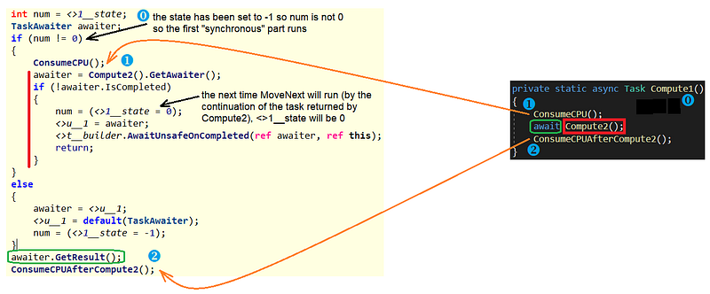

Since `<>1__state` is -1, the first “synchronous” part of the code is executed (i.e. calling `ComsumeCPU` method).

The `Compute2` method is then called to get the corresponding awaitable object (here a `Task`). If the task runs immediately (i.e. no **await** call such as a simple `Task.FromResult()` in the **async** method), `IsCompleted()` will return **true** and the code after the **await** call will be run by the same thread. Yes it means that **async**/**await** calls could be run synchronously by the same thread: why creating a thread when it is not needed?

If the Task is passed to the ThreadPool to be executed by a worker thread, the `<>1__state` value is set to **0** (so the next time `MoveNext` is called, the next “synchronous” part (i.e. after the **await** call) will be executed). The code now calls `awaitUnsafeOnCompleted` to do its magic: adding a continuation to the `Compute2` task (the first **awaiter** parameter) so that `MoveNext` will be called on that same state machine (the second **this** parameter) when the task ends. The current thread then quietly returns.

So when the `Compute2` task ends, its continuation runs to call `MoveNext` this time with `<>1__state` as **0** so the last two lines are executed: `awaiter.GetResult()` returns immediately because the `Task` returned by `Compute2` already ended and the last `CinsumeCPUAfterCompute2` method is now called.

Here is a summary of what is happening:

- Each time you see an **async** method, the C# compiler is generating a dedicated state machine type with a `MoveNext` method that is responsible for executing your code synchronously between **await** calls
- each time you see an **await** call, it means that a continuation will be added to the `Task` wrapping the **async** method to be executed. That continuation code will call the `MoveNext` method of the state machine of the calling method to execute the next piece of code up to its next **await** call.

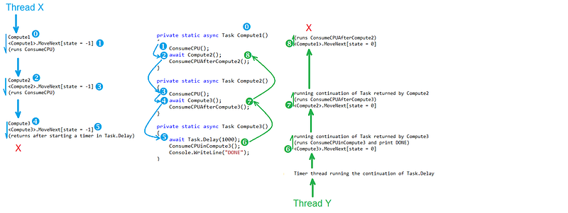

This is why Visual Studio, trying to smartly match each async method state machine `MoveNext` frame to the method itself, shows reversed callstacks: the shown frames are the ones corresponding to the continuations after the **await** calls (in green in the previous figure).

Note that I described in more details how **async**/**await** is working and the action of `AwaitUnsageOnCompleted` during a [DotNext conference session](https://youtu.be/8Ans2u4Bsi8?t=995) with [Kevin](https://twitter.com/KooKiz) so feel free to watch the [recording at that particular time](https://youtu.be/8Ans2u4Bsi8?t=995) if you want to go deeper.

The next post will describe what to do in Perfview to get more readable callstacks.

### Stay tuned!

---

**Check out our latest posts on Medium:**

[**Top Applications of Graph Neural Networks 2021**
*GNNs have come a long way in academia. But do we have good applications of them in industry?*medium.com](https://medium.com/criteo-engineering/top-applications-of-graph-neural-networks-2021-c06ec82bfc18)[](https://medium.com/criteo-engineering/top-applications-of-graph-neural-networks-2021-c06ec82bfc18)[**Build your own .NET CPU profiler in C#**
*After describing memory allocation profiling it is now time to dig into the CPU sample profiling in C#!*medium.com](/posts/2020-12-08_build-your-own-net/)

---

**Join the crowd!**

[**Careers at Criteo | Criteo jobs**
*Find opportunities everywhere. ​Choose your next challenge. *careers.criteo.com](http://careers.criteo.com)[](http://careers.criteo.com)
