---

## Introduction

In the [previous post](/posts/2021-01-19_understanding-reversed-callsta/), I described why you might get weird reversed callstacks in Visual Studio when analyzing or debugging async/await code. And if you are using Perfview to profile the same application, you should also get the same reverse continuation flow:

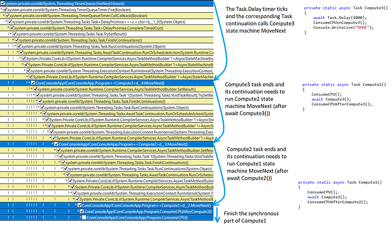

The rest of the post describes how to easily profile with Perfview and more interestingly, how to leverage grouping/folding features to get much more readable asynchronous callstacks.

## Perfview 101

Here are the different steps to get the previous tree-like representation of a profiling session results.

First, start a data collection by clicking the **Start Collection** button from the **Collect | Collect** dialog box and check **Kernel Base**, **CPU Samples**, and **.NET** boxes:

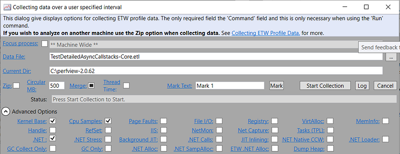

Stop the collection when the application ends and double-click the **CPU Stacks** node :

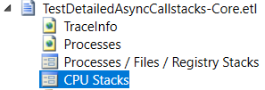

After selecting the application in the **Select Process Window**

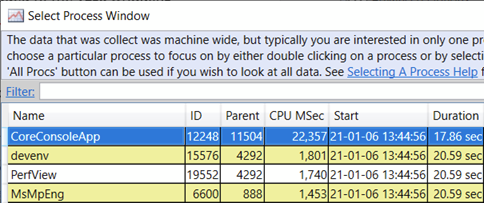

click the **CallTree** tab:

Before entering the dreaded yellow/white CPU Stacks window, let’s spend some time detailing its vast toolbar in the following figure:

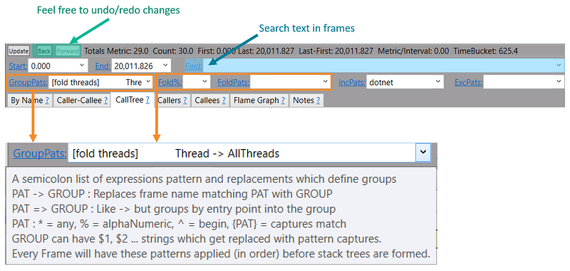

The most powerful elements are the ***Pats** combo-boxes. Each of them supports a “simple” matching pattern syntax for different purposes (don’t worry, you will see how to use them in many more examples later):

- **GroupPats**: merge sibling matching frames into one.
- **FoldPats**: matching frames are folded into parent frame.
- **IncPats**: non matching frames are removed (used for process filtering for example).
- **ExcPats**: matching frames are excluded.

Let’s see what we get with all combo-box set as empty for the **CallTree** tab:

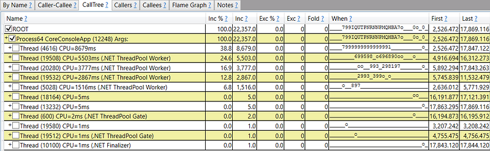

For server applications, we are usually not interested in making any difference between threads so it would be nice to group all threads under a single **AllThreads** node. This is exactly what the first choice of the **GroupPats** combo-box provides:

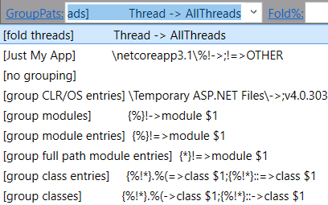

The effect is simple: all lines at the same level containing “Thread” in the text are merged into a new line with “AllThreads” as new text

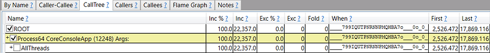

You can now get the same kind of tree based representation as in Visual Studio: the difference is that you need to open each node by clicking a checkbox (or right-click + **Expand All** to see the whole tree)

Most columns meaning are quite self-explicit except maybe the **When** column that provides the CPU usage graph over time in a “textual” way:

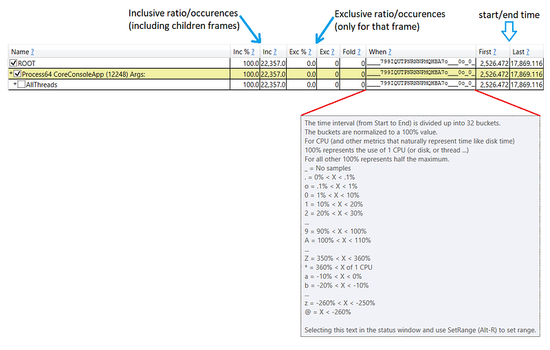

The **CallTree** representation obviously displays the frames sorted by **Inc%** column.

## Going further with Perfview

When expanding the calltree, you usually get lost in the async/await implementation details. The following screenshot shows the signal/noise ratio for my simple test application where we don’t really care about the blue lines!

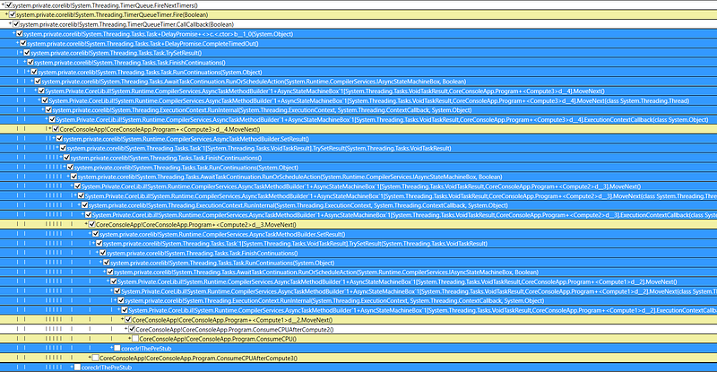

This is where the different Perfview combo-boxes are coming to the rescue. Some frames and their children are clearly not interesting such as the last two **coreclr!ThePreStub**. In that case, select the frame and copy the text from the status bar (yes: this is possible and so handy!)

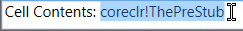

and paste it into the **ExcPats** combo-box

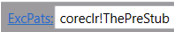

to make the corresponding frames disappear.

Unfortunately, you can’t do the same for the other Task-related frames because these **ExcPats** matching frames are completely removed with their children where your async method calls appear.

## Folding patterns are your friends

This time, the **FoldPats** combo-box will be your friend: each frame that maps one of its ; separated substring will disappear and its occurrence count will be added to its parent frame. Since all these Task-related frame do not appear a lot, the impact in the Inc/Exc columns of the parent frames should be minimal. After I used the following substrings:

> Tasks.Task+DelayPromise.CompleteTimedOut(;Tasks.Task.FinishContinuations(;Tasks.Task.RunOrQueueCompletionAction;Tasks.Task.RunContinuations(;Tasks.Task+DelayPromise+;Tasks.AwaitTaskContinuation.RunOrScheduleAction;Runtime.CompilerServices.AsyncTaskMethodBuilder`;CompilerServices.AsyncTaskMethodBuilder.Start(;CompilerServices.AsyncMethodBuilderCore.Start(;ExecutionContext.RunInternal(;CompilerServices.AsyncTaskMethodBuilder.SetResult(;Tasks.VoidTaskResult].TrySetResult;.TrySetResult(System.Threading.Tasks.;Tasks.Task.TrySetResult(

the callstack was much more readable:

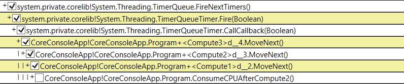

## Morph the frames

The final step is to transform the frames text into something more meaningful thanks to the **GroupPats** combo-box. At the beginning of this post, I picked the predefined **[fold threads] Thread -> AllThreads** grouping pattern. The starting text between **[]** is used as a title by Perfview to allow the user to more easily figure out what its role is. The rest of the string defines how parts of each frame should match and be grouped. The corresponding contextual help has already been shown earlier when the toolbar was detailed.

Here, I don’t want to group all sibling frames into a group but rather morph the text into something more readable. The part before **->** or **=>** is used as matching pattern to be replaced by the part after the sign. It is also possible to “extract” elements between **{}** from the matching pattern to be used to build the replacement string. Each matched element is identified as **$1**, **$2**,… based on its position in the pattern.

In my example, I would like to apply the following transformation:

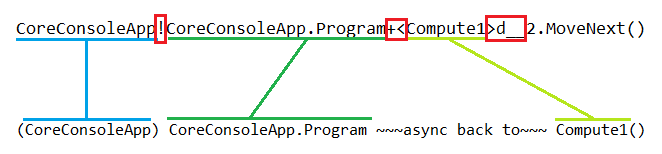

To write the pattern, you should focus on the separators (**!**, **+<** and **>d__** in this case):

**+<****.

The building of the replacement string is simply counting the matching item position (starting at 1):

(**$1**) **$2** ~~~async back to~~~ **$3**()

And here is the corresponding final result:

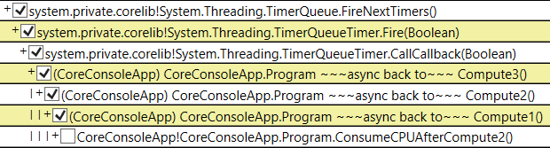

## Don’t lose your xxxPats!

It is interesting to note that you could define your own patterns preset via the **Preset** menu item

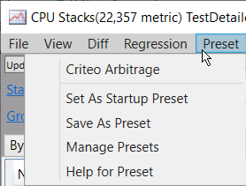

As you can see here, I have defined my own **Criteo Arbitrage** preset. If you want to reuse the content of **GroupPats**, **FoldPats**, and **Fold%** combo-boxes, click the **Save As Preset** (or even **Set As Startup Preset** to get them when you start Perfview) and pick a name

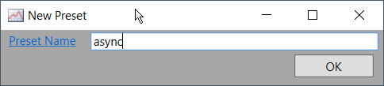

Feel free to use the **Manage Presets** dialog for easier preset manipulation:

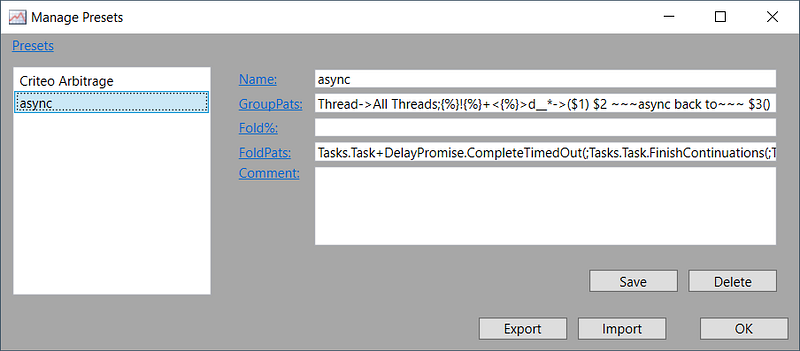

I hope that, now, you better understand the value of Perfview to analyze complicated callstacks.

---

**Read more from Christophe on our Medium blog!**

[**Consul Streaming: What’s behind it?**
*Let’s look at new hidden feature for Consul large or very dynamic clusters of Consul 1.9: Streaming.*medium.com](https://medium.com/criteo-engineering/consul-streaming-whats-behind-it-6f44f77a5175)

**Like what you are reading? Join us and make an impact!**

[**Careers at Criteo | Criteo jobs**
*Find opportunities everywhere. ​Choose your next challenge. Find the job opportunities at Criteo in Product, research &…*careers.criteo.com](http://careers.criteo.com)
