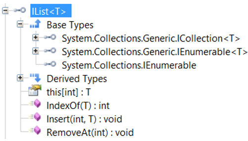
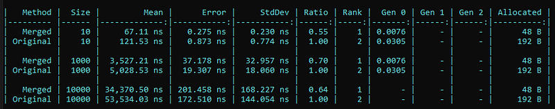

---


In the context of helping the teams at Criteo to clean up our code base, I gathered and documented a few C# anti-patterns similar to [Kevin](https://twitter.com/KooKiz)’s publication about [performance code smell](https://kevingosse.medium.com/performance-best-practices-in-c-b85a47bdd93a). Here is an extract related to good/bad memory patterns.

Even though the garbage collector is doing its works out of the control of the developers, the less allocations are done, the less the GC will impact an application. So the main goal is to avoid writing code that allocates unnecessary objects or references them too long.

## Finalizer and IDisposable usage

Let’s start with a hidden way to referencing an object: implementing a “finalizer”. In C#, you write a method whose name is the name of the class prefixed by **~**. The compiler generates an override for the virtual [**Object.Finalize**](https://docs.microsoft.com/en-us/dotnet/api/system.object.finalize?WT.mc_id=DT-MVP-5003325) method. An instance of such a type is treated in a particular way by the Garbage Collector:

- after it is allocated, a reference is kept in a** Finalization** internal queue
- after a collection, if it is no more referenced, this reference is moved into another **fReachable** internal queue and treated as a root until a dedicated thread calls its finalizer code

As Konrad Kokosa details in [one of his free GC Internals video](https://twitter.com/konradkokosa), instances of a type implementing a finalizer stay much longer in memory than needed; waiting for the next collection of the generation in which the previous collection left it (i.e. gen1 if it was in gen0 or even worse, gen2 if it was in gen1).

So the first question people are usually asking is: do you really need to implement a finalizer? Most of the time, the answer should be no. The code of a finalizer is responsible for cleaning up **ONLY** resources that are **NOT** managed. It usually means “stuff” received from COM interop or P/Invoke calls to native functions such as handles, native memory or memory allocated via [Marshal ](https://docs.microsoft.com/en-us/dotnet/api/system.runtime.interopservices.marshal?WT.mc_id=DT-MVP-5003325)helpers. If your class has **IntPtr** fields, it is a good sign that their lifetime finishes in a finalizer via **Marsal** helpers or P/Invoke cleanup calls. Look for [**SafeHandle**](https://docs.microsoft.com/en-us/dotnet/api/system.runtime.interopservices.safehandle?WT.mc_id=DT-MVP-5003325)-derived class if you need to manipulate kernel object handles instead of raw **IntPtr** and avoiding finalizers. So in 99.9% of the cases, you don’t need a finalizer.

The second question is how implementing a finalizer relates to implementing [**IDisposable**](https://docs.microsoft.com/en-us/dotnet/api/system.idisposable?WT.mc_id=DT-MVP-5003325)? Unlike a finalizer, implementing the unique **Dispose()** method of **IDisposable** interface in a class means nothing for the Garbage Collector. So there is no side effect to extend the lifetime of its instances. This is only a way to allow the users of instances of this class to explicitly cleanup such an instance at a certain point in time instead of waiting for a garbage collection to be triggered.

Let’s take an example: when you want to write to a file, behind the scene, .NET will call native APIs that operate on real file (via kernel object handles on Windows) with limited concurrent access (i.e. two processes can’t corrupt a file by writing different things at the same time — this is a very high level view of the situation but valid enough for this discussion). Another class would allow access to databases via a limited number of connections that should be released as soon as possible. In all these scenarios, as a user of these classes, you want to be able to “release” the resources used behind the scene as quickly as possible when you don’t need to access them anymore. This translates into the well known **using **pattern in C#:

```csharp
using (var disposableInstance = new MyDisposable())
{
   DoSomething(disposableInstance);
}; // the instance will be cleanup and its resources released
```

that is transformed by the C# compiler into:

```csharp
var disposableInstance = new MyDisposable();
try
{
   DoSomething(disposableInstance);
}
finally
{
   disposableInstance?.Dispose();
}
```

So when should you implement **IDisposable**? My answer is simple: when the class owns fields of classes that implement **IDisposable** **and** if it implements a finalizer (for the good reasons already explained). Don’t use **IDisposable.Dispose** for other reasons such as logging (like what we used to do in C++ destructor): prefer to implement another explicit interface dedicated to that purpose.

In term of implementation, I have to say that I never understood why Microsoft decided to provide such a confusing implementation in its [documentation](https://docs.microsoft.com/en-us/dotnet/standard/garbage-collection/implementing-dispose?WT.mc_id=DT-MVP-5003325). You have to implement the following method to *“free” unmanaged and managed resources*. It should be called by both the finalizer and **IDisposable.Dispose()**:

```csharp
protected virtual void Dispose(bool disposing)
{
   // free unmanaged and managed resources
}
```

You also need to have a **_disposed** field to allow **IDisposable.Dispose()** to be called more than once without problem. In all methods and properties of the class, don’t forget to throw an **ObjectDisposedException** if **_disposed** is true to catch usage of already disposed objects.

Ask a group of developers when **disposing** should be true or false: half will say when called from the finalizer and the other half from **Dispose** (and I’m not counting those who are not sure). Why giving the same name to the method that already exists in **IDisposable**? Why picking “disposing” as parameter name? I don’t think it could been possible to find a more confusing solution: too many “*dispose*” kills the pattern…

Here is my own implementation that does exactly the same thing but with much less confusion:

```csharp
class DisposableMe : IDisposable
{
    private bool _disposed = false;

    // 1. field that implements IDisposable
    // 2. field that stores "native resource" (ex: IntPtr)

    ~DisposableMe()
    {
        Cleanup("called from GC" != null);
    }           // = true

    public void Dispose()
    {
        Cleanup("not from GC" == null);
    }           // = false
    
    ...
}
```

I also rename **Dispose(bool disposing)** into **Cleanup(bool from GC)**:

```csharp
 private void Cleanup(bool fromGC)
 {
     if (_disposed)
         return;

     try
     {
         // always clean up the NATIVE resources
         if (fromGC)
             return;

         // clean up managed resources ONLY if not called from GC
     }
     finally
     {
         _disposed = true;

         if (!fromGC)
             GC.SuppressFinalize(this);
     }
 }
```

The rules you have to keep in mind are simple:

- native resources (i.e. **IntPtr** fields) must always be cleaned up
- managed resources (i.e. **IDisposable** fields) should be disposed when called from **Dispose** (not from GC)

The **_disposed** boolean field is used to cleanup resources only once. In this implementation, it is set to true even if an exception happens because I’m assuming that if it just happened, it will also happen if called another time.

Last but not least, the call to `GC.SuppressFinalize(this)` simply tells the GC to remove the disposed object from the **Finalization** internal queue:

- it is only meaningful when called from **Dispose** (not from GC) to avoid extending its lifetime.
- it means that the finalizer will never be called. If it were, it would have called **Cleanup** that would have returned immediately because **_disposed** is true.

The rest of the post describes typical anti-patterns. However, as usual with performance related topic, remember that the impact might not be noticeable if it does not run in a hot path. Always balance between readability/ease of maintenance/understanding and performance gain.

## Provide list capacity when possible

It is recommended to provide a capacity when creating a **List** or a collection instance. The .NET implementation of such classes usually stores the values in an array that need to be resized when new elements are added: it means that:

- A new array is allocated
- The former values are copied to the new array
- The former array is no more referenced

In the following example, the capacity of **resultList** is **otherList.Count**

```csharp
var resultList = new List<...>();
foreach (var item in otherList)
{ 
   resultList.Add(...);
}
```

## Prefer StringBuilder to +/+= for string concatenation

Creating temporary objects will increase the number of garbage collections and impact performances. Since the string class is immutable, each time you need to get an updated version of a string of characters, the .NET framework ends up creating a new string.

For string concatenation, avoid using **Concat**, **+** or **+=**. This is especially important in loop or methods called very often. For example in the following code, a **StringBuilder** should be used:

```csharp
var productIds = string.Empty;
while (match.Success)
{
   productIds += match.Groups[2].Value + "\n";
   match = match.NextMatch();
}
```

Again in loops, avoid creating temporary string such as in the following code where **SearchValue.ToUpper()** do not change in the loop:

```csharp
if (SelectedColumn == Resources.Journaux.All && !String.IsNullOrEmpty(SearchValue))
    source = model.DataSource.Where(x => x.ItemId.Contains(SearchValue)
        || x.ItemName.ToUpper().Contains(SearchValue.ToUpper())
        || x.ItemGroupName.ToUpper().Contains(SearchValue.ToUpper())
        || x.CountingGroupName.ToUpper().Contains(SearchValue.ToUpper()));
 
 
if (SelectedColumn == Resources.Journaux.ItemNumber)
    source = model.DataSource.Where(x => x.ItemId.ToUpper().Contains(SearchValue.ToUpper()));
 
 
if (SelectedColumn == Resources.Journaux.ItemName)
    source = model.DataSource.Where(x => x.ItemName.ToUpper().Contains(SearchValue.ToUpper()));
 
 
if (SelectedColumn == Resources.Journaux.ItemGroup)
    source = model.DataSource.Where(x => x.ItemGroupName.ToUpper().Contains(SearchValue.ToUpper()));
 
if (SelectedColumn == Resources.Journaux.CountingGroup)
    source = model.DataSource.Where(x => x.CountingGroupName.ToUpper().Contains(SearchValue.ToUpper()));
```

The effect is even worse due to the **Where()** clause that create a new temporary upper string for each element of the sequence!

This recommendation also applies to types that provides string-based direct access to characters such as in the following code:

```csharp
if (!uriBuilder.ToString().EndsWith(".", true, invCulture))
```

where **ToString()** is not needed because it is possible to directly access the last character:

```csharp
if (uriBuilder[uriBuilder.Length - 1] != '.')
```

## Caching strings and interning

Prefer static cache of read-only objects to recreating them in each call such as in the following example:

```csharp
var allCampaignStatuses = 
   ((CampaignActivityStatus[])Enum.GetValues(typeof(CampaignActivityStatus)))
   .ToList();
```

*(Replace by a static list since the enumeration elements won’t change)*

Last but not least, when string keys (with only a few different values) are used, you could “intern” them (i.e. ask the CLR to cache a value and always return the same reference). Read the corresponding [Microsoft Docs](https://docs.microsoft.com/en-us/dotnet/api/system.string.intern) for more details.

## Don’t (re)create objects

The first pattern to use is the static classes with static methods to avoid the creation of temporary objects just to call fields-less methods. It is also recommended to pre-compute read-only list instead of re-creating it each time a method gets called like in the following example :

```csharp
var allCampaignStatuses = 
   ((CampaignActivityStatus[])Enum.GetValues(typeof(CampaignActivityStatus)))
   .ToList();
   // use allCampaignStatuses in the rest of the method
```

This list could have been computed once as a static field of the class because the enumeration will not change during the application lifetime.

Avoid repeated calls and keep values in local variables when used in a loop; this is particularly easy to forget when dealing with string **ToLower()** and **ToUpper()**.

```csharp
var found = elements.Any(
// ToLower() is called in each test
k => string.Compare(
       k.ToLower(), 
       key.ToLower(), 
       StringComparison.OrdinalIgnoreCase
       ) == 0);
```

*(a new temporary string will be created by key.ToLower() by each test)*

Prefer **String.Compare(…, StringComparison.OrdinalIgnoreCase)** to avoid calling **ToLower()/ToUpper()** just for string comparison such as in the following example:

```csharp
if (transactionIdAsString != null && transactionIdAsString.ToLowerInvariant() == "undefined")
```

becomes:

```csharp
if (transactionIdAsString != null && string.Compare(transactionIdAsString, "undefined", StringComparison.OrdinalIgnoreCase) == 0)
```

## Best practices with LINQ

The LINQ syntax is used extensively all over the source code. However, several patterns are found very often and might impact overall performance.

## Prefer IEnumerable<T> to IList<T>

Most of the methods are iterating on sequences represented by **IEnumerable<T>** either via **foreach()** or thanks to **System.Linq.Enumerable** extension methods. **IList<T>** should be used only when sequence modification is required:



It is also recommended to use **IEnumerable<T>** instead of **IList<T>** as method parameters if there is no need to add/remove elements to the sequence. That way, the client code don’t have to use **ToList()** before calling the method. The same comment applies to return types that should be **IEnumerable<T>** rather than **IList<T>** because most of the time, the sequence will simply be iterated via a **foreach** statement.

## FirstOrDefault and Any are your friends… but might not be needed

First, there is no need to call **Any** (or even worse **ToList().Count > 0**) before **foreach** such as in the following code:

```csharp
if (sequence != null && sequence.Any())
{
   foreach (var item in sequence)
   ...
}
```

## Avoid unnecessary ToList()/ToArray() calls

LINQ queries are supposed to defer their execution until the corresponding sequence is iterated such as with a **foreach **statement. This is also the case when **ToList()** or **ToArray()** are called on such a query:

```csharp
var resourceNames = resourceAssembly
.GetManifestResourceNames()
.Where(r => r.StartsWith($"{resourcePath}.i18n"))
.ToArray();

foreach (var resourceName in resourceNames)
{
   ...
}
```

The **ToList()** method builds a **List<>** instance that contains all elements of the given sequence. It should be used carefully because the cost of creating a list from a large sequence of objects could be high both in term of memory and performance due to the implementation of element addition in **List<>**.

The only recommended usages are:

- optimization sake to avoid executing the underlying query several times when it is expensive
- removing/adding elements from a sequence
- storing the result of a query execution in a class field

However, most of the times, you don’t need to call **ToList()** to iterate on a **IEnumerable<T>**. If you do so, you hurt the runtime execution both in term of memory consumption (because of the unneeded **List<T>** that is just temporary) and in term of performance because the sequence gets iterated twice.

The base of LINQ to Object is the I**Enumerable** interface used to iterate on a sequence of objects. All LINQ extension methods are taking **IEnumerable** instances as parameter in addition to **foreach **constructs. It is also not needed to call **ToList()** when an **IEnumerable** is expected (this is a good reason to prefer **IEnumerable** to **IList**/**List**/**[]** in method signatures)

Some methods are calling **ToList()** before **Where** clauses are applied to an **IEnumerable** sequence: it is more efficient to stack the **Where** clauses and call **ToList()** at the end.

Last but not least, it is not needed to call **ToList()** to get the number of elements in a sequence such as in the following code sample:

```csharp
productInfos
  .Select(p => p.Split(DisplayProductInfoSeparator)[0])
  .Distinct()
  .ToList()
  .Count;
```

becomes:

```csharp
productInfos
  .Select(p => p.Split(DisplayProductInfoSeparator)[0])
  .Distinct()
  .Count();
```

### Prefer IEnumerable<>.Any to List<>.Exists

When manipulating **IEnumerable**, it is recommended to use **Any** instead of **ToList().Exists()** such as in the following code:

```csharp
if (sequence.ToList().Exists(…))
```

becomes:

```csharp
if (sequence.Any(...))
```

### Prefer Any to Count when checking for emptiness

The **Any **extension methods should be preferred to count computation on **IEnumerable** because the iteration on the sequence stops as soon as the condition (if any) is fulfilled without allocating any temporary list:

```csharp
var nonArchivedCampaigns = 
   campaigns
   .Where(c => c.Status != CampaignActivityStatus.Archived)
   .ToList();
if (nonArchivedCampaigns.Count == 0)
```

becomes:

```csharp
if (!campaigns.Where(c => c.Status != CampaignActivityStatus.Archived).Any())
```

Note that it is also valid to use `if (!campaigns.Any(filter))`

## Order in extension methods might matter

When operators are applied to sequences (i.e. **IEnumerable**), their order might have an impact on the performance of the resulting code. One important rule is to always filter first so the resulting sequences get smaller and smaller to iterate. This is why it is recommended to start a LINQ query by **Where** filters.

With LINQ, the code you write to define a query might be misleading in term of execution. For example, what is the difference between:

```csharp
var filteredElements = sequence
  .Where(first filter)
  .Where(second filter)
  ;
```

and:

```csharp
var filteredElements = sequence
  .Where(first filter && second filter)
  ;
```

It depends on the query executor. For LINQ for Objects, it seems that there is no difference in term of the filters execution: the first and second filters will be executed the same number of times as shown by the following code:

```csharp
 var integers = Enumerable.Range(1, 6);
 var set1 = integers
 .Where(i => IsEven(i))
 .Where(i => IsMultipleOf3(i));

 foreach (var current in set1)
 {
     Console.WriteLine($"--> {current}");
 }

 Console.WriteLine("--------------------------------");

 var set2 = integers
 .Where(i => IsEven(i) && IsMultipleOf3(i))
 ;

 foreach (var current in set2)
 {
     Console.WriteLine($"--> {current}");
 }
```

When you run it, you get the exact same lines in the console:

```
IsEven(1)
IsEven(2)
   IsMultipleOf3(2)
IsEven(3)
IsEven(4)
   IsMultipleOf3(4)
IsEven(5)
IsEven(6)
   IsMultipleOf3(6)
--> 6
--------------------------------
IsEven(1)
IsEven(2)
   IsMultipleOf3(2)
IsEven(3)
IsEven(4)
   IsMultipleOf3(4)
IsEven(5)
IsEven(6)
   IsMultipleOf3(6)
--> 6
```

However, when you run it under Benchmark.NET,

```csharp
 private int[] _myArray;

 [Params(10, 1000, 10000)]
 public int Size { get; set; }

 [GlobalSetup]
 public void Setup()
 {
     _myArray = new int[Size];

     for (var i = 0; i < Size; i++)
         _myArray[i] = i;
 }

 [Benchmark(Baseline = true)]
 public void Original()
 {
     var set = _myArray
         .Where(i => IsEven(i))
         .Where(i => IsMultipleOf3(i))
         ;

     int i;
     foreach (var current in set)
     {
         i = current;
     }
 }

 [Benchmark]
 public void Merged()
 {
     var set = _myArray
         .Where(i => IsEven(i) && IsMultipleOf3(i))
         ;

     int i;
     foreach (var current in set)
     {
         i = current;
     }
 }
```

the results are significantly better for the single “merged” **Where** clause:



After looking at the implementation in the [.NET Framework](https://referencesource.microsoft.com/#System.Core/System/Linq/Enumerable.cs,44b8532e11187695) with my colleague [Jean-Philippe](https://twitter.com/durot_jp), the additional cost seems to be related to the underlying **IEnumerator** corresponding to the first **Where**.

Remember to never assume and always measure.

---

Interesting in joining the team? Check out our latest job posts:

[**Senior Site Reliability Engineer - PRE Team (remote flexibility with base in France) job in Paris**
careers.criteo.com](https://careers.criteo.com/job/341c287d-f045-46b9-b3ff-70f773ce6911/Senior-Site-Reliability-Engineer-PRE-Team-remote-flexibility-with-base-in-France)[](https://careers.criteo.com/job/341c287d-f045-46b9-b3ff-70f773ce6911/Senior-Site-Reliability-Engineer-PRE-Team-remote-flexibility-with-base-in-France)[**Senior Site Reliability Engineer - PRE - Performance (remote flexibility with base in France)**
careers.criteo.com](https://careers.criteo.com/job/38e2cc1c-718c-4d2d-ae62-4f5206192de7/Senior-Site-Reliability-Engineer-PRE-Performance-remote-flexibility-with-base-in-France)[](https://careers.criteo.com/job/38e2cc1c-718c-4d2d-ae62-4f5206192de7/Senior-Site-Reliability-Engineer-PRE-Performance-remote-flexibility-with-base-in-France)
