---

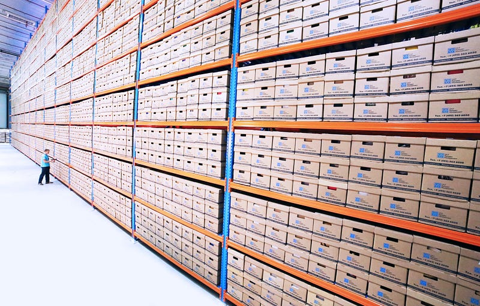

I have already explained how to [write your own allocation monitoring tool](/posts/2020-04-18_build-your-own-net/). Each time 100 cumulated KB are allocated, the CLR emits an [AllocationTick event](https://docs.microsoft.com/en-us/dotnet/framework/performance/garbage-collection-etw-events#gcallocationtick_v2-event?WT.mc_id=DT-MVP-5003325) with the name of the last allocated type before the 100 KB threshold and if it is in the LOH or not. This post shows you how to get these events with the corresponding callstacks thanks to the Microsoft [Perfview free tool](https://github.com/microsoft/perfview/releases/).

On Linux, things are a little bit more complicated because the Kernel provider does not exist to emit callstacks events. Microsoft provides the [perfcollect script](https://github.com/microsoft/perfview/tree/main/src/perfcollect) to get a zip file containing both the CLR events (collected by LTTng) and the callstacks (collected via perf). If you want, like [dotnet-trace](https://docs.microsoft.com/en-us/dotnet/core/diagnostics/dotnet-trace?WT.mc_id=DT-MVP-5003325), to rely on EventPipe instead of LTTng, you could use [Criteo fork of the perfcollect script](https://github.com/criteo-forks/perfview) and the corresponding updated version of Perfview to open the generated .trace.zip file. Note that our [Pull Request](https://github.com/microsoft/perfview/pull/1291) to the Microsoft Perfview repository is still pending…

If you are on Windows, you could use Perfview (menu **Collect** | **Collect** or **Alt+C** shortcut)

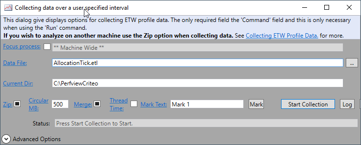

and click the **Start Collection** button. When the workflow you want to analyze is finished, click the same button (with a **Stop Collection** text this time) and the corresponding file should open up as a tree:

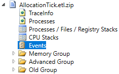

Note that with a Linux collection, the nodes might be different:

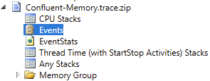

In both cases, you are interested in the events visible when you double-click the **Events** node. You could use the **Filter** textbox to easily find the AllocationTick line in the left panel. Then, right-click and select **Open Any Stacks**:

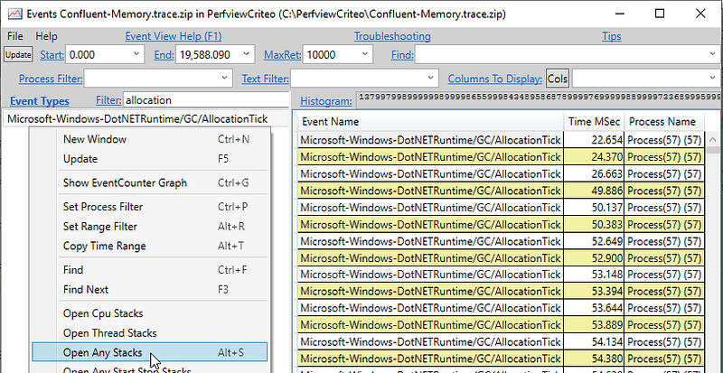

This action opens up a new windows that is different between a Windows and a Linux collection:

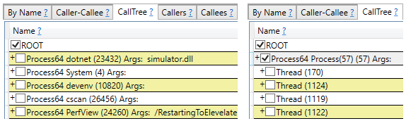

The reason is simple: on Windows, events from ALL processes have been collected while only process is targeted on Linux. This is why you have to double-click the process you want on Windows while it is already selected for Linux. You could also keep only events from a process by entering its ID in the **IncPats** combo-box:

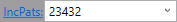

Instead of staying on the **CallTree** tab, I recommend to select the **By Name** tab instead and double-click the AllocationTick line:

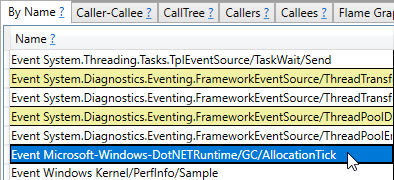

This action moves to the **Caller** tab with AllocationTick selected:

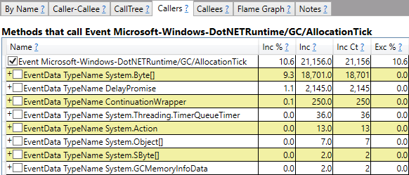

Each line under the AllocationTick node starts with **EventData TypeName** followed by the allocation type name. **EventData** is the name of the event payload used by Perfview and **TypeName** is the property name in the payload.

The **Inc** columns gives an hint about the split of the different allocations. Remember that the AllocationTick events are providing a sampling of the allocations, not an exact picture but it should be enough. In the previous screenshot, the majority of allocations are byte arrays Byte[].

Click the corresponding checkbox to open the Byte[] node:

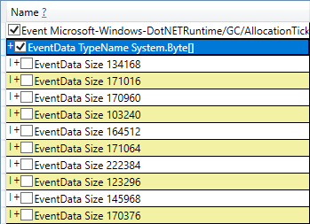

As you can guess, each line represent a different value of the **Size** property in the **EventData** payload. You don’t really care about the different values so type **EventData Size** in the FoldPats combo-box to make them disappear:

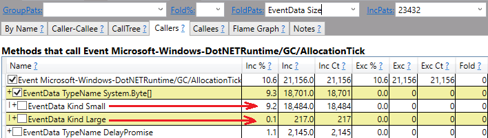

Most of the allocations are not in the LOH (i.e. less that 85.000 bytes with the default LOH threshold) and when you click the **Small** checkbox, the different callstacks leading to these allocations appear in the tree such as the **Run** method of the **RandomAllocationAction** class in the following screenshot:

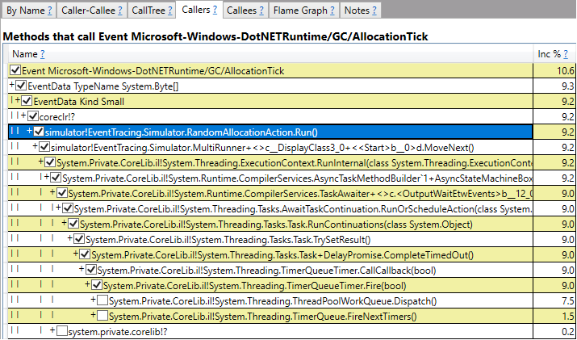

Don’t be scared by the raw state of the stack frame: read [this previous post](/posts/2021-03-02_how-to-ease-async/) to see how to better understand async/await callstacks and make them more readable.

Happy memory profiling!

---

**Interested in working on this topic? Check out our open positions:**

[**Careers at Criteo | Criteo jobs**
*Find opportunities everywhere. ​*careers.criteo.com](https://careers.criteo.com)[**Senior Site Reliability Engineer - PRE - Performance (remote flexibility with base in France) job…**
careers.criteo.com](https://careers.criteo.com/job/38e2cc1c-718c-4d2d-ae62-4f5206192de7/Senior-Site-Reliability-Engineer-PRE-Performance-remote-flexibility-with-base-in-France)
