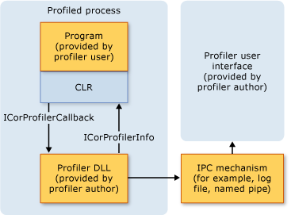
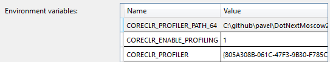
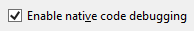
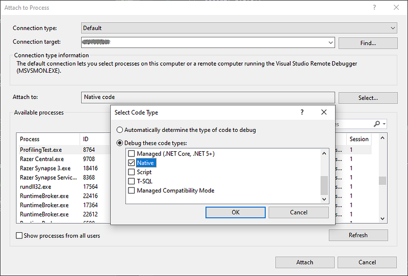

---

## Introduction

When I want to dig into a new API, I implement a real world scenario. This is exactly what I did for the .NET native profiling API. I want to know how to get parameters and return value of any method call during any .NET application life. The expected result would be something like :

```
Enter PublicClass::ClassParamReturnClass
this = 0x6f97e190 (8)
ClassType obj = 0x6f97e488 (8)
| int32 <IntProperty>k__BackingField = 84
| int32 intField = 42
| String stringField = 43
ClassType obj = 0x0000023A475BBAD8
```

```
Leave PublicClass::ClassParamReturnClass
| int32 <IntProperty>k__BackingField = 170
| int32 intField = 85
| String stringField = 86
returns 0x0000023A475BBBB0
```

when the following method is executed:

```csharp
public ClassType ClassParamReturnClass(ClassType obj)
{
   return new ClassType(obj.IntProperty + 1);
}
```

You will have to write native C/C++ code to leverage the .NET Profiling API as [John Robbins](https://twitter.com/JohnWintellect) explained in his 2003 [Debugging Applications book](https://www.amazon.com/Debugging-Applications-Microsoft-Developer-Reference/dp/0735615365). Even though Microsoft is providing a [code sample](https://github.com/Microsoft/clr-samples/tree/master/ProfilingAPI/ELTProfiler) for that, it does just show how to get notified when a function is called or exited but nothing about its type, its name, what are its parameters value and its return value. This series will detail both the .NET profiling API and the metadata API (i.e. the native reflection API).

Let’s start with the basics of .NET Profiling. As shown in the following figure from the [Microsoft Profiling documentation](https://docs.microsoft.com/en-us/dotnet/framework/unmanaged-api/profiling/profiling-overview?WT.mc_id=DT-MVP-5003325), with the right [environment configuration](https://docs.microsoft.com/en-us/dotnet/framework/unmanaged-api/profiling/setting-up-a-profiling-environment?WT.mc_id=DT-MVP-5003325), the CLR will load a COM-like object implementing [**ICorProfilerCallback**](https://docs.microsoft.com/en-us/dotnet/framework/unmanaged-api/profiling/icorprofilercallback-interface?WT.mc_id=DT-MVP-5003325) interface to notify almost everything happening in a .NET application from startup to shutdown.



Since .NET was launched, more and more notifications have been added by versioning the interface up to [**ICorProfilerCallback9**](https://docs.microsoft.com/en-us/dotnet/framework/unmanaged-api/profiling/icorprofilercallback9-interface?WT.mc_id=DT-MVP-5003325). Welcome to the usual COM world! I recommend that you watch [Pavel Yosifovich](https://twitter.com/zodiacon) session about [writing a CLR Profiler in an hour](https://youtu.be/TqS4OEWn6hQ?t=30) to get an overview. I will use [his sample solution](https://github.com/zodiacon/DotNextMoscow2019) as a starting point.

For performance sake, you tell the runtime which events you are interested in; i.e. which **ICorProfilerCallback** functions will be called and you simply have to return **S_OK** from all other functions. This setup is done in your implementation of **ICorProfilerCallback::Initialize**. This first function called by the CLR provides a parameter from which you need to **QueryInterface** a version of **ICorProfilerInfo** interface (the current one is **ICorProfilerInfo10**). This interface provides functions to query information about parameters passed to your **ICorProfilerCallback** functions (such as AppDomain, assembly, type, function, thread and so on).

The first **ICorProfilerInfo** function you will use is [**SetEventMask**](https://docs.microsoft.com/en-us/dotnet/framework/unmanaged-api/profiling/icorprofilerinfo-seteventmask-method?WT.mc_id=DT-MVP-5003325) to filter the **ICorProfilerCallback** functions that will be called by the runtime. It accepts a flag combination of values from the [**COR_PRF_MONITOR**](https://docs.microsoft.com/en-us/dotnet/framework/unmanaged-api/profiling/cor-prf-monitor-enumeration?WT.mc_id=DT-MVP-5003325) enumeration.

## Assembly code is needed for Enter/Leave/TailCall

To get notified when a managed method is called or exits, you should pass:

```
COR_PRF_MONITOR_ENTERLEAVE | 
COR_PRF_ENABLE_FUNCTION_ARGS | 
COR_PRF_ENABLE_FUNCTION_RETVAL | 
COR_PRF_ENABLE_FRAME_INFO
```

to **ICorProfilerInfo**::**SetEventMask**. The first flag tells the runtime to call [static callbacks](https://docs.microsoft.com/en-us/dotnet/framework/unmanaged-api/profiling/profiling-global-static-functions?WT.mc_id=DT-MVP-5003325) (i.e. not exposed as functions of **ICorProfilerCallback**) when a managed method gets executed or returns. The other three flags ensure that these callbacks will receive enough information to extract method arguments and return value.

Unlike the other notifications that end up calling your **ICorProfilerCallback** functions, you need to register three special callbacks to the runtime via [**ICorProfilerInfo3**::**SetEnterLeaveFunctionHooks3WithInfo**.](https://docs.microsoft.com/en-us/dotnet/framework/unmanaged-api/profiling/icorprofilerinfo3-setenterleavefunctionhooks3withinfo-method?WT.mc_id=DT-MVP-5003325) For performance reasons, the .NET team asks you to write the prolog and epilog (i.e. saving/restoring CPU registers on/from the stack) yourself in assembly code instead of relying on well-defined [calling conventions](https://docs.microsoft.com/en-us/cpp/cpp/calling-conventions?WT.mc_id=DT-MVP-5003325) supported by the C/C++ compiler.

This is why you have to call **ICorProfilerInfo3:: SetEnterLeaveFunctionHooks3WithInfo** and pass pointers to these “naked” functions. The Microsoft [*ELTProfiler*](https://github.com/Microsoft/clr-samples/tree/master/ProfilingAPI/ELTProfiler) sample implements the stubs both for x86 (as inlined assembly embedded in a C++ file) and x64 (defined in .asm file). In x64, you need to update your project file to add the following:

```xml
<ImportGroup Label = "ExtensionSettings">
   <Import Project = "$(VCTargetsPath)\BuildCustomizations\masm.props" / >
</ ImportGroup>
<ItemGroup>
<MASM Include = "../DotNext.Profiler.Shared/asm/windows/nakedcallbacks.asm"
	Condition = "'$(Platform)' == 'x64'" / >
</ ItemGroup>
<ImportGroup Label = "ExtensionTargets">
    <Import Project = "$(VCTargetsPath)\BuildCustomizations\masm.targets" / >
</ ImportGroup>
```

The nakedcallbacks.asm file contains the assembly code to call stub functions wrapped by the expected prolog and epilog written in assembly code. Here is the signature of the functions from where you will be able to start working in C++:

```csharp
PROFILER_STUB EnterStub(FunctionIDOrClientID functionId, COR_PRF_ELT_INFO eltInfo)
{
   ...
}

PROFILER_STUB LeaveStub(FunctionID functionId, COR_PRF_ELT_INFO eltInfo)
{
   ...
}

PROFILER_STUB TailcallStub(FunctionID functionId, COR_PRF_ELT_INFO eltInfo)
{
   ...
}
```

A function is identified by a **FunctionID** and this is where you start your adventure (I will come back later to the **COR_PRF_ELT_INFO** parameter). Note that for the **EnterStub** function, you need to get the **FunctionID** from the **FunctionIDOrClientID.functionId** field.

Once your hook callbacks have been registered via **ICorProfilerInfo3:: SetEnterLeaveFunctionHooks3WithInfo**, it is still possible to decide whether or not a managed method call should trigger them. For that, it is needed to register a “mapper” function that is called once per managed method with one of these functions:

- `HRESULT ICorProfilerInfo::SetFunctionIDMapper([in] FunctionIDMapper* pFunc); `
 with `UINT_PTR __stdcall Mapper(FunctionID functionId, BOOL* pHookFunction)`
- `HRESULT ICorProfilerInfo3::SetFunctionIDMapper2([in] FunctionIDMapper2* pFunc, [in] void* clientData);`
 with `UINT_PTR __stdcall Mapper2(FunctionID functionId, void* clientData, BOOL* pHookFunction)`

The latter allows you to pass some “client data” to the mapper function such as a helper class to manipulate the received **FunctionID** or your profiler state.

If **pHookFunction** is set to **TRUE**, your enter/leave functions will be called and the returned **UINT_PTR** will be passed as the **FunctionID** parameter. This allows you to handle function name or signature computation at one single place outside of the real profiling work done each time a method is called. If **pHookFunction** is set to **FALSE**, the enter/leave functions will never be called for that **FunctionID**. The mapper callback is called only once per **FunctionID**: this could be a good way to avoid performance impact if you just want to profile a small subset of methods.

## How to debug your profiler

Before going any further, it is needed to know how to debug your C++ profiler code with Visual Studio. The first step is to write a simple .NET application to execute the method calls you want to intercept. The second natural step would be to setup the environment variables needed to inject your profiler:



and also check the *Enable native code debugging* option:



If you start a debug session, the Visual Studio debugger with use both managed and native debugging APIs. Unfortunately, the managed debugging API does not allow breakpoints sets in **ICorProfilerCallback** functions.

Instead, you need to **Debug | Start Without Debugging** (**CTRL+F5**), not **Debug | Start Debugging** (**F5**) the C# test application with the same environment variables and attach the debugger via **Debug | Attach to Process**. Select the process and click **Select** button in the **Attach to** section:



To make attachment simple, add a **Console.ReadLine** in a console application before starting the method calls to test.

The next post will show you how to extract information from a **FunctionID**.

## References

- [Writing a .NET Core cross platform profiler in an hour](https://www.youtube.com/watch?v=TqS4OEWn6hQ&t=25s) video and the corresponding [source code](https://github.com/zodiacon/DotNextMoscow2019) from [Pavel Yosifovich](https://twitter.com/zodiacon)
- [Microsoft Profiling documentation](https://docs.microsoft.com/en-us/dotnet/framework/unmanaged-api/profiling/profiling-overview?WT.mc_id=DT-MVP-5003325)
- Microsoft Enter/Leave [code sample](https://github.com/Microsoft/clr-samples/tree/master/ProfilingAPI/ELTProfiler)
