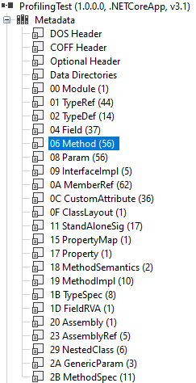
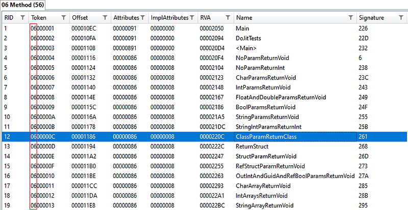
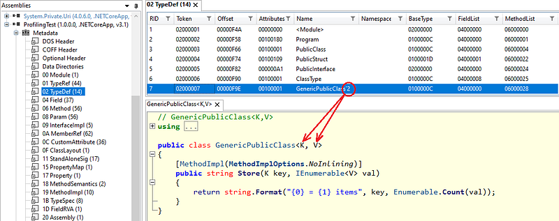
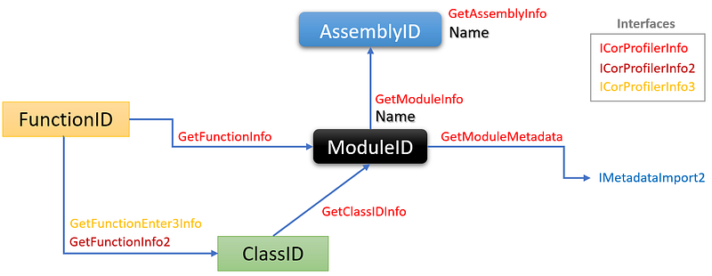

---

## Introduction

In[ the first post](/posts/2021-08-07_start-journey-into-the/) of this series dedicated to CLR Profiling API, you have seen how to get a **FunctionID** each time a managed method is executed in a .NET application. As David Broman (source of most of the profiling implementation details at Microsoft) explains, a **FunctionID** is a pointer to an internal data structure of the CLR called a **MethodDesc**. For us, it is just an opaque value that is usable in different CLR APIs. So what if you would like to know the name of the method behind this **FunctionID**?

Unlike what you might think, this first question is not an easy one, especially if you would like to get the complete signature of the method such as what you get in Visual Studio Call Stack panel:

> ProfilingTest.dll!PublicClass.ClassParamReturnClass(ClassType obj)

You will have to get the module name (i.e. the assembly where the method type is defined), the type name, the method name and the list of its parameters type and name.

This post deals with the notions of module, assembly and type in addition to introducing the .NET Metadata API.

## Identifying the module and assembly

I’m sure that most of you know what an assembly is: this is what gets generated when you compile a Class Library in Visual Studio. Easy answer. However, .NET (unlike Visual Studio) supports the notion of [multi-module assembly creation](https://docs.microsoft.com/en-us/dotnet/framework/app-domains/build-multifile-assembly?WT.mc_id=DT-MVP-5003325) bound to several “[modules](https://docs.microsoft.com/en-us/dotnet/standard/assembly/?WT.mc_id=DT-MVP-5003325)”. Each module can contain types and resources and the assembly contains the manifest listing all the modules defining the assembly.

This is why the profiling API allows you to get both assembly and module. Let’s use [**ICorProfilerInfo::GetFunctionInfo**](https://docs.microsoft.com/en-us/dotnet/framework/unmanaged-api/profiling/icorprofilerinfo-getfunctioninfo-method?WT.mc_id=DT-MVP-5003325) to find out which module and assembly is implementing the type of a given **FunctionID**.

```csharp
ClassID classId;
ModuleID moduleId;
mdToken mdtokenFunction;

pInfo->GetFunctionInfo(functionId, &classId, &moduleId, &mdtokenFunction);
```

Now that you have a **ModuleID**, you can call [**ICorProfilerInfo::GetModuleInfo**](https://docs.microsoft.com/en-us/dotnet/framework/unmanaged-api/profiling/icorprofilerinfo-getmoduleinfo-method?WT.mc_id=DT-MVP-5003325) to get its name, load address and assembly. The usage pattern of this API is common in COM: first you call it to get the size of the buffer to copy the name and then you call it a second time with the newly allocated buffer:

```csharp
LPCBYTE loadAddress;
ULONG nameLen = 0;
AssemblyID assemblyId;

hr = pInfo->GetModuleInfo(moduleId, &loadAddress, nameLen, &nameLen, NULL, &assemblyId);
if (SUCCEEDED(hr))
{
   WCHAR* pszName = new WCHAR[nameLen];  // count the trailing \0
   pInfo->GetModuleInfo(moduleId, &loadAddress, nameLen, &nameLen, pszName, 
                        &assemblyId);
   oss << L"(" << pszName << L")";
   delete [] pszName;
}
else
   oss << L"(UNKNOWN)";
```

Note that the module name is the full path name of the module file.

Here is the code that calls [**ICorProfilerInfo::GetAssemblyInfo**](https://docs.microsoft.com/en-us/dotnet/framework/unmanaged-api/profiling/icorprofilerinfo-getassemblyinfo-method?WT.mc_id=DT-MVP-5003325) to get the assembly name now that you have the **AssemblyID**:

```csharp
hr = pInfo->GetAssemblyInfo(assemblyId, 0, &nameLen, NULL, NULL, NULL);
if (SUCCEEDED(hr))
{
   WCHAR* pszName = new WCHAR[nameLen];  // count the trailing \0
   hr = pInfo->GetAssemblyInfo(assemblyId, nameLen, &nameLen, pszName, NULL, NULL);
   oss << pszName;
   delete [] pszName;
}
else
   oss << L"<UNKNOWN>";
```

The assembly name does not contain the file extension such as .dll or .so.

## ID or Token: it depends on which profiling API to use

it is important to discuss what kind of information you get from the different profiling APIs. Like **FunctionID**, **ClassID** and **ModuleID** are opaque pointers to CLR internal data structures. They are used by the runtime to map into memory metadata generated by the compiler. The metadata identifiers are usually referenced as “token” and the **mdToken** type simply stands for “metadata token”. Unlike the different **xxxID** types with values different each time the code runs, the metadata tokens stay the same because they come from the compiled assembly. While debugging, it is good to be able to compare what token you get against their corresponding value in an assembly. As an example, here is what you get with ILSpy while browsing the medatata:



Each kind of metadata is encoded into the first 2 digits so it is easy to see what you are manipulating. The 06 prefix tells you that you are dealing with a method:



Instead of **ICorProfilerInfo**, you need to use [**IMetaDataImport**](https://docs.microsoft.com/en-us/windows/win32/api/rometadataapi/nn-rometadataapi-imetadataimport?WT.mc_id=DT-MVP-5003325) to access information behind the metadata tokens. Since the metadata is bound to a given module, you have to call [**ICorProfilerInfo:: GetModuleMetaData**](https://docs.microsoft.com/en-us/dotnet/framework/unmanaged-api/profiling/icorprofilerinfo-getmodulemetadata-method?WT.mc_id=DT-MVP-5003325) to get the implementation corresponding to a given **ModuleID**.

```cpp
IMetaDataImport* pMetaDataImport;
HRESULT hr = pInfo->GetModuleMetaData(
   moduleId, ofRead, IID_IMetaDataImport, reinterpret_cast<IUnknown**>(&pMetaDataImport));
```

For the rest of the series, I will do my best to present which profiling/metadata API to use for what purpose. And in some cases, you will need both.

## Identifying the type

After the module details, let’s see what we can get for the type that implements a given **FunctionID**. For one of my test, I defined the following C# generic type:

```csharp
public class GenericPublicClass<K, V>
{ 
   [MethodImpl(MethodImplOptions.NoInlining)]
   public string Store(K key, IEnumerable<V> val)
   {
      return $"{key} = {val.Count()} items";
   }
}
```

It can be used like the following:

```csharp
var g1 = new GenericPublicClass<string, int>();
Console.WriteLine(g1.Store("secret", new int[] { 1, 2, 3, 4, 5 }));
```

Why am I starting with a generic type? That way, you will better understand that this feature has been added after the initial profiling API shipped and is not that well integrated. Basically, the first iteration of **ICorProfilerInfo** did not deal with generics but the second one **ICorProfilerInfo2** does.

But first, let’s summarize [a few basics about generics](https://docs.microsoft.com/en-us/dotnet/standard/generics/?WT.mc_id=DT-MVP-5003325/). When you define a generic type and generic methods such as for my **GenericPublicClass**, the C# compiler generates the metadata for the *generic* *type definition* that acts as a template. The *generic type parameters* (K and V in my case) are placeholders that will be instanciated by *generic type arguments* to get a final *generic* *constructed type*.

The important part to understand for our purpose is the fact that metadata will only contain generic type definitions



The name stored in the metadata ends with the ` character followed by the number of generic type parameters. This is what you get when you call **GetType().Name** on a generic instance in C#.

As shown earlier, [**ICorProfilerInfo::GetFunctionInfo**](https://docs.microsoft.com/en-us/dotnet/framework/unmanaged-api/profiling/icorprofilerinfo-getfunctioninfo-method?WT.mc_id=DT-MVP-5003325) is used to get the **ClassID** of the type implementing the given **FunctionID**. Unfortunately, in case of a generic type, it returns **S_OK** but the **ClassID** you get is 0. In that case, you know you have to call [**ICorProfilerInfo2::GetFunctionInfo2**](https://docs.microsoft.com/en-us/dotnet/framework/unmanaged-api/profiling/icorprofilerinfo2-getfunctioninfo2-method?WT.mc_id=DT-MVP-5003325):

```cpp
HRESULT GetFunctionInfo2(  
    [in]  FunctionID funcId,  
    [in]  COR_PRF_FRAME_INFO frameInfo,  
    [out] ClassID *pClassId,  
    [out] ModuleID *pModuleId,  
    [out] mdToken *pToken,  
    [in]  ULONG32 cTypeArgs,  
    [out] ULONG32 *pcTypeArgs,  
    [out] ClassID typeArgs[]
    );
```

You have the **FunctionID** but not the **COR_PRF_FRAME_INFO**… You need to call [**ICorProfilerInfo3::GetFunctionEnter3Info**](https://docs.microsoft.com/en-us/dotnet/framework/unmanaged-api/profiling/icorprofilerinfo3-getfunctionenter3info-method?WT.mc_id=DT-MVP-5003325) to get it from the **COR_PRF_ELT_INFO** given by the enter stub. Here is the final code to get a **ClassID** for a generic type:

```cpp
if (classId == 0)
{
   // Call GetFunctionEnter3Info to get the COR_PRF_FRAME_INFO* needed by GetFunctionInfo2 
   // as a second parameter and get the instanciated generic argument types. 
   // Otherwise will get <K, V> instead of <int, string> for example
   COR_PRF_FRAME_INFO frameInfo = NULL;
   ULONG nbArgumentInfo = 0;

   // NOTE: it is needed to pass &nbArgumentInfo or the method will return INVALIDARGUMENT error
   hr = pInfo->GetFunctionEnter3Info(functionId, eltInfo, &frameInfo, &nbArgumentInfo, NULL);
   // NOTE: hr will fail will insuffisant buffer size in case of generic but the frameInfo will be correct

   hr = pInfo->GetFunctionInfo2(functionId, frameInfo, &classId, &moduleId, &mdtokenFunction, 0, NULL, NULL);
}
// from here, we are sure to have a valid ClassID
```

Here is a summary of the relationships between the different IDs with the corresponding APIs to call:



## From a ClassID to a class name

It is time to enter a complicated part of the story: how to get the “name” of the type that hides behind a **ClassID**. As you might guess, the first step is to figure out if it is a generic type and what are the corresponding type arguments. You have to call [**ICorProfilerInfo2::GetClassIDInfo2**](https://docs.microsoft.com/en-us/dotnet/framework/unmanaged-api/profiling/icorprofilerinfo2-getclassidinfo2-method?WT.mc_id=DT-MVP-5003325) with the **ClassID** to get the metadata token of the type, the number of type arguments and the **ClassID** of these types if any. As usual with this kind of API, a first call is needed to get the number of type arguments so you can allocate the right sized array of **ClassID**. The second call will fill up the newly allocated array:

```cpp
mdTypeDef mdType;
ClassID parentClassId; // not needed in our scenario 
ULONG32 numGenericTypeArgs = 0;
ClassID* genericTypeArgs = NULL;

pInfo->GetClassIDInfo2(classId, NULL, &mdType, &parentClassId, 0, &numGenericTypeArgs, NULL);

if (numGenericTypeArgs > 0)
{
   genericTypeArgs = new ClassID[numGenericTypeArgs];
   pInfo->GetClassIDInfo2(classId, NULL, &mdType, &parentClassId, numGenericTypeArgs, &numGenericTypeArgs, genericTypeArgs);
}
```

Since you obtained a metadata token, you will need the [**IMetaDataImport**](https://docs.microsoft.com/en-us/dotnet/framework/unmanaged-api/metadata/imetadataimport-interface?WT.mc_id=DT-MVP-5003325) of the module where the type is defined to get details such as… its name. The [**IMetaDataImport2**](https://docs.microsoft.com/en-us/dotnet/framework/unmanaged-api/metadata/imetadataimport2-interface?WT.mc_id=DT-MVP-5003325) is required to enumerate the parameter types:

```cpp
IMetaDataImport2* pMetaDataImport = NULL;
pInfo->GetModuleMetaData(moduleId, ofRead, IID_IMetaDataImport2, reinterpret_cast<IUnknown**>(&pMetaDataImport));
```

Getting the type “name” is done by a call to [**IMetaDataImport::GetTypeDefProps**](https://docs.microsoft.com/en-us/dotnet/framework/unmanaged-api/metadata/imetadataimport-gettypedefprops-method?WT.mc_id=DT-MVP-5003325), passing the metadata token corresponding to the **ClassID**:

```cpp
ULONG length = bufferLen;
DWORD flags;
mdTypeDef mdBaseType;
std::wostringstream oss;
pszName[0] = L'\0';

hr = pMetaDataImport->GetTypeDefProps(mdType, pszName, length, &length, &flags, &mdBaseType);
```

But before jumping into the name, you need to take care of the case where you are dealing with a nested type (i.e. a type defined in another type). Checking the **flags** parameter is exactly what you need:

```cpp
if (IsTdNested(flags))
{
   mdToken mdEnclosingClass;
   pMetaDataImport->GetNestedClassProps(mdType, &mdEnclosingClass);

   // create a new buffer to get the enclosing type name
   WCHAR* pszEnclosingTypeName = new WCHAR[bufferLen];
   GetTypeName(pInfo, pMetaDataImport, mdEnclosingClass, numGenericTypeArgs, genericTypeArgs, pszEnclosingTypeName, bufferLen);
   oss << pszEnclosingTypeName << "+";
   delete pszEnclosingTypeName;
}
```

A call to [**IMetaDataImport::GetNestedClassProps**](https://docs.microsoft.com/en-us/dotnet/framework/unmanaged-api/metadata/imetadataimport-getnestedclassprops-method?WT.mc_id=DT-MVP-5003325) returns the metadata token of the enclosing type and you simply recursively call the **GetTypeName** method that we are implementing in case of multi-nested types.

If this is not a generic type, we are done. However, as already mentioned in case of a generic type, it will end with the ` character followed by the number of type parameters. The following helper function swiftly gets rid of it:

```cpp
void FixGenericSyntax(WCHAR* name)
{
   ULONG currentCharPos = 0;
   while (name[currentCharPos] != L'\0')
   {
      if (name[currentCharPos] == L'`')
      {
         // skip `xx 
         name[currentCharPos] = L'\0';
         return;
      }
      currentCharPos++;
   }
}
```

The next step is to rebuild the list of generic argument types using the array of **ClassID** return by [**ICorProfilerInfo2::GetClassIDInfo2**](https://docs.microsoft.com/en-us/dotnet/framework/unmanaged-api/profiling/icorprofilerinfo2-getclassidinfo2-method?WT.mc_id=DT-MVP-5003325). The most complicated part of the loop is avoid to add a “,” after the last argument type:

```cpp
if (numGenericTypeArgs > 0)
{
   // replace "`xx" by "<"
   FixGenericSyntax(pszName);

   oss << pszName;
   oss << L"<";

   for (size_t currentGenericArg = 0; currentGenericArg < numGenericTypeArgs; currentGenericArg++)
   {
      ClassID argClassId = genericTypeArgs[currentGenericArg];
      ModuleID argModuleId;
      pInfo->GetClassIDInfo2(argClassId, &argModuleId, NULL, 0, NULL, NULL, NULL);
      WCHAR argTypeName[260];
      GetTypeName(pInfo, argClassId, argModuleId, argTypeName, ARRAY_LEN(argTypeName) - 1));
      oss << argTypeName;

      if (currentGenericArg < numGenericTypeArgs - 1)
         oss << L", ";
   }

   oss << L">";
}
```

You call [**ICorProfilerInfo2::GetClassIDInfo2**](https://docs.microsoft.com/en-us/dotnet/framework/unmanaged-api/profiling/icorprofilerinfo2-getclassidinfo2-method?WT.mc_id=DT-MVP-5003325) on each parameter type **ClassID** to obtain the **ModuleID** where the type is defined and call our **GetTypeName** helper method.

The next episode will analyze methods signature.

## References

- [Basics about generic types](https://docs.microsoft.com/en-us/dotnet/standard/generics/?WT.mc_id=DT-MVP-5003325/)
- Episode 1: [Start a journey into the .NET Profiling APIs](/posts/2021-08-07_start-journey-into-the/)
