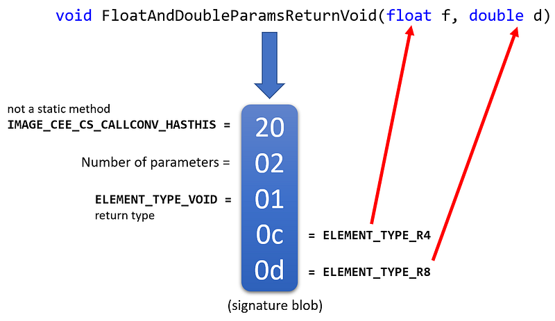
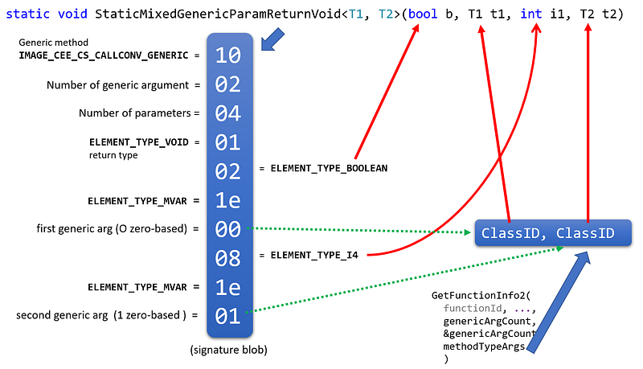

---

## Introduction

After [introducing](/posts/2021-08-07_start-journey-into-the/) the CLR profiling API by tracing managed methods calls, then [dealing with assemblies and types](/posts/2021-09-06_dealing-with-modules-assemblie/), it is time to look at methods signatures. Remember that the starting point is the **FunctionID** received by the [**Enter**](https://docs.microsoft.com/en-us/dotnet/framework/unmanaged-api/profiling/functionenter2-function?WT.mc_id=DT-MVP-5003325) callback each time a method is executed.

The question answered by this post is how to build the signature of the method given a **FunctionID**.

A method signature is built from its return value (or void), its name and a list of parameters. All these details are stored in the module metadata generated by the C# compiler. So the first step is to get the metadata token corresponding to a **FunctionID** thanks to [**ICorProfilerInfo::GetFunctionInfo**](https://docs.microsoft.com/en-us/dotnet/framework/unmanaged-api/profiling/icorprofilerinfo-getfunctioninfo-method?WT.mc_id=DT-MVP-5003325):

```csharp
mdToken token;
HRESULT hr = pInfo->GetFunctionInfo(functionId, &classId, &moduleId, &token);
```

Next, use the **IMetaDataImport** corresponding to the module to call [**GetMethodProps**](https://docs.microsoft.com/en-us/dotnet/framework/unmanaged-api/metadata/imetadataimport-getmethodprops-method?WT.mc_id=DT-MVP-5003325) and pass the function metadata token:

```csharp
mdTypeDef type;
WCHAR name[260];
ULONG size;
ULONG attributes;
PCCOR_SIGNATURE pSig;
ULONG blobSize;
ULONG codeRva;
DWORD flags;
hr = pMetaDataImport->GetMethodProps(
        token, &type, name, ARRAY_LEN(name) - 1, &size, &attributes, &pSig, &blobSize, &codeRva, &flags);
In addition to the function name, you will be able to check the attributes to figure out if the function is static or not:
if ((attributes & mdStatic) == mdStatic)
{
   oss << " static ";
}
```

The return type and parameters type of the function are encoded in a binary format defined in the [ECMA-335](https://www.ecma-international.org/publications-and-standards/standards/ecma-335/) specification. This binary blob is pointed to by the **pSig** parameter. Hopefully, you don’t have to implement a blob signature parser yourself. This has been done my [Rico Mariani](https://docs.microsoft.com/en-us/archive/blogs/davbr/sample-a-signature-blob-parser-for-your-profiler?WT.mc_id=DT-MVP-5003325) or [Peter Sollich](https://github.com/microsoftarchive/clrprofiler/blob/master/CLRProfiler/profilerOBJ/ProfilerInfo.cpp#L1838) and it relies on low level helpers from cor.h such as [CorSigUncompressData](https://github.com/dotnet/runtime/blob/main/src/coreclr/inc/cor.h#L1944).

Here is an example of a signature blob for a non-static method returning void and accepting a float and a double as parameters:



The well-known types are encoded and available as **ELEMENT_TYPE_xxx** constants from corhdr.h.

```smalltalk
ELEMENT_TYPE_VOID,    "Void",          
ELEMENT_TYPE_BOOLEAN, "Boolean",       
ELEMENT_TYPE_CHAR,    "Char",          
ELEMENT_TYPE_I1,      "SByte",         
ELEMENT_TYPE_U1,      "Byte",          
ELEMENT_TYPE_I2,      "Int16",         
ELEMENT_TYPE_U2,      "UInt16",        
ELEMENT_TYPE_I4,      "Int32",         
ELEMENT_TYPE_U4,      "UInt32",        
ELEMENT_TYPE_I8,      "Int64",         
ELEMENT_TYPE_U8,      "UInt64",        
ELEMENT_TYPE_R4,      "Single",        
ELEMENT_TYPE_R8,      "Double",        
ELEMENT_TYPE_STRING,  "String",        
ELEMENT_TYPE_I,       "IntPtr",        
ELEMENT_TYPE_U,       "UIntPtr",       
ELEMENT_TYPE_OBJECT,  "Object",
```

For custom types identified as **ELEMENT_TYPE_CLASS** for reference types or **ELEMENT_TYPE_VALUETYPE** for value types, the metadata token of the type is “compressed” as part of the signature (see [**CorSigUncompressToken**](https://github.com/dotnet/runtime/blob/main/src/coreclr/inc/cor.h#L1944) in cor.h for implementation details). If the type is defined in the same assembly as the method, you get a *TypeDef* token (starting with 02) used to call [**IMetaDataImport::GetTypeDefProps**](https://docs.microsoft.com/en-us/windows/win32/api/rometadataapi/nf-rometadataapi-imetadataimport-gettypedefprops?WT.mc_id=DT-MVP-5003325). If not, it will be a *TypeRef* token (starting with 01) used to call [**IMetaDataImport::GetTypeRefProps**](https://docs.microsoft.com/en-us/windows/win32/api/rometadataapi/nf-rometadataapi-imetadataimport-gettyperefprops?WT.mc_id=DT-MVP-5003325).

```csharp
case ELEMENT_TYPE_CLASS:
case ELEMENT_TYPE_VALUETYPE:
{
   mdToken token;
   char classname[260];

   classname[0] = '\0';
   signature += CorSigUncompressToken(signature, &token);
   if (typeToken != NULL)
   {
      *typeToken = token;
   }

   HRESULT hr;
   WCHAR zName[260];
   if (TypeFromToken(token) == mdtTypeRef)
   {
      mdToken resScope;
      ULONG length;
      hr = pMDImport->GetTypeRefProps(token,
         &resScope,
         zName,
         260,
         &length);
   }
   else
   {
      hr = pMDImport->GetTypeDefProps(token,
         zName,
         260,
         NULL,
         NULL,
         NULL);
   }
…
```

More on typeRef and typeDef later.

This is nice but since the parameter name is not encoded in the signature blob, you have to work more to get it. First, you have to call [**IMetaDataImport::EnumParams**](https://docs.microsoft.com/en-us/dotnet/framework/unmanaged-api/metadata/imetadataimport-enumparams-method?WT.mc_id=DT-MVP-5003325), to get the metadata token **mdParamDef** for each parameter:

```csharp
HCORENUM hEnum = 0;
ULONG paramCount;
mdParamDef* paramDefs = new mdParamDef[argCount];
pMetaData->EnumParams(&hEnum, token, paramDefs, argCount, &paramCount);
pMetaData->CloseEnum(hEnum);
The next step is to iterate on the array of metadata parameter definition and call IMetaDataImport::GetParamProps to get its name, if it is a value type and the ParseElementType helper extracts the type from the signature blob:
ULONG pos;
WCHAR name[260];
ULONG length;
ULONG attributes;  // values from CorParamAttr in CorHdr.h
DWORD bIsValueType;
for (ULONG i = 0;
	(SUCCEEDED(hr) && (pSigBlob != NULL) && (i < (argCount)));
	i++)
{
	// get the parameter name
	hr = pMetaData->GetParamProps(paramDefs[i], NULL, &pos, name, ARRAY_LEN(name)-1, &length, &attributes, &bIsValueType, NULL, NULL);
	// note that we need to convert from WCHAR* to char* for the name

	// get the parameter type
	buffer[0] = '\0';
	pSigBlob = ParseElementType(pMetaData, pSigBlob, classTypeArgs, methodTypeArgs, &elementType, buffer, ARRAY_LEN(buffer) - 1);

}
```

## Generic methods have more complicated signatures to compute

The following figure shows how to handle generic methods:



The main change for such a generic method is that, in the signature blob, you will get the number of generic arguments just after the total parameters count and the first “calling convention” data will be **IMAGE_CEE_CS_CALLCONV_GENERIC**. The other difference is how to deal with generic parameters in the blob that will all share the same **ELEMENT_TYPE_MVAR** value followed by a *position* (starting from 0). This is the position in the array returned by [**ICorProfilerInfo2::GetFunctionInfo2**](https://docs.microsoft.com/en-us/dotnet/framework/unmanaged-api/profiling/icorprofilerinfo2-getfunctioninfo2-method?WT.mc_id=DT-MVP-5003325) for the **ClassID**.

The final code should look like the following:

```csharp
DWORD bIsValueType;
ULONG currentGenericParam = 0;
for (ULONG i = 0;
   (SUCCEEDED(hr) && (pSigBlob != NULL) && (i < (argCount)));
   i++)
{
   // get the parameter name
   hr = pMetaData->GetParamProps(paramDefs[i], NULL, &pos, name, ARRAY_LEN(name)-1, &length, &attributes, &bIsValueType, NULL, NULL);
   // note that we need to convert from WCHAR* to char* for the name

   // get the parameter type
   buffer[0] = '\0';

   // in case of generic function, get the type details from the runtime and not from the metadata
   // !! we don't know in advance which parameter is a generic parameter and this is given by elementType == ELEMENT_TYPE_MVAR
   pSigBlob = ParseElementType(pMetaData, pSigBlob, classTypeArgs, methodTypeArgs, &elementType, buffer, ARRAY_LEN(buffer) - 1);
   if ((methodTypeArgs != NULL) && (elementType == ELEMENT_TYPE_MVAR))
   {
      ModuleID moduleId;
      mdTypeDef mdType;
      hr = pInfo->GetClassIDInfo2(methodTypeArgs[currentGenericParam], &moduleId, &mdType, NULL, 0, NULL, NULL);
      if (SUCCEEDED(hr))
      {
         WCHAR paramTypeName[260];
         IMetaDataImport2* pImport2;
         hr = pInfo->GetModuleMetaData(moduleId, ofRead, IID_IMetaDataImport2, reinterpret_cast<IUnknown**>(&pImport2));
         ULONG sigBlobLen = 0;

         // NOTE: get elementType from type name because the metadata can't give us the instanciated generic in the blob signature
         hr = pImport2->GetTypeDefProps(mdType, paramTypeName, ARRAY_LEN(paramTypeName)-1, 0, NULL, NULL);
         pImport2->Release();
      }

      currentGenericParam++;
   }
}
```

One last detail before looking for the parameters value in the next post: for ALL reference types, the same implementation is generated by the JIT compiler. If you think about it, there is no need to implement a **List<string>** in a different way than a **List** of any other reference type: they all deal with references (i.e. addresses). The name picked by the CLR team to identify this “generic reference type” is **System.__Canon** that stands for “canonical”. So expect to receive that type name a lot!

## References

- [Sample: A Signature Blob Parser for your Profiler](https://docs.microsoft.com/en-us/archive/blogs/davbr/sample-a-signature-blob-parser-for-your-profiler?WT.mc_id=DT-MVP-5003325)
- Episode 1: [Start a journey into the .NET Profiling APIs](/posts/2021-08-07_start-journey-into-the/)
- Episode 2: [Dealing with Modules, Assemblies and Types with CLR profiling API](/posts/2021-09-06_dealing-with-modules-assemblie/)
