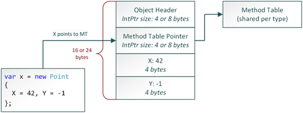
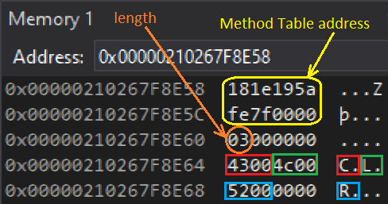

---

## Introduction

From [the list of arguments with their type](/posts/2021-10-12_decyphering-method-signature-w/), it becomes possible to figure out their value when a method gets called. The rest of this post describes how to access method call parameters and get the value of numbers and strings.

## Where are my parameters?

When you pass **COR_PRF_ENABLE_FUNCTION_ARGS** to **ICorProfilerInfo::SetEventMask**, the runtime prepares a [**COR_PRF_FUNCTION_ARGUMENT_INFO**](https://docs.microsoft.com/en-us/dotnet/framework/unmanaged-api/profiling/cor-prf-function-argument-info-structure?WT.mc_id=DT-MVP-5003325) structure before your enter callback is called:

```c
typedef struct _COR_PRF_FUNCTION_ARGUMENT_INFO {  
    ULONG numRanges;  
    ULONG totalArgumentSize;  
    COR_PRF_FUNCTION_ARGUMENT_RANGE ranges[1];  
} COR_PRF_FUNCTION_ARGUMENT_INFO;
```

I have to admit that the Microsoft Docs did not really help me to figure out what is the meaning of each field of this structure because the word “range” is very confusing here…

Based on my experiments, **numRanges** gives you the number of parameters; including the implicit *this* parameter in case of a non-static method. It is different from the signature that we have already parsed from the metadata where *this* is not mentioned. The **ranges** fields is an array of **COR_PRF_FUNCTION_ARGUMENT_RANGE** ; one per parameter:

```c
typedef struct _COR_PRF_FUNCTION_ARGUMENT_RANGE {  
    UINT_PTR startAddress;  
    ULONG length;  
} COR_PRF_FUNCTION_ARGUMENT_RANGE;
```

The **startAddress** points to where the parameter value is stored in memory.

However, in addition to the **FunctionID**, you only receive a **COR_PRF_ELT_INFO** in your enter callback. You need to call [**ICorProfilerInfo3:: GetFunctionEnter3Info**](https://docs.microsoft.com/en-us/dotnet/framework/unmanaged-api/profiling/icorprofilerinfo3-getfunctionenter3info-method?WT.mc_id=DT-MVP-5003325) to get the corresponding **COR_PRF_FUNCTION_ARGUMENT_INFO** you are interested in. As often with COM, you need to call a first time to get the size of the buffer to allocate and a second time to fill it up:

```cpp
ULONG argumentInfoSize = 0;
COR_PRF_FRAME_INFO frameInfo;
_pInfo->GetFunctionEnter3Info(functionId, eltInfo, &frameInfo, &argumentInfoSize, NULL);
byte* pBuffer = new byte[argumentInfoSize];
_pInfo->GetFunctionEnter3Info(functionId, eltInfo, &frameInfo, &argumentInfoSize, (COR_PRF_FUNCTION_ARGUMENT_INFO*)pBuffer);
COR_PRF_FUNCTION_ARGUMENT_INFO* pArgumentInfo = (COR_PRF_FUNCTION_ARGUMENT_INFO*)pBuffer;
```

Before iterating on the parameters, you need to deal with non-static method and their implicit this parameter stored in **pArgumentInfo->ranges[0]**:

```cpp
ULONG hiddenThisParameterIndexOffset = 0;
if (!pSignature->IsStatic)
{
   hiddenThisParameterIndexOffset++;

   // deal with the "this" hidden parameter for non static method
   // ex: show its address (i.e. pArgumentInfo->ranges[0].startAddress)
}
```

Next, write a loop to iterate on each parameter based on the parameter count obtained previously from the metadata:

```cpp
char value[128];
for (ULONG currentParameterInSignature = 0; currentParameterInSignature < parameterCount; currentParameterInSignature++)
{
   // Note: pParameter contains detail extracted from the metadata signature

   UINT_PTR pStartValue = pArgumentInfo->ranges[currentParameterInSignature + hiddenThisParameterIndexOffset].startAddress;
   ULONG length = pArgumentInfo->ranges[currentParameterInSignature + hiddenThisParameterIndexOffset].length;

   if (IsPdOut(pParameter->Attributes))
   {
      // if [out] parameter, nothing to get from it
   }
   else
   {
      value[0] = '\0';
      // call a helper function to extract the value of the parameter
      // a string from its address and type 
      pHelpers->GetObjectValue(pStartValue, length, pParameter->ElementType , pParameter->TypeToken, pSignature->ModuleId, value, ARRAY_LEN(value) - 1);
   }
}
```

## Simple type parameters case

The **GetObjectValue()** helper function looks like the following:

```cpp
void CorProfilerHelpers::GetObjectValue(UINT_PTR address, ULONG length, ULONG elementType, mdToken elementTypeToken, ModuleID moduleId, char* value, ULONG charCount)
{
   ULONG numberValue;
   strcpy_s(value, charCount, "???");
   switch(elementType)
   {
      ...

      default:
         sprintf_s(value, charCount, "unknown type 0x%x", elementType);
      break;
   }
```

The way to get the value of a parameter really depends on its type. I know that a length is provided by the **COR_PRF_FUNCTION_ARGUMENT_INFO** structure but I did not used it except for sanity check.

The value for simple types are easy to compute because they are mostly stored at the given address :

```cpp
case ELEMENT_TYPE_BOOLEAN:
{
   bool* pBool = (bool*)address;
   if (*pBool)
      strcpy_s(value, charCount, "true");
   else
      strcpy_s(value, charCount, "false");
}
break;

case ELEMENT_TYPE_CHAR:
{
   WCHAR* pChar = (WCHAR*)address;
   sprintf_s(value, charCount, "%C", *pChar);
}
break;

case ELEMENT_TYPE_I1:
// int8
{
   char* pNumber = (char*)address;
   numberValue = *pNumber;
   sprintf_s(value, charCount, "%d", numberValue);
}
break;

case ELEMENT_TYPE_U1:
// unsigned int8
{
   unsigned char* pNumber = (unsigned char*)address;
   numberValue = *pNumber;
   sprintf_s(value, charCount, "%d", numberValue);
}
break;

case ELEMENT_TYPE_I2:
// int16
{
   short int* pNumber = (short int*)address;
   numberValue = *pNumber;
   sprintf_s(value, charCount, "%d", numberValue);
}
break;

case ELEMENT_TYPE_U2:
// unsigned int16
{
   short unsigned int* pNumber = (short unsigned int*)address;
   numberValue = *pNumber;
   sprintf_s(value, charCount, "%d", numberValue);
}
break;

case ELEMENT_TYPE_I4:
// int32
{
   __int32* pNumber = (__int32*)address;
   numberValue = *pNumber;
   sprintf_s(value, charCount, "%d", numberValue);
}
break;

case ELEMENT_TYPE_U4:
// unsigned int32
{
   unsigned __int32* pNumber = (unsigned __int32*)address;
   numberValue = *pNumber;
   sprintf_s(value, charCount, "%d", numberValue);
}
break;

// NOTE: %lld might not work on linux
case ELEMENT_TYPE_I8:
// int64
{
   __int64* pNumber = (__int64*)address;
   sprintf_s(value, charCount, "%lld", *pNumber);
}
break;

case ELEMENT_TYPE_U8:
{
// unsigned int64
   unsigned __int64* pNumber = (unsigned __int64*)address;
   sprintf_s(value, charCount, "%lld", *pNumber);
}
break;
And guess what? It is the same for float and double because it is stored by the CLR the same way as in C++:
case ELEMENT_TYPE_R4:
{
   float* pFloat = (float*)address;
   sprintf_s(value, charCount, "%f", *pFloat);
}
break;

case ELEMENT_TYPE_R8:
{
   double* pDouble = (double*)address;
   sprintf_s(value, charCount, "%g", *pDouble);
}
break;
```

The other types require more knowledge about how the CLR stores their value.

## The string case

This is the first reference type we meet and, as for all reference types, the given address points to the memory where the reference (i.e. address of the object in the managed heap) is stored. It allows you to check against null parameter before looking at the “real” managed reference:

```cpp
case ELEMENT_TYPE_STRING:
{
   // look at the reference stored at the given address
   unsigned __int64* pAddress = (unsigned __int64*)address;
   byte* managedReference = (byte*)(*pAddress);

   // easily check for null string
   if (managedReference == NULL)
   {
      strcpy_s(value, charCount, "null string");
      break;
   }
```

At that point, you need to know how an instance of a reference type instance is stored by the CLR in the managed heap. Hopefully, Sergey Tepliakov, a software engineer at Microsoft, has provided [a lot of details about that](https://devblogs.microsoft.com/premier-developer/managed-object-internals-part-1-layout?WT.mc_id=DT-MVP-5003325), especially where does the address stored by a managed reference point to:



It means that you have to skip the Method Table pointer pointed to by the address you have. This applies to any reference types instance!

But for our **string** current case, you still need to know how a **string** is stored (i.e. its length followed by the buffer of UTF16 characters). I recommend that you read [the post from Matt Warren](https://mattwarren.org/2016/05/31/Strings-and-the-CLR-a-Special-Relationship/) about the subject because it also covers a lot of interesting details related to string implementation. However, you should simply rely on the implementation details provided by the CLR via [**ICorProfilerInfo3:: GetStringLayout2**](https://docs.microsoft.com/en-us/dotnet/framework/unmanaged-api/profiling/icorprofilerinfo3-getstringlayout2-method?WT.mc_id=DT-MVP-5003325)**:**

```cpp
ULONG _stringLengthOffset;
ULONG _stringBufferOffset;
hr = _pProfilerInfo->GetStringLayout2(&_stringLengthOffset, &_stringBufferOffset);
```

These two variables give you the offsets to use to access both the string size and the beginning of the array of WCHAR storing each character.

```cpp
// -----------------------------------------------------------------
//    | MethodTable address | string length | buffer 
// -----------------------------------------------------------------
// 64       8 bytes              4 bytes      (length+1) x WCHAR
// off                           8            12
// -----------------------------------------------------------------
// 32       4 bytes              4 bytes      (length+1) x WCHAR
// off                           4            8
// -----------------------------------------------------------------
```

As shown in this table, you need to skip 8/4 bytes to read the length. It is just the confirmation that you need to jump over the address of the Method Table stored as a 64/32 bit value (i.e. an address in x64/x86). The length itself is stored as a 32 bit number (4 bytes) both in x64 an x86. So the array containing the consecutive UTF16 characters just follows (i.e. its offset from the reference address is 12/8 bytes). For example, here is what you get in Visual Studio Memory panel with the reference to the 3 characters “CLR” string for a 64 bit application:



With this information in hand, it is easy to detect empty strings or copy the UNICODE string into a simple **char*** buffer:

```cpp
byte* pLength = GetPointerAfterNBytes(managedReference, _stringLengthOffset);
ULONG stringLength = *pLength;
if (stringLength == 0)
{
   strcpy_s(value, charCount, "empty string");
   break;
}

byte* pBuffer = GetPointerAfterNBytes(managedReference, _stringBufferOffset);
//                                                               V-- to copy the trailing \0
::WideCharToMultiByte(CP_ACP, 0, (WCHAR*)pBuffer, stringLength + 1, value, charCount, NULL, NULL);
```

The **GetPointerAfterNBytes** function simply helps me dealing with pointer arithmetic in C++

```cpp
byte* GetPointerAfterNBytes(void* pAddress, ULONG byteCount)
{
   return ((byte*)pAddress) + byteCount;
}
```

The next post will describe how to get the value of array parameters and the basics of extracting fields value from a reference type instance.

## References

- [Sample: A Signature Blob Parser for your Profiler](https://docs.microsoft.com/en-us/archive/blogs/davbr/sample-a-signature-blob-parser-for-your-profiler?WT.mc_id=DT-MVP-5003325)
- [Strings and the CLR — a Special Relationship](https://mattwarren.org/2016/05/31/Strings-and-the-CLR-a-Special-Relationship/) by Matt Warren
- Episode 1: [Start a journey into the .NET Profiling APIs](/posts/2021-08-07_start-journey-into-the/)
- Episode 2: [Dealing with Modules, Assemblies and Types with CLR profiling API](/posts/2021-09-06_dealing-with-modules-assemblie/)
- Episode 3: [Decyphering methods signature with .NET Profiling APIs](/posts/2021-10-12_decyphering-method-signature-w/)
