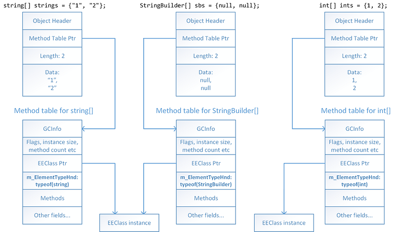
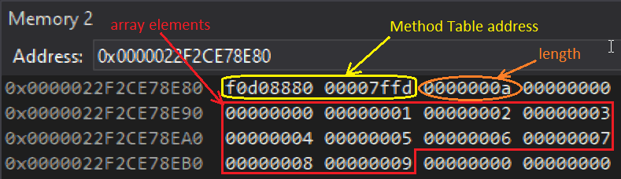
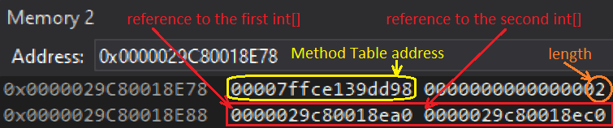
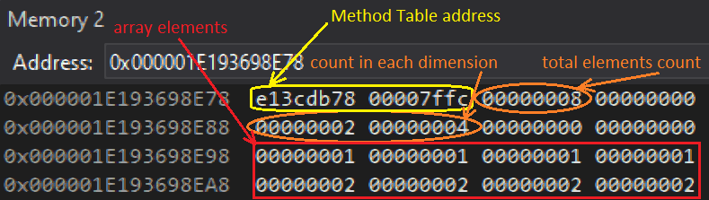
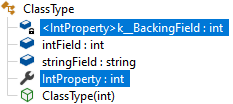
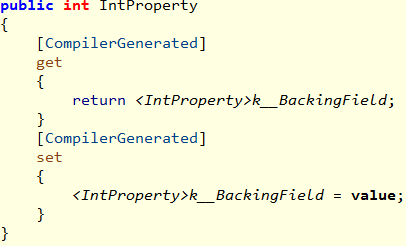
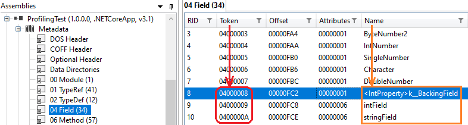

---

## Introduction

After getting basic and strings parameters, it is time to look at arrays and reference types.

## Accessing managed arrays

You check against null array parameter the same way as for string:

```csharp
case ELEMENT_TYPE_SZARRAY:
{
   // look at the reference stored at the given address
   unsigned __int64* pAddress = (unsigned __int64*)address;
   byte* managedReference = (byte*)(*pAddress);
   if (managedReference == NULL)
   {
      strcpy_s(value, charCount, "null array");
      break;
   }
```

The **ELEMENT_TYPE_SZARRAY** applies to single dimension arrays including jagged arrays. **ELEMENT_TYPE_ARRAY** is used for matrice :

```csharp
case ELEMENT_TYPE_ARRAY:
{
   // look at the reference stored at the given address
   unsigned __int64* pAddress = (unsigned __int64*)address;
   byte* managedReference = (byte*)(*pAddress);
   if (managedReference == NULL)
   {
      strcpy_s(value, charCount, "null matrix");
      break;
   }
```

Since arrays are reference types, we know that the managed reference points to the address of the Method Table but we need more insights to get the elements. Again, Sergey Tepliakov explains in great details how single dimension arrays are laid out in memory:



The length is stored in front of the elements as you can see in Visual Studio for the following 10 elements integer array:

```
var ints = new int[] { 0, 1, 2, 3, 4, 5, 6, 7, 8, 9 };
```



Note that “jagged” arrays (i.e. array of array such as int[][]) are stored the same way: each element of the first array contains a reference to another array:



The layout is a little bit different for matrices (i.e. multi-dimensional arrays) such as this 2 x 4 integers array:

```
var matrix = new int[,] { { 1, 1, 1, 1 }, { 2, 2, 2, 2 } };
```



In that case, the total element count appears before each dimension length. The elements are stored row after row.

The profiling API [**ICorProfilerInfo2::GetArrayObjectInfo**](https://docs.microsoft.com/en-us/dotnet/framework/unmanaged-api/profiling/icorprofilerinfo2-getarrayobjectinfo-method?WT.mc_id=DT-MVP-5003325) gives us all the implementation details we need:

```csharp
   // single dimension array so the following arrays only need 1 element to receive size and lower bound
   ULONG32* pDimensionSizes = new ULONG32[1];
   int* pDimensionLowerBounds = new int[1];
   byte* pElements; // will point to the beginning of the array elements
   HRESULT hr = _pProfilerInfo->GetArrayObjectInfo((ObjectID)managedReference, 1, pDimensionSizes, pDimensionLowerBounds, &pElements);
```

Here is the description of each parameter:

- an **ObjectID** (i.e. a reference to an object in the managed heap) corresponding to an array.
- the number of dimensions (a.k.a. rank) so 1 for **ELEMENT_TYPE_SZARRAY** array. I will show in a moment how to get it for matrices.
- an allocated array to receive the size of each dimension
- an allocated array to receive the lower bound of each dimension; should be 0 for C#
- the address of the beginning of the elements

So it is easy to detect an empty array: it means that its length is 0:

```csharp
   ULONG32 arrayLength = pDimensionSizes[0];
   delete pDimensionSizes;
   delete pDimensionLowerBounds;

   if (arrayLength == 0)
   {
      strcpy_s(value, charCount, "empty single dimension array");
      break;
   }
```

The next step is to get the value of each array element. It is easy to get the ClassID of a given object by calling [**ICorProfilerInfo::GetClassFromObject**](https://docs.microsoft.com/en-us/dotnet/framework/unmanaged-api/profiling/icorprofilerinfo-getclassfromobject-method?WT.mc_id=DT-MVP-5003325) and then [**ICorProfilerInfo::IsArrayClass**](https://docs.microsoft.com/en-us/dotnet/framework/unmanaged-api/profiling/icorprofilerinfo-isarrayclass-method?WT.mc_id=DT-MVP-5003325) will provide the array rank and its elements **CorElementType** and **ClassID**.

```csharp
// get element type and array rank 
// (could be used before calling GetArrayObjectInfo to allocate the size + bounds arrays)
ClassID classId;
ULONG rank = 0;
CorElementType baseElementType;
hr = _pProfilerInfo->GetClassFromObject((ObjectID)managedReference, &classId);
hr = _pProfilerInfo->IsArrayClass(classId, &baseElementType, NULL, &rank);
```

With these details, iterating over each element to get its value is not that complicated:

```cpp
char elementValue[128];
for (ULONG current = 0; current < arrayLength; current++)
{
   hr = GetElementValue(pElements, baseElementType, elementValue, ARRAY_LEN(elementValue) - 1);
   strcat_s(value, charCount, elementValue);
   if (FAILED(hr)) break;

   if (current < arrayLength - 1)
      strcat_s(value, charCount, ", ");
}
strcat_s(value, charCount, ")");
```

The **GetElementValue** is where you need to use the element type to compute the value but also to know how many byte you need to move forward to look at the next element:

```cpp
HRESULT CorProfilerHelpers::GetElementValue(byte*& pElement, CorElementType elementType , mdToken elementToken, ModuleID moduleId, char* value, ULONG charCount)
{
   GetObjectValue((UINT_PTR)pElement, sizeof(void*), elementType, elementToken, moduleId, value, charCount);

   switch (elementType)
   {
   case ELEMENT_TYPE_BOOLEAN:
      pElement += sizeof(bool);
      break;

   case ELEMENT_TYPE_CHAR:
      pElement += sizeof(WCHAR);
      break;

   case ELEMENT_TYPE_I1:
      pElement += sizeof(char);
      break;

   case ELEMENT_TYPE_U1:
      pElement += sizeof(unsigned char);
      break;

   case ELEMENT_TYPE_I2:
      pElement += sizeof(short);
      break;

   case ELEMENT_TYPE_U2:
      pElement += sizeof(unsigned short);
      break;

   case ELEMENT_TYPE_I4:
      pElement += sizeof(int);
      break;

   case ELEMENT_TYPE_U4:
      pElement += sizeof(unsigned int);
      break;

   case ELEMENT_TYPE_I8:
      pElement += sizeof(long);
      break;

   case ELEMENT_TYPE_U8:
      pElement += sizeof(unsigned long);
      break;

   case ELEMENT_TYPE_R4:
      pElement += sizeof(float);
      break;

   case ELEMENT_TYPE_R8:
      pElement += sizeof(double);
      break;

   case ELEMENT_TYPE_STRING:
      pElement += sizeof(void*);
      break;

   case ELEMENT_TYPE_CLASS:
      // NOTE: can't call GetObjectValue recursively because won't fit on one line
      sprintf_s(value, charCount, "0x%p", *(UINT_PTR*)pElement);
      pElement += sizeof(void*);
      break;

   case ELEMENT_TYPE_SZARRAY:
      // arrays are reference types so skip the size of an address
      pElement += sizeof(void*);
      break;

   case ELEMENT_TYPE_OBJECT:
      strcpy_s(value, charCount, "obj");
      pElement += sizeof(void*);
      break;

   default:
      strcpy_s(value, charCount, "?");
      return E_FAIL;
   }

   return S_OK;
}
```

For matrices, it is needed to know the rank ahead of time to allocate the **GetArrayObjectInfo** out parameters:

```cpp
case ELEMENT_TYPE_ARRAY:
{
   // same code to check null matrix
   ...

   // get element type and array rank 
   // --> used before calling GetArrayObjectInfo to allocate the size + bounds arrays
   ClassID classId;
   ULONG rank = 0;
   CorElementType baseElementType;
   HRESULT hr = _pProfilerInfo->GetClassFromObject((ObjectID)managedReference, &classId);
   hr = _pProfilerInfo->IsArrayClass(classId, &baseElementType, NULL, &rank);

   ULONG32* pDimensionSizes = new ULONG32[rank];
   int* pDimensionLowerBounds = new int[rank];
   byte* pElements; // will point to the beginning of the array elements
   hr = _pProfilerInfo->GetArrayObjectInfo((ObjectID)managedReference, rank, pDimensionSizes, pDimensionLowerBounds, &pElements);
```

The following code shows how to compute each dimension length:

```cpp
// show dimensions
strcpy_s(value, charCount, "[");
char buffer[16];
for (ULONG32 i = 0; i < rank; i++)
{
   sprintf_s(buffer, ARRAY_LEN(buffer) - 1, "%u", pDimensionSizes[i]);
   strcat_s(value, charCount, buffer);
   if (i < rank -1)
      strcat_s(value, charCount, ", ");
}
strcat_s(value, charCount, "]");

delete pDimensionSizes;
delete pDimensionLowerBounds;
```

## Getting fields of a reference type instance

Since most “basic” types have been covered, it is now time to discuss the case of reference type parameters. Let’s take the following simple class as an example:

```csharp
public class ClassType
{
    public ClassType(int val)
    {
        intField = val;
        stringField = (val + 1).ToString();
        IntProperty = val * 2;
    }

    public int IntProperty { get; set; }

    public int intField;
    public string stringField;
}
```

On purpose, one property and two fields are defined. The C# compiler translates the automatic property syntax into a backing field to store the value



And the corresponding get/set accessors pair:



So when an instance of this class is passed as a parameter to the **ClassParamReturnClass(ClassType obj)** method, you should be able to list these three fields and access their value to build the following output:

```
--> ClassType ClassParamReturnClass (ClassType obj)
|  int32 <IntProperty>k__BackingField = 84
|  int32 intField = 42
|  String stringField = 43
ClassType obj = 0x00000276D0A98E78
```

When you read Sergey Tepliakov in [Managed object internals, Part 4. Fields layout](https://devblogs.microsoft.com/premier-developer/managed-object-internals-part-4-fields-layout?WT.mc_id=DT-MVP-5003325), it sounds quite hard to achieve due to the complicated padding rules dictating where each field is stored in memory. Hopefully, the profiling API will help you a lot with a three steps process:

- Get the offset of each field value
- Get the name of each field
- Get the type of each field and then compute the value using the offset

First, you need the **ClassID** corresponding to the type of the reference you want to dump and we have seen that [**ICorProfilerInfo::GetClassFromObject**](https://docs.microsoft.com/en-us/dotnet/framework/unmanaged-api/profiling/icorprofilerinfo-getclassfromobject-method?WT.mc_id=DT-MVP-5003325) is perfect for that. Then, pass it to [**ICorProfilerInfo2::GetClassLayout**](https://docs.microsoft.com/en-us/dotnet/framework/unmanaged-api/profiling/icorprofilerinfo2-getclasslayout-method?WT.mc_id=DT-MVP-5003325) to get the number of fields and their offset within an instance. This API expects you to call it once to get the number of fields and a second time to get the offset that are stored in a buffer you allocate after the first call.

```cpp
ULONG fieldCount = 0; 
hr = _pProfilerInfo->GetClassLayout(classID, NULL, 0, &fieldCount, NULL);

// no field to dump
if (fieldCount == 0)
   break;

COR_FIELD_OFFSET* pFieldOffsets = new COR_FIELD_OFFSET[fieldCount];
hr = _pProfilerInfo->GetClassLayout(classID, pFieldOffsets, fieldCount, &fieldCount, NULL);
```

The [**COR_FIELD_OFFSET**](https://docs.microsoft.com/en-us/dotnet/framework/unmanaged-api/metadata/cor-field-offset-structure?WT.mc_id=DT-MVP-5003325) structure has a confusing name because it contains more than just the offset:

```c
typedef struct COR_FIELD_OFFSET {  
    mdFieldDef  ridOfField;  
    ULONG       ulOffset;  
} COR_FIELD_OFFSET;
```

The **ridOfField** part gives you the metadata token corresponding to a field as shown in ILSpy:



It will allow you to get its name and the usual binary signature for its type via [**IMetaDataImport::GetFieldProps**](https://docs.microsoft.com/en-us/windows/win32/api/rometadataapi/nf-rometadataapi-imetadataimport-getfieldprops?WT.mc_id=DT-MVP-5003325).

So you first need to get the **IMetaDataImport** implementation for the class module:

```cpp
IMetaDataImport* pMetaDataImport = NULL;  
ModuleID moduleID = NULL;
mdTypeDef typeDefToken = NULL;
WCHAR name[256];
hr = _pProfilerInfo->GetClassIDInfo(classID, &moduleID, &typeDefToken);
hr = _pProfilerInfo->GetModuleMetaData(moduleID, ofRead, IID_IMetaDataImport, (IUnknown**)&pMetaDataImport);
```

It is now time to iterate on each field to get its name, type and value for the given object:

```cpp
char value[512];
char buffer[2 * 260];
for (ULONG fieldIndex = 0; fieldIndex < fieldCount; fieldIndex++)
{
   PCCOR_SIGNATURE pSigBlob;
   ULONG sigBlobSize;
   name[0] = L'\0';

   hr = pMetaDataImport->GetFieldProps(pFieldOffsets[fieldIndex].ridOfField, NULL,
      name, ARRAY_LEN(name), NULL, NULL, &pSigBlob, &sigBlobSize, 
      NULL, NULL, NULL);
   if (SUCCEEDED(hr))
   {
   // skip the "calling convention" that should correspond to a 'field'
      ULONG callingConvention = *pSigBlob++;
      assert(callingConvention == IMAGE_CEE_CS_CALLCONV_FIELD);
      buffer[0] = '\0';
      pSigBlob = ParseElementType(pMetaDataImport, pSigBlob, NULL, NULL, &elementType, buffer, ARRAY_LEN(buffer) - 1);

      // get its value from pFieldOffsets[fieldIndex].ulOffset
      value[0] = '\0';
      GetObjectValue((UINT_PTR)(managedReference + pFieldOffsets[fieldIndex].ulOffset), length, elementType, elementToken, moduleId, value, ARRAY_LEN(value) - 1);
   }
}

delete [] pFieldOffsets;
pMetaDataImport->Release();
```

The only thing that differs from the blob signature parsing you have seen earlier is that it starts with a “calling convention” (yes I know that we are talking about field and not method!) equal to **IMAGE_CEE_CS_CALLCONV_FIELD**.

The field value is stored in memory at **ulOffset** bytes after the address pointed to by the given managed reference.

The next episode will describe how to dump value type instances, the return values and exceptions handling: a good way to start 2022!

## References

- [Arrays and the CLR — a Very Special Relationship](https://mattwarren.org/2017/05/08/Arrays-and-the-CLR-a-Very-Special-Relationship/) by [Matt Warren](https://twitter.com/matthewwarren)
- [Managed object internals, Part 3. The layout of a managed array](https://devblogs.microsoft.com/premier-developer/managed-object-internals-part-3-the-layout-of-a-managed-array-3?WT.mc_id=DT-MVP-5003325) by [Sergey Tepliakov](https://devblogs.microsoft.com/premier-developer/author/seteplia/)
- [Managed object internals, Part 4. Fields layout](https://devblogs.microsoft.com/premier-developer/managed-object-internals-part-4-fields-layout?WT.mc_id=DT-MVP-5003325) by [Sergey Tepliakov](https://devblogs.microsoft.com/premier-developer/author/seteplia/)
- Episode 1: [Start a journey into the .NET Profiling APIs](/posts/2021-08-07_start-journey-into-the/)
- Episode 2: [Dealing with Modules, Assemblies and Types with CLR profiling API](/posts/2021-09-06_dealing-with-modules-assemblie/)
- Episode 3: [Decyphering methods signature with .NET Profiling APIs](/posts/2021-10-12_decyphering-method-signature-w/)
- Episode 4: [Reading parameters value with the .NET Profiling APIs](/posts/2021-11-16_reading-parameters-value-with/)
