---

## Introduction

The beta of Datadog .NET Continuous Profiler is [available](https://github.com/DataDog/dd-trace-dotnet/releases/tag/v2.1.1-profiler-beta1)!

This is a great opportunity to show how to use the different tools provided by Datadog to troubleshoot .NET applications facing performance issues. [Tess Ferrandez](https://twitter.com/TessFerrandez) updated her famous BuggyBits application to .NET Core. Among the [different available scenarios](https://www.tessferrandez.com/blog/2008/02/04/debugging-demos-setup-instructions.html), let’s see how to investigate the [Lab 4 — High CPU Hang](https://www.tessferrandez.com/blog/2008/02/27/net-debugging-demos-lab-4-walkthrough.html) with Datadog. It will be completely different from Tess way: no need to analyze memory dump anymore.

## Setup the environment

First, you need to download and run the .msi from our Tracer repository: it will install both the Tracer and the Profiler. The former allows you, among other things, to see how long it takes to process ASP.NET Core requests. The latter is in Beta today and provides wall time duration of your threads (more on this later). Look at the corresponding documentations for the details of enabling [tracing](https://docs.datadoghq.com/tracing/setup_overview/setup/dotnet-framework/?tab=windows) and [profiling](https://docs.datadoghq.com/tracing/profiler/enabling/dotnet) once installed.

Next, ensure that **.NET Runtime Metrics** are installed for your organization:

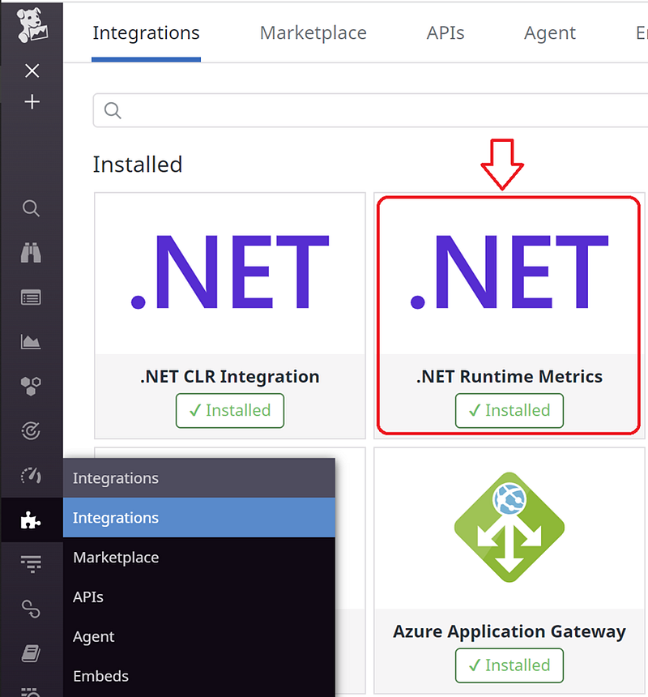

Add **DD_RUNTIME_METRICS_ENABLED=true** environment variable for the application/service you want to monitor. Once enabled for your application, this package allows you to see the evolution of [important metrics](https://docs.datadoghq.com/tracing/runtime_metrics/dotnet/) including some that you won’t find anywhere else such as GC pause time, thread contention time or count of exceptions per type.

Ensure that [DogstatsD is setup](https://docs.datadoghq.com/developers/dogstatsd/?tab=hostagent#setup) for the Agent

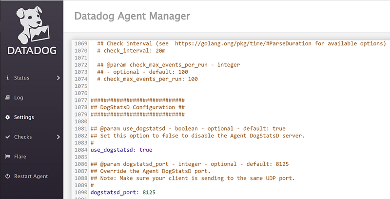

## Looking at the symptoms

In my example, the buggybits application is running under the *datadog.demos.buggybits* service name. This is how I can filter the related traces in the APM/Traces part of the Datadog portal:

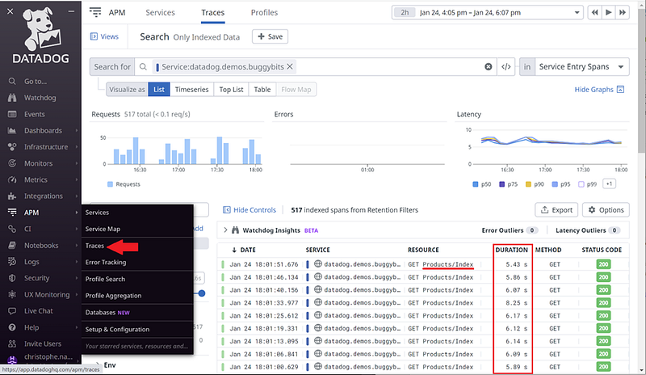

In this screenshot, the **Products/Index** requests duration is around 6 seconds; which is way too long!

When clicking such a request, the details panel provides the exact URL in the **Tags** tab:

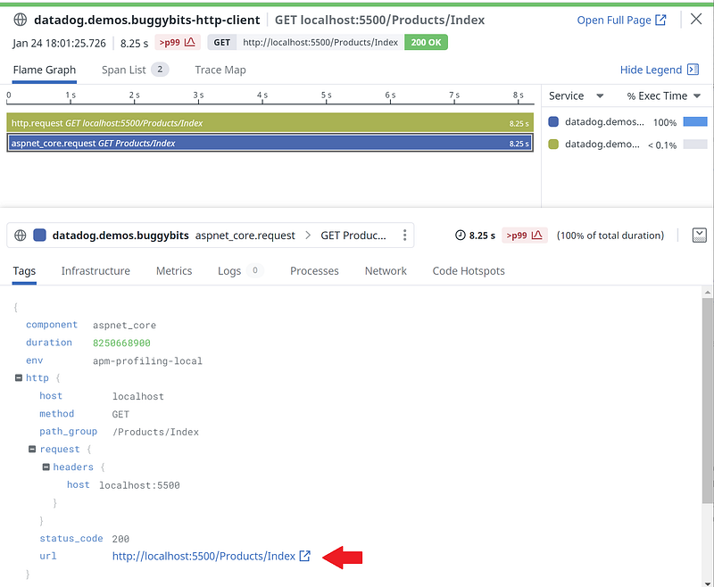

The **Metrics** tab shows CPU usage and other few metrics around the trace time:

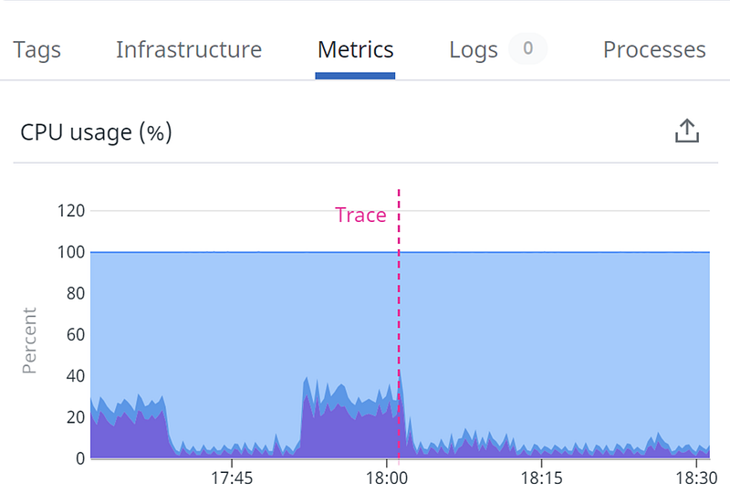

So, in addition to having slow requests, the CPU usage seems to increase.

It is now time to go to the *.NET runtime metrics* dashboard and look at what is going on in more details. The first graph that shows up is the number of gen2 collections:

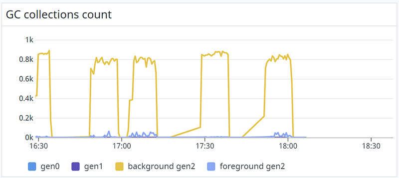

It means that during the 10 minutes test where very few requests are processed, almost 800 gen2 GC are happening every 10s (all runtime metrics are computed every 10 seconds).

The load test corresponding to these requests lasted 10 minutes between 4pm and 6+pm. Each time the requests were processed:

- the CPU usage increased
- the number of gen2 collections increased
- the duration of pauses due to garbage collections increased
- the threads contention time increased

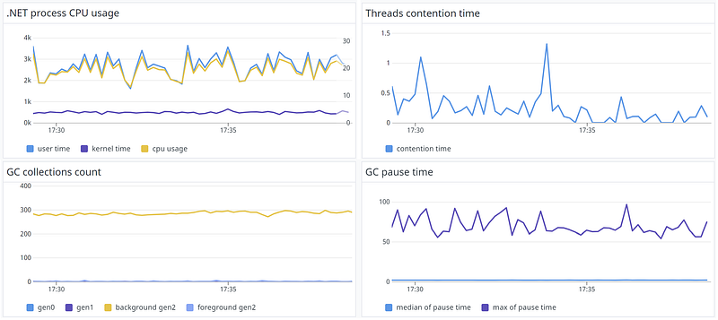

In addition to being slow, it seems that the code that processes *products/index* HTTP requests has also an impact on the CPU (i.e. on the overall application and machine performances).

It would be great if we could see the callstacks corresponding to this processing. This is exactly what the .NET Wall time Continuous Profiler is all about: looking at the duration of methods through a flamegraph representation.

## Here comes the profiler

Today, there is no direct way to jump from a trace to the profile containing the callstacks while the corresponding request was processed. We are currently working on this new feature called *Code Hotspots*.

However, it is easy to use the service name to filter the profiles and select the period of time from APM/Profile Search:

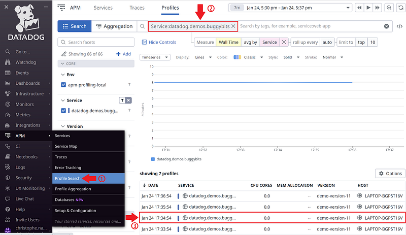

When you click a one-minute profile (the callstacks are gathered and sent every minute), a panel appears with the **Performance** tab selected. It shows a framegraph on the left and a list on the right.

## Getting used to flamegraph

When you look at the wall time flamegraph, you see everything that happened during a single minute:

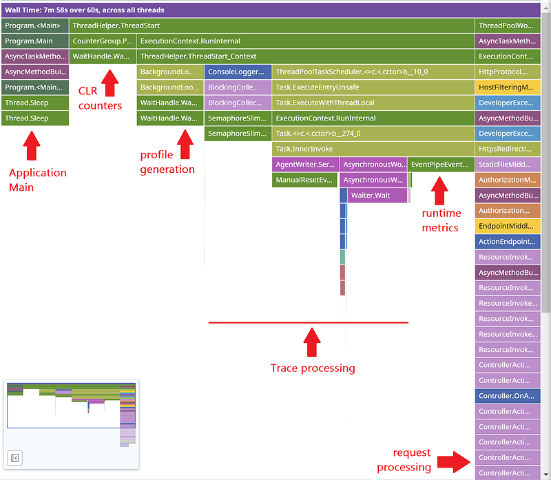

The previous screenshot highlights the groups of callstacks corresponding to the different threads of execution (from left to right):

- the **Main()** entry point of the application
- the code in the CLR responsible for sending counters
- the code in the Profiler in charge of generating and sending (the very thin spike) the profile every minute
- the Tracer code
- the code that listens to the CLR events to generate the runtime metrics
- …and the application code that processes the requests!

In the flamegraph, the width of each frame on a row represents the relative time during which the frame was found on a callstack. For example, in our tests, we have 4 threads simply calling **Thread.Sleep**; one for 10 seconds, one for 20 seconds, one for 30 seconds and a last one for 40 seconds. This is the expected result in a flamegraph (i.e. the widths are consistent with the 1/2/3/4 ratio):

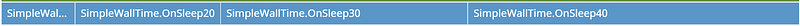

This also applies to CPU-bound threads. For example, if 3 threads are computing the sum of numbers in a tight loop, this is the expected result (i.e. all **OnCPUxxx** have the same width)

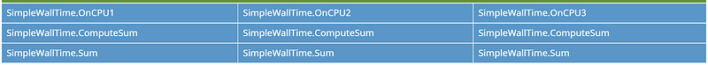

These explanations should stop the fear that started to crawl inside your head about the “visible cost” of the Datadog Tracer and Profiler based on the previous screenshot. The large width of the Datadog threads frames is all about wall time, not CPU time: we are mostly sleeping or waiting but we don’t stop :^)

## Investigate the performance issue

The next step is to focus on the stack frames corresponding to the request processing to better understand what is going on.

Basically, you would like to either remove a branch or keep only a branch. You simply have to move the mouse over a frame (i.e. **ThreadPoolWorkQueue** in the previous screenshot) and click the three dots that just appeared. Next, select **Show From** to keep only that branch in the flamegraph:

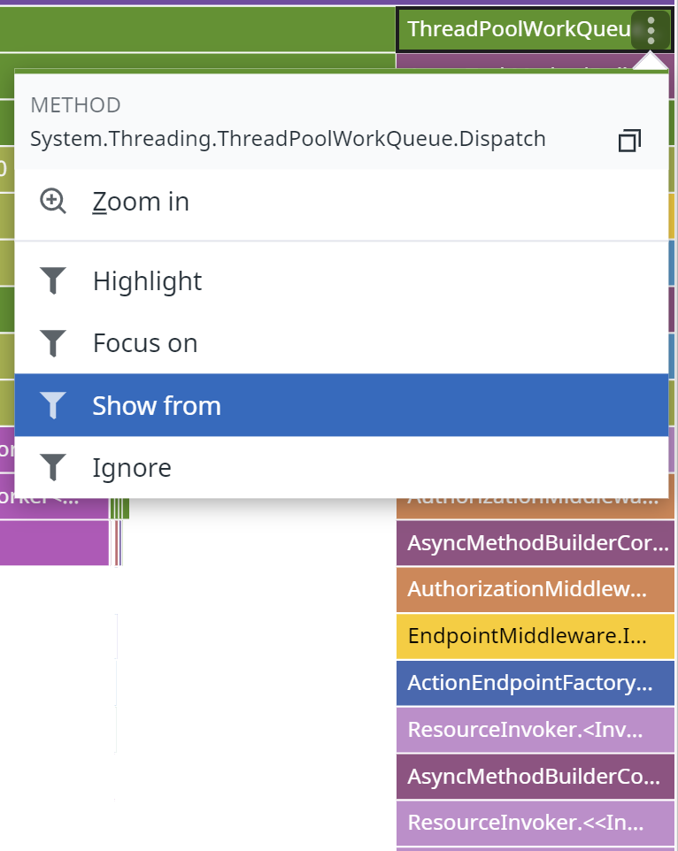

Now, scroll-down into the flamegraph and the flow of execution corresponding to processing the *Products/Index* request becomes more visible:

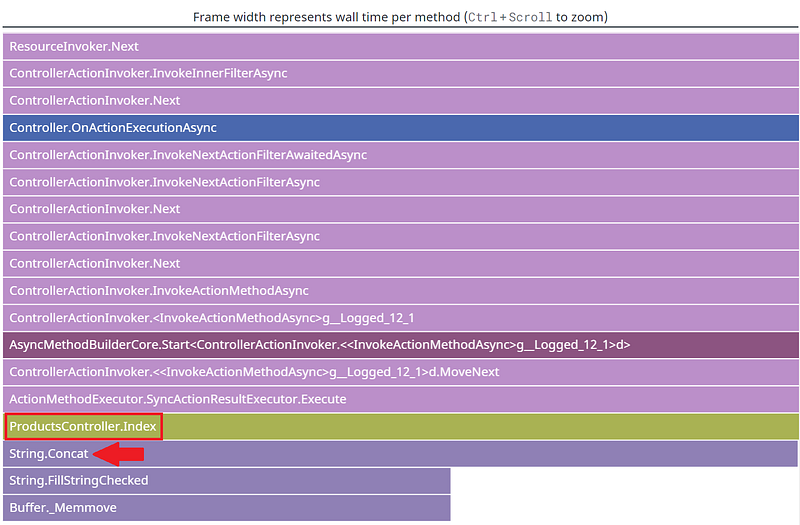

It seems that the **Index()** method of the **ProductsController** is spending most of its time calling **String.Concat()**.

Let’s have a look at the [source code](https://github.com/TessFerrandez/BuggyBits/blob/main/src/BuggyBits/Controllers/ProductsController.cs#L18):

```csharp
// GET: Products
public IActionResult Index()
{
    var products = dataLayer.GetAllProducts();
    var productsTable = "<table><tr><th>Product Name</th><th>Description</th><th>Price</th></tr>";
    foreach (var product in products)
    {
        productsTable += $"<tr><td>{product.ProductName}</td><td>{product.Description}</td><td>{product.Price}</td></tr>";
    }
    productsTable += "</table>";

    ViewData["ProductsTable"] = productsTable;
    return View();
}
```

But still no sign of **String.Concat()**… Well, this is because the C# compiler is hiding it from you with the **+=** syntaxic sugar. Let’s have a look at the decompiled code as shown by IlSpy (without the **string.Concat** transformation):

```csharp
public Microsoft.AspNetCore.Mvc.IActionResult Index()
{
    var products = dataLayer.GetAllProducts();
    string productsTable = "<table><tr><th>Product Name</th><th>Description</th><th>Price</th></tr>";
    var enumerator = products.GetEnumerator();
    try
    {
        while (enumerator.MoveNext())
        {
            BuggyBits.Models.Product product = enumerator.Current;
            string[] array = new string[8];
            array[0] = productsTable;
            array[1] = "<tr><td>";
            array[2] = product.ProductName;
            array[3] = "</td><td>";
            array[4] = product.Description;
            array[5] = "</td><td>";
            array[6] = product.Price;
            array[7] = "</td></tr>";
            productsTable = string.Concat(array);
        }
    }
    finally
    {
        ((System.IDisposable)enumerator).Dispose();
    }
    productsTable = string.Concat(productsTable, "</table>");
    base.ViewData["ProductsTable"] = productsTable;
    return View();
}
```

So now we can see the call to **string.Concat()** at the end of the **while** loop iteration.

Behind the scene, since a string object is immutable, **string.Concat()** will create a new string each time it is called and the previous string referenced by **productsTable** is no more rooted and will put more pressure on the GC. If I’m telling you that **datalayer.GetAllProducts()** returns 10.000 products, it means that **string.Concat** gets called 10.000 times.

As the string grows, it will reach the 85000 bytes limit and start to be allocated in the LOH, adding more pressure on GC that will trigger gen2 collections; hence the high number of gen2 collections seen in the runtime metrics dashboard.

Note that if the native frames were visible in the flamegraph (by the way, let me know if this is a feature that would make sense to add), you would see the methods of the CLR responsible for the GC.

Look at [Tess Ferrandez post](https://www.tessferrandez.com/blog/2008/02/27/net-debugging-demos-lab-4-walkthrough.html) for a possible solution to this expensive code pattern (i.e. calling **string.Contact** in a large tight loop)

## Different types of filters

Before leaving, I would like to quicky talk about the list shown on the right hand-side of the UI.

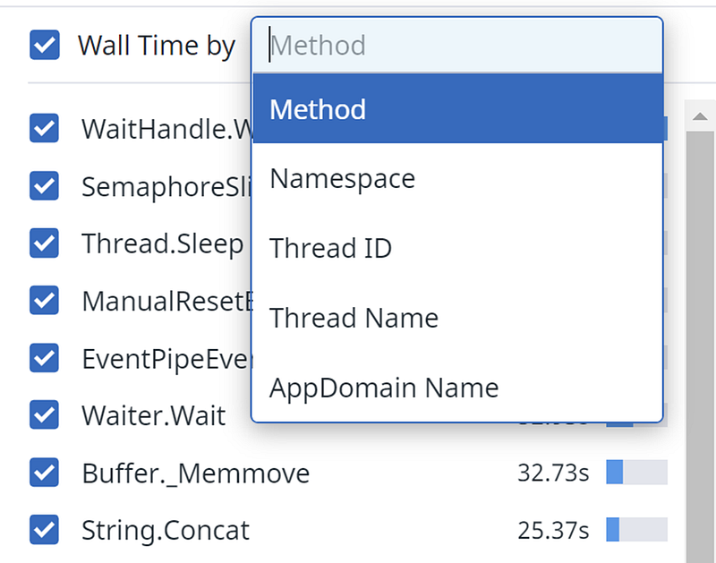

It allows you to see a wall time summary per method name, namespace (i.e. sum of methods from types in the same namespace, thread ID (i.e. internal Datadog unique ID), thread name or AppDomain Name.

First, the only methods listed here are “leaf” methods: they appear at the top of at least one callstack. If you would like to visually see some specific frames, you should use the filter box:

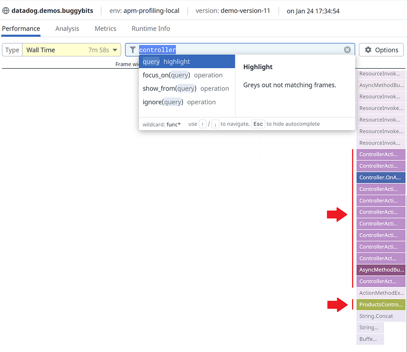

All other frames are faded out.

Second, the list is sorted with the largest wall time at the top: this could be an easy way to spot method “expensive” in term of CPU (i.e. will frequently be running so appear at the top of the stack). You simply need to skip the wait and sleep related methods like shown in the previous screenshot: **String.Concat** and **Buffer._Memmove** (used by **string.Concat**) were just in front of your eyes!

When you select an element of the list, the flamegraph is updated accordingly: only the callstacks containing this element will be visible (it could speed up the filtering process)

## References

- Datadog Tracer & Continuous Profiler [.msi Installer](https://github.com/DataDog/dd-trace-dotnet/releases/tag/v2.1.1-profiler-beta1)
- [Datadog Continuous Profiler documentation](https://docs.datadoghq.com/tracing/profiler/enabling/dotnet)
- [Datadog Tracer documentation](https://docs.datadoghq.com/tracing/setup_overview/setup/dotnet-framework/?tab=windows)
- [Datadog Runtime metrics documentation](https://docs.datadoghq.com/tracing/runtime_metrics/dotnet/)
- [Tess Ferrandez](https://twitter.com/TessFerrandez) repository for [BuggyBits labs](https://www.tessferrandez.com/blog/2008/02/04/debugging-demos-setup-instructions.html)
