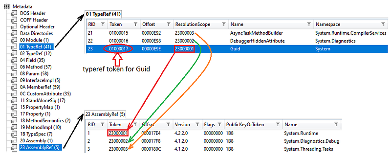
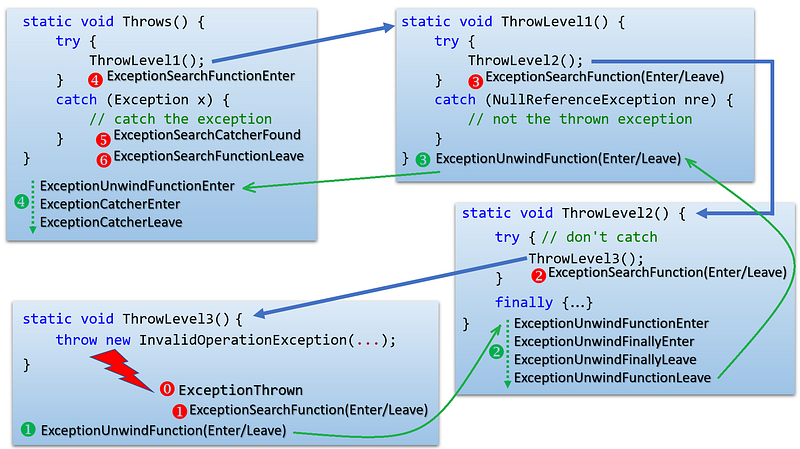

---

Here comes the end of the series about .NET profiling APIs. This final episode describes how to get fields of a value type instance and how to deal with exceptions.

## Getting fields of a value type instance

The case of a value type is very similar to a reference type except that the address you receive points directly to the beginning of the fields value; instead of the type MethodTable (or **ObjectID** if you prefer).

```csharp
case ELEMENT_TYPE_VALUETYPE:
{
   // same as reference type except that the received address points to the beginning of the value type instance fields
   byte* managedReference = (byte*)address;
```

It means that you won’t be able to call [**ICorProfilerInfo::GetClassFromObject**](https://docs.microsoft.com/en-us/dotnet/framework/unmanaged-api/profiling/icorprofilerinfo-getclassfromobject-method?WT.mc_id=DT-MVP-5003325) to get its **ClassID** and start the field enumeration like for a reference type. Note that despite its name, [**ICorProfilerInfo2::GetClassLayout**](https://docs.microsoft.com/en-us/dotnet/framework/unmanaged-api/profiling/icorprofilerinfo2-getclasslayout-method?WT.mc_id=DT-MVP-5003325) is perfectly capable of providing fields offset for a value type.

Instead, you will have to use the metadata token (extracted from the method signature) corresponding to the parameter. If the type is defined in the same assembly as the method, it is just a matter of calling [**ICorProfilerInfo::GetClassFromToken**](https://docs.microsoft.com/en-us/dotnet/framework/unmanaged-api/profiling/icorprofilerinfo-getclassfromtoken-method?WT.mc_id=DT-MVP-5003325) with the same moduleID as the method:

```csharp
if (TypeFromToken(elementTypeToken) == mdtTypeDef)
{
   hr = _pProfilerInfo->GetClassFromToken(moduleId, elementTypeToken, &classID);
}
```

If the type is defined in another assembly (i.e. **TypeFromToken()** will return **mdTypeRef**), the metadata keeps track of the relationships:



The *ResolutionScope* (i.e. assembly where the typeref is defined) is given by [**IMetaDataImport::GetTypeRefProps**](https://docs.microsoft.com/en-us/windows/win32/api/rometadataapi/nf-rometadataapi-imetadataimport-gettyperefprops?WT.mc_id=DT-MVP-5003325):

```csharp
WCHAR szName[MAX_CLASS_NAME];
ULONG chName = MAX_CLASS_NAME-1;
mdToken resolutionScope = mdTokenNil;
hr = pMetaDataImport->GetTypeRefProps(elementTypeToken, &resolutionScope, szName, chName, &chName);
```

Unfortunately, I did not find any direct API call (either from **IMetaDataImport** or **ICorProfilerInfo**) to find the **ModuleID** where a typeref is defined in another assembly. The only link is the **IMetaDataImport** corresponding to the module implementing the typeref that is available via the [not recommended](https://docs.microsoft.com/en-us/archive/blogs/davbr/metadata-tokens-run-time-ids-and-type-loading?WT.mc_id=DT-MVP-5003325) [**IMetaDataImport::ResolveTypeRef**](https://docs.microsoft.com/en-us/dotnet/framework/unmanaged-api/metadata/imetadataimport-resolvetyperef-method?WT.mc_id=DT-MVP-5003325):

```csharp
IMetaDataImport* pMetaDataImportRef = NULL;
mdToken referencedElementTypeToken = mdTokenNil;
hr = pMetaDataImport->ResolveTypeRef(elementTypeToken, IID_IMetaDataImport, (IUnknown**)&pMetaDataImportRef, &referencedElementTypeToken);
```

This looks like a dead end: the metadata API knows about tokens (i.e. values generated by C# compiler) and the profiling API knows about IDs (i.e. pointers to internal data structures).

Remember that [**ICorProfilerInfo:: GetModuleMetaData**](https://docs.microsoft.com/en-us/dotnet/framework/unmanaged-api/profiling/icorprofilerinfo-getmodulemetadata-method?WT.mc_id=DT-MVP-5003325) returns the **IMetaDataImport** corresponding to a given **ModuleID**. So the idea is to be able to identify a **ModuleID** by its **IMetaDataImport** counterpart, enumerate the modules loaded by the profiler and get their “identifier” to compare with the one implementing the type we are interested in. This identifier could be the **mdModule** token return by [**IMetaDataImport::GetModuleFromScope**](https://docs.microsoft.com/en-us/windows/win32/api/rometadataapi/nf-rometadataapi-imetadataimport-getmodulefromscope?WT.mc_id=DT-MVP-5003325):

```csharp
mdModule module = mdModuleNil;
hr = pMetaDataImport->GetModuleFromScope(&module);
```

Well… not really because I always got 0x1 in my test. This value could be the module in the assembly and I only tested single-module assemblies generated by Visual Studio. Hopefully, each module is labelled by a unique “mvid” (i.e. a GUID identifying each module) returned by [**IMetaDataImport::GetScopeProps**](https://docs.microsoft.com/en-us/windows/win32/api/rometadataapi/nf-rometadataapi-imetadataimport-getscopeprops?WT.mc_id=DT-MVP-5003325):

```csharp
GUID refMvid;
hr = pMetaDataImport->GetScopeProps(szName, chName, &chName, &refMvid);
```

Here is the code to enumerate profiled modules and check for the given **refMvid**:

```cpp
ICorProfilerModuleEnum* pEnumModule = NULL;
hr = _pProfilerInfo->EnumModules(&pEnumModule);
ModuleID enumeratedModuleId = NULL;
ModuleID refModuleId = NULL;
GUID mvid;
IMetaDataImport* pEnumeratedModuleMetadata = NULL;
mdModule enumeratedModuleToken = mdModuleNil;
ULONG fetchedModulesCount = 0;
do
{
   hr = pEnumModule->Next(1, &enumeratedModuleId, &fetchedModulesCount);
   if (FAILED(hr))
      break;
   if (fetchedModulesCount == 0)
      break;

   // get the IMetadataImport corresponding to this module
   hr = _pProfilerInfo->GetModuleMetaData(enumeratedModuleId, ofRead, IID_IMetaDataImport, (IUnknown**)&pEnumeratedModuleMetadata);
      
   // get the module token
   hr = pEnumeratedModuleMetadata->GetModuleFromScope(&enumeratedModuleToken);
   hr = pEnumeratedModuleMetadata->GetScopeProps(szName, chName, &chName, &mvid);
   pEnumeratedModuleMetadata->Release();

   if (refMvid == mvid)
   {
      refModuleId = enumeratedModuleId;
   }
} while (TRUE);
pEnumModule->Release();

// this is the one!
moduleId = refModuleId;
```

For performance sake, it would be better to build (in your **IProfilerCallback** implementation of [**ModuleLoadFinished**](https://docs.microsoft.com/en-us/dotnet/framework/unmanaged-api/profiling/icorprofilercallback-moduleloadfinished-method?WT.mc_id=DT-MVP-5003325) and [**ModuleUnloadFinished**](https://docs.microsoft.com/en-us/dotnet/framework/unmanaged-api/profiling/icorprofilercallback-moduleunloadfinished-method?WT.mc_id=DT-MVP-5003325)), a map between the loaded modules and their mvid. This map could then be used when a **ModuleID** is needed while only the metadata side is known.

## What has been returned?

The final step of our journey is to figure out what is returned by a method. The leave callback executed each time a method returns receives a **FunctionID** and a **COR_PRF_ELT_INFO** as parameters:

```cpp
PROFILER_STUB LeaveStub(FunctionID functionId, COR_PRF_ELT_INFO eltInfo)
{
   ...
}
```

The signature parsing for a **FunctionID** already shown tells whether it returns **void** or an instance of a type identified by an element type and a metadata token.

```cpp
void CorProfilerHelpers::DumpLeaveReturnValue(FunctionID functionId, FunctionSignature* pSignature, COR_PRF_ELT_INFO eltInfo)
{
   char value[128];
   value[0] = '\0';

   if (_stricmp(pSignature->pszReturnType, "void") == 0)
   {
      strcpy_s(value, ARRAY_LEN(value) - 1, "void");
   }
```

The **COR_PRF_ELT_INFO** parameter is the key to get the address of the returned instance thanks to [**ICorProfilerInfo3::GetFunctionLeave3Info**](https://docs.microsoft.com/en-us/dotnet/framework/unmanaged-api/profiling/icorprofilerinfo3-getfunctionleave3info-method?WT.mc_id=DT-MVP-5003325):

```cpp
   else
   {
      ULONG pcbArgumentInfo = 0;
      COR_PRF_FRAME_INFO frameInfo;
      COR_PRF_FUNCTION_ARGUMENT_RANGE returnValueInfo;
      HRESULT hr = _pProfilerInfo->GetFunctionLeave3Info(functionId, eltInfo, &frameInfo, &returnValueInfo);
      UINT_PTR pStartValue = returnValueInfo.startAddress;
      ULONG length = returnValueInfo.length;

      const FunctionParameter* pReturnParameter = pSignature->GetReturnParameter();
      GetObjectValue(pStartValue, length, pReturnParameter->ElementType, pReturnParameter->TypeToken, pSignature->ModuleId, value, sizeof(value) / sizeof(value[0]) - 1);
   }
   
   ...
}
```

To get meaningful information from this API, the **COR_PRF_ENABLE_FUNCTION_RETVAL** flag must be set when [**ICorProfilerInfo::SetEventMask**](https://docs.microsoft.com/en-us/dotnet/framework/unmanaged-api/profiling/icorprofilerinfo-seteventmask-method?WT.mc_id=DT-MVP-5003325) is called during [**ICorProfilerCallback::Initialize**](https://docs.microsoft.com/en-us/dotnet/framework/unmanaged-api/profiling/icorprofilercallback-initialize-method?WT.mc_id=DT-MVP-5003325). The returned [**COR_PRF_FUNCTION_ARGUMENT_RANGE**](https://docs.microsoft.com/en-us/dotnet/framework/unmanaged-api/profiling/cor-prf-function-argument-range-structure?WT.mc_id=DT-MVP-5003325) contains the address of the returned instance in its **startAddress** field.

The same **GetObjectValue** helper function already used to get parameters’ value is still valid here.

## And what about exceptions?

I discussed how to follow the normal flow of execution by entering and exiting a method. When, in a method, an exception is thrown and not caught, you won’t get notified by the Leave callback. Instead other methods of **ICorProfilerCallback** are called if you pass **COR_PRF_MONITOR_EXCEPTIONS** to [**ICorProfilerInfo::SetEventMask**](https://docs.microsoft.com/en-us/dotnet/framework/unmanaged-api/profiling/icorprofilerinfo-seteventmask-method?WT.mc_id=DT-MVP-5003325).

Let’s take the following C# example to understand when which callbacks are executed:



The blue arrows are showing the flow of execution from **Throws** to **ThrowLevel3**. When the **InvalidOperationException** is thrown, **ExceptionSearchFunctionXXX** callbacks are executed “backward” to find the first catch block that will match the exception (i.e. up to **Throws**). It is now time to run the **finally** blocks (if any) starting from where the exception was thrown (i.e. **ThrowLevel3**) up to the catch block in **Throws**.

The object corresponding to the exception is passed to **ExceptionThrown** and **ExceptionCatcherEnter** as **ObjectID**. Feel free to use the code that has been presented earlier to get the type of the exception. However, getting interesting fields such as **_message**, or **_innerException** requires to figure out the **ClassID** of the **System.Exception** base class.

As already mentioned, the [**ICorProfilerInfo2::GetClassIDInfo2**](https://docs.microsoft.com/en-us/dotnet/framework/unmanaged-api/profiling/icorprofilerinfo2-getclassidinfo2-method?WT.mc_id=DT-MVP-5003325) function returns the **ClassID** of the parent type. Here is the code to search a parent type in a type hierarchy:

```cpp
HRESULT GetExceptionBaseClass(ICorProfilerInfo8* pInfo, ClassID classId, ClassID* baseClassId)
{
    ModuleID moduleId;
    ClassID parentClassId;
    HRESULT hr = pInfo->GetClassIDInfo2(classId, &moduleId, nullptr, &parentClassId, 0, nullptr, nullptr);
    if (FAILED(hr))
        return hr;

    WCHAR szName[260];
    hr = CorProfilerHelpers::GetTypeName(pInfo, classId, moduleId, szName, ARRAY_LEN(szName)-1);
    if (wcscmp(L"System.Exception", szName) == 0)
    {
        *baseClassId = classId;
        return S_OK;
    }

    return GetExceptionBaseClass(pInfo, parentClassId, baseClassId);
}
```

The **FunctionID** corresponding to the method is passed as a parameter to **ExceptionSearchFunctionEnter**, **ExceptionSearchFilterEnter**, **ExceptionSearchCatcherFound**, **ExceptionUnwindFunctionEnter**, **ExceptionUnwindFinallyEnter**, and **ExceptionCatcherEnter**. (i.e. not to the **xxxLeave** callbacks)

## Conclusion

This series of articles introduced the .NET native profiling API in the context of method enter/leave tracing. The relationships between its metadata counterpart has also been detailed. You should now be able to implement other overrides of **ICorProfilerCallback** to get details about allocations for example.

## References

- Episode 1: [Start a journey into the .NET Profiling APIs](/posts/2021-08-07_start-journey-into-the/)
- Episode 2: [Dealing with Modules, Assemblies and Types with CLR profiling API](/posts/2021-09-06_dealing-with-modules-assemblie/)
- Episode 3: [Decyphering methods signature with .NET Profiling APIs](/posts/2021-10-12_decyphering-method-signature-w/)
- Episode 4: [Reading parameters value with the .NET Profiling APIs](/posts/2021-11-16_reading-parameters-value-with/)
- Episode 5: [Accessing arrays and class fields with .NET profiling APIs](/posts/2021-12-18_accessing-arrays-and-class/)
