---

## Introduction

With the new 2.10 release of the Datadog .NET Tracer and Continuous Profiler available, it is time to update some investigation workflows [I already introduced](/posts/2022-01-28_troubleshooting-net-performanc/). New features have been added to help you diagnose performance issues in your .NET applications:

- Linux support!
- Code Hotspots: allow you to automatically navigate from lengthy spans and requests to profiles
- CPU profiling: pinpoint high CPU consuming methods
- Exceptions profiling: identify exceptions distributions
- Profile sequence: easily profile an application startup

The goal of this post is to show you how all these features make your investigations easier. I would recommend reading [the previous post](/posts/2022-01-28_troubleshooting-net-performanc/); especially for the environment setup that I won’t repeat here.

## It’s Linux showtime!

The .NET Continuous Profiler is now available for Linux. The only limitation is the presence of glibc 2.18+ in the distribution; for example, CentOS 7 is not supported. Beyond that, we provide features parity between Linux and Windows.

In terms of installation, download the [.NET Tracer package](https://github.com/DataDog/dd-trace-dotnet/releases) that supports your operating system and architecture. Go to [the documentation](https://docs.datadoghq.com/tracing/profiler/enabling/dotnet?tab=linux) for the additional configuration steps.

## From spans to profiles

When analysing lengthy requests, you usually start from looking at the corresponding spans in the APM Traces part of the UI. It is now possible to view the corresponding profiles by clicking the “View Profile” button in the “Code Hotspots” tab:

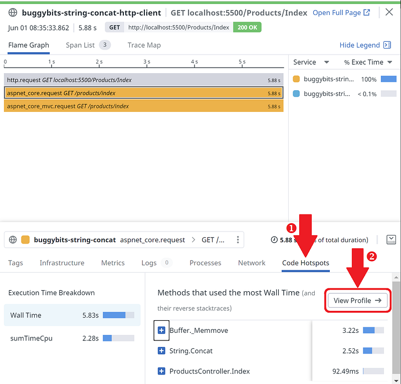

Before digging into the profiling information, you are already able to see that more than half of the time is spent in **Buffer._Memmove** that is called by Buggybits **ProductsController.Index** method:

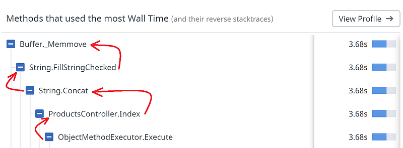

From the profile view, it is also possible to come back to the traces:

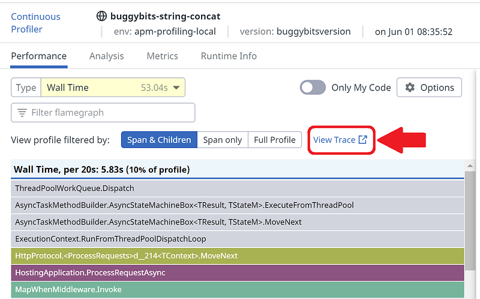

Let’s see now what new features are available at the profiling side.

## CPU profiling

The most demanded feature was the ability to analyse CPU consumption (a.k.a. CPU profiling). The idea is to be able to identify code that really consumes CPU usage and optimize it. This is particularly important in the context of cloud-based computing where what you pay is related to the consumed CPU.

In term of implementation, unlike Wall Time profiling, we look at the time spent by a thread on a CPU core and not the elapsed time since the last time we checked (every ~10ms). We also collect the call stack of a thread only if it is currently running on a core. Why? Because we want to only record call stacks corresponding to code paths that are consuming CPU. For example, ThreadPool threads are usually waiting (not interesting call stack) for a work item to process (interesting call stack).

In the [last blog post](/posts/2022-01-28_troubleshooting-net-performanc/), the [code responsible for lengthy requests](https://github.com/DataDog/dd-trace-dotnet/blob/master/profiler/src/Demos/Samples.BuggyBits/Controllers/ProductsController.cs#L124) is doing too many string concatenations (look for += in the following code):

```csharp
public IActionResult Index()
{
    var sw = new Stopwatch();
    sw.Start();
    var products = dataLayer.GetAllProducts();
    var productsTable = "<table><tr><th>Product Name</th><th>Description</th><th>Price</th></tr>";
    foreach (var product in products)
    {
        productsTable += $"<tr><td>{product.ProductName}</td><td>{product.Description}</td><td>{product.Price}</td></tr>";
    }

    productsTable += "</table>";
    sw.Stop();

    ViewData["ElapsedTimeInMs"] = sw.ElapsedMilliseconds;
    ViewData["ProductsTable"] = productsTable;
    return View();
}
```

The Wall Time view was very explicit about **ProductsController.Index()** calling **String.Concat()** culprit:

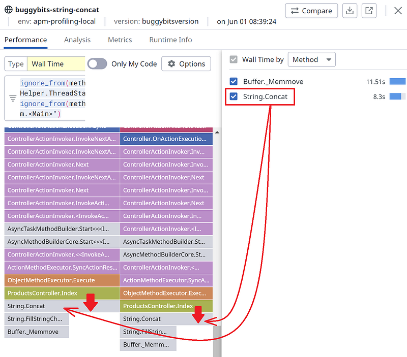

A simple solution is to [use a StringBuilder to optimize the concatenations](https://github.com/DataDog/dd-trace-dotnet/blob/master/profiler/src/Demos/Samples.BuggyBits/Controllers/ProductsController.cs#L103):

```csharp
public IActionResult Builder()
{
    var sw = new Stopwatch();
    sw.Start();
    var products = dataLayer.GetAllProducts();
    var productsTable = new StringBuilder(1000 * 80);
    productsTable.Append("<table><tr><th>Product Name</th><th>Description</th><th>Price</th></tr>");
    foreach (var product in products)
    {
        productsTable.Append($"<tr><td>{product.ProductName}</td><td>{product.Description}</td><td>{product.Price}</td></tr>");
    }

    productsTable.Append("</table>");
    sw.Stop();

    ViewData["ElapsedTimeInMs"] = sw.ElapsedMilliseconds;
    ViewData["ProductsTable"] = productsTable;
    return View("Index");
}
```

The Wall Time view of the profile with the fix does not provide anything useful…

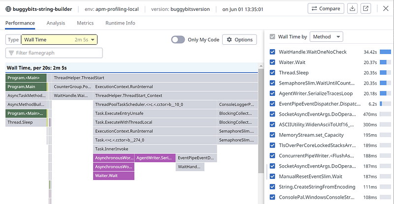

If you want to go deeper, you need to look at the CPU consumption:

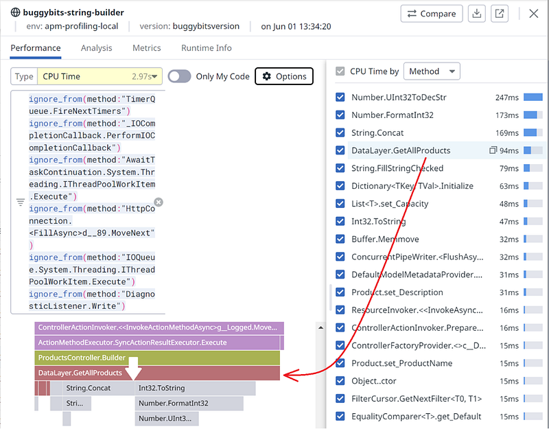

The **ProductController.Builder** method is handling the request (like **Index()** in the String.Concat case) and calls **DataLayer.GetAllProducts()** where most of the CPU-related work is done.

Would it be interesting to continue optimizing the code? Notice that **GetAllProducts()** is “only” consuming 94ms and the other **Number.*** and **String.Concat** method around 350ms. So a gain might be neglectable compared to the total ~3 seconds CPU usage

Remember that you should not optimize for the sake of “optimizing”: you should have metrics that tell you when to start (too lengthy request processing) and when to stop.

## Exceptions profiling

In the .NET world, exceptions are at the center of errors handling. It is now possible to get a sampled view of the exceptions that happened during an application lifetime; by type:

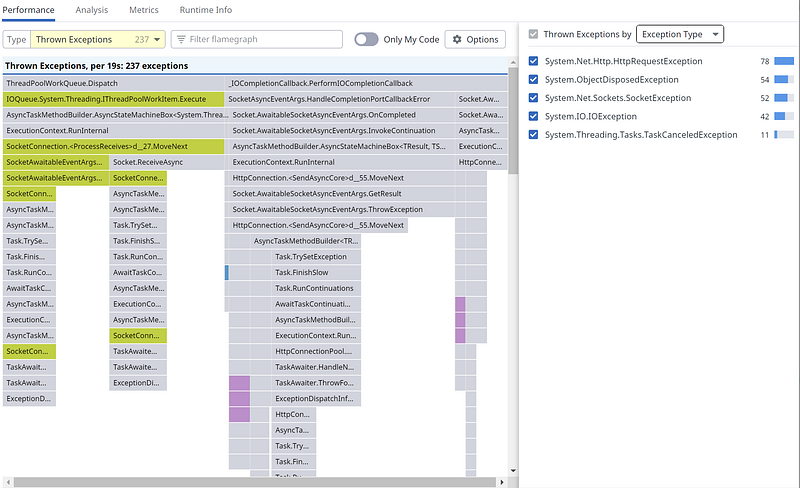

and by message:

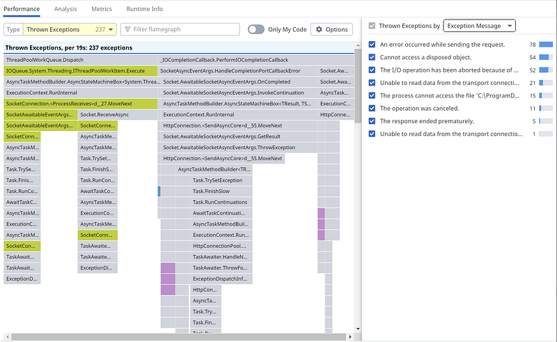

At the implementation level, the new exceptions profiler is notified by the CLR when an exception is thrown. Since in special cases (such as network issue or invalid parsed data for example), an application could trigger thousands of exceptions in a very short period, it is needed to sample them. Otherwise, the impact on performances would be severe; especially if the call stack needs to be rebuilt for each exception.

First, at least one exception per type is kept, ensuring that weird specific exceptions are not lost in the flow. Second, exceptions are sampled over time based on a fixed number of exceptions per profile and the rate of appearance. For knowing the exact number of exceptions, feel free to leverage the Runtime Metrics package as explained in the previous blog post.

## Profiling the application bootstrap

In some situations, you are interested in analysing an application bootstrap. In Datadog APM Profile Search UI, it means finding the first profile of the given service execution. However, even with the date and time column, it is not obvious to find the right one:

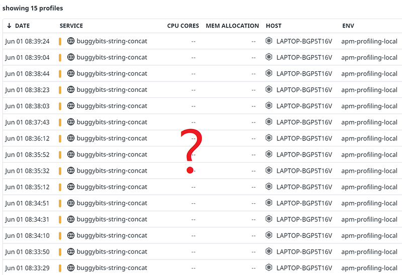

To help you find the initial profile of a service execution, a new “profile_seq” tag has been added to the HTTP request used to upload the profiles. It contains the count of generated profiles for a given execution of a service, starting from 0.

So now, in the Options of the profile list, add a “profile_seq” column:

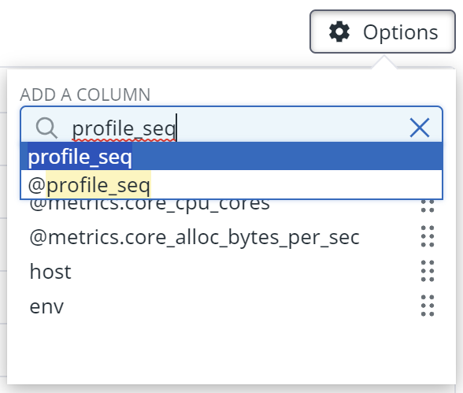

The first profile is then easily spottable with a 0 value:

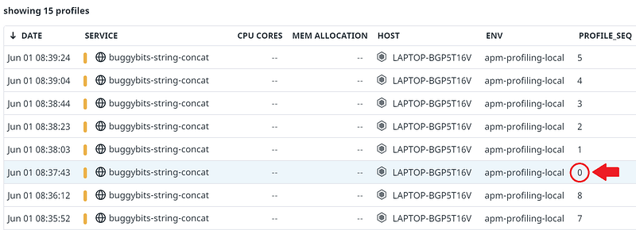

In the future, a more visual hint might be added to identify it without the need to add the column.

## Major implementation refactoring

Finally, our implementation has benefited from a large code refactoring. As the previous post explained, the generation of .pprof files and their upload was done in C#. This has been replaced by using a rust library shared amongst different profiler libraries (native, Ruby, .NET).

It means that you should not anymore see these frames in the application call stacks:

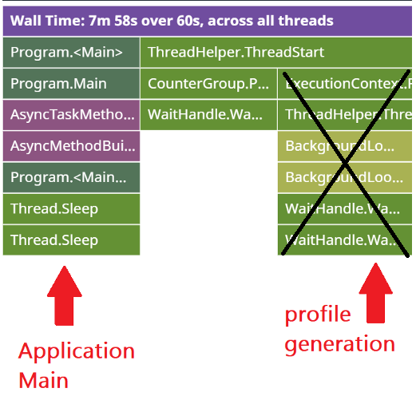

It does not mean that one third of the processing has been removed! Just that no more C# code is running with performance gain. First, the managed implementation was allocating objects managed by the garbage collector; adding pressure that might trigger more collections. Second, with the native rust implementation, there is no need to duplicate data between the collecting native part of the continuous profiler and the managed code used to serialize it.

In addition, several optimizations have been done in the symbol’s resolution (i.e., type and method names) part of the code that also reduce memory consumption and CPU usage.

Happy profiling!

## References

- Datadog Tracer & Continuous Profiler [.msi Installer and Linux tar.gz](https://github.com/DataDog/dd-trace-dotnet/releases/tag/v2.10.0)
- [Datadog Continuous Profiler documentation](https://docs.datadoghq.com/tracing/profiler/enabling/dotnet)
- [Datadog Tracer documentation](https://docs.datadoghq.com/tracing/setup_overview/setup/dotnet-framework/?tab=windows)
- [Datadog Runtime metrics documentation](https://docs.datadoghq.com/tracing/runtime_metrics/dotnet/)
- [Tess Ferrandez](https://twitter.com/TessFerrandez) repository for [BuggyBits labs](https://www.tessferrandez.com/blog/2008/02/04/debugging-demos-setup-instructions.html)
