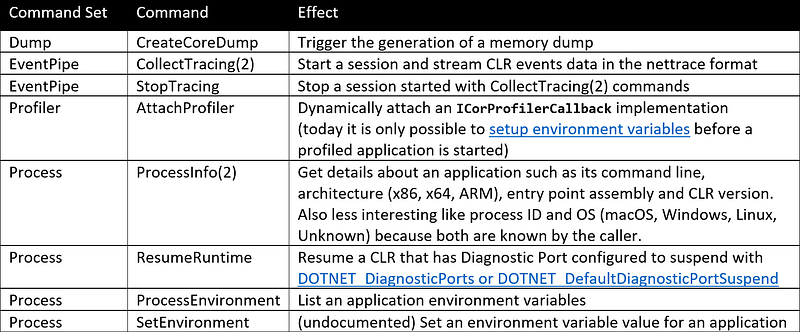
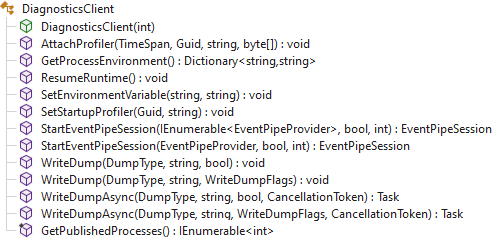
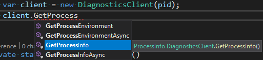

---

## Introduction

As I explained during [a DotNext conference session](https://www.youtube.com/watch?v=Jpoy3O6x-wM&t=1530s), the .NET CLI tools such as **dotnet-trace**, **dotnet-counter** or **dotnet-dump** are communicating with the CLR thanks to Named Pipe on Windows and Domain Socket on Linux. Within the CLR, a [diagnostic server thread](https://github.com/dotnet/coreclr/blob/release/3.1/src/vm/diagnosticserver.cpp#24) is responsible for answering requests. A communication protocol allows a tool to send *commands* and expect *responses*. This Diagnostic IPC Protocol is [pretty well documented](https://github.com/dotnet/diagnostics/blob/main/documentation/design-docs/ipc-protocol.md) in the dotnet Diagnostics repository.

Before going into the protocol details, here is a list of the available commands and their effect:



This series will detail how to communicate with a CLR using this protocol both in C# and in C++. Also note that processing CLR events thanks to EventPipe will also be covered.

## Make it simple: use Microsoft.Diagnostics.NETCore.Client nuget

With [TraceEvent nugget package](https://www.nuget.org/packages/Microsoft.Diagnostics.Tracing.TraceEvent), Microsoft provided a great library to [easily listen to CLR events](http://labs.criteo.com/2018/07/grab-etw-session-providers-and-events/) in C#. If you want to easily send CLR diagnostic IPC protocol commands to a CLR in a .NET process, [Microsoft.Diagnostics.NETCore.Client nuget package](https://www.nuget.org/packages/Microsoft.Diagnostics.NETCore.Client/) is for you. Remember that EventPipe is implemented by .NET Core and .NET 5+ (so no .NET Framework support)

The Swiss knife class **DiagnosticsClient** gives you access to most of the commands plus a way to list .NET processes as a bonus:



If you want to get the pid of all supported running .NET applications, call the static **GetPublishedProcesses()** method. Beware that the pid of your own application will also be included.

```csharp
private static void ListProcesses()
{
    var selfPid = Process.GetCurrentProcess().Id;
    foreach (var pid in DiagnosticsClient.GetPublishedProcesses())
    {
        var process = Process.GetProcessById(pid);
        Console.WriteLine($"{pid,6}{GetSeparator(pid == selfPid)}{process.ProcessName}");
    }
}
```

Otherwise, create an instance passing the process ID of the .NET application you are interested in. With this object, call the method corresponding to the command you want to send. For example, the following code is calling **GetProcessEnvironment()** to list the environment variables:

```csharp
private static void ListEnvironmentVariables(int pid)
{
    // get environment variables via existing wrapper in DiagnosticsClient
    var client = new DiagnosticsClient(pid);
    var envVariables = client.GetProcessEnvironment();
    foreach (var variable in envVariables.Keys.OrderBy(k => k))
    {
        Console.WriteLine($"{variable,26} = {envVariables[variable]}");
    }
}
```

Note that the value “ExitCode=00000000” is associated to the “” (empty) key for reason unknown to me…

Even though the undocumented command to set an environment variable is available via the **SetEnvironmentVariable()** method, there is no helper method wrapping the **ProcessInfo** command. In fact, a **GetProcessInfo()** method exists but it is internal! The **PidIpcEndpoint** type in charge of the transport and the **IpcMessage**, **IpcResponse** and **IpcClient** types dealing with commands are also internal. It means that the nuget will not help if you need to send the **ProcessInfo** command.

## Still easy: use Microsoft.Diagnostics.NETCore.Client source code

The .NET team spends some extra time testing, documenting, and verifying they are happy with the APIs in NetCore.Client before making them public, so sometimes you will see types that they used in their own tools that are still internal. But wait, if the CLI tools need some of these types, how will it work? Well…

The C# project corresponding to the MicrosoftDiagnostics.NETCore.Client assembly is part of the dotnet Diagnostic repository where the tools are implemented. If you look at [the .csproj file](https://github.com/dotnet/diagnostics/blob/main/src/Microsoft.Diagnostics.NETCore.Client/Microsoft.Diagnostics.NETCore.Client.csproj), you will see **InternalsVisibleTo** attributes to allow the tools to access the internal types:

```xml
  <ItemGroup>
    <InternalsVisibleTo Include="dotnet-counters" />
    <InternalsVisibleTo Include="dotnet-dsrouter" />
    <InternalsVisibleTo Include="dotnet-monitor" />
    <InternalsVisibleTo Include="dotnet-trace" />
    <InternalsVisibleTo Include="Microsoft.Diagnostics.Monitoring" />
    <InternalsVisibleTo Include="Microsoft.Diagnostics.Monitoring.EventPipe" />
    <!-- Temporary until Diagnostic Apis are finalized-->
    <InternalsVisibleTo Include="Microsoft.Diagnostics.Monitoring.WebApi" />
    <InternalsVisibleTo Include="Microsoft.Diagnostics.NETCore.Client.UnitTests" />
  </ItemGroup>
```

The great thing about OSS is that you can compile your own fork to make these types public. Of course you will be on your own to support these custom builds of the library and it is possible there will be changes to the API before .NET makes it public.

So what you could do to use these internal types in your code is the following:

- copy the folder from the Diagnostics repository
- add the name of your assembly that needs to access the internal types and members into the .csproj
- replace the reference to the nuget package by a project reference to the copied project

And now **GetProcessInfo** and the other internal types are public for you:



```csharp
private static void ListProcessInfo(int pid)
{
    var client = new DiagnosticsClient(pid);
    var info = client.GetProcessInfo();  // this method is internal
    Console.WriteLine($"              Command Line = {info.CommandLine}");
    Console.WriteLine($"              Architecture = {info.ProcessArchitecture}");
    Console.WriteLine($"      Entry point assembly = {info.ManagedEntrypointAssemblyName}");
    Console.WriteLine($"               CLR Version = {info.ClrProductVersionString}");
}
```

Note that during my tests, I was able to get a value for the **ManagedEntrypointAssemblyName** or **ClrProductVersionString** properties only with .NET 6+: the **ProcessInfo2** (0x404) command does not seem to be implemented in previous versions.

The next episode of the series will start to explain the EventPipe IPC protocol from a native C++ developer perspective.

## Resources

- [Microsoft.Diagnostics.NETCore.Client nuget package](https://www.nuget.org/packages/Microsoft.Diagnostics.NETCore.Client/)
- [TraceEvent nugget package](https://www.nuget.org/packages/Microsoft.Diagnostics.Tracing.TraceEvent)
- Diagnostics IPC protocol [documentation](https://github.com/dotnet/diagnostics/blob/main/documentation/design-docs/ipc-protocol.md)
