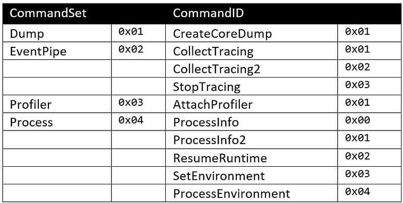
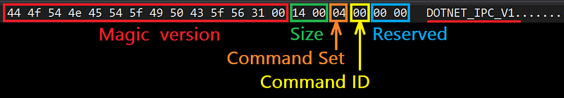
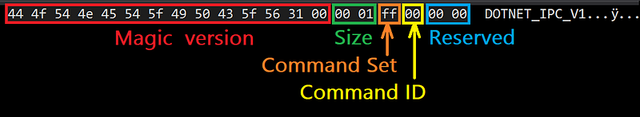
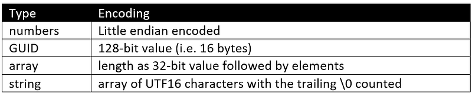
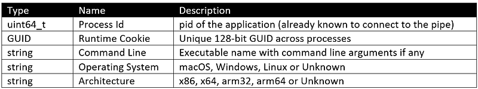
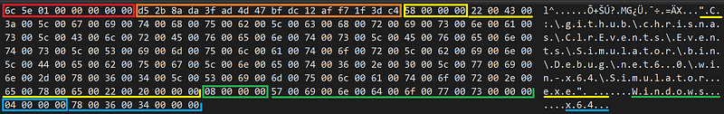

---

The [previous post](/posts/2022-07-28_digging-into-the-clr/) was describing the C# helpers to communicate with the diagnostic server in the CLR of a running .NET application.

If, like me, you must write native code (i.e not in C#), you will need to implement the transport and protocol yourself. And, as you will see, it is not that complicated thanks to the [documentation](https://github.com/dotnet/diagnostics/blob/main/documentation/design-docs/ipc-protocol.md) but also by using the [available C# code](https://github.com/dotnet/diagnostics/tree/main/src/Microsoft.Diagnostics.NETCore.Client) of the Microsoft.Diagnostics.NETCore.Client implementation as a guide.

## EventPipe transport layer

The first step is to connect to the CLR of a running .NET process. On Linux, you connect to a domain socket named “**{$TMPDIR}/dotnet-diagnostic-{%d:PID}-{%llu:**[**disambiguation key**](https://github.com/dotnet/diagnostics/blob/main/documentation/design-docs/ipc-protocol.md)**}-socket**”. For Windows, a named pipe called **\\.\pipe\dotnet-diagnostic-{%d:PID}** needs to be accessed.

Here is the Windows implementation code to connect to the IPC named pipe:

```cpp
int BasicConnection(DWORD pid)
{
    wchar_t pszPipeName[256];

    // build the pipe name as described in the protocol
    int nCharactersWritten = -1;
    nCharactersWritten = wsprintf(
        pszPipeName,
        L"\\\\.\\pipe\\dotnet-diagnostic-%d",
        pid
    );

    // check that CLR has created the diagnostics named pipe
    if (!::WaitNamedPipe(pszPipeName, 200))
    {
        auto error = ::GetLastError();
        std::cout << "Diagnostics named pipe is not available for process #" << pid << " (" << error << ")" << "\n";
        return -1;
    }

    // connect to the named pipe
    HANDLE hPipe;
    hPipe = ::CreateFile(
        pszPipeName,    // pipe name
        GENERIC_READ |  // read and write access
        GENERIC_WRITE,
        0,              // no sharing
        NULL,           // default security attributes
        OPEN_EXISTING,  // opens existing pipe
        0,              // default attributes
        NULL);          // no template file

    if (hPipe == INVALID_HANDLE_VALUE)
    {
        std::cout << "Impossible to connect to " << pszPipeName << "\n";
        return -2;
    }

        // ... send a command...

    // don't forget to close the named pipe
    ::CloseHandle(hPipe);

    return 0;
}
```

## Dig into the Command protocol

Once the connection is created, a command can be sent by writing to the pipe (or socket on Linux). The answer will be received by reading from the pipe (or socket on Linux). There is something important to remember: if you need to send different commands, it is needed to create one connection for each. You should not try to reuse a given connection that might also be closed after a command has been processed.

## Let’s start with the IpcHeader

Both the command and the response share the same header format:

```c
#pragma pack(1)
struct IpcHeader
{
    union
    {
        MagicVersion _magic;
        uint8_t  Magic[14];  // Magic Version number; a 0 terminated ANSI char array
    };
    uint16_t Size;       // The size of the incoming packet, size = header + payload size
    uint8_t  CommandSet; // The scope of the Command.
    uint8_t  CommandId;  // The command being sent
    uint16_t Reserved;   // reserved for future use
};

const MagicVersion DotnetIpcMagic_V1 = { "DOTNET_IPC_V1" };
```

The **Size** field stores the size of the header (= 20) plus the size of the payload (if any). Next comes the **CommandSet** field that identifies the groups in which the command belongs to:

```c
enum class DiagnosticServerCommandSet : uint8_t
{
    // reserved = 0x00,
    Dump        = 0x01,
    EventPipe   = 0x02,
    Profiler    = 0x03,
    Process     = 0x04,

    Server      = 0xFF,
};
```

It is then followed by the ID of a command in that **CommandSet** :



For example, here is the memory layout of a **ProcessInfo** command:



Since there is no additional parameter that would need to be encoded in a payload, the **Size** field is set to 20 (= 0x14 in hexadecimal) which is the size of the header alone.

To make command handling easier, I have defined the corresponding headers:

```c
const IpcHeader ProcessInfoMessage =
{
    { DotnetIpcMagic_V1 },
    (uint16_t)sizeof(IpcHeader),
    (uint8_t)DiagnosticServerCommandSet::Process,
    (uint8_t)DiagnosticServerResponseId::OK,
    (uint16_t)0x0000
};
```

All that makes the the code to send such a **ProcessInfo** command straightforward:

```cpp
bool ProcessInfoRequest::Send(HANDLE hPipe)
{
    // send the request
    IpcHeader message = ProcessInfoMessage;
    DWORD bytesWrittenCount = 0;
    if (!::WriteFile(hPipe, &message, sizeof(message), &bytesWrittenCount, nullptr))
    {
        Error = ::GetLastError();
        std::cout << "Error while sending ProcessInfo message to the CLR: 0x" << std::hex << Error << std::dec << "\n";
        return false;
    }
```

The next step is to read from the pipe to get the answer from the CLR. As mentioned earlier, the same **IpcHeader** is received; always with the **Server** (0xFF) **CommandSet** value. The **CommandId** field is 0 for a success and 0xFF in case of an error.

```c
enum class DiagnosticServerResponseId : uint8_t
{
    OK = 0x00,
    // future
    Error = 0xFF,
};
```

For example, here is the memory layout of a **ProcessInfo** answer:



Note that numbers are little-endian encoded (hence the 0001 for the Size field: it means 0x0100 = 256 bytes)

The code to analyze the response follows:

```cpp
    // analyze the response
    // 1. get the header to know how large the buffer should be to get the payload
    message = {};
    DWORD bytesReadCount = 0;
    if (!::ReadFile(hPipe, &message, sizeof(message), &bytesReadCount, nullptr))
    {
        Error = ::GetLastError();
        std::cout << "Error while getting ProcessInfo response from the CLR: 0x" << std::hex << Error<< std::dec << "\n";
        return false;
    }

    if (message.CommandId != (uint8_t)DiagnosticServerResponseId::OK)
    {
        Error = message.CommandId;
        std::cout << "Error returned by the CLR in ProcessInfo response: 0x" << std::hex << Error<< std::dec << "\n";
        return false;
    }
```

In case of success, the size of the response payload is obtained from the **Size** field by subtracting the size of the header. The next step is to allocate a buffer and read the payload from the pipe into that buffer:

```cpp
    uint16_t payloadSize = message.Size - sizeof(message);
    _buffer = new uint8_t[payloadSize];
    if (!::ReadFile(hPipe, _buffer, payloadSize, &bytesReadCount, nullptr))
    {
        Error = ::GetLastError();
        std::cout << "Error while getting ProcessInfo payload: 0x" << std::hex << Error << std::dec << "\n";
        return false;
    }
    // Note: bytesReadCount == payloadSize
```

## How to access the response fields

Now that the response payload has been read into a memory buffer, it is time to look at the expected fields [as described in the documentation](https://github.com/dotnet/diagnostics/blob/main/documentation/design-docs/ipc-protocol.md). Here is the encoding of the different field types:



To continue with the **ProcessInfo** example, here are the expected fields:



So here is the memory layout for the response payload for my monitored Windows 64-bit simulator.exe test application:



To simplify the implementation, the class in charge of a command allocates a buffer corresponding to the payload and provides fields with values either copied from it or, in case of strings, pointing to the buffer (just after the 32-bit length):

```cpp
bool ProcessInfoRequest::ParseResponse(DWORD payloadSize)
{
    uint32_t index = 0;
    
    memcpy(&Pid, &_buffer[index], sizeof(Pid));
    index += sizeof(Pid);
    if (payloadSize < index) return false;

    memcpy(&RuntimeCookie, &_buffer[index], sizeof(RuntimeCookie));
    index += sizeof(RuntimeCookie);
    if (payloadSize < index) return false;

    PointToString(_buffer, index, CommandLine);
    if (payloadSize < index) return false;

    PointToString(_buffer, index, OperatingSystem);
    if (payloadSize < index) return false;

    PointToString(_buffer, index, Architecture);

    return true;
}
```

The **PointToString** helper code is straightforward:

```cpp
void PointToString(uint8_t* buffer, uint32_t& index, wchar_t*& string)
{
    // strings are stored as:
    //    - characters count as uint32_t
    //    - array of UTF16 characters followed by "\0"
    // Note that the last L"\0" IS COUNTED 
    uint32_t count;
    memcpy(&count, &buffer[index], sizeof(count));

    // skip characters count 
    index += sizeof(count);

    // empty string case
    // Note: could make it point to the "count" which is 0 in the buffer
    //       instead of returning nullptr
    if (count == 0)
    {
        string = nullptr;
        return;
    }

    string = (wchar_t*)&buffer[index];

    // skip the whole string (including last UTF16 '\0')
    index += count * (uint32_t)sizeof(wchar_t);
}
```

You now know how to send a command without parameter and analyze the expected response. The next post will show you how to listen to CLR events like dotnet trace.

## Resources

- [Episode 1](/posts/2022-07-28_digging-into-the-clr/) — *Digging into the CLR Diagnostics IPC Protocol in C#*
- Diagnostics IPC protocol [documentation](https://github.com/dotnet/diagnostics/blob/main/documentation/design-docs/ipc-protocol.md)
- Microsoft.Diagnostics.NETCore.Client [source code](https://github.com/dotnet/diagnostics/tree/main/src/Microsoft.Diagnostics.NETCore.Client)
