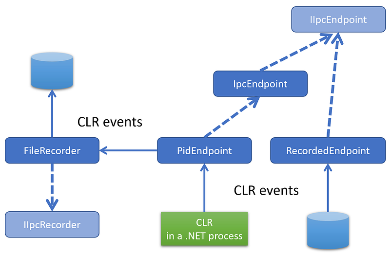

---

As shown in the [previous post](/posts/2022-09-18_net-diagnostic-ipc-protocol/), the processing of **ProcessInfo** diagnostic commands is easy because you send a request and read the different fields from the response. This is different if you want to receive events from the CLR via EventPipe. In C#, the [TraceEvent nuget package](https://www.nuget.org/packages/Microsoft.Diagnostics.Tracing.TraceEvent/) wraps everything under a nice event handler based model as shown in many of my [previous posts](http://labs.criteo.com/2018/07/grab-etw-session-providers-and-events/).

Behind the scene, a **StartSession** command is sent (more details about the parameters later) and the response contains the numeric ID of the session. Then, the events will be read from the IPC channel as a binary stream of data with the [“nettrace“ file format](https://github.com/microsoft/perfview/blob/main/src/TraceEvent/EventPipe/EventPipeFormat.md). The collection ends when the **StopTracing** command is sent.

The source code is available from [my github repository](https://github.com/chrisnas/ClrEvents/tree/master/Events/NativeEventListener).

## Hidding the transport layer: IIpcEndoint

Unlike the previous post, to send the command and read the response back from the CLR , I’m wrapping the transport layer with the **IIpcEndpoint** interface:

```cpp
class IIpcEndpoint
{
public:
    virtual bool Write(LPCVOID buffer, DWORD bufferSize, DWORD* writtenBytes) = 0;
    virtual bool Read(LPVOID buffer, DWORD bufferSize, DWORD* readBytes) = 0;
    virtual bool ReadByte(uint8_t& byte) = 0;
    virtual bool ReadWord(uint16_t& word) = 0;
    virtual bool ReadDWord(uint32_t& dword) = 0;
    virtual bool ReadLong(uint64_t& ulong) = 0;

    virtual bool Close() = 0;
    virtual ~IIpcEndpoint() = default;
};
```

It abstracts the write and read accesses to the underlying transport layer. In addition, the base class accepts a “recorder” that allows me to store what is received from the CLR into any kind of storage (today only a file-based recorder that helped a lot to reproduce specific situations without the need to have a running process to connect to):



The **PidEndpoint** class accepts the process id of the running .NET application to monitor its CLR events and an optional recorder implementing the **IIpcRecorder** interface. The **Create** static factory implementation creates the expected named pipe on Windows (or the domain socket on Linux) and stores the handle into its **_handle** field:

```cpp
PidEndpoint* PidEndpoint::CreateForWindows(int pid, IIpcRecorder* pRecorder)
{
    PidEndpoint* pEndpoint = new PidEndpoint(pRecorder);

    // build the pipe name as described in the protocol
    wchar_t pszPipeName[256];
    int nCharactersWritten = -1;
    nCharactersWritten = wsprintf(
        pszPipeName,
        L"\\\\.\\pipe\\dotnet-diagnostic-%d",
        pid
    );

    // check that CLR has created the diagnostics named pipe
    if (!::WaitNamedPipe(pszPipeName, 200))
    {
        auto error = ::GetLastError();
        std::cout << "Diagnostics named pipe is not available for process #" << pid << " (" << error << ")" << "\n";
        return nullptr;
    }

    // connect to the named pipe
    HANDLE hPipe;
    hPipe = ::CreateFile(
        pszPipeName,    // pipe name
        GENERIC_READ |  // read and write access
        GENERIC_WRITE,
        0,              // no sharing
        NULL,           // default security attributes
        OPEN_EXISTING,  // opens existing pipe
        0,              // default attributes
        NULL);          // no template file

    if (hPipe == INVALID_HANDLE_VALUE)
    {
        std::cout << "Impossible to connect to " << pszPipeName << "\n";
        return nullptr;
    }

    pEndpoint->_handle = hPipe;
    return pEndpoint;
}
```

The next step is to open a tracing session by sending the **StartSession** command.

## The Trace diagnostic commands

Following the same object model provided by the [Microsoft.Diagnostics.NETCore.Client nuget](https://www.nuget.org/packages/Microsoft.Diagnostics.NETCore.Client/), my **DiagnosticsClient** class hides the transport layer. It also exposes high level functions such as **OpenEventPipeSession** to initiate a trace event session with the CLR:

```c
EventPipeSession* OpenEventPipeSession(uint64_t keywords, EventVerbosityLevel verbosity);
```

If you remember from **TraceEvent**, you need a few parameters to create a session:

- size of circular buffers used by the CLR to cache events (same as Perfview, use 16 MB as default)
- netttrace format (i.e. value of 1)
- if rundown events are needed
- a list of providers (“Microsoft-Windows-DotNETRuntime” for the CLR in my case)
- keywords
- verbosity level
- possible arguments (none here)

Here is the corresponding C++ description of the command type:

```c
const uint8_t DotnetProviderMagicLength = 32;
struct MagicProvider
{
    wchar_t Magic[DotnetProviderMagicLength];
};

// 32 wchar_t (including \0)
const MagicProvider DotnetProviderMagic = { L"Microsoft-Windows-DotNETRuntime" };

const uint32_t CircularBufferMBSize = 16;
const uint32_t NetTraceFormat = 1;

#pragma pack(1)
struct StartSessionMessage : public IpcHeader
{
    uint32_t CircularBufferMB;  // 16 MB
    uint32_t Format;            // 1 for NetTrace format
    uint8_t RequestRundown;     // 0 because don't want rundown

    // array of provider configuration
    uint32_t ProviderCount;     // 1 only: Microsoft-Windows-DotNETRuntime
    uint64_t Keywords;          // from EventKeyword
    uint32_t Verbosity;         // from EventPipeEventLevel
    uint32_t ProviderStringLen; // number of UTF16 characters = 32 (including last \0)
    union                       // dotnet provider name
    {
        MagicProvider _magic;
        uint8_t Provider[2 * DotnetProviderMagicLength];
    };
    uint32_t Arguments;         // 0 for empty string (no argument)
};
```

The code to fill up the command is straightforward:

```cpp
StartSessionMessage* CreateStartSessionMessage(uint64_t keywords, EventVerbosityLevel verbosity)
{
    auto message = new StartSessionMessage();
    ::ZeroMemory(message, sizeof(message));
    memcpy(message->Magic, &DotnetIpcMagic_V1, sizeof(message->Magic));
    message->Size = sizeof(StartSessionMessage);  
    message->CommandSet = (uint8_t)DiagnosticServerCommandSet::EventPipe;
    message->CommandId = (uint8_t)EventPipeCommandId::CollectTracing2;
    message->Reserved = 0;
    message->CircularBufferMB = CircularBufferMBSize;
    message->Format = NetTraceFormat;
    message->RequestRundown = 0;
    message->ProviderCount = 1;
    message->Keywords = (uint64_t)keywords;
    message->Verbosity = (uint32_t)verbosity;
    message->ProviderStringLen = DotnetProviderMagicLength;
    memcpy(message->Provider, &DotnetProviderMagic, sizeof(message->Provider));
    message->Arguments = 0;

    return message;
}
```

The provider list is defined with the **ProviderCount** field and string containing the list (only one here) follows the **Verbosity** field. To start the session, it is needed to send the **StartSession** message and read the session id from the response:

```cpp
bool EventPipeStartRequest::Process(IIpcEndpoint* pEndpoint, uint64_t keywords, EventVerbosityLevel verbosity)
{
    // send an StartSessionMessage and parse the response
    StartSessionMessage* pMessage = CreateStartSessionMessage(keywords, verbosity);

    DWORD writtenBytes = 0;
    if (!pEndpoint->Write(pMessage, pMessage->Size, &writtenBytes))
    {
        return false;
    }

    // analyze the response
    IpcHeader response = {};
    DWORD bytesReadCount = 0;
    if (!pEndpoint->Read(&response, sizeof(response), &bytesReadCount))
    {
        return false;
    }

    if (response.CommandId != (uint8_t)DiagnosticServerResponseId::OK)
    {
        return false;
    }

    // get the session ID from the payload
    uint16_t payloadSize = response.Size - sizeof(response);
    if (payloadSize < sizeof(uint64_t))
    {
        return false;
    }

    if (!pEndpoint->ReadLong(SessionId))
    {
        return false;
    }

    return true;
}
```

Once the **StartSession** command has been sent, the events corresponding to the given provider/keywords/verbosity (here the CLR runtime/gc+exception+contention/verbose)

```cpp
auto pSession = pClient->OpenEventPipeSession(
        EventKeyword::gc |
          EventKeyword::exception |
          EventKeyword::contention,
        EventVerbosityLevel::Verbose  // required for AllocationTick
        );
```

will be read from the event pipe. Since this action will be synchronous, it is recommended to dedicate a thread to read and process the events:

```cpp
    if (pSession != nullptr)
    {
        DWORD tid = 0;
        auto hThread = ::CreateThread(nullptr, 0, ListenToEvents, pSession, 0, &tid);

        std::cout << "Press ENTER to stop listening to events...\n\n";
        std::string line;
        std::getline(std::cin, line);

        std::cout << "Stopping session\n\n";
        pSession->Stop();
        std::cout << "Session stopped\n\n";

        // test if it works
        ::Sleep(1000);

        ::CloseHandle(hThread);
    }
```

The **ListenToEvents** callback executed by the new thread is “simply” listening to the event pipe of the session:

```cpp
DWORD WINAPI ListenToEvents(void* pParam)
{
    EventPipeSession* pSession = static_cast<EventPipeSession*>(pParam);

    pSession->Listen();

    return 0;
}
```

Before describing how to read the events, it is important to understand how to stop the flow. First, inside the **EventPipeSession**, the internal loop that reads events needs to exit thanks to the **_stopRequested** boolean:

```cpp
bool EventPipeSession::Stop()
{
    _stopRequested = true;

    if (_pid == -1)
        return true;

    // it is neeeded to use a different ipc connection to stop the Session
    DiagnosticsClient* pStopClient = DiagnosticsClient::Create(_pid, nullptr);
    pStopClient->StopEventPipeSession(SessionId);
    delete pStopClient;

    return true; 
}
```

In addition, a message with **StopTracing** command id from the **EventPipe** command set needs to be sent to tell the CLR to stop sending the events. This message must be sent through a different IPC channel (hence the **pStopClient** variable used in the previous code. The **StopEventPipeSession** helper function uses the **EventPipeStopRequest** wrapper:

```cpp
bool DiagnosticsClient::StopEventPipeSession(uint64_t sessionId)
{
    EventPipeStopRequest request;
    return request.Process(_pEndpoint, sessionId);
}
```

The **StopSession** command accepts the session ID as single parameter:

```c
#pragma pack(1)
struct StopSessionMessage : public IpcHeader
{
    uint64_t SessionId;
};
```

The processing of the stop request is to create such a message and send it through the IPC channel:

```cpp
StopSessionMessage* CreateStopMessage(uint64_t sessionId)
{
    StopSessionMessage* message = new StopSessionMessage();
    ::ZeroMemory(message, sizeof(message));
    memcpy(message->Magic, &DotnetIpcMagic_V1, sizeof(message->Magic));
    message->Size = sizeof(StopSessionMessage);
    message->CommandSet = (uint8_t)DiagnosticServerCommandSet::EventPipe;
    message->CommandId = (uint8_t)EventPipeCommandId::StopTracing;
    message->Reserved = 0;
    message->SessionId = sessionId;

    return message;
}

bool EventPipeStopRequest::Process(IIpcEndpoint* pEndpoint, uint64_t sessionId)
{
    StopSessionMessage* pMessage = CreateStopMessage(sessionId);
    DWORD writtenBytes;
    if (!pEndpoint->Write(pMessage, pMessage->Size, &writtenBytes))
    {
        Error = ::GetLastError();
        std::cout << "Error while sending EventPipe Stop message to the CLR: 0x" << std::hex << Error << std::dec << "\n";
        delete pMessage;
        return false;
    }
    
    delete pMessage;

    ... // handle the response 

    return true;
}
```

When the stop command is received by the CLR, the remaining “data” (more on this in the next episode) is sent through the first IPC channel before being closed. This is how the code knows that the session can stop listening to the EventPipe.

The next episode will start to parse the nettrace stream of events.

## Resources

- [Episode 1](/posts/2022-07-28_digging-into-the-clr/) — *Digging into the CLR Diagnostics IPC Protocol in C#*
- [Episode 2](/posts/2022-09-18_net-diagnostic-ipc-protocol/) — *.NET Diagnostic IPC protocol: the C++ way*
- [Source code](https://github.com/chrisnas/ClrEvents/tree/master/Events/NativeEventListener) for the C++ implementation of CLR events listener
- Diagnostics IPC protocol [documentation](https://github.com/dotnet/diagnostics/blob/main/documentation/design-docs/ipc-protocol.md)
- Microsoft.Diagnostics.NETCore.Client [source code](https://github.com/dotnet/diagnostics/tree/main/src/Microsoft.Diagnostics.NETCore.Client)
