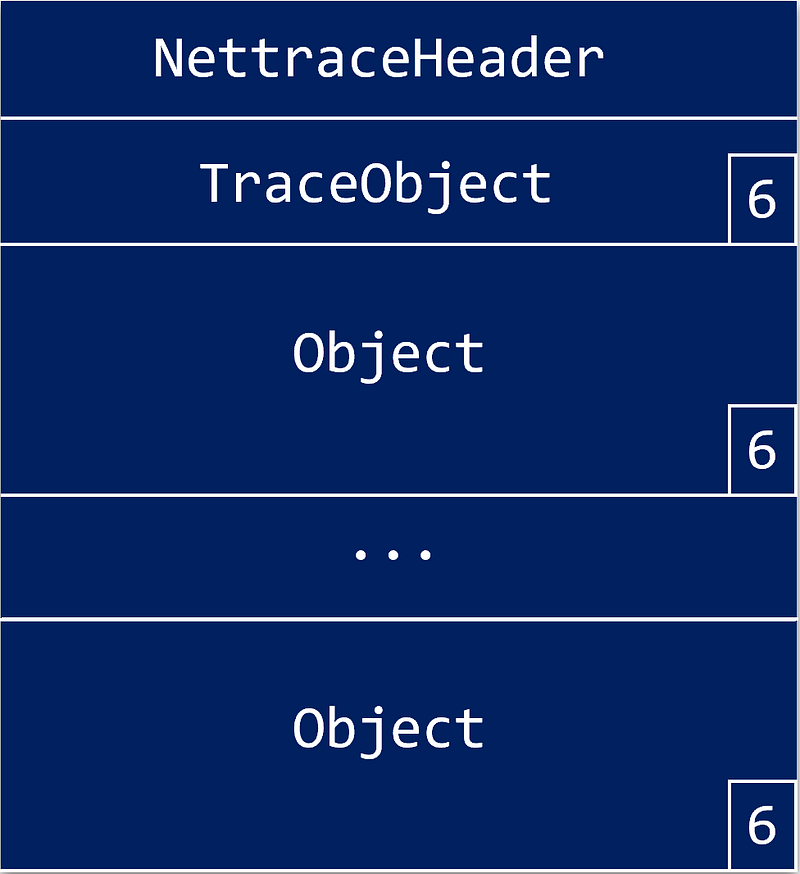
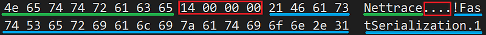
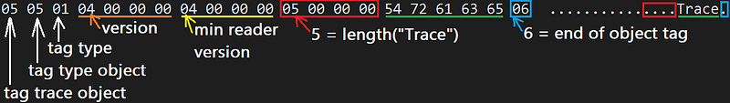
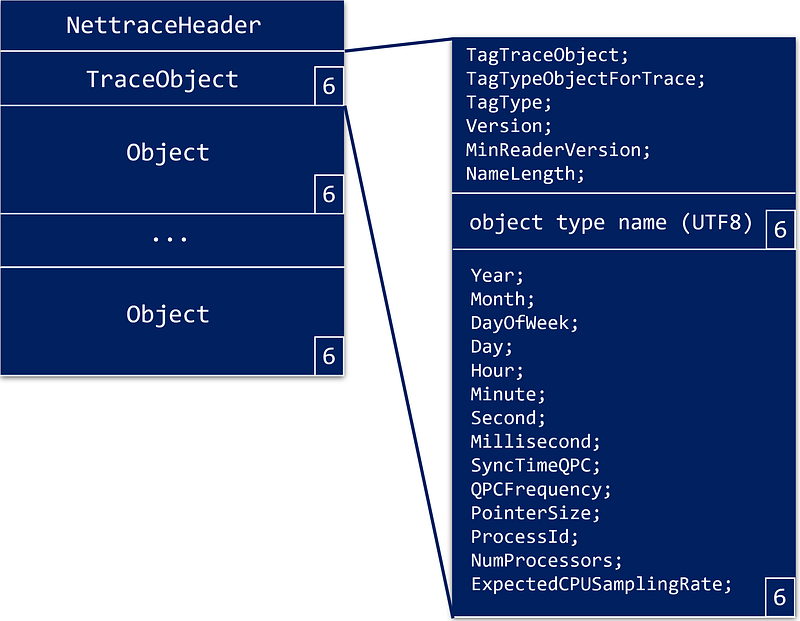

---

The previous episodes explained how to [contact the .NET Diagnostics IPC server](/posts/2022-09-18_net-diagnostic-ipc-protocol/) and [initiate the protocol to receive CLR events](/posts/2022-10-23_clr-events-go-for/). It is now time to dig into the “nettrace” stream format!

As the [IPC command documentation](https://github.com/dotnet/diagnostics/blob/main/documentation/design-docs/ipc-protocol.md) states, the response to the **CollectTracing** command is *followed by an Optional Continuation of a nettrace format stream of events*. In fact, before .NET Core 3, the [netperf format](https://github.com/microsoft/perfview/blob/main/src/TraceEvent/EventPipe/NetPerfFormat.md) was used but I will focus on the nettrace format also used in .NET 5+.

From a high-level view, it is a header followed by a stream of “objects”; each described by a header and ending with a byte with **6** as value:



Let’s start with the *nettrace* header:

```c
#pragma pack(1)
struct NettraceHeader
{
    uint8_t Magic[8];               // "Nettrace" with not '\0'
    uint32_t FastSerializationLen;  // 20
    uint8_t FastSerialization[20];  // "!FastSerialization.1" with not '\0'
};

const char* NettraceHeaderMagic = "Nettrace";
const char* FastSerializationMagic = "!FastSerialization.1";
```

It can be used to check the format and version of the received data (in case of format evolution over time):

```cpp
bool CheckNettraceHeader(NettraceHeader& header)
{
    if (!IsSameAsString(header.Magic, sizeof(header.Magic), NettraceHeaderMagic))
        return false;

    if (header.FastSerializationLen != strlen(FastSerializationMagic))
        return false;

    if (!IsSameAsString(header.FastSerialization, sizeof(header.FastSerialization), FastSerializationMagic))
        return false;

    return true;
};
```

In memory, the “strings” are stored as an array of UTF8 characters without trailing ‘\0’



This drives the implementation of the comparison helper:

```cpp
bool IsSameAsString(uint8_t* bytes, uint16_t length, const char* characters)
{
    return memcmp(bytes, characters, length) == 0;
}
```

## Everything is an “object”

After the header, data is represented as “objects” whose description is stored in an **ObjectHeader**:

```c
#pragma pack(1)
struct ObjectHeader
{
    NettraceTag TagTraceObject;         // 5
    NettraceTag TagTypeObjectForTrace;  // 5
    NettraceTag TagType;                // 1
    uint32_t Version;                   //
    uint32_t MinReaderVersion;          //
    uint32_t NameLength;                // length of UTF8 name that follows
};
```

followed by the name of the object type in UTF8. Note that, like for “!FastSerialization.1” in **NettraceHeader**, its length is provided in the **NameLength** field of the **ObjectHeader**. For example, here is how the initial TraceObject header is stored in memory:



and its equivalent in code:

```c
#pragma pack(1)
struct TraceObjectHeader : ObjectHeader
{
  //NettraceTag TagTraceObject;         // 5
  //NettraceTag TagTypeObjectForTrace;  // 5
  //NettraceTag TagType;                // 1
  //uint32_t Version;                   // 4
  //uint32_t MinReaderVersion;          // 4
  //uint32_t NameLength;                // 5
    uint8_t Name[5];                    // 'Trace
    NettraceTag TagEndTraceObject;      // 6
};
```

Note that after the “object” type name, an “end of object” byte (i.e. = 6) appears before the payload.

So, each kind of “object” shares the same **ObjectHeader** followed by a UTF8 type name:

- “EventBlock” : contains one or more events
- “MetadataBlock” : contains partial description of events (no name nor payload fields)
- “StackBlock” : contains call stacks (i.e. arrays of instruction pointers)
- “SPBlock” : contains check point inside the stream inside the stream (used for drop message detection and callstack cache invalidation)

It means that you need to compare the strings to figure out the “object” type:

```cpp
const char* EventBlockName = "EventBlock";
const char* MetadataBlockName = "MetadataBlock";
const char* StackBlockName = "StackBlock";
const char* SequencePointBlockName = "SPBlock";

ObjectType EventPipeSession::GetObjectType(ObjectHeader& header)
{
    // check validity
    if (header.TagTraceObject != NettraceTag::BeginPrivateObject) return ObjectType::Unknown;
    if (header.TagTypeObjectForTrace != NettraceTag::BeginPrivateObject) return ObjectType::Unknown;
    if (header.TagType != NettraceTag::NullReference) return ObjectType::Unknown;

    // figure out which type it is based on the name:
    //   EventBlock -> "EventBlock"  (size = 10)
    //   MetadataBlock -> "MetadataBlock" (size = 13)
    //   StackBlock -> "StackBlock" (size = 10)
    //   SequencePointBlock -> "SPBlock" (size = 7)
    if (header.NameLength == 13)
    {
        uint8_t buffer[13];
        if (!Read(buffer, 13))
            return ObjectType::Unknown;

        if (IsSameAsString(buffer, 13, MetadataBlockName))
            return ObjectType::MetadataBlock;

        return ObjectType::Unknown;
    }
    else
    if (header.NameLength == 10)
    {
        uint8_t buffer[10];
        if (!Read(buffer, 10))
            return ObjectType::Unknown;

        if (IsSameAsString(buffer, 10, EventBlockName))
            return ObjectType::EventBlock;
        else
        if (IsSameAsString(buffer, 10, StackBlockName))
            return ObjectType::StackBlock;

        return ObjectType::Unknown;
    }
    else
    if (header.NameLength == 7)
    {
        uint8_t buffer[7];
        if (!Read(buffer, 7))
            return ObjectType::Unknown;

        if (IsSameAsString(buffer, 7, SequencePointBlockName))
            return ObjectType::SequencePointBlock;

        return ObjectType::Unknown;
    }

    return ObjectType::Unknown;
}
```

The first object that appears in the stream contains details about the whole stream:



After the header, some fields follow as a payload:

```c
#pragma pack(1)
struct ObjectFields
{
    uint16_t Year;
    uint16_t Month;
    uint16_t DayOfWeek;
    uint16_t Day;
    uint16_t Hour;
    uint16_t Minute;
    uint16_t Second;
    uint16_t Millisecond;
    uint64_t SyncTimeQPC;
    uint64_t QPCFrequency;
    uint32_t PointerSize;
    uint32_t ProcessId;
    uint32_t NumProcessors;
    uint32_t ExpectedCPUSamplingRate;
};
```

Beyond the timestamp information and the pointer size (required when call stack instruction pointers will be read as 8 (64-bit) or 4 (32-bit) bytes addresses) the other fields are not really interesting.

## Let’s go back to a higher-level view

Here is the code to listen to the nettrace stream:

```cpp
bool EventPipeSession::Listen()
{
    if (!ReadHeader())
        return false;

    if (!ReadTraceObjectHeader())
        return false;

    ObjectFields ofTrace;
    if (!ReadObjectFields(ofTrace))
        return false;

    // use the "trace object" fields to figure out the bitness of the application
    Is64Bit = ofTrace.PointerSize == 8;
    _stackParser.SetPointerSize(ofTrace.PointerSize);
    _metadataParser.SetPointerSize(ofTrace.PointerSize);
    _eventParser.SetPointerSize(ofTrace.PointerSize);

    // don't forget to check the end object tag
    uint8_t tag;
    if (!ReadByte(tag) || (tag != NettraceTag::EndObject))
        return false;

    // read one "object" after the other
    while (ReadNextObject())
    {
        std::cout << "------------------------------------------------\n";
        std::cout << "\n________________________________________________\n";
    }

    return _stopRequested;
}
```

I will come back to the different **_XXXparser** fields soon.

The **ReadNextObject** helper is responsible for reading the expected **ObjectHeader** and the string that follows to figure out what is the type of this “object” and what payload to expect:

```cpp
bool EventPipeSession::ReadNextObject()
{
    // get the type of object from the header
    ObjectHeader header;
    if (!Read(&header, sizeof(ObjectHeader)))
    {
        Error = ::GetLastError();
        std::cout << "Error while reading Object header: 0x" << std::hex << Error << std::dec << "\n";
        return false;
    }

    ObjectType ot = GetObjectType(header);
    if (ot == ObjectType::Unknown)
    {
        std::cout << "Invalid object header type:\n";
        DumpObjectHeader(header);
        return false;
    }

    // don't forget to check the end object tag
    uint8_t tag;
    if (!ReadByte(tag) || (tag != NettraceTag::EndObject))
    {
        std::cout << "Missing end of object tag: " << (uint8_t)tag << "\n";
        return false;
    }
    ...
```

The **GetObjectType** function checks the header validity and extracts the “object” type name:

```cpp
ObjectType EventPipeSession::GetObjectType(ObjectHeader& header)
{
    // check validity
    if (header.TagTraceObject != NettraceTag::BeginPrivateObject) return ObjectType::Unknown;
    if (header.TagTypeObjectForTrace != NettraceTag::BeginPrivateObject) return ObjectType::Unknown;
    if (header.TagType != NettraceTag::NullReference) return ObjectType::Unknown;

    // figure out which type it is based on the name:
    //   EventBlock -> "EventBlock"  (size = 10)
    //   MetadataBlock -> "MetadataBlock" (size = 13)
    //   StackBlock -> "StackBlock" (size = 10)
    //   SequencePointBlock -> "SPBlock" (size = 7)
    if (header.NameLength == 13)
    {
        uint8_t buffer[13];
        if (!Read(buffer, 13))
            return ObjectType::Unknown;

        if (IsSameAsString(buffer, 13, MetadataBlockName))
            return ObjectType::MetadataBlock;

        return ObjectType::Unknown;
    }
    else
    if (header.NameLength == 10)
    {
        uint8_t buffer[10];
        if (!Read(buffer, 10))
            return ObjectType::Unknown;

        if (IsSameAsString(buffer, 10, EventBlockName))
            return ObjectType::EventBlock;
        else
        if (IsSameAsString(buffer, 10, StackBlockName))
            return ObjectType::StackBlock;

        return ObjectType::Unknown;
    }
    else
    if (header.NameLength == 7)
    {
        uint8_t buffer[7];
        if (!Read(buffer, 7))
            return ObjectType::Unknown;

        if (IsSameAsString(buffer, 7, SequencePointBlockName))
            return ObjectType::SequencePointBlock;

        return ObjectType::Unknown;
    }

    return ObjectType::Unknown;
}
```

The same **IsSameAsString** helper is used to compare the read “object” name with the known types.

The end of **ReadNextObject** simply parses the “object” payload as a memory block based on its type:

```cpp
    ...
    switch (ot)
    {
        case ObjectType::EventBlock:
            return ParseEventBlock(header);
        case ObjectType::MetadataBlock:
            return ParseMetadataBlock(header);
        case ObjectType::StackBlock:
            return ParseStackBlock(header);
        case ObjectType::SequencePointBlock:
            return ParseSequencePointBlock(header);

        default:
            return false;
    }
}
```

The next step will be to look into each “object” type payload.

## Resources

- [Episode 1](/posts/2022-07-28_digging-into-the-clr/) — *Digging into the CLR Diagnostics IPC Protocol in C#*
- [Episode 2](/posts/2022-09-18_net-diagnostic-ipc-protocol/) — *.NET Diagnostic IPC protocol: the C++ way*
- [Episode 3 ](/posts/2022-10-23_clr-events-go-for/ CLR events: go for the nettrace file format!
- [Source code](https://github.com/chrisnas/ClrEvents/tree/master/Events/NativeEventListener) for the C++ implementation of CLR events listener
- Diagnostics IPC protocol [documentation](https://github.com/dotnet/diagnostics/blob/main/documentation/design-docs/ipc-protocol.md)
