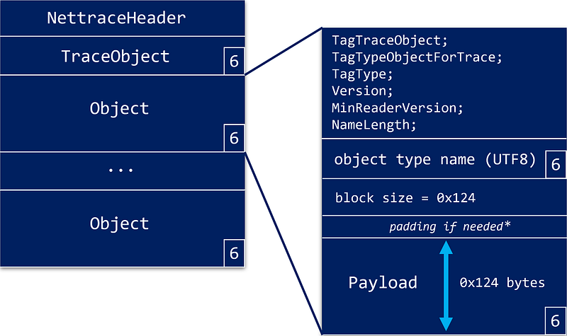
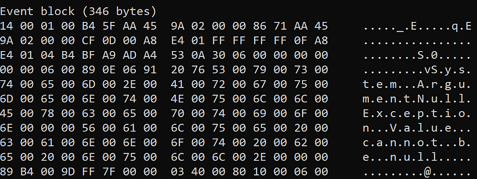
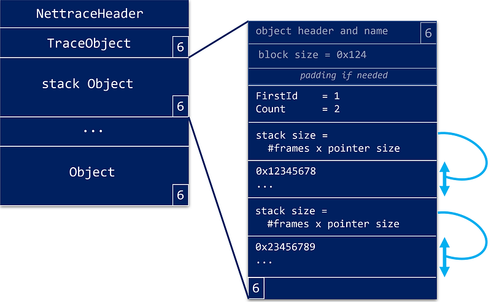
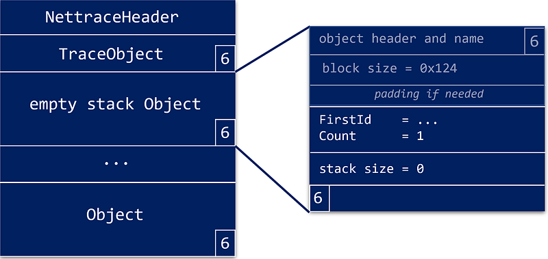

---

The previous episodes started the parsing of the “nettrace” format used when [contacting the .NET Diagnostics IPC server](/posts/2022-09-18_net-diagnostic-ipc-protocol/) and [initiate the protocol to receive CLR events](/posts/2022-10-23_clr-events-go-for/). It is now time to see how to get the payload of each “object” type, especially how stacks are stored.

We have seen that the stream starts with a **TraceObject** that describes the rest of the stream followed by a sequence of “object”:



The remaining of each “object” is a 32 bit block size followed by the payload.

Well… not only. One thing I missed when I started to work on the nettrace format is the fact that all “object” payloads must be 4-bytes aligned **on the beginning of the stream**!

This is why I’m keeping track of the current position in the **EventPipeSession** class:

```cpp
private:
    IIpcEndpoint* _pEndpoint;
    bool _stopRequested;

    // parsers
    MetadataParser _metadataParser;
    EventParser _eventParser;
    StackParser _stackParser;
    SequencePointParser _sequencePointParser;

    // Keep track of the position since the beginning of the "file"
    // i.e. starting at 0 from the first character of the NettraceHeader
    //      Nettrace
    uint64_t _position;
    ...
};
```

So each **ParseXXXBlock** function checks the minimum reader version in the header before reading the “object” payload as a memory block. The idea is being able to support backward compatibility:

```cpp
bool EventPipeSession::ParseMetadataBlock(ObjectHeader& header)
{
    if (header.MinReaderVersion != 2) return false;

    uint32_t blockSize = 0;

    // read the block and send it to the corresponding parser
    uint64_t blockOriginInFile = 0;
    if (!ExtractBlock("Metadata", blockSize, blockOriginInFile))
        return false;

    return _metadataParser.Parse(_pBlock, blockSize, blockOriginInFile);
}
```

The **ExtractBlock** function reads the size of the payload (and skips the padding if any) with **ReadBlockSize**:

```cpp
bool EventPipeSession::ExtractBlock(const char* blockName, uint32_t& blockSize, uint64_t& blockOriginInFile)
{
    // get the block size
    if (!ReadBlockSize(blockName, blockSize))
        return false;

    // skip the block + final EndOfObject tag
    blockSize++;
    ...
```

The block name is only used for error messages if needed.

The next step is to read the payload in a memory block using these two **EventPipeSession** fields:

```cpp
...
    // buffer used to read each block that will be then parsed
    uint8_t* _pBlock;
    uint32_t _blockSize;
    ...
```

In the session constructor, **_blockSize** is set to 4 KB and **_pBlock** points to an allocated memory buffer of that size.

The rest of **ExtractBlock** deals with payload size: if the current payload to parse is larger than **_blockSize**, then these fields are updated up to a maximum of 100 KB (i.e. max block size sent by the CLR).

```cpp
// check if it is needed to resize the block buffer
    if (_blockSize < blockSize)
    {
        // don't expect blocks larger than 100KB
        if (blockSize > MAX_BLOCK_SIZE)
            return false;

        delete [] _pBlock;
        _pBlock = new uint8_t[blockSize];
        ::ZeroMemory(_pBlock, blockSize);
        _blockSize = blockSize;
    }

    // keep track of the current position in file for padding
    blockOriginInFile = _position;
    if (!Read(_pBlock, blockSize))
    {
        Error = ::GetLastError();
        std::cout << "Error while extracting " << blockName << " block: 0x" << std::hex << Error << std::dec << "\n";
        return false;
    }
    std::cout << "\n" << blockName << " block (" << blockSize << " bytes)\n";
    DumpBuffer(_pBlock, blockSize);

    return true;
}
```

For debugging sake, I’m displaying each “object” payload



thanks to the **DumpBuffer** helper.

To ease the memory access to the memory block content, my **BlockParser** will be used as a base class for each dedicated parsers:

```cpp
class BlockParser
{
public:
    BlockParser();
    bool Parse(uint8_t* pBlock, uint32_t bytesCount, uint64_t blockOriginInFile);
    void SetPointerSize(uint8_t pointerSize);

public:
    uint8_t PointerSize;

protected:
    virtual bool OnParse() = 0;

    // Access helpers
    bool Read(LPVOID buffer, DWORD bufferSize);
    bool ReadByte(uint8_t& byte);
    bool ReadWord(uint16_t& word);
    bool ReadDWord(uint32_t& dword);
    bool ReadLong(uint64_t& ulong);
    bool ReadDouble(double& d);
    bool ReadVarUInt32(uint32_t& val, DWORD& size);
    bool ReadVarUInt64(uint64_t& val, DWORD& size);
    bool ReadWString(std::wstring& wstring, DWORD& bytesRead);
    bool SkipBytes(uint32_t byteCount);

// shared fields
protected:
    bool _is64Bit;
    uint32_t _blockSize;
    uint32_t _pos;

private:
    uint8_t* _pBlock;
    uint64_t _blockOriginInFile;
};
```

The **Parse** function accepts the memory buffer containing an “object” payload, its size and its position since the beginning of the stream. The derived class will have to implement the **OnParse** function using the **ReadXXX** helpers.

The two **ReadVarUintXXX** functions are different from the other direct read helpers because they deal with some simple compression mechanisms used by the serialization of 32-bit and 64-bit numbers.

In the different types of “object” payloads, the strings are serialized as UTF16 strings ending with a “\0” wide character. Here is the implementation of the helper function used to read a **std::wstring** from a memory block:

```cpp
bool BlockParser::ReadWString(std::wstring& wstring, DWORD& bytesRead)
{
    uint16_t character;
    bytesRead = 0;  // in case of empty string
    while (true)
    {
        if (!ReadWord(character))
        {
            return false;
        }

        // protect against invalid UNICODE character (due to missing fields in ExceptionThrown event)
        if (character > 256)
        {
            // rewind the character
            _pos = _pos - sizeof(character);

            // this is only covering a missing string
            return (bytesRead == 0);
        }

        bytesRead += sizeof(character);

        // Note that an empty string contains only that \0 character
        if (character == 0) // \0 final character of the string
            return true;

        wstring.push_back(character);
    }
}
```

Note the check for character content in the loop: this is due to a serialization issue I will discuss later when the event “object” block will be detailed.

## The Stack “object”

If you remember my previous post about [retrieving call stacks for CLR events with TraceEvent](/posts/2020-05-18_build-your-own-net/), you might be wondering why there is a specific stack object since a **ClrStackWalk** event should contain the frames if the **Stack** keyword is enabled for the .NET provider. In fact, the current TraceEvent implementation is not using the stack object sent by the CLR (maybe to have the same code between ETW and EventPipe).

One stack “object” received in a nettrace stream contains one or more stacks. Each stack is identified by an id (more about this soon) and contains a list of instruction pointer addresses.



In the previous screenshot, the id of the first stack is 1 and the second is 2. In the next stack “object”, the **FirstId** field will be 3 and so on. This avoids storing the id in each call stack and saves space.

Note that even if this does not seem to make any sense, it might happen that the addresses list is empty.



These call stacks are stored in **EventPipeSession** as a per id cache:

```cpp
// per stackID stack
    // only one will be used depending on the bitness of the monitored application
    std::unordered_map<uint32_t, EventCacheStack32> _stacks32;
    std::unordered_map<uint32_t, EventCacheStack64> _stacks64;
```

The frames are stored as addresses in a vector:

```cpp
class EventCacheStack32
{
public:
    uint32_t Id;
    std::vector<uint32_t> Frames;
};
```

The CLR is sending one stack per unique callstack (i.e. at least one frame is different). As you will soon see, each event “object” contains a stack id corresponding to the chain of code from which it is sent.

The next episode will detail the **Metadata** and **Event** blocks to end the series.

## Resources

- [Episode 1](/posts/2022-07-28_digging-into-the-clr/) — *Digging into the CLR Diagnostics IPC Protocol in C#*
- [Episode 2](/posts/2022-09-18_net-diagnostic-ipc-protocol/) — *.NET Diagnostic IPC protocol: the C++ way*
- [Episode 3 ](/posts/2022-10-23_clr-events-go-for/ *CLR events: go for the nettrace file format!*
- [Episode 4 ](/posts/2022-11-27_parsing-the-nettrace-stream/ *Parsing the “nettrace” steam*
- [Source code](https://github.com/chrisnas/ClrEvents/tree/master/Events/NativeEventListener) for the C++ implementation of CLR events listener
- Diagnostics IPC protocol [documentation](https://github.com/dotnet/diagnostics/blob/main/documentation/design-docs/ipc-protocol.md)
