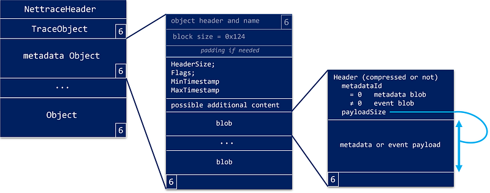
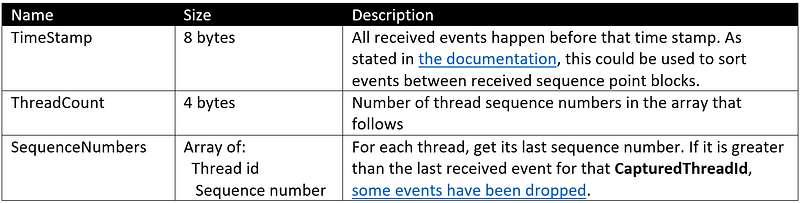

---

The previous episodes started the parsing of the “nettrace” format used when [contacting the .NET Diagnostics IPC server](/posts/2022-09-18_net-diagnostic-ipc-protocol/), [initiate the protocol to receive CLR events](/posts/2022-10-23_clr-events-go-for/) and start to [parse stacks](/posts/2023-01-15_reading-object-in-memory/). This last episode covers the Metadata and Event blocks.

In terms of format, both Metadata and Event blocks share the same memory layout:



The common **EventBlockHeader** starts the block:

```cpp
#pragma pack(1)
struct EventBlockHeader
{
    uint16_t HeaderSize;
    uint16_t Flags;
    uint64_t MinTimestamp;
    uint64_t MaxTimestamp;

    // some optional reserved space might be following
};
```

The timestamp fields give the time of the first and last event in the block. The **HeaderSize** fields is important because additional information can be stored in the header. Since I have no idea what could be stored there, I simply skip it:

```cpp
bool EventParserBase::OnParse()
{
    // read event block header
    EventBlockHeader ebHeader = {};
    if (!Read(&ebHeader, sizeof(ebHeader)))
    {
        return false;
    }

    // skip any optional content if any
    if (ebHeader.HeaderSize > sizeof(EventBlockHeader))
    {
        uint8_t optionalSize = ebHeader.HeaderSize - sizeof(EventBlockHeader);
        if (!SkipBytes(optionalSize))
        {
            return false;
        }
    }
```

The important piece of information to figure out how to unpack the rest of the block is kept in the **Flags** field. If the lowest bit is set, it means that the blobs header will be compressed:

```cpp
// the rest of the block is a list of Event blobs
    //
    DWORD blobSize = 0;
    DWORD totalBlobSize = 0;
    DWORD remainingBlockSize = _blockSize - ebHeader.HeaderSize;
    bool isCompressed = ((ebHeader.Flags & 1) == 1);
```

The rest of the code iterates on each blob:

```cpp
// Note: in order to gain space, some fields of the header could be "inherited"
    // from the header of the previous blob --> need to pass it from blob to blob
    EventBlobHeader header = {};
    while (OnParseBlob(header, isCompressed, blobSize))
    {
        totalBlobSize += blobSize;
        blobSize = 0;

        if (totalBlobSize >= remainingBlockSize - 1) // try to detect last blob
        {
            // don't forget to check the end of block tag
            uint8_t tag;
            if (!ReadByte(tag) || (tag != NettraceTag::EndObject))
            {
                std::cout << "Missing end of block tag\n";
                return false;
            }

            return true;
        }
    }

    return true;
}
```

Here is the tricky part: to gain space, each blob starts with a header that could be “compressed”. The compression mechanism is simple: the first byte is a bitfield value that indicates which fields are present (i.e. their value should be read from the memory block) or skipped (i.e. their value is the same as the previous blob header). Therefore, an **EventBlobHeader** is passed by reference to the **OnParseBlob** function. My **MetadataParser** and **EventParser** implementations of **OnParseBlob** both starts with the same code to read the header:

```cpp
bool XXXParser::OnParseBlob(EventBlobHeader& header, bool isCompressed, DWORD& blobSize)
{
    if (isCompressed)
    {
        if (!ReadCompressedHeader(header, blobSize))
        {
            return false;
        }
    }
    else
    {
        if (!ReadUncompressedHeader(header, blobSize))
        {
            return false;
        }
    }
```

The implementation to read compressed and uncompressed version of the header is a direct translation of [the TraceEvent C# code](https://github.dev/microsoft/perfview/blob/b5d1f0423ed5fb6521fae0f3c9e92c886752ac8d/src/TraceEvent/EventPipe/EventPipeEventSource.cs#L1439) into C++.

The **EventBlobHeader** contains details of events:

```cpp
#pragma pack(1)
struct EventBlobHeader_V4
{
    uint32_t EventSize;
    uint32_t MetadataId;
    uint32_t SequenceNumber;
    uint64_t ThreadId;
    uint64_t CaptureThreadId;
    uint32_t ProcessorNumber;
    uint32_t StackId;
    uint64_t Timestamp;
    GUID ActivityId;
    GUID RelatedActivityId;
    uint32_t PayloadSize;
};
```

- The “identity” of an event is given by the **MetadataId** field that refers to information defined in Metadata “object“ (for which **MetadataId** is 0).
- The **SequenceNumber** field is incremented on a per thread basis each time an event is emitted. This could be used to detect if some events have been dropped (for a given **CaptureThreadId**, two consecutive events have a **SequenceNumber** incremented by more than 1 — more on dropped events in the forthcoming SequencePoint “object” description). Its value is 0 for a metadata “object”
- The **ThreadId** and **CaptureThreadId** field have always the same value for Event “object”; **CaptureThreadId** is 0 for Metadata “object”.
- In case of Event “object”, the **StackId** field refers to one of the stacks extracted from a Stack “object”. Its value is 0 for Metadata “object”.

## The Metadata “object”

As [the documentation states](https://github.com/microsoft/perfview/blob/main/src/TraceEvent/EventPipe/EventPipeFormat.md), *each MetadataBlock holds a set of metadata records. Each metadata record has an ID and it describes one type of event. Each event has a metadataId field which will indicate the ID of the metadata record which describes that event*.

The resulting mapping is stored in **EventPipeSession** class:

```cpp
// per metadataID event metadata description
    std::unordered_map<uint32_t, EventCacheMetadata> _metadata;
```

However, the rest of the documentation is partially right in the case of nettrace stream received through EventPipe: *Metadata includes an event name, provider name, and the layout of fields that are encoded in the event’s payload section.*

First, the fields layout is simply not there. In addition, for some providers (dotnet runtime, private and rundown), the event names are empty strings. So, the data structure filled from the **MetadataBlock** will most of the time have an empty **EventName** field. Note that the “Microsoft-DotNETCore-EventPipe” provider (i.e. command events for that specific provider) and EventSource-derived classes written in C# provide the events name:

```cpp
class EventCacheMetadata
{
public:
    uint32_t     MetadataId;
    std::wstring ProviderName;
    uint32_t     EventId;
    std::wstring EventName; // empty most of the time
    uint64_t     Keywords;
    uint32_t     Version;
    uint32_t     Level;
};
```

In addition to the provider’s name serialized as a UTF16 string (including last ‘\0’ wide character), the **EventId** field is the key used to identify an event.

After these details, you will find a 4 bytes value corresponding to the number of fields in the event payload. As already mentioned, this value is always 0 so my code is skipping the rest of the metadata block payload.

## The Event “object”

And at last, here comes the time to parse Event “object” payload! The **MetadataId** field of the **EventBlobHeader** is used to find the provider’s name and event id:

```cpp
bool EventParser::OnParseBlob(EventBlobHeader& header, bool isCompressed, DWORD& blobSize)
{
    ...

    auto& metadataDef = _metadata[header.MetadataId];
```

So, the rest of the function reads the payload based on the expected event id:

```cpp
switch (metadataDef.EventId)
    {
        case EventIDs::AllocationTick:
            if (!OnAllocationTick(header.PayloadSize, metadataDef))
            {
                return false;
            }
            break;

        case ...
            break;

        case EventIDs::ExceptionThrown:
            if (!OnExceptionThrown(header.PayloadSize, metadataDef))
            {
                return false;
            }
            break;

        default:  // skip events we are not interested in
        {
            SkipBytes(header.PayloadSize);
        }
    }

    blobSize += header.PayloadSize;

    return true;
}
```

The format of each event payload is usually given by [the Microsoft documentation](https://docs.microsoft.com/en-us/dotnet/framework/performance/clr-etw-events?WT.mc_id=DT-MVP-5003325). If not, you should look into the [ClrEtwall.man file](https://github.com/dotnet/coreclr/blob/release/3.1/src/vm/ClrEtwAll.man) where the payload of ALL events are defined. For example, the [*AllocationTick* event payload](https://docs.microsoft.com/en-us/dotnet/framework/performance/garbage-collection-etw-events#gcallocationtick_v3-event?WT.mc_id=DT-MVP-5003325) provides the name of the last allocated type to reach the 100 KB threshold (read [this blog post](/posts/2020-04-18_build-your-own-net/) for more details about how to use this event):

```cpp
//  AllocationAmount    UInt32          The allocation size, in bytes.
//                                      This value is accurate for allocations that are less than the length of a ULONG(4,294,967,295 bytes).
//                                      If the allocation is greater, this field contains a truncated value.
//                                      Use AllocationAmount64 for very large allocations.
//  AllocationKind      UInt32          0x0 - Small object allocation(allocation is in small object heap).
//                                      0x1 - Large object allocation(allocation is in large object heap).
//  ClrInstanceID       UInt16          Unique ID for the instance of CLR or CoreCLR.
//  AllocationAmount64  UInt64          The allocation size, in bytes.This value is accurate for very large allocations.
//  TypeId              Pointer         The address of the MethodTable.When there are several types of objects that were allocated during this event,
//                                      this is the address of the MethodTable that corresponds to the last object allocated (the object that caused the 100 KB threshold to be exceeded).
//  TypeName            UnicodeString   The name of the type that was allocated.When there are several types of objects that were allocated during this event,
//                                      this is the type of the last object allocated (the object that caused the 100 KB threshold to be exceeded).
//  HeapIndex           UInt32          The heap where the object was allocated.This value is 0 (zero)when running with workstation garbage collection.
//  Address             Pointer         The address of the last allocated object.
//
```

Based on this fields definition, the **EventParser::OnAllocationTick** function is reading each field after the other thanks to the **ReadWord**, **ReadDWord**, **ReadLong** and **ReadWString** :

```cpp
bool EventParser::OnAllocationTick(DWORD payloadSize, EventCacheMetadata& metadataDef)
{
    DWORD readBytesCount = 0;
    DWORD size = 0;
    std::cout << "\nAllocation Tick:\n";

    // get common fields
    uint32_t dword = 0;
    if (!ReadDWord(dword))
    {
        return false;
    }
    readBytesCount += sizeof(dword);
    std::cout << "   Amount        = " << dword << " bytes\n";

    if (!ReadDWord(dword))
    {
        return false;
    }
    readBytesCount += sizeof(dword);
    std::cout << "   Kind          = " << ((dword == 1) ? "LOH" : "small") << " bytes\n";

    uint16_t word = 0;
    if (!ReadWord(word))
    {
        return false;
    }
    readBytesCount += sizeof(word);
    std::cout << "   CLR ID        = " << word << "\n";

    uint64_t ulong = 0;
    if (!ReadLong(ulong))
    {
        return false;
    }
    readBytesCount += sizeof(ulong);
    std::cout << "   Amount64      = " << ulong << " bytes\n";
```

The bitness of the monitored application is important when “pointers” need to be read from the payload: use **ReadDWord** for 32-bit and **ReadLong** for 64-bit:

```cpp
// skip useless MT address
    // Note: handle 32/64 bit difference
    if (_is64Bit)
    {
        if (!ReadLong(ulong))
        {
            return false;
        }
        readBytesCount += sizeof(ulong);
    }
    else
    {
        if (!ReadDWord(dword))
        {
            return false;
        }
        readBytesCount += sizeof(dword);
    }
```

And if you don’t need the rest of the payload, **SkipBytes** is your friend:

```cpp
// skip the rest of the payload
    return SkipBytes(payloadSize - readBytesCount);
}
```

I had some issues when dealing with the [**ExceptionThrown** event payload](https://docs.microsoft.com/en-us/dotnet/framework/performance/exception-thrown-v1-etw-event?WT.mc_id=DT-MVP-5003325):

```cpp
// Type             wstring     Exception type
// Message          wstring     Exception message
// EIPCodeThrow     win:Pointer Instruction pointer where exception occurred.
// ExceptionHR      win:UInt32  Exception HRESULT.
// ExceptionFlags   win:UInt16
//      0x01: HasInnerException (see CLR ETW Events in the Visual Basic documentation).
//      0x02: IsNestedException.
//      0x04: IsRethrownException.
//      0x08: IsCorruptedStateException (indicates that the process state is corrupt).
//      0x10: IsCLSCompliant (an exception that derives from Exception is CLS-compliant).
// ClrInstanceID win:UInt16 Unique ID for the instance of CLR or CoreCLR.
```

In case of an empty message, the field itself was not even there! Not even 0 for a ‘\0’ wide character… In fact, there is a bug in the serialization code that skips the field in that case. This has been [fixed in .NET 6](https://github.com/dotnet/runtime/commit/72e2420fd227aa45c86577622cf3ed4adfbbb461) by storing “NULL” as the serialized string: I would have preferred ‘\0’ but it seems to be compatible with the ETW implementation.

To support .NET Core 3+ and .NET 5, my code is comparing the size of the remaining of the payload after reading the exception type with the expected size of the 4 remaining fields after the exception message. If it is greater then it means that there is a string for the message. If not, I know that the message is empty:

```cpp
bool EventParser::OnExceptionThrown(DWORD payloadSize, EventCacheMetadata& metadataDef)
{
    DWORD readBytesCount = 0;
    DWORD size = 0;

    // read exception type
    ...

    // Size of the ExceptionThrown payload AFTER the Message field
    uint16_t exceptionRemainingPayloadSize = (_is64Bit ? 8 : 4) + 4 + 2 + 2;

    // In case of "empty" message, it might not be even visible as "\0" before .NET Core 6 (and after, will be "NULL")
    // so it is needed to check if the remaining payload contains such a string
    if ((payloadSize - readBytesCount) == _exceptionRemainingPayloadSize)
    {
        std::wcout << L"   message = ''\n";
    }
    else
    {
        if (!ReadWString(strBuffer, size))
        {
            return false;
        }
        readBytesCount += size;

        // handle empty string case (check for "NULL" in case of .NET 6+)
        if (strBuffer.empty() || (wcscmp(strBuffer.c_str(), L"NULL") == 0))
            std::wcout << L"   message = ''\n";
        else
        {
            std::wcout << L"   message = " << strBuffer.c_str() << L"\n";
        }
    }

    // skip the rest of the payload
    return SkipBytes(payloadSize - readBytesCount);
}
```

## The SequencePointBlock “object”

The last “object” type is the sequence point block that contains the following fields:



In addition to these fields, it also [implicitly tells you](https://github.com/microsoft/perfview/blob/main/src/TraceEvent/EventPipe/EventPipeFormat.md#sequencepointblock-object) that new stack “object” will be received (with stack id restarting from 1) to match next Event “objects”. For example, the following trace shows how a sequence point block resets the stacks by restarting at 1:

```markdown
Event block (140 bytes)

blob header:
   StackId           = 3
Contention

blob header:
   StackId           = 4
Event = 81

blob header:
   StackId           = 3
Contention
...
------------------------------------------------ 

________________________________________________
SequencePoint block (217 bytes)
...
------------------------------------------------

________________________________________________
Stack block (105 bytes)

Stack block header:
   FirstID: 1
   Count  : 2
------------------------------------------------

________________________________________________
Event block (92 bytes)

blob header:
   StackId           = 1
Contention

blob header:
   StackId           = 2
Event = 81

blob header:
   StackId           = 1
Contention:
------------------------------------------------
```

So, the stacks you might have cached based on the already received stack “objects” should now be invalidated like what I’m doing in **SequencePointParser::OnParse**:

```cpp
bool SequencePointParser::OnParse()
{
    // reset stack caches
    _stacks32.clear();
    _stacks64.clear();
    ...
```

You now have all the elements you need to listen to CLR events on Windows and Linux for .NET Core 3+ and .NET 5+. If you are still running applications with .NET Framework, you will need to use ETW but this is another story.

## Resources

- [Episode 1](/posts/2022-07-28_digging-into-the-clr/) — *Digging into the CLR Diagnostics IPC Protocol in C#*
- [Episode 2](/posts/2022-09-18_net-diagnostic-ipc-protocol/) — *.NET Diagnostic IPC protocol: the C++ way*
- [Episode 3 ](/posts/2022-10-23_clr-events-go-for/ *CLR events: go for the nettrace file format!*
- [Episode 4 ](/posts/2022-11-27_parsing-the-nettrace-stream/ *Parsing the “nettrace” steam*
- [Episode 5 ](/posts/2023-01-15_reading-object-in-memory/ *Reading “object” in memory — starting with stacks*
- [Source code](https://github.com/chrisnas/ClrEvents/tree/master/Events/NativeEventListener) for the C++ implementation of CLR events listener
- Diagnostics IPC protocol [documentation](https://github.com/dotnet/diagnostics/blob/main/documentation/design-docs/ipc-protocol.md)
